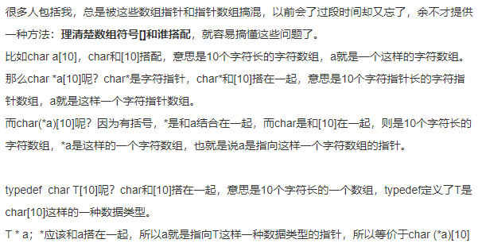

# 一、C++篇

## 语言基础

#### 1、C++和C有什么比较突出的点

C++和C都是计算机编程语言，它们有很多共同点，比如它们都是静态类型语言，都支持指针等基本特性。不过，它们也有一些突出的不同点，包括以下几点：

1. **面向对象编程支持**：C++ 是一种支持面向对象编程的语言，而C不是。这意味着 C++ 具有封装、继承、多态等面向对象的特性，这些特性使得 C++ 适合于开发大型软件系统。
2. **标准库支持**：C++ 的标准库提供了许多可重用的代码，如容器、算法和迭代器等，这些代码使得 C++ 开发者能够更加高效地编写程序。相比较而言，C语言的标准库少得多。
3. **内存管理**： C++ 支持对象生命周期的概念，在对象创建时需要分配内存，在对象被销毁时需要释放内存。C++ 支持 RAII（资源获取即初始化）技术，使得内存管理更加容易，而 C 不支持这种技术。
4. **异常处理**：C++ 支持异常处理机制，可以处理程序中的异常情况，比如内存分配失败或者数组越界等。C语言没有内置的异常处理机制。
5. **函数重载**：C++ 支持函数重载，即可以定义多个同名函数，但它们的参数类型或参数数量不同。这种特性可以提高代码的可读性和可维护性，C语言没有这种特性。

总之，C++ 在面向对象编程、标准库支持、内存管理、异常处理和函数重载等方面比 C 更加强大和灵活。但是，由于其复杂性较高，需要开发者具备更多的编程知识和技能。

----------------

> 请说一下更加本质的区别

更加本质的区别在于，C++ 是一种支持面向对象编程的语言，而 C 不是。面向对象编程是一种编程范式，它强调将问题分解为对象，每个对象都有自己的状态和行为，对象之间通过**消息传递**来协作完成任务。面向对象编程有助于提高代码的可维护性、可扩展性和复用性，因此在开发大型软件系统时非常有用。

另外，C++ 对于内存管理和类型安全方面也有一些本质的区别。C++ 支持对象生命周期的概念，使得对象的创建和销毁更加容易，而 C 不支持这种概念。C++ 还提供了一些类型安全的特性，比如强制类型转换和运行时类型识别，这些特性可以减少类型错误的出现。而 C 没有这些类型安全的特性。

总之，C++ 相对于 C 而言更加灵活、强大和安全，但也更加复杂和难以掌握。开发者需要根据具体的应用场景来选择适合的编程语言。

#### 2、class 和 struct 的区别

在C++中，class和struct都是用于定义自定义数据类型的关键字，它们非常相似，但有一些区别：

1. **默认访问控制**：class的默认访问控制是私有的，而struct的默认访问控制是公有的也就是说，在class中定义的成员变量和成员函数默认是**私有的**，而在struct中定义的成员变量和成员函数默认是**公有的**。
2. **继承方式**：在**class**中，默认的继承方式是**私有继承（private）**，而在struct中，默认的继承方式是**公有继承（public）**。
3. 成员变量和成员函数的访问：对于成员变量和成员函数，class和struct并没有什么区别，它们都可以定义成员变量和成员函数，并且都可以通过对象来访问。

总之，**class**和**struct**的主要区别在于**默认访问控制和默认继承方式**。

#### 3、C++的内存分区

在C++中，程序运行时内存被划分为五大区域：

- 代码区：存放函数体的二进制代码，由操作系统进行管理，通常是共享的和只读的。
- 全局区：存放全局变量、静态变量、常量（如字符串常量、const修饰的全局变量），在程序结束后由操作系统释放。
- 栈区：由编译器自动分配释放，存放函数的函数值、局部变量等，遵循先进后出的原则。
- 堆区：由程序员分配和释放，若不释放，程序结束时由操作系统回收，在C++中主要使用new关键字在堆区创建内存空间。
- 常量区：是全局区中划分的一个小区域，里面存放的是常量，如const修饰的局部变量等。

不同的内存区域有不同的作用和特点，可以根据需要合理地使用它们。

-----------------

自由存储区是C++中通过new和delete动态分配和释放对象的抽象概念[1](https://zhuanlan.zhihu.com/p/344377490)[2](https://zhuanlan.zhihu.com/p/120997610)[3](https://blog.csdn.net/zy47675676/article/details/89216003)。它不一定等同于堆区，因为程序员可以通过重载操作符，改用其他内存来实现自由存储，例如全局变量做的对象池[4](https://zhuanlan.zhihu.com/p/361707026)。但是多数情况下，new实现的基础仍然是C语言的malloc和free，所以自由存储区通常也可以认为是堆区的一部分。

#### 4、指针参数传递和引用参数传递的区别

- 指针参数传递本质上是**值传递**的方式，它所传递的是一个地址值。被调函数的形式参数作为被调函数的局部变量处理，即在栈中开辟了内存空间以存放由主调函数放进来的实参的地址值，从而成为了实参的一个副本。指针参数传递的特点是被调函数对形式参数的任何操作都是作为局部变量进行，不会影响主调函数的实参变量的值（这里是在说实参指针本身的地址值不会变）。
- 引用参数传递本质上是引用传递的方式，它所传递的是实参本身。被调函数的形式参数虽然也作为局部变量在栈中开辟了内存空间，但是这时存放的是由主调函数放进来的实参变量的地址。**被调函数对形参的任何操作都被处理成间接寻址**，即通过栈中存放的地址访问主调函数中的实参变量。引用参数传递的特点是被调函数对形参做的任何操作都影响了主调函数中的实参变量。
- 指针可以改变其指向的对象（指针变量中的值可以改），而引用则不能改变其引用的对象（自始至终只能依附于同一个变量）。
- 指针可以为空，而引用不能为空。
- 指针和引用的自增（++）运算意义不一样。
- 引用是类型安全的，而指针不是（引用比指针多了类型检查）。

#### 5、引用的底层实现

- 一种说法是引用本质上就是指针，只不过编译器对它进行了封装和优化，使得它看起来像是变量的别名，但实际上它在内存中占用了空间，并存储了所引用对象的地址。这种说法可以通过反汇编代码来验证，例如：

```c++
int main() {
    int x = 1;
    int &b = x;
    return 0;
}
```

反汇编后的汇编代码如下：

```assembly
movl $0, -4(%rbp)  ; int x = 1
leaq -4(%rbp), %rcx ; t0 = &x
movq %rcx, -16(%rbp) ; int &b = t0
```

可以看出，引用b在栈上开辟了空间，并存储了x的地址。

- 另一种说法是引用并不一定是指针，而是由编译器根据具体情况来决定如何实现的。有时候编译器会将引用优化掉，使得它和所引用的对象完全等价，没有任何额外的开销。有时候编译器会将引用实现为指针，以便于传递和操作。这种说法可以通过抽象机器的概念来理解，即我们写的代码其实都是面向抽象机器的，而具体的编译器则需要保证他们的具体机器和抽象机器有相同的行为。
- 还有一种说法是引用在C++中没有明确的定义，它只是一个语法糖，它的底层实现取决于编译器的设计者。不同的编译器可能会有不同的实现方式，但都要遵循C++标准中规定的引用的语义和行为。因此，我们不能简单地将引用等同于指针，也不能假设引用一定占用内存或不占用内存。

#### 6、const的含义和用法

C++中的`const`关键字用于定义常量，即表示一个变量的值不能被修改。在C++中，`const`可以被用于以下场景：

- 定义常量：

```cpp
const int MAX_VALUE = 100;
```

这里定义了一个常量`MAX_VALUE`，它的值不能被修改。

- 定义函数参数：

```cpp
void foo(const int& arg)
{
    // arg的值不能被修改
}
```

这里`arg`是一个常量引用，它的值不能被修改。

- 定义成员函数：

```cpp
class MyClass
{
public:
    int getValue() const
    {
        // 成员函数内部不能修改类的成员变量
        return value_;
    }

private:
    int value_;
};
```

这里`getValue()`是一个常量成员函数，它不能修改`MyClass`的成员变量。

-----

> 常对象只能访问常成员函数
>

- 定义指针：

```cpp
const int* ptr;
```

这里`ptr`是一个指向常量的指针，它指向的值不能被修改。

---

```cpp
int* const ptr;
```

这里`ptr`是一个指针常量，它的指向不能被修改。

- 定义函数返回值：

```cpp
const int foo()
{
    return 42;
}
```

这里`foo()`返回一个常量值，它不能被修改。

总结一下，`const`关键字用于表示一个值是不可修改的，可以用于**定义常量**、**函数参数**、**成员函数**、**指针以及函数返回值**。

#### 7、`static`的含义和用法

- 静态局部变量 

在函数内部定义的变量，如果加上`static`关键字，就成为了静态局部变量。**静态局部变量的生命周期与程序运行时间相同，而不是函数执行时间**，因此可以保持其值不变。例如：

```cpp
void func()
{
    static int count = 0;
    count++;
    std::cout << count << std::endl;
}

int main()
{
    func(); // 输出1
    func(); // 输出2
    func(); // 输出3
    return 0;
}
```

- 静态全局变量 （限定访问作用域）

在函数外部定义的变量，如果加上`static`关键字，就成为了静态全局变量。静态全局变量的作用域仅限于定义它的文件，其他文件无法访问。例如：

```cpp
// file1.cpp
static int count = 0;

// file2.cpp
extern int count;
// error: count未定义
```

- 静态成员变量 （类外初始化）

在类中定义的变量，如果加上`static`关键字，就成为了静态成员变量。静态成员变量是所有对象共享的，不占用对象的存储空间，而是在类定义的作用域内分配存储空间。例如：

```cpp
class MyClass
{
public:
    static int count;
};

int MyClass::count = 0;

int main()
{
    MyClass obj1;
    MyClass obj2;
    MyClass::count++; // 静态成员变量可以通过类名访问
    obj1.count++; // 也可以通过对象名访问，但不推荐
    obj2.count++;
    std::cout << MyClass::count << std::endl; // 输出3
    return 0;
}
```

- 静态成员函数 

在类中定义的函数，如果加上`static`关键字，就成为了静态成员函数。静态成员函数不属于任何对象，可以直接通过类名调用。**静态成员函数只能访问静态成员变量和其他静态成员函数**。例如：

```cpp
class MyClass
{
public:
    static int count;
    static void func()
    {
        count++; // 静态成员函数可以访问静态成员变量
        // error: 成员函数不能访问静态成员函数
        // static void foo() {}
    }
};

int MyClass::count = 0;

int main()
{
    MyClass::func(); // 静态成员函数可以直接通过类名调用
    std::cout << MyClass::count << std::endl; // 输出1
    return 0;
}
```

总结一下，`static`关键字有多种含义和用法，包括静态局部变量、静态全局变量、静态成员变量和静态成员函数，它们的共同特点是可以在不创建对象

#### 8、定义常量的方式和常量的存放位置

在C++中，可以使用 `const` 或 `#define` 来定义常量。

- 使用#define预处理器，如 `#define PI 3.1415926`，这样会在预处理阶段将PI替换为其对应的值。
- 使用const关键字，如 `const int a = 5;`，这样会在运行时将a声明为一个只读变量，其值不能被修改。

常量存放在内存的哪个位置，取决于常量的类型和作用域[1](https://zhuanlan.zhihu.com/p/417207698)[2](https://www.runoob.com/cprogramming/c-constants.html)：

- 全局常量和静态常量存放在数据段（data segment），也叫静态存储区（static storage area），它们在程序运行期间一直存在。
- 局部常量存放在栈（stack）中，它们在函数调用时被创建，在函数返回时被销毁。
- 字符串常量存放在常量区（constant area），也叫文字常量区（literal pool），它们是只读的，不能被修改。

#### 9、重载和重写，重定义的区别

- 重载（overload）：是指在同一个类中，定义了多个同名的函数，但是参数列表不同（参数个数，类型或顺序不同）。重载是一种**静态多态性**，**编译器根据参数的不同来决定调用哪个函数**。
- 重写（override）：也叫覆盖，是指在派生类中，重新定义了基类中的虚函数（virtual function），且参数列表相同。重写是一种**动态多态性**，**运行时根据对象的实际类型来决定调用哪个函数**。
- 重定义（redefine）：也叫隐藏，是指在派生类中，重新定义了基类中的非虚函数（non-virtual function），参数列表可以相同也可以不同。重定义会导致基类的函数被隐藏，除非显式地使用基类的作用域来调用。

#### 10、**介绍** **C++** **所有的构造函数**

C++中的构造函数是一种特殊的函数，用于在创建对象时初始化对象的成员变量。下面是C++中的构造函数类型：

1. **默认构造函数**：如果没有为对象提供显式构造函数，则编译器将提供一个默认构造函数。默认构造函数不带任何参数，并且初始化成员变量为默认值。
2. **参数构造函数**：参数构造函数带有一个或多个参数，并用这些参数初始化对象的成员变量。可以使用参数构造函数来创建对象并将初始值传递给对象。
3. **拷贝构造函数**：拷贝构造函数是一种特殊的构造函数，用于将一个对象的值复制到另一个对象中。当使用一个对象来初始化另一个对象时，拷贝构造函数将被调用。
4. **移动构造函数**：移动构造函数是一种特殊的构造函数，用于将对象从一个位置移动到另一个位置。移动构造函数通常用于实现移动语义，以提高程序的性能。
5. **委托构造函数**：委托构造函数是一种构造函数，它调用同一个类的另一个构造函数来初始化成员变量。这使得代码可以重用构造函数的代码，从而简化了构造函数的实现。

总之，构造函数是用于初始化对象的特殊函数。它们的类型和用途各不相同，可以根据需要使用不同类型的构造函数来创建对象。

#### 11、解释一下移动构造函数吗，给出代码示例

移动构造函数是C++11中引入的一个特殊的构造函数，它允许我们在移动语义下从一个对象移动到另一个对象，而不是进行复制和销毁。移动构造函数通常用于提高性能，特别是当涉及到动态内存分配时。

移动构造函数通常使用右值引用（`Rvalue reference`）来实现，其语法形式为`类名(类名&& other)`。移动构造函数从另一个对象中“窃取”资源，将原对象置为空，而不是创建新的资源并复制数据。

以下是一个简单的示例，展示了如何定义和使用移动构造函数：

```cpp
class MyClass {
public:
    MyClass() {
        data = nullptr;
        size = 0;
    }

    MyClass(int n) {
        data = new int[n];
        size = n;
    }

    ~MyClass() {
        delete[] data;
    }

    // 移动构造函数
    MyClass(MyClass&& other) {
        data = other.data;
        size = other.size;
        other.data = nullptr;
        other.size = 0;
    }

private:
    int* data;
    int size;
};

int main() {
    MyClass a(10); // 创建 MyClass 对象 a
    MyClass b(std::move(a)); // 使用移动构造函数将 a 移动到 b 中
    return 0;
}
```

在上面的示例中，我们定义了一个`MyClass`类，它具有默认构造函数和带整型参数的构造函数。我们还定义了一个移动构造函数，它接受一个右值引用作为参数，并将其它对象中的数据移动到当前对象中。在`main`函数中，我们创建了一个名为`a`的`MyClass`对象，并将其移动到`b`中。在移动完成后，`a`对象的状态被置为空，而`b`对象包含了`a`对象中的数据。

> 需要注意的是，当我们使用移动构造函数时，被移动的对象的内容将被修改，因为我们实际上是从该对象中“窃取”了资源。因此，在移动构造函数中，我们需要将原对象的状态置为空，以防止对其进行二次使用。

移动构造函数常常用于对临时对象进行操作，并且它的使用可以大大提高程序的性能，因为**避免了不必要的复制和销毁**。

#### 12、再说说拷贝构造函数，给出示例代码

拷贝构造函数是C++中的一种特殊构造函数，它用于创建一个新对象，其内容与另一个已经存在的对象完全相同。拷贝构造函数通常使用常量引用（const reference）作为参数，以确保原对象不会被修改。以下是一个简单的示例，展示了如何定义和使用拷贝构造函数：

```cpp
class MyClass {
public:
    MyClass() {
        data = nullptr;
        size = 0;
    }

    MyClass(const MyClass& other) {
        data = new int[other.size]; //
        size = other.size;
        for (int i = 0; i < size; ++i) {
            data[i] = other.data[i];
        }
    }

    MyClass(int n) {
        data = new int[n];
        size = n;
    }

    ~MyClass() {
        delete[] data;
    }

private:
    int* data;
    int size;
};

int main() {
    MyClass a(10); // 创建 MyClass 对象 a
    MyClass b(a); // 使用拷贝构造函数将 a 拷贝到 b 中
    return 0;
}

```

在上面的示例中，我们定义了一个`MyClass`类，它具有默认构造函数、带整型参数的构造函数和拷贝构造函数。拷贝构造函数接受一个常量引用作为参数，并将该对象的数据复制到新对象中。在`main`函数中，我们创建了一个名为`a`的`MyClass`对象，并将其拷贝到`b`中。在拷贝完成后，`a`对象和`b`对象具有相同的内容。

> 需要注意的是，拷贝构造函数常常会使用动态内存分配来分配新的内存，以确保新对象具有与原对象相同的大小和数据。在使用拷贝构造函数时，我们需要确保新对象的内存分配成功，并将原对象的内容复制到新对象中。

总之，拷贝构造函数是C++中非常常见的构造函数，它在创建新对象时非常有用，并且在许多情况下可以提高程序的性能和效率。

#### 13、**C++** 的四种强制类型转换

C++中有四种强制类型转换：

- `static_cast`：用于**基本数据类型**之间的转换，以及具有继承关系的类之间指针或引用的转换。`static_cast`没有运行时类型检查，需要程序员保证转换的安全性。

- `dynamic_cast`：用于具有继承关系的类之间指针或引用的转换，会在运行时检查类型是否匹配。如果类型不匹配，则会返回 null 指针或引发 `std::bad_cast` 异常。

- `reinterpret_cast`：用于将一个指针转换为另一个类型的指针，或将一个整数转换为指针类型。`reinterpret_cast`执行的是逐位复制的操作，没有任何类型检查，是最不安全的一种转换。

- `const_cast`：用于**去除指针或引用的 const 限定符**，使其可以修改指向的对象。`const_cast`不能改变表达式的本质类型，只能改变其常量性。

需要注意的是，强制类型转换应该谨慎使用，因为它可能会导致类型不匹配、未定义行为等问题。在实际使用中应该尽量避免使用强制类型转换，尽可能使用类型安全的编程方式。

#### 14、指针和引用的区别

指针和引用都是C++中的重要概念，它们的主要区别如下：

- **定义方式不同**：指针是一个变量，存储另一个变量的地址；而引用是一个别名，是原变量的一个引用。

- **取值方式不同**：指针使用 * 运算符访问所指向的变量，而引用直接使用变量名访问原变量。

- **初始化方式不同**：指针可以被赋值为空值或未初始化，而引用必须在定义时初始化，不能初始化为NULL，且不可以重新赋值。

- **操作方式不同**：指针可以进行算术运算（加、减、比较等），而引用不支持这些运算。
- **`sizeof`大小不同**：`sizeof`指针得到的是指针本身的大小，而`sizeof`引用得到的是所引用对象的大小；`typeid`指针得到的是指针类型，而`typeid`引用得到的是所引用对象的类型。

需要注意的是，指针和引用在某些情况下可以互相替代，但它们的使用场景和语义是不同的。在实际使用中应该根据具体情况选择合适的方式。

#### 15、野指针和悬空指针的区别，如何避免

野指针和悬空指针都是程序中常见的指针问题，它们的区别如下：

- 野指针是**指尚未初始化的指针**，既不指向合法的内存空间，也没有使用`NULL/nullptr`初始化指针。
- 悬空指针是**指指针指向的内存空间已被释放或不再生效**。
  - 情况一：释放指针资源后，未再次赋值前；
  - 情况二：超出了变量的作用域；
  - 情况三：指向了函数局部变量。
- 野指针与悬空指针的区别在于产生的原因和时机不同。野指针是在定义时就没有赋初值，而悬空指针是在使用后变得无效。

要避免产生野指针和悬空指针，可以遵循以下几个原则：

- 定义指针时，尽量初始化为`nullptr`，或者赋予一个合法的内存地址。
- 释放指针指向的内存空间后，及时将指针置为`nullptr`，防止重复释放或者误用。
- 不要返回局部变量的地址，因为局部变量在函数结束后会被销毁，导致指针悬空。
- 不要使用超出作用域的指针，因为作用域外的变量可能已经被回收或者修改，导致指针悬空。
- 不要对野指针或悬空指针进行解引用或者赋值操作，因为这可能破坏内存的完整性或安全性。

#### 16、堆和栈区别

当程序运行时，内存会被分为两个主要的部分：栈和堆。它们的主要区别在于内存分配的方式和用途：

- **内存分配的方式**：栈内存的分配是由编译器自动完成的，程序员只需要声明变量即可。而堆内存的分配需要程序员手动完成，通过函数调用动态地申请或释放内存。

- **内存使用的场景**：栈主要用于存储程序执行过程中的临时变量、函数参数、返回地址等信息。当函数执行结束后，这些数据会自动地从栈中弹出。堆主要用于存储动态分配的数据，例如大型数组和复杂的数据结构。程序员可以根据需要申请一块指定大小的堆内存，并且在不需要使用这些数据时手动地释放这些内存。

- **内存访问的速度**：栈内存的访问速度比堆内存要快，**因为栈内存的数据存储方式是连续的，而堆内存的数据存储方式是离散的**。由于栈内存的数据访问速度更快，所以程序员应该尽可能地使用栈内存来存储变量和数据。

需要注意的是，堆和栈的使用都有其限制。堆内存的滥用会导致内存泄漏、内存碎片等问题，**而栈内存的过度使用会导致栈溢出的问题**。因此，在编写程序时应该注意对内存的合理使用，避免出现内存管理问题。

#### 17、`new/delete` 和`malloc/free` 区别

`new/delete` 是C++中的操作符， `malloc/free` 是C 库函数，两者都可以用于动态内存的分配和释放。它们的主要区别如下：

- `new/delete`不仅分配和释放内存空间，还会**调用类的构造函数和析构函数**，进行初始化和清理工作。而`malloc/free`只负责分配和释放内存空间，不会进行初始化和清理工作。
- `new/delete`能够自动计算需要分配的内存空间大小，而`malloc`需要手动指定字节数。`new/delete`返回具体类型的指针，而`malloc/free`返回`void *`类型的指针，需要强制类型转换。
- `new/delete`在内存分配失败时，会抛出`bad_alloc`异常。而`malloc/free`在内存分配失败时返回`nullptr`指针。
- `new/delete`可以被重载，以实现自定义的内存管理策略，而`malloc`和`free`不可以被重载。
- `new/delete`从自由存储区上为对象动态分配内存空间，而`malloc/free`从堆上动态分配内存空间，自由存储区是C++基于new操作符的一个抽象概念，而堆是操作系统中术语，是操作系统所维护的一块特殊内存。

#### 18、`volatile` 和 `extern` 关键字

`volatile` 和 `extern` 关键字是用来控制变量存储和访问方式的。

- `volatile` 关键字

`volatile` 关键字告诉编译器，该变量的值可能会在程序的其他地方被修改，因此不应该对该变量进行优化，以**确保在访问变量时能够获取最新的值**。

例如，在多线程程序中，一个变量可能被一个线程更新，但另一个线程不知道变量的值已经改变了。在这种情况下，可以使用 volatile 关键字来确保所有线程都可以看到变量的最新值。

- `extern` 关键字

`extern` 关键字用于声明一个**在其他文件中定义的变量或函数**。例如，如果你想在一个源文件中使用在另一个源文件中定义的全局变量，那么你需要在使用该变量的文件中使用 `extern` 关键字进行声明。

示例：

```cpp
// 在源文件1中定义全局变量
int global_var = 10;

// 在源文件2中使用全局变量
extern int global_var;
int main()
{
   // 在此处使用 global_var
   return 0;
}
```

在上面的示例中，源文件2 中使用 `extern` 关键字声明了全局变量 `global_var`，并在 main 函数中使用它。

> 总结：volatile 和 extern 关键字是用于控制变量存储和访问方式的，**volatile 关键字用于确保访问变量时能够获取最新的值**，而 extern 关键字用于声明在其他文件中定义的变量或函数。
>

#### 19、`define` 和 `const` 区别（编译阶段、安全性、内存占⽤等）

- 处理阶段

`define` 是在预处理阶段进行宏展开的，**而 `const` 是在编译阶段进行类型检查和内存分配的**。

- 内存占用

`define` 定义的常量不会占用程序的内存空间，因为在编译时会被替换成常量的实际值。而使用 `const` 定义的常量会在程序运行时占用内存空间，因为编译器需要分配内存来存储常量的值。

- 类型安全性

`define` 定义的常量没有类型，它们只是简单地进行文本替换，不会进行任何类型检查和内存分配操作。而 `const` 定义的常量是有类型的，因此在使用时会进行类型检查，可以提高代码的类型安全性。

综上所述，建议在 C++ 中使用 `const` 来定义常量，而不是 `define`，因为 `const` 具有更好的类型安全性、更高的程序安全性、更好的可读性和可维护性。

#### 20、C++多态的实现

C++多态的实现主要依靠虚函数机制。如果一个成员函数被声明为虚函数，则在派生类中重载该函数时可以使用override关键字来标记，以表明该函数是对基类虚函数的重载，从而实现多态性。

当一个类中有虚函数时，编译器会为该类生成一个虚函数表，虚函数表中存储了指向每个虚函数的指针。该类的实例化对象都会有一个指向虚函数表的指针，这个指针被称为虚函数指针。当对象调用虚函数时，实际调用的是虚函数表中对应的函数。

在使用多态时，通常会将**基类指针或引用**指向派生类对象。这样，当调用虚函数时，会根据**实际指向的对象来查找虚函数表并调用相应的函数**。**这种实现方式使得程序可以在运行时决定调用哪个函数，从而实现了多态性**。

下面是一个简单的C++多态示例：

```cpp
class Shape {
public:
    virtual void draw() {
        cout << "Drawing a shape." << endl;
    }
};

class Circle : public Shape {
public:
    void draw() override {
        cout << "Drawing a circle." << endl;
    }
};

class Square : public Shape {
public:
    void draw() override {
        cout << "Drawing a square." << endl;
    }
};

int main() {
    Shape* shapePtr = new Circle();
    shapePtr->draw();  // 输出 "Drawing a circle."
    delete shapePtr;
    
    shapePtr = new Square();
    shapePtr->draw();  // 输出 "Drawing a square."
    delete shapePtr;
    
    return 0;
}
```

在这个示例中，Shape是基类，Circle和Square是派生类。Shape类中的draw()函数被声明为虚函数，并在Circle和Square中进行了重载。在main函数中，我们使用Shape指针来指向Circle和Square对象，然后调用draw()函数。由于draw()函数是虚函数，因此程序会在运行时根据实际指向的对象来调用相应的函数，从而实现多态性。

#### 21、构造函数和析构函数能否为虚函数

C++中，**构造函数不可以是虚函数**，而析构函数可以且**常常是虚函数**。

- 构造函数不可以是虚函数的原因有两个：
  - 从存储空间角度来看，虚函数的调用需要 虚函数表 (`vptr`)指针 ，而该指针存放在对象的内存空间中，在构造函数中进行初始化工作，即初始化vptr，让它指向正确的虚函数表。如果构造函数声明为虚函数，那么由于对象还未创建，还没有内存空间，更没有虚函数表地址用来调用虚函数——构造函数了。
  - 从多态角度来看，构造一个对象的时候，**必须知道对象的实际类型**；而虚函数主要是实现多态，在运行时才可以明确调用对象，根据传入的对象类型来调用函数。而构造函数是在创建对象时自己主动调用的，**不可能通过父类的指针或者引用去调用**，那使用虚函数也就没有了实际意义。

- 析构函数可以是虚函数的原因是：
  - 当要使用基类指针或引用调用子类时，最好把基类的析构函数声明为虚函数，否则会存在内存泄露的问题。如果析构函数是虚函数，delete时，基类和子类都会被释放；如果析构函数不是虚函数，delete时，只有基类会被释放，而子类没有释放，存在内存泄露的隐患。

> #### 在构造函数或析构函数中调用虚函数会怎样
>

在C++中，在构造函数或析构函数中调用虚函数会导致未定义的行为。这是因为在构造函数和析构函数执行期间，对象的状态可能尚未完全初始化或已经部分销毁，因此调用虚函数可能会导致意外的行为。建议在构造函数和析构函数中避免调用虚函数。

#### 22、构造函数和析构函数的执行顺序

**构造函数顺序**

- 基类构造函数。如果有多个基类，则构造函数的调⽤顺序是某类在类派⽣表中出现的顺序，⽽不是它们在成员初始化表中的顺序。

- 成员类对象构造函数。如果有多个成员类对象则构造函数的调⽤顺序是**对象在类中被声明的顺序**，⽽不是它们出现在成员初始化表中的顺序。

- 派⽣类构造函数。

**析构函数顺序**

- 调⽤派⽣类的析构函数；

- 调⽤成员类对象的析构函数；

- 调⽤基类的析构函数。

#### 23、纯虚函数的应用场景

纯虚函数是一种特殊的虚函数，它在基类中只有函数声明，没有实现。派生类必须实现基类中的纯虚函数，否则派生类也会成为抽象类。

纯虚函数的应用场景如下：

1. 接口类：纯虚函数可以用于定义接口类，**这种类只包含纯虚函数，没有数据成员**。接口类可以作为抽象类，用于定义**一组接口或规范**，由派生类实现具体的功能。比如STL中的容器类就是使用了接口类的概念。
2. 模板方法模式：模板方法模式是一种设计模式，它定义一个抽象类作为算法的框架，其中包含一个模板方法，模板方法中调用了多个纯虚函数，这些纯虚函数由派生类实现。模板方法模式可以提高代码的复用性，将算法的变化和不变部分分离开来。
3. 虚函数的默认实现：有时候我们希望在基类中提供一个虚函数的默认实现，但是这个实现并不是所有派生类都需要使用的。这时可以将虚函数定义为纯虚函数，在基类中提供默认实现，在派生类中根据需要覆盖这个函数。

总的来说，纯虚函数是C++中非常重要的特性，它允许我们定义抽象类和接口，以及应用模板方法模式。通过使用纯虚函数，可以实现代码的高度抽象和重用，使代码更加简洁、清晰、易于维护。

#### 24、静态绑定和动态绑定的介绍

C++中的静态绑定和动态绑定是指在程序执行期间**将函数调用与函数实现**关联的两种方式。

静态绑定是指在编译时将函数调用与函数实现关联起来，它是通过**函数名、参数类型和作用域**来实现的。在静态绑定中，编译器会在编译时决定调用哪个函数。例如：

```cpp
class A {
public:
    void foo() { std::cout << "A::foo()" << std::endl; }
};

class B : public A {
public:
    void foo() { std::cout << "B::foo()" << std::endl; }
};

int main() {
    B b;
    A* p = &b;
    p->foo(); // 静态绑定，调用A::foo()
    return 0;
}

```

在这个例子中，p是一个指向B对象的指针，但是在静态绑定中，调用的是A类中的foo()函数，因为指针p的类型是A*。即使p指向的是B对象，编译器也会在编译时决定调用A::foo()函数。

动态绑定是指在运行时将函数调用与函数实现关联起来，它是通过虚函数机制来实现的。在动态绑定中，编译器不会在编译时决定调用哪个函数，而是在运行时根据对象的实际类型来决定调用哪个函数。例如：

```cpp
class A {
public:
    virtual void foo() { std::cout << "A::foo()" << std::endl; }
};

class B : public A {
public:
    void foo() override { std::cout << "B::foo()" << std::endl; }
};

int main() {
    B b;
    A* p = &b;
    p->foo(); // 动态绑定，调用B::foo()
    return 0;
}

```

在这个例子中，p指向的是B对象，因此在动态绑定中调用的是B::foo()函数，而不是A::foo()函数。在A类中，foo()函数被声明为虚函数，这意味着它可以被派生类中的函数所重写，并且在动态绑定中可以根据对象的实际类型来调用正确的函数。

总的来说，**静态绑定是在编译期间确定函数的调用对象，而动态绑定是在运行期间根据对象的实际类型确定函数的调用对象**。静态绑定在效率上更高，但是不能实现多态性，动态绑定在实现多态性方面更加灵活。

#### 25、对象的浅拷贝和深拷贝的区别

- 浅拷贝是指源对象与拷贝对象共用一份实体，仅仅是引用变量的名称不同。对其中任何一个对象的改动都会影响另外一个对象。
- 深拷贝是指源对象与拷贝对象相互独立，其中任何一个对象的改动都不会对另一个对象产生影响。
- 如果一个类**拥有指针类型的成员变量**，那么绝大多数情况下需要深拷贝，因为只有这样，才能将指针指向的内容再复制一份来，让原有对象和新生对象相互独立，彼此之间不受影响。
- 如果类中成员变量没有指针，一般浅拷贝足以。

#### 26、调用拷贝构造函数的三种情况

- 当用类的一个对象去初始化同类的另一个对象时，会引起拷贝构造函数被调用。例如，`Complex c2(c1);`或者`Complex c2 = c1;`都会调用拷⻉构造函数。
- 如果**函数的参数是类的对象**（值传递），那么当函数被调用时，类的拷贝构造函数将被调用。例如，`void Func(A a){}`中的形参a是用拷⻉构造函数初始化的。
- 如果**函数的返回值是类的对象**，则函数返回时，类的拷⻉构造函数被调用。例如，`A doWork(){ A a; return a; }`中的返回值a是用拷⻉构造函数初始化的。

#### 27、为什么拷贝构造函数必须引用传递，不能是值传递？

- 如果拷贝构造函数的参数是值传递，那么在传递参数时，需要**调用拷贝构造函数来创建一个临时对象**。
- 这样就会导致无限递归地调用拷贝构造函数，直到栈溢出或者内存耗尽。
- 如果拷贝构造函数的参数是引用传递，那么在传递参数时，不需要调用拷贝构造函数，只需要传递一个执行原对象的引用。
- 这样就可以避免无限递归和额外的开销，提高效率。

#### 28、结构体内存对齐

结构体内存对齐的目的是**为了提高CPU访问内存的效率，因为CPU一次只能访问固定字节的数据，如果一个变量跨越多个字节。那么CPU就需要多次访问内存才能获取完整的数据，这样就会降低性能**。而如果一个变量的起始地址是它大小的整数倍，那么CPU就可以一次性访问内存就获取到完整的数据，这样会提高性能。

另外，如果结构体成员的排列顺序没有经过字节对齐，那么结构体中可能会存在一些填充字节。通过对结构体进行字节对齐，可以避免出现无用的填充字节，从而节省了内存空间。

**C++中的结构体内存对齐方式是根据各个成员变量的类型和对齐规则来确定的**。一般来说，对于大多数数据类型，其内存对齐大小为其类型大小或者系统字长（32位或64位）中较小的那个。比如：

- `char`：对齐大小为1字节
- `short`：对齐大小为2字节
- `int`：对齐大小为4字节
- `long long`：对齐大小为8字节

**对于结构体，它的对齐大小为其最大成员变量的对齐大小**(整数倍)。因此，结构体中成员变量的排列顺序和类型、大小以及对齐方式都会影响结构体的内存布局和内存对齐。

例如，假设有以下结构体定义：

```cpp
struct Test {
    char c;
    int i;
    short s;
};
```

根据默认的 4 字节对齐方式，编译器会将 char 对齐到 1 字节的整数倍上，short 对齐到 2 字节的整数倍上，int 对齐到 4 字节的整数倍上。因此，在这个例子中，编译器会在 char 变量后面插入 3 个 padding 字节，使得 int变量从第 4 个字节开始，short 变量从第 8 个字节开始，这样结构体的大小为 12 字节。

----

```cpp
struct Test {
    char c;
    short s;
    int i;
};
```

根据默认的对齐方式，编译器会将 char 对齐到 1 字节的整数倍上，short 对齐到 2 字节的整数倍上，int 对齐到 4 字节的整数倍上。因此，在这个例子中，编译器会在 char 变量后面插入 1 个 padding 字节，使得 short 变量从第 2 个字节开始，int 变量从第 4 个字节开始，这样结构体的大小为 8 字节。

#### 29、`Inline`的使用

以下是`Inline`关键字的使用方法是：

- 在函数定义时，在返回值类型前面加上inline关键字，表示为内联函数。

- 内联函数的目的是**为了提高函数的执行效率，省去了函数调用的开销，但是会增加内存消耗**。

- 内联函数只适用函数体内部代码简单的函数使用，不能包含复杂的结构体控制语句或者递归调用。

- 内联函数仅仅是一个对编译器的建议，最后能否真正内联，取决于编译器的判断。

  > 编译器会根据一些因素来判断是否将函数处理成内联函数，比如`函数体的大小、调用次数`等

- 内联函数的定义应该放在头文件中，以便编译器随处可见其定义。
- 类中的成员函数**默认都是内联的**，如果在类外定义，需要加上`Inline`关键字。

#### 30、代码到执行的流程

C++代码到执行的一个流程是指从源代码文件到可执行程序文件的过程，一般包括预处理、编译、汇编和链接四个步骤：

- 预处理是指对源代码文件进行一些文本替换和展开的操作，比如处理宏定义、条件编译、头文件包含等。预处理后的文件一般以 `.i` 为后缀，仍是文本文件。

- 编译是指将预处理后的文件进行词法分析、语法分析、语义分析和优化，生成对应的汇编代码文件。编译后的文件一般以 `.s` 为后缀，也是文本文件。
- 汇编是指将汇编代码文件翻译成机器指令，生成目标文件。汇编后的文件一般以 `.o` 或 `.obj` 为后缀，是二进制格式的文件。
- 链接是指将多个目标文件和库文件连接起来，形成一个完整的可执行程序文件。链接后的文件一般以 `.exe` 或 `.out` 为后缀，也是二进制格式的文件。

#### 31、fork、wait和exec 函数

- fork()函数用于创建新进程，父进程调用fork函数后会产生一个子进程，子进程与父进程有相同的代码段、数据段、堆栈段等。但是在子进程中返回0，在父进程中返回子进程的进程ID。
- wait()函数用于等待子进程结束，当一个子进程结束时，父进程通过wait()函数**获取子进程的退出状态**。
- exec()函数族用于执行一个新的程序，它会替换当前进程的代码段、数据段、堆栈段等，使当前进程变身为另一个程序。

#### 32、动态链接和静态链接的区别

- 动态链接是在程序运行时才将库文件加载到内存并链接到可执行程序，而静态链接是在编译时就将库文件的代码拷贝到可执行程序中。
- 动态链接可以**节省内存空间和方便更新**，因为多个程序可以共享同一份库文件，而不需要在每个程序中都包含一份副本，而且只需要替换库文件就可以更新程序。
- 静态链接可以提高性能和移植性，因为可执行程序中已经包含了所有需要的代码，而不需要在运行时进行额外的链接操作，而且不依赖于外部的库文件。

#### 33、`extern`的作用

- `extern`可以用来声明一个在外部定义的变量或函数，让编译器**在链接时**（这样编译期就不会报“没有定义”的错误）寻找它的定义。
- `extern "C"`可以用来指定一个变量或函数是**按照C语言的方式编译和链接的**，这样可以实现C++和C或其他语言的混合编程。

> C语言中是没有函数重载的，在C++中代码中，将函数按照c语言方式编译和链接，就可以实现在C++代码中调用c语言实现的代码，比如调用一些c语言库。 

#### 34、如何区分指针数组和数组指针




#### 35、栈为什么比堆快

- 栈是程序运行前就已经分配好的空间，所以运行时分配几乎不需要时间。而堆是运行时动态申请的，需要进行系统调用，耗费更多时间。
- 栈的逻辑地址空间是连续的，而堆未必，查找堆的链表也会耗费较多的时间，所以存储寻址速度慢。
- CPU有专门的寄存器来操作栈，而堆是使用间接寻址，所以CPU硬件操作速度快。
- 在并发场景下，栈上分配内存的效率更高。栈是线程独享的，**而在堆中申请内存可能需要多线程之间的同步**。

#### 36、符号链接和符号链接冲突

符号链接是一种将符号 (如函数、变量、类型等) 与它们的实际地址相关联的过程，以便程序能够在运行时找到并使用它们。当程序依赖的多个多态链接库存在符号冲突时，只有最先加载的那个符号是有效的。

符号链接冲突的解决方法有：

- 更改相同的符号名，避免重复定义。
- 去除不必要的符号导出，减少冲突的可能性。
- **使用命名空间或更长的名字来区分不同库中的符号**。
- 使用 `-fvisibility=hidden` 选项来隐藏内部的符号，不让它被导出。
- 使用 `-Bsymbolic` 或 `RTLD_DEEPBIND` 选项来控制符号的查找范围。
- 使用 `dlopen` 和 `dlsym` 来强制使用某个库中的符号。

#### 37、说说C++中的形参和实参的区别

在C++中，形参和实参是函数中的两个不同的概念，它们有以下的区别：

- 生命周期：形参和实参的生命周期不一样。形参的生命周期仅限于函数执行期间，一旦函数执行完毕，形参就会销毁。而实参的生命周期则可以超出函数执行期间，因为实参可能是函数外部的对象或者变量。
- 定义的方式和位置：形参是在函数定义的时候声明的，它们作为函数的输入参数，用于接收调用函数时传递的实参。而实参是在函数调用时传递给函数的，用于提供函数执行所需的具体数据或对象。
- 变量名：形参和实参可以有不同的变量名。在函数定义时，形参的变量名可以任意指定，只要与函数调用时传递的实参类型和顺序相同即可。而实参在函数调用时必须有明确的变量名和常量值。

#### 38、引用类型占用几个字节

C++ 编译器使用常指针作为引用的内部实现，所以引用所占用的空间大小与指针相同：即 **32 位环境下占用 4 字节**， **64 位环境下占用 8 字节**。

你可以用 `sizeof` 查看引用类型占用的空间，但是要注意，`sizeof` 返回的是**引用所指向的对象的大小，而不是引用本身的大小**。如果你想知道引用本身的大小，你可以定义一个只含有引用的类，然后用 `sizeof` 查看这个类的大小。

> 那引用底层到底是如何实现的

引用的底层实现是由编译器决定的，不同的编译器可能有不同的实现方式。一种常见的实现方式是用常指针来表示引用，即在内存中为引用分配一个指针变量，存放指向对象的地址，然后在编译时将引用的操作转换为指针的操作。这样做的好处是可以避免对象的拷贝，提高效率，也可以保证引用的语义，即不能改变指向的对象，不能为NULL等。

当然，这并不是唯一的实现方式，编译器也可以用其他的方法来实现引用，只要保证引用的语法和语义正确即可。我们作为程序员，不需要关心引用的底层实现细节，只需要按照引用的规则来使用它就可以了。

#### 39、C和C++中的struct区别

- 在C语言中，struct是用户自定义数据类型（UDT），只能包含数据成员，不能包含函数成员，也没有访问控制符（如private，public等）。而C++中，struct是**抽象数据类型**（ADT），可以包含数据成员和函数成员，也有访问控制符，可以继承和实现多态，与class基本相同，只是默认的访问控制符为public。
- 在C语言中，struct的标识符必须在前面加上struct关键字才能作为类型名使用，除非用typedef定义别名。而C++中，struct的标识符可以直接作为类型名使用，不需要加struct关键字，也不需要typedef定义别名。
- 在C语言中，struct不能作为函数的返回值或参数类型。在C++语言中：struct可以作为函数的返回值或参数类型。

#### 40、静态变量和全局变量的区别

在C++中，静态变量和全局变量都是存储在程序的静态存储区，但它们之间有一些关键的区别：
1. **作用域（Scope）**：
   - 全局变量具有全局作用域，它在程序的任何地方都是可见的，除非被局部变量遮蔽。
   - 静态变量可以是全局静态变量或局部静态变量：
     - 全局静态变量与全局变量的作用域类似，但在定义它的文件外是不可见的，除非使用`extern`关键字声明。
     - 局部静态变量具有局部作用域，它只能在定义它的函数或块内部访问。
2. **生命周期（Lifetime）**：
   - 全局变量的生命周期是程序的整个运行期间，它们在程序启动时创建，在程序结束时销毁。
   - 静态变量的生命周期也是程序的整个运行期间，但是局部静态变量只在第一次调用它的函数或块时创建，并且在程序的结束时销毁。
3. **初始化**：
   - 全局变量在程序启动时自动初始化为0（或nullptr对于指针）。
   - 静态变量也可以在声明时进行初始化，全局静态变量在程序启动时初始化，而局部静态变量在第一次执行到它的定义时初始化。
4. **访问控制**：
   - 全局变量默认是外部的，可以在其他文件中使用`extern`关键字来声明并访问。
   - 静态全局变量默认是内部的，只在定义它的文件内可见，除非使用`extern`关键字声明。
5. **链接属性**：
   - 全局变量的链接属性通常是外部的，这意味着它们可以在程序的多个文件之间共享。
   - 静态全局变量的链接属性是内部的，它们通常只在定义它们的文件内可见。
6. **使用场景**：
   - 全局变量通常用于需要在程序的不同部分之间共享数据的场景。
   - 静态变量通常用于需要保持状态跨函数调用或在某个函数内部保持唯一实例的场景。
总结来说，全局变量和静态变量都存在于程序的静态存储区，但全局变量的作用域更广，而静态变量提供了更精细的作用域控制。静态变量还可以用来实现函数或块内的状态保持，而全局变量则更适合在不同文件间共享数据。


## 类和模板

#### 1、类的继承和组合

- 类的继承是一种特殊和一般的关系，即一个类（派生类）从另一个类（基类）继承了其成员和行为，同时也可以添加或覆盖自己的成员和行为。类的继承可以实现多态，即同一个接口在不同对象上有不同的表现。
- 类的组合是一种整体与部分的关系，即一个类（整体）包含了另一个类（部分）的对象作为其成员，从而利用其成员的功能。类的组合可以实现多功能，即一个对象可以拥有多个不同类型的成员对象，从而具有多种功能。
- 类的继承有三种方式：`public`，`protected`，`private`，它们决定了派生类对基类的访问权限，在公有继承中，派生类对外保留了基类的接口；在私有继承中，派生类隐藏了基类的接口；在保护继承中，派生类对外隐藏了基类的接口，但对自己派生类保留了基类的接口。
- 类的组合通常将组合类作为**整体类的私有成员**，这样整体类对外隐藏了组合类的接口，只能通过**整体类提供的方法来访问组合类**。如果将组合类作为整体类的公有成员，那么整体类对外暴露组合类的接口，这样可能会破坏整体类的封装性。

#### 2、构造函数析构函数可否抛出异常

在C++中，构造函数和析构函数可以抛出异常，但这样做需要非常小心，因为它们抛出的异常可能会导致资源泄漏或程序崩溃。

**构造函数抛出异常**
- 当一个对象的构造函数抛出异常时，已经构造的部分必须被正确地撤销，这通常涉及到已经分配资源的释放。C++语言保证，如果一个对象的构造函数抛出异常，那么已经构造完成的对象的析构函数会被调用。这称为“异常安全”的构造。为了确保资源管理的正确性，通常需要使用资源获取即初始化（RAII）的技术，例如智能指针，来确保即使发生异常也能释放资源。
- 
**析构函数抛出异常**
- 析构函数抛出异常是一个非常危险的行为，因为它可能导致未定义的行为。如果一个对象的析构函数在执行过程中抛出异常，而该异常没有被捕获处理，那么程序的执行可能会因为未释放的资源或其他未处理的状态而变得不稳定。因此，强烈建议不要在析构函数中抛出异常。如果析构函数中可能发生错误，应该尝试捕获并处理这些异常，而不是抛出它们。

**最佳实践**

为了编写健壮和异常安全的代码，以下是一些关于构造函数和析构函数以及异常处理的最佳实践：
1. 尽量避免在构造函数和析构函数中抛出异常。
2. 如果构造函数中可能抛出异常，确保使用RAII来管理资源，以便在异常发生时能够自动释放资源。
3. 在析构函数中捕获并处理所有可能的异常，而不是抛出它们。
4. 使用智能指针和其他RAII对象来管理资源，减少手动资源管理的需要。
5. 设计类时考虑到异常安全，确保在发生异常时对象能够保持一致状态。
遵循这些最佳实践可以帮助你编写更加可靠和易于维护的C++代码。


#### 3、类如何实现只能静态分配和只能动态分配

- 如果要实现类只能静态分配，即只能在栈上创建对象，不能使用new运算符在堆上创建对象，那么可以**将类的operator new和operator delete函数重载**为private，这样就无法在类外部使用new运算符来分配内存。例如：

  ```cpp
  class A {
  private:
    void* operator new(size_t t) {} //非严格实现, 仅作示意之用
    void operator delete (void* ptr) {} //非严格实现, 仅作示意之用
  public:
    A() {}
    ~A () {}
  };
  ```

- 如果要实现类只能动态分配，即只能在堆上创建对象，不能在栈上创建对象，那么可以**将类的构造和析构函数设为private或protected**，这样就无法在类外部直接调用析构函数来释放对象。但是需要提供一个public的成员函数来调用delete this来释放对象。例如：

  ```cpp
  class A {
  protected:
    A() {}
    ~A () {}
  public:
    static A* create() {return new A ();} //提供一个静态成员函数来创建对象
    void destory () {delete this;} //提供一个成员函数来释放对象
  };
  ```

#### 4、成员初始化列表的使用场景

- 如果类中有一个成员是一个**引用**, 由于引用必须给予初始值, 因此, 引用必须使用初始化列表[1](https://bing.com/search?q=C%2b%2b何时需要成员初始化列表)[2](https://zhuanlan.zhihu.com/p/386604081)。
- 如果类中有一个成员是**const类型**, 由于const属性必须给予初始值, 因此, const类型必须使用初始化列表。
- 如果类是继承一个**基类**，并且基类中有构造函数，构造函数里有参数; 则继承类中调用基类初始化构造函数, 实际上就是先构造基类对象, 必须使用初始化列表。
- 如果类中有一个成员变量类型是类类型，而该类的构造函数带参数时；则需要使用初始化列表来调用该类的拷贝构造函数进行初始化。
- 为了提高程序运行效率，**避免多次调用构造函数和赋值运算符，建议使用初始化列表来直接初始化成员变量**。

#### 5、哪些函数不能是虚函数

在C++中，有一些函数不能被声明为虚函数。以下是一些例子：

- 非成员函数，因为它们不属于类，不能被继承和重写。
- 友元函数，因为它们也不属于类，不能被继承和重写。
- **构造函数**，因为它们是用来初始化对象的，而多态是在对象创建之后才能实现，而虚函数在调用时需要知道虚表指针，而虚表指针是在构造函数中初始化的，这是矛盾的。
- **内联函数**，因为它们是在编译时确定的，而虚函数是在运行时动态绑定的。内联函数与语言多态的特性相违背。
- **静态成员函数**，因为它们是**编译时确定的，无法动态绑定，不支持多态**，因此不能被重写或声明为虚函数。

---------

另外，不会被继承的基类的析构函数也没有必要声明为虚函数，因为虚函数需要额外的虚表和虚表指针占用内存。只有当需要被当作基类时的析构函数才会被设置为虚函数，以防止内存泄漏。

#### 6、虚函数表的创建时机和存储位置

> **虚函数表是在编译时生成的，存在于程序的只读数据段（`.rodata`）**。

每个包含虚函数的类都有一个自己的虚函数表，存储了指向每个虚函数的函数指针。编译器还会在每个类对象中添加一个隐藏的虚表指针（`vptr`），指向该类的虚函数表。

当创建类对象时，`vptr`会自动被设置为指向类的虚函数表。当通过基类指针或引用调用虚函数时，程序会根据`vptr`找到对应的虚函数表，然后在虚函数表中查找正确的虚函数地址，从而实现动态绑定。

#### 7、new一个对象的过程

在C++中，使用`new`关键字分配内存并创建对象的过程涉及到以下几个步骤：
1. **内存分配**：
   - `new`操作首先在堆（heap）上寻找足够大小的内存来存放对象。这个内存大小至少要等于对象的大小加上任何可能的额外内存（例如用于对齐或维护内部数据结构的内存）。
2. **构造函数调用**：
   - 一旦内存被分配，`new`操作会调用对象的构造函数。构造函数负责初始化对象的成员变量，并执行任何必要的初始化操作。
3. **返回指针**：
   - 构造函数执行完成后，`new`操作返回一个指向新分配内存的指针。这个指针可以被用来访问和操作新创建的对象。
如果在这个过程中任何一步失败（例如，内存分配失败或构造函数抛出异常），`new`操作会处理这些错误：
- **内存分配失败**：如果堆上没有足够的内存来分配对象，`new`操作会抛出一个类型为`std::bad_alloc`的异常。
- **构造函数异常**：如果构造函数抛出异常，`new`操作会保证已经分配的内存被释放，并且抛出的异常会被传递给`new`的调用者。
使用`new`创建对象的示例代码如下：
```cpp
 MyClass *p = new MyClass(); // 分配内存，调用构造函数，返回指针
```
在C++11及以后的版本中，还可以使用`new`的nothrow版本`new(std::nothrow)`，它在内存分配失败时不会抛出异常，而是返回一个空指针。
```cpp
 MyClass *p = new(std::nothrow) MyClass(); // 如果分配失败，返回空指针而不是抛出异常
 if (!p) {
     // 处理内存分配失败的情况
 }
```
需要注意的是，使用`new`分配的内存必须使用`delete`来释放，以避免内存泄漏。释放内存时，会调用对象的析构函数，然后释放内存。
```cpp
 delete p; // 调用析构函数，释放内存
```
如果对象是一个数组，应该使用`delete[]`来释放内存。
```cpp
 MyClass *pArray = new MyClass[10]; // 分配数组
 delete[] pArray; // 释放数组内存
```
正确地管理通过`new`分配的内存是C++编程中的一个重要方面，因为不当的内存管理可能导致资源泄漏、程序崩溃或其他未定义的行为。


#### 8、类默认生成了哪些成员方法，拷贝构造在哪些情况下不自动生成

C++类默认生成了以下六个成员方法：

- 默认构造函数：如果没有显示定义构造函数，编译器会提供一个无参的默认构造函数，用于初始化类对象。
- 拷贝构造函数：如果没有显示定义拷贝构造函数，编译器会提供一个按值拷贝类对象的拷贝构造函数，用于创建类对象的副本。
- 移动构造函数（C++11）：如果没有显示定义移动构造函数，编译器会提供一个按移动语义拷贝类对象的移动构造函数，用于创建类对象的副本。移动构造函数可以避免不必要的拷贝和内存分配，提高效率
- 赋值运算符重载：如果没有显示定义赋值运算符重载，编译器会提供一个按值赋值类对象的赋值运算符重载，用于将一个类对象赋值给另一个类对象。
- 移动赋值运算符重载（C++11）：如果没有显示定义移动赋值运算符重载，编译器会提供一个按移动语义赋值类对象的移动赋值运算符重载，用于将一个类对象赋值给另一个类对象。移动赋值运算符重载可以避免不必要的拷贝和内存分配，提高效率。
- 析构函数：如果没有显示定义析构函数，编译器会提供一个空的析构函数，用于销毁类对象。

拷贝构造函数在以下情况下不会自动生成：

- 类有成员定义了自己的拷贝构造函数，且该拷贝构造函数是不可访问的（例如，私有成员或受保护的成员）。
- 类有成员是引用类型的。
- 类有const或volatile修饰的成员。
- 类的基类没有公开的或者可访问的拷贝构造函数。
- 类声明了用户定义的拷贝赋值运算符或者析构函数，在这种情况下，编译器不会生成拷贝构造函数，因为可能需要特殊的拷贝逻辑。

#### 9、拷贝构造函数与成员函数传入同类型的变量来进行拷贝的区别

拷贝构造函数和成员函数传入同类型的变量来进行拷贝的主要区别在于它们的用途和调用时机。
拷贝构造函数是一种特殊的构造函数，用于创建一个新对象，并将已存在对象的数据成员拷贝到新对象中。拷贝构造函数的典型签名是 `ClassName(const ClassName& other)`，其中 `other` 是要拷贝的已存在对象。拷贝构造函数通常在以下情况下被调用：
1. 当用一个已存在的对象初始化新对象时。
2. 当函数的参数是类类型时，使用传值方式传递对象时。
3. 当函数的返回值是类类型时，返回对象时。
例如：
```cpp
MyClass obj1;
MyClass obj2(obj1); // 调用拷贝构造函数
```
成员函数传入同类型的变量来进行拷贝，则是一种普通的函数行为，用于在对象内部实现拷贝逻辑。这种函数可以有任何名称，并且可以在需要时被调用。它通常用于实现对象的拷贝赋值运算符或者其他需要拷贝操作的成员函数。
例如：
```cpp
class MyClass {
public:
    MyClass& operator=(const MyClass& other) {
        // 实现拷贝赋值逻辑
        return *this;
    }
    
    void copyFrom(const MyClass& other) {
        // 实现拷贝逻辑
    }
};
MyClass obj1;
MyClass obj2;
obj2 = obj1; // 调用拷贝赋值运算符
obj2.copyFrom(obj1); // 调用成员函数进行拷贝
```
总结来说，拷贝构造函数是一种特殊的构造函数，用于初始化新对象，而成员函数传入同类型的变量来进行拷贝是一种普通的函数调用，用于在对象内部实现拷贝逻辑。拷贝构造函数的调用是由编译器自动触发的，而成员函数需要显式调用。


#### 10、静态成员变量和静态成员函数的使用场景是什么？

C++中静态成员变量和静态成员函数的使用场景有以下几种：

- 当类的所有对象需要共享同一个数据时，可以使用静态成员变量，例如类的对象计数器；
- 当类的成员函数不需要访问对象的非静态成员时，可以使用静态成员函数，例如工具类或单例类的方法；
- 当类的成员函数需要在没有对象的情况下被调用时，可以使用静态成员函数，例如main函数中调用；
- 当类的成员函数需要访问类的静态成员变量或静态成员函数时，可以使用静态成员函数，例如**获取或设置静态成员变量的值**。

#### 11、类的对象大小由什么决定

C++ 类的对象大小是由以下因素决定的：

1. **类中成员变量的数量和大小**：一个类中的成员变量越多或者每个成员变量的大小越大，对象的大小就越大。
2. **类中是否包含虚函数**：如果类中包含虚函数，那么对象的大小会增加一个指向虚函数表的指针的大小，通常是 4 字节或 8 字节。
3. **对象对齐方式**：为了提高访问成员变量的效率，C++ 编译器通常会按照某种规则进行对象的对齐，使得对象的地址是某个特定值的整数倍。这个规则可以通过编译器选项进行配置，一般默认为 4 或 8 字节。
4. **编译器的实现**：不同的编译器实现可能会有不同的对象布局和优化策略，从而导致对象大小不同。

总之，C++ 类的对象大小是由多个因素综合决定的，其中成员变量大小和虚函数的存在是最主要的两个因素。

#### 12、C++模板是什么，底层怎么实现的？

C++ 模板是一种泛型编程机制，可以让程序员定义一些参数化的类和函数，从而实现**对不同类型的数据的通用处理**。C++模板的底层实现原理是通过编译器在编译时期**进行模板的实例化和代码的生成**。

具体来说，当编译器遇到一个模板定义时，它会检查模板的语法和语义，但不会生成任何目标代码。当编译器遇到一个模板使用时，它会根据模板实参来推导和替换模板形参，从而生成一个具体的类或函数，这个过程叫做模板的实例化。

模板实例化之后，编译器会对实例化的代码进行通常的编译，生成目标代码，并进行链接。如果有多个源文件使用了同一个模板，并且提供了相同的模板实参，那么编译器会为每个源文件生成相同的目标代码，这可能导致重复定义的错误。为了避免这种情况，C++11提供了extern template关键字，可以让程序员显式地声明一个模板实例化在另一个源文件中已经存在，从而避免重复代码的生成。

#### 13、C++普通模板函数定义在哪里，为什么

C++普通模板函数的定义一般放在头文件中，而不是源文件中。这是**因为C++编译器在实例化模板函数时，需要看到模板的完整定义，而不是只有声明**。

如果把模板函数的定义放在源文件中，那么在其他源文件中使用该模板函数时，编译器就无法找到模板的定义，从而导致链接错误。而如果把模板函数的定义放在头文件中，那么在其他源文件中包含该头文件时，编译器就能看到模板的定义，从而正确地实例化模板函数。

---------------

> 编译器不能看到源文件的代码吗

编译器可以看到源文件的代码，但是编译器在编译一个源文件时并不会考虑其他源文件中的代码，**每个源文件都会被独立编译**。因此，如果函数模板的定义只出现在一个源文件中，那么在编译其他源文件时，编译器就无法找到该函数模板的定义，从而导致链接错误。

为了避免这种情况，建议将函数模板的声明和定义都放在头文件中，并在**需要使用该函数模板的源文件中包含该头文件**。这样，所有的源文件都可以访问到函数模板的定义，编译器也可以正确实例化函数模板并生成正确的代码。

#### 14、普通模板函数定义在头文件里为什么链接器不报符号重定义

普通模板函数定义在头文件里不会导致链接器报符号重定义的错误，是因为编译器会对模板函数进行隐式实例化，即只有当模板函数被使用时，才会生成对应的代码。

而且，编译器会保证同一个模板函数的同一个实例，在不同的源文件中只会生成一次代码，从而避免了重复定义的问题。

如果模板函数没有被使用，那么就不会生成任何代码，也就不会占用空间。所以，普通模板函数定义在头文件里，只要保证头文件被正确地包含，就不会出现链接错误。

> 如果源文件a和b中都使用了模板函数，为什么不报重定义的错误?
>
> 如果源文件a和b中都使用了模板函数，那么编译器会在每个源文件中生成对应的模板函数实例的代码，但是在链接的时候，链接器会检查是否有重复的符号，并且只保留一个，把其他的丢弃。这样就避免了重定义的错误。

## 标准库STL

#### 1、vector相比deque性能上的优势

C++标准库中的 `vector` 和 `deque` 都是顺序容器，但它们在性能上有一些不同的特点，这些特点使得 `vector` 在某些情况下比 `deque` 更有优势。
1. **连续内存分配**：`vector` 使用连续的内存块来存储元素，这意味着它可以有效地使用缓存，因为连续的内存访问往往能更好地利用现代处理器的缓存机制。相比之下，`deque` 由多个独立的内存块组成，这些块可能不连续，因此在缓存利用方面可能不如 `vector`。
2. **随机访问性能**：由于 `vector` 的内存是连续的，它提供了快速的随机访问性能，即可以通过索引直接访问任何元素。`deque` 也提供了随机访问迭代器，但其性能可能不如 `vector`，因为 `deque` 的内部结构可能需要额外的间接访问来定位元素。
3. **插入和删除性能**：`vector` 在末尾插入和删除元素非常高效，因为通常不需要移动其他元素。然而，如果在 `vector` 的开始或中间插入或删除元素，可能会导致大量元素的移动，这会降低性能。`deque` 在两端插入和删除元素都非常高效，因为它可以在常数时间内进行这些操作，而不需要移动其他元素。
4. **内存管理**：`vector` 在需要更多内存时会进行重新分配，这可能涉及复制现有元素到新的内存块。虽然重新分配是一个相对昂贵的操作，但现代编译器和标准库实现已经对此进行了优化。`deque` 通过分配新的内存块并链接它们来扩展，这减少了重新分配的频率，但也增加了内存管理的复杂性。
总的来说，`vector` 在需要频繁随机访问和快速末尾插入删除操作的场景中性能更好。而 `deque` 在需要频繁在两端插入和删除元素的场景中更有优势。选择哪个容器取决于具体的应用场景和性能需求。

#### 2、vector的`emplace_back`函数

`emplace_back()`是`vector`类的一个成员函数，它允许您在向量的末尾构造并插入一个新元素。它通过直接在向量的内存中构造新元素来实现，而不是创建一个临时对象并将其复制或移动到向量中。

与`push_back()`不同，它需要一个现有对象的复制或移动，`emplace_back()`需要直接传递构造新元素所需的参数，并使用它们直接在现有向量内存中构造元素。当处理复杂或昂贵的移动对象时，这可能比`push_back()`更有效率。

例如，假设您有一个`std::pair<int, std::string>`对象的向量，并且要添加一个具有整数值为42和字符串值为“hello”的新元素。您可以像这样使用`emplace_back()`：

```cpp
std::vector<std::pair<int, std::string>> myVector;

myVector.emplace_back(42, "hello");
```

这将直接在向量的内存中构造一个新的`std::pair<int, std::string>`对象，使用整数值42和字符串值“hello”。

**如果要自己实现一个类似于 STL `vector` 的容器，并且要支持 `emplace_back()` 函数，可以这样实现**：

- 定义一个存储元素的数组和一个表示数组中已有元素数量的变量。

- 定义一个模板参数 `Args`，它是一个可变参数模板，用于存储 `emplace_back()` 函数的参数。

- 在 `emplace_back()` 函数中，先检查数组是否已满，如果已满则需要扩容。

- 利用可变参数模板 `Args`，构造一个新的元素对象，并将其插入到数组末尾，然后将已有元素数量加 1。

下面是一个简单的实现示例：

```cpp
template <typename T>
class MyVector {
public:
    // 构造函数、析构函数等省略

    template <typename... Args>
    void emplace_back(Args&&... args) {
        static_assert(std::is_constructible<T, Args...>::value,
                      "Invalid arguments for emplace_back()");
        if (m_size == m_capacity) {
            reserve(m_capacity * 2);
        }
        new (&m_data[m_size]) T(std::forward<Args>(args)...);
        m_size++;
    }

private:
    T* m_data;
    size_t m_size;
    size_t m_capacity;

    void reserve(size_t newCapacity) {
        T* newData = new T[newCapacity];
        for (size_t i = 0; i < m_size; i++) {
            newData[i] = std::move(m_data[i]);
        }
        delete[] m_data;
        m_data = newData;
        m_capacity = newCapacity;
    }
};
```

在上述代码中，我使用了 `std::is_constructible` 类型特征来检查可变参数 `Args` 是否可以用来构造一个 `T` 类型的对象。如果无法构造，则会在编译时给出错误信息。

当然，这只是一个简单的实现示例，实际上，STL 的容器是非常复杂的，还需要考虑到诸如迭代器、分配器、异常安全等方面的问题。

#### 3、能说说`vector<bool>`吗？

`vector<bool>` 是 stl中的一个容器类型，它是一个能够存储多个 `bool` 类型值的动态数组。和其它的 STL 容器类似，它提供了许多操作函数，例如访问元素、添加或删除元素等等。

不同于其它的 STL 容器类型，`vector<bool>` 实现中使用了一些优化手段，以便在存储空间和时间复杂度上取得更好的性能表现。具体来说，它会将每个 `bool` 类型的元素压缩为 1 bit，而不是占用一个字节的存储空间。这样做虽然可以节省空间，但也带来了一些使用上的限制，例如无法直接取地址或进行引用操作。

因为这些特殊的实现细节，`vector<bool>` 在一些情况下可能会表现出与其它 `vector` 类型不同的行为，例如它的 `operator[]` 返回的不是一个引用类型，而是一个代理类型。这些细节需要在使用 `vector<bool>` 时特别注意，以免引起错误。

```cpp
#include <iostream>
#include <vector>

int main()
{
    std::vector<bool> bools = {true, false, true};

    // 通过下标访问元素，返回代理类型
    auto b = bools[1];
    std::cout << "b = " << b << std::endl;

    // 通过迭代器访问元素，返回代理类型
    auto it = bools.begin();
    auto ref = *it;
    std::cout << "ref = " << ref << std::endl;

    // 修改元素值
    bools[1] = true;
    std::cout << "bools[1] = " << bools[1] << std::endl;

    return 0;
}
```

#### 4、解释一下什么是trivial destructor？

`trivial destructor`一般是指用户没有自定义析构函数，而由系统生成。反之，用户自定义了析构函数，则称为`non-trivial destructor`，这种析构函数如果申请了新的空间一定要显式的释放，否则会造成内存泄露。

对于`trivial destructor`，如果每次都进行调用，显然对效率是一种伤害，如何进行判断呢？

首先利用value_type()获取对象的类型，再利用`__type_traits<T>`判断该型别的析构函数是否为trivial，若是(`__true_type`)，则什么也不做，若为(`__false_type`)，则去调用destory函数。

也就是说，在实际的应用当中，STL库提供了相关的判断方法**`__type_traits`**，感兴趣的读者可以自行查阅使用方式。除了trivial destructor，还有trivial construct、trivial copy construct等，如果能够对是否trivial进行区分，可以采用内存处理函数`memcpy()`、`malloc()`等更加高效的完成相关操作，提升效率。

#### 5、vector如何释放空间?

由于vector的内存占用空间只增不减，比如你首先分配了10,000个字节，然后erase掉后面9,999个，留下一个有效元素，但是内存占用仍为10,000个。所有内存空间是在vector析构时候才能被系统回收。empty()用来检测容器是否为空的，clear()可以清空所有元素。但是即使clear()，vector所占用的内存空间依然如故，无法保证内存的回收。

- 如果需要空间动态缩小，可以考虑使用deque。

- 如果使用vector，可以用`swap()`来帮助你释放多余内存或者清空全部内存。

#### 6、容器内部删除一个元素

- 顺序容器（序列式容器，比如vector、deque）

erase迭代器不仅使所指向被删除的迭代器失效，而且使被删元素之后的所有迭代器失效（list除外），所以不能使用erase(it++)的方式，但是erase的返回值的下一个有效迭代器；

```cpp
auto it = c.erase(it);
```

- 关联容器（关联式容器，比如map、set、multimap、multiset等）

erase迭代器只是被删除元素的迭代器失效，但是返回值是void，所以要采用erase(it++)的方式删除迭代器；

```cpp
c.erase(it++)
```

#### 7、STL中迭代器失效的情况有哪些？

以`vector`为例：

- 插入元素：
  - 末尾插入：size < capacity时，首迭代器不失效尾迭代器失效（未重新分配空间）；若size == capacity时，所有迭代器均失效（需要重新分配空间）。
  - 中间插入：size < capacity时，首迭代器不失效但插入元素之后的所有迭代器失效；若size == capacity时，所有迭代器均失效。

- 删除元素：
  - 末尾删除：只有尾迭代器失效
  - 中间删除：删除位置之后的迭代器失效

`deque`和`vector`的情况类似。而list双向链表每个节点内存不连续，不删除节点仅当前迭代器失效，erase后返回下一个有效迭代器；

`map/set`等关联容器底层是红黑树删除节点不会影响其他节点的迭代器，使用递增方法获取下一个迭代器`map.erase(it++)`;

`unordered_(hash)` 迭代器意义不大, rehash之后, 迭代器应该也是全部失效。

#### 8、`map`和`unorder_map`区别

`map` 和 `unordered_map` 都是 C++ STL 中用于存储键值对的容器，它们有以下几个区别：

- 底层实现方式不同

`map` 底层使用红黑树（RB-Tree）实现，它能够自动将元素按照键排序，并且支持快速的查找、插入和删除操作，时间复杂度为 $O(log\ n)$。但是，由于需要维护元素的排序，因此在大量元素插入或删除时效率可能会降低。

`unordered_map` 底层使用哈希表（Hash Table）实现，它不会对元素进行排序，而是通过哈希函数将元素映射到对应的桶中，支持快速的查找、插入和删除操作，时间复杂度为 $O(1)$。但是，由于需要维护哈希表，因此可能需要消耗更多的空间，并且在元素冲突时需要进行额外的处理。

- 元素顺序不同

`map` 按照元素的键进行排序，并且保持元素的插入顺序，因此可以遍历得到有序的元素序列。

`unordered_map` 不会对元素进行排序，也不会保持元素的插入顺序，因此遍历得到的元素序列是无序的。

- 查找性能不同

在元素数量较小的情况下，`map` 的查找性能可能会更优，因为它能够利用元素的排序性质进行优化。

在元素数量较大的情况下，`unordered_map` 的查找性能可能会更优，因为它能够通过哈希函数将元素快速映射到对应的桶中，并且查找时间复杂度为 $O(1)$。

综上所述，`map` 和 `unordered_map` 都有各自的优势和适用场景。如果需要有序的元素序列，或者元素数量较小且需要频繁的查找、插入和删除操作，则可以选择使用 `map`。如果不需要有序的元素序列，或者元素数量较大且需要频繁的查找操作，则可以选择使用 `unordered_map`。

## C++ 新特性

#### 1、能说说C++11的新特性吗

- 自动类型推导：提供auto关键字用来自动推导变量的类型；提供decltype关键字用于推导表达式的类型。

- 智能指针：std::unique_ptr、std::shared_ptr 和 std::weak_ptr 提供了自动内存管理的功能。

- 函数对象包装器：std::function 用于封装可调用对象。

- 移动语义：允许将资源从一个对象转移给另一个对象，而不是进行昂贵的复制。

- 变长模板：允许定义接受任意数量和类型的参数的模板。

- `lambda`表达式：允许定义匿名函数对象，用于方便地编写回调函数或闭包。

- `constexpr`和字面量类型：允许定义在编译期就能计算出结果的常量表达式函数和用户自定义字面量。

- `nullptr`：允许使用空指针字面量，而不是宏NULL或整数0。

- 类型别名：允许使用using关键字定义类型别名，而不是typedef关键字。

- 多线程内存模型：定义了原子操作、顺序一致性、数据竞争等概念，用于支持并发编程。

- 并发支持库：提供了原子操作、互斥锁、条件变量、线程管理等功能，用于实现多线程编程。

- `range-for`：允许使用基于范围的for循环遍历容器或数组中的元素，而不需要迭代器或下标。

#### 2、说说`Lambda` 表达式

Lambda表达式是C++11引入的一种匿名函数，它可以在代码中直接定义函数对象，而不需要显式地定义一个函数。Lambda表达式的基本语法如下：

```cpp
[capture list] (parameter list) -> return type { function body }
```

其中，`capture list`是一个可选的捕获列表，用于捕获外部变量；`parameter list`是函数参数列表，和普通函数的参数列表一样；`return type`是函数返回类型，可以省略；`function body`是函数体，也和普通函数的函数体一样。

每当你定义一个lambda表达式后，编译器会自动生成一个匿名类（这个类当然重载了()运算符），称为闭包类型（closure type）。那么在运行时，这个lambda表达式就会返回有个匿名的闭包实例，其实是一个右值。所以lambda表达式的结果就是一个个闭包。**闭包的一个强大之处是其可以通过传值或者引用方式捕捉作用域内的变量，前面的方括号就是用来定义捕捉模式以及变量，称为lambda捕捉块**。

**lambda必须使用尾置返回来指定返回类型，可以忽略列表和返回值，但必须永远包含捕捉列表和函数体；**

#### 3、可变参数模板

可变参数模板是C++11新增的一种特征，它允许模板函数或模板类接受不定数量和类型的参数。可变参数模板的基本语法如下：

```cpp
template<typename... Args> // Args是一个模板参数包，表示零个或多个模板参数
void func(Args... args) // args是一个函数参数包，表示零个或多个函数参数
{
  // 函数体
}
```

其中，`typename... Args`表示一个模板参数包，它可以包含零个或多个模板参数，例如`int`，`double`，`string`等。`Args... args`表示一个函数参数包，它可以包含零个或多个函数参数，例如`1`，`3.14`，`"hello"`等。在函数体中，我们可以使用`sizeof...(Args)`或者`sizeof...(args)`来获取参数包中的元素个数。我们也可以使用展开运算符（`...`）来对参数包进行展开操作，即将参数包中的每个元素应用一个指定的模式，并得到一个逗号分隔的列表。例如：

```cpp
template<typename T, typename... Args>
void print(const T& t, const Args&... rest)
{
  std::cout << t << ", "; // 打印第一个参数
  print(rest...); // 递归调用print函数，展开剩余的参数
}

template<typename T>
void print(const T& t)
{
  std::cout << t << std::endl; // 打印最后一个参数并换行
}

int main()
{
  print(1, 2.0, "hello"); // 调用可变参数模板函数
  return 0;
}
```

上面的代码定义了两个重载的print函数，一个是可变参数模板函数，另一个是普通的模板函数。当我们调用`print(1, 2.0, “hello”)`时，会先匹配可变参数模板函数，并将其实例化为：

```cpp
void print(const int& t, const double& rest1, const char* rest2)
{
  std::cout << t << ", "; // 打印1,
  print(rest1, rest2); // 调用print(double, const char*)
}
```

然后，在这个函数中，会递归调用`print(rest1, rest2)`，并将其实例化为：

```cpp
void print(const double& t, const char* rest)
{
  std::cout << t << ", "; // 打印2.0,
  print(rest); // 调用print(const char*)
}
```

再然后，在这个函数中，会递归调用print(rest)，并将其实例化为：

```cpp
void print(const char* t)
{
  std::cout << t << std::endl; // 打印hello并换行
}
```

最后，在这个函数中，会打印最后一个参数并换行，并结束递归。因此，最终的输出结果是：

```cpp
1, 2.0, hello
```

可变参数模板的优点是可以让我们定义更灵活和通用的模板函数或模板类，不需要事先知道参数的数量和类型。它也可以与其他C++特性结合使用，例如`lambda`表达式，`std::tuple`，`std::bind`等。

#### 4、构造委托

C++11 引入了构造函数委托（constructor delegation）的语法，允许一个构造函数调用另一个构造函数来完成一部分初始化工作。这样做可以减少重复代码，提高代码的可维护性。

构造函数委托的语法是在构造函数的成员初始化列表中使用另一个构造函数来完成初始化工作，例如：

```cpp
class MyClass {
public:
  MyClass(int x, int y, int z) : m_x(x), m_y(y), m_z(z) {}
  MyClass(int x, int y) : MyClass(x, y, 0) {}
  MyClass(int x) : MyClass(x, 0, 0) {}
  MyClass() : MyClass(0, 0, 0) {}

private:
  int m_x;
  int m_y;
  int m_z;
};
```

在上面的例子中，`MyClass` 的构造函数有多个重载，其中一些构造函数通过调用其他构造函数来完成初始化工作，这样做可以避免代码重复。例如，第二个构造函数委托给第一个构造函数，第三个构造函数委托给第一个构造函数，第四个构造函数委托给第一个构造函数。

需要注意的是，在使用构造函数委托时，被委托的构造函数必须出现在构造函数的成员初始化列表中，否则会导致编译错误。同时，构造函数委托只能在构造函数中使用，不能在其他成员函数中使用。

#### 5、`final` 和 `override`

`final` 和 `override` 都是 C++11 引入的关键字，用于支持面向对象编程中的多态特性。

`final` 关键字用于表示一个**类或虚函数是最终的，不能被继承或重写**。例如：

```cpp
class Base {
public:
  virtual void foo() {}
};

class Derived final : public Base {
public:
  virtual void foo() override {}
};

class FurtherDerived : public Derived { // 编译错误，Derived 已经被 final 修饰，不能再被继承
public:
  virtual void foo() override {}
};
```

在上面的例子中，`Derived` 类被使用了 `final` 关键字修饰，表示它是最终的，不能被其他类继承。`FurtherDerived` 尝试继承 `Derived`，但会导致编译错误。

`override` 关键字用于表示一个函数是覆盖（`override`）基类的虚函数，**确保函数签名与基类虚函数一致**。例如：

```cpp
class Base {
public:
  virtual void foo() {}
};

class Derived : public Base {
public:
  virtual void foo() override {}
};
```

在上面的例子中，`Derived` 类覆盖了 Base 类的虚函数 foo，并使用 `override` 关键字显式指定覆盖。这样做可以确保 `Derived` 类中的 foo 函数与 Base 类中的 foo 函数签名一致，从而实现多态特性。

需要注意的是，在使用 `override` 关键字时，必须确保基类中存在一个虚函数与派生类中的虚函数具有相同的名称、参数列表和 `constness` 属性。如果没有，将导致编译错误。

#### 6、`default` 和 `delete`关键字

`default` 和 `delete` 都是 C++11 引入的关键字，用于控制默认构造函数、复制构造函数、移动构造函数、赋值运算符和移动赋值运算符的生成和删除。

`default` 关键字用于显式指定一个**默认的特殊成员函数**（如默认构造函数、复制构造函数、赋值运算符等），让编译器自动生成这些函数的定义。例如：

```cpp
class MyClass {
public:
  MyClass() = default;
  MyClass(const MyClass&) = default;
  MyClass(MyClass&&) = default;
  MyClass& operator=(const MyClass&) = default;
  MyClass& operator=(MyClass&&) = default;
};
```

在上面的例子中，使用 `default` 关键字显式指定了默认的特殊成员函数，让编译器自动生成这些函数的定义。

`delete` 关键字用于**禁用一个特殊成员函数**（如默认构造函数、复制构造函数、赋值运算符等），让编译器无法自动生成这些函数的定义。例如：

```cpp
class MyClass {
public:
  MyClass() = default;
  MyClass(const MyClass&) = delete;
  MyClass(MyClass&&) = delete;
  MyClass& operator=(const MyClass&) = delete;
  MyClass& operator=(MyClass&&) = delete;
};
```

在上面的例子中，使用 `delete` 关键字禁用了复制构造函数、移动构造函数、赋值运算符和移动赋值运算符，这样做可以防止这些函数被错误地调用。

需要注意的是，在使用 `default` 和 `delete` 关键字时，需要遵循一些规则。例如，对于一个特殊成员函数，如果显式提供了用户定义版本，那么不能同时使用 `default` 和 `delete` 关键字。另外，如果一个类禁用了复制构造函数，那么它也不能被复制初始化，因为复制初始化需要调用复制构造函数。

#### 7、智能指针的原理、常用的智能指针及实现

> **原理**：

智能指针是一个类，用来存储指向动态分配对象的指针，负责自动释放动态分配的对象，防止堆内存泄露。动态分配的资源，交给一个类对象去管理，当类对象生命周期结束时，自动调用析构函数释放资源。

> **常用的智能指针：**

- `shared_ptr`

  实现原理：采用引用计数的方法，允许多个智能指针指向同一个对象，每当多一个指针指向该对象时，指向该对象的所有智能指针内部的引用计数加1，每当减少一个智能指针指向对象时，引用计数会减1，当计数为0的时候，会自动的释放动态分配的资源。

  - 智能指针将一个计数器与类指向的对象相关联，引用计数器跟踪共有几个类对象共享同一个指针。
  - 每次创建类的新对象的时候，初始化指针并将引用计数置为1。
  - 当对象作为另一个对象的副本而创建时，拷贝构造函数拷贝指针并增加与之相应的引用计数。
  - 对一个对象进行赋值时，赋值操作符减少左操作数所指向对象的引用计数（如果引用计数减至0，则该对象会销毁），并增加右操作数所指向的对象的引用计数。
  - 调用析构函数时，析构函数减少引用计数（如果引用计数减至0，则该对象会销毁）。

- `unique_ptr`

  实现原理：`unique_ptr`采用的是独享所有权语义，一个非空的`unique_ptr`总是拥有它所指向的资源。转移一个`unique_ptr`将会把所有权全部从源指针转移到目标指针，源指针会被置空；所以`unique_ptr`不支持普通的拷贝和赋值操作（仅支持移动拷贝），不能用在STL标准容器中；局部变量的返回值除外（因为编译器知道要返回的对象将要被销毁）；如果你拷贝一个`unique_ptr`，那么拷贝结束后，这两个`unique_ptr`会指向相同的资源，造成结束时，对同一个内存指针多次释放而导致程序崩溃。

- `weak_ptr`

  实现原理：`weak_ptr`意思为弱引用。引用计数有个问题就是相互引用形成环，这样两个指针指向的内存都无法释放。需要使用`weak_ptr`打破环形引用。`weak_ptr`是一个弱引用，它是为了配合`shared_ptr`而引入的一种智能指针，它指向一个由`shared_ptr`管理的对象而不影响所指对象的生命周期，也就是说，它只是引用，不计数。如果一块内存被`share_ptr`和`weak_ptr`同时引用，当所有的`shared_ptr`析构了之后，不管还有没有`weak_ptr`引用该内存，内存也会释放。所以`weak_ptr`不保证它指向的内存一定是有效的，在使用之前使用函数`lock()`检查`weak_ptr`是否为空指针。

  > `weak_ptr`对象包含一个指向控制块的指针，该控制块包含一个指向被观察对象的`shared_ptr`和一个引用计数。当一个`shared_ptr`被创建，它会与一个控制块相关联，控制块中的引用计数就是`shared_ptr`对象的引用计数。当所有的`shared_ptr`都被销毁时，控制块中的引用计数为零，控制块会被销毁，从而触发`weak_ptr`的“过期”操作。

- `auto_ptr`

  主要是为了解决“有异常抛出时，发生内存泄露”的问题。因为发生异常而无法正常释放内存。

  `auto_ptr`有拷贝语义，拷贝后源对象变得无效，这可能引发很严重的问题；而`unique_ptr`则无拷贝语义，但提供了移动语义，这样的错误不再可能发生，因为很明显必须要使用`std:move()`进行转移。

  `auto_ptr`不支持拷贝和赋值操作，不能在STL标准容器中。STL容器中的元素经常要支持拷贝、赋值操作，在这过程中`auto_ptr`会传递所有权，所以不能在STL中使用。

> **智能指针`shared_ptr`代码实现：**

```C++
template<typename T>
class SharedPtr
{
public:
	SharedPtr(T* ptr = NULL):_ptr(ptr), _pcount(new int(1))
	{}

	SharedPtr(const SharedPtr& s):_ptr(s._ptr), _pcount(s._pcount){
		(*_pcount)++;
	}

	SharedPtr<T>& operator=(const SharedPtr& s){
		if (this != &s)
		{
			if (--(*(this->_pcount)) == 0)
			{
				delete this->_ptr;
				delete this->_pcount;
			}
			_ptr = s._ptr;
			_pcount = s._pcount;
			*(_pcount)++;
		}
		return *this;
	}
	T& operator*()
	{
		return *(this->_ptr);
	}
	T* operator->()
	{
		return this->_ptr;
	}
	~SharedPtr()
	{
		--(*(this->_pcount));
		if (*(this->_pcount) == 0)
		{
			delete _ptr;
			_ptr = NULL;
			delete _pcount;
			_pcount = NULL;
		}
	}
private:
	T* _ptr;
	int* _pcount;//指向引用计数的指针
};

```

----

下面是一个简单的带锁`shared_ptr`的实现，它可以确保多个线程安全地访问同一个对象：

```cpp
#include <atomic>
#include <iostream>

template <typename T>
class shared_ptr_with_lock {
public:
    shared_ptr_with_lock(T* ptr = nullptr)
        : _ptr(ptr), _ref_count(new std::atomic<int>(1)), _lock(new std::atomic_flag()) {}

    shared_ptr_with_lock(const shared_ptr_with_lock<T>& sp)
        : _ptr(sp._ptr), _ref_count(sp._ref_count), _lock(sp._lock) {
        lock();
        (*_ref_count)++;
        unlock();
    }

    shared_ptr_with_lock<T>& operator=(const shared_ptr_with_lock<T>& sp) {
        if (this != &sp) {
            release();
            _ptr = sp._ptr;
            _ref_count = sp._ref_count;
            _lock = sp._lock;
            lock();
            (*_ref_count)++;
            unlock();
        }
        return *this;
    }

    ~shared_ptr_with_lock() {
        release();
    }

    T* get() const {
        return _ptr;
    }

    void reset(T* ptr = nullptr) {
        release();
        _ptr = ptr;
        _ref_count = new std::atomic<int>(1);
    }

    T& operator*() const {
        return *_ptr;
    }

    T* operator->() const {
        return _ptr;
    }

private:
    void lock() const {
        while (_lock->test_and_set(std::memory_order_acquire));
    }

    void unlock() const {
        _lock->clear(std::memory_order_release);
    }

    void release() {
        lock();
        if (--(*_ref_count) == 0) {
            delete _ptr;
            delete _ref_count;
        }
        else {
            unlock();
        }
    }

private:
    T* _ptr;
    std::atomic<int>* _ref_count;
    std::atomic_flag* _lock;
};

```

这里使用`std::atomic`和`std::atomic_flag`来确保多线程安全。每个`shared_ptr_with_lock`对象包含一个指向引用计数的`std::atomic<int>`和一个指向`std::atomic_flag`的指针，该`std::atomic_flag`用于在并发访问时保护共享资源。在拷贝构造函数和赋值操作符中，必须先锁定对象，然后增加引用计数并解锁对象。在析构函数中，必须锁定对象并减少引用计数。如果引用计数为零，则释放对象并删除引用计数。

#### 8、`shared_ptr`是线程安全的吗，为什么不保证线程安全？

`shared_ptr`本身并不是线程安全的，因为它**没有内置的同步机制来保护引用计数**。当多个线程同时访问一个`shared_ptr`对象时，如果没有合适的同步机制保护引用计数的增减，就有可能会导致引用计数不正确，进而导致**内存泄露**或者**访问已经被销毁的对象**等问题。

然而，C++11中提供了`std::atomic`模板，可以实现原子操作，从而实现线程安全的引用计数。在使用`atomic`模板时，需要使用`std::atomic<int>`类型来存储引用计数，并使用`std::atomic_load`和`std::atomic_fetch_add`等原子操作来保证引用计数的正确性。因此，在使用`atomic`模板来实现引用计数时，可以保证`shared_ptr`的线程安全性。

但是由于需要使用原子操作来保证引用计数的线程安全性，这回带来额外的性能开销，因此在单线程环境下使用atomic版本的`shared_ptr`可能会导致性能下降。因此，如果在单线程环境下使用`shared_ptr`，可以使用非原子版的引用计数，这样可以避免性能开销。但是，在多线程环境下，为了保证线程安全，建议使用`shared_ptr`。

> 原子版的`shared_ptr`在stl中有提供吗

C++标准库中的`shared_ptr`并没有提供原子版的实现，需要自行使用`std::atomic`模板来实现原子版的引用计数。但是，C++标准库提供了`std::atomic_shared_ptr`模板，可以实现原子操作的共享指针。`std::atomic_shared_ptr`是C++20中引入的新特性，在之前的C++标准中并没有提供。

`std::atomic_shared_ptr`可以保证对共享指针的原子操作，包括获取和设置指针值、交换指针值等操作。同时，`std::atomic_shared_ptr`也支持自定义删除器，可以方便地处理指向动态分配对象的共享指针的内存释放。

需要注意的是，虽然`std::atomic_shared_ptr`可以保证对共享指针的原子操作，但它并不能保证共享指针所指向的对象的线程安全性。如果共享指针所指向的对象是一个可变对象，并且多个线程同时修改该对象，就需要使用适当的同步机制来保证线程安全。

#### 9、说说`std::function`

`std::function`是一个函数包装器，它可以包装任何类型的可调用对象，例如普通函数，函数指针，成员函数，lambda表达式，函数对象等。`std::function`是C++11的新特性，包含在头文件`<functional>`中。

`std::function`的优点是可以让我们使用统一的方式处理不同类型的可调用对象，而不需要关心它们的具体类型和实现细节。`std::function`也可以用作回调函数，或者与`std::bind`，`std::placeholders`等结合使用，实现更灵活和强大的函数调用功能。

`std::function`的基本语法如下：

```cpp
std::function<返回值类型(参数类型列表)> 函数对象;
```

其中，返回值类型和参数类型列表表示函数的调用特征，例如`int(int, double)`表示一个返回值为`int`，接受两个参数（`int`和`double`）的函数。函数对象表示一个`std::function`类型的变量，它可以被赋值为任何符合调用特征的可调用对象，并且可以像普通函数一样被调用。

例如：

```CPP
#include <functional>
#include <iostream>

// 定义一个普通函数
int add(int a, int b)
{
  return a + b;
}

// 定义一个函数对象
struct multiply
{
  int operator()(int a, int b) const
  {
    return a * b;
  }
};

int main()
{
  // 定义一个std::function对象f，它可以接受两个int参数并返回一个int值
  std::function<int(int, int)> f;

  // 将普通函数add赋值给f
  f = add;
  // 调用f，并打印结果
  std::cout << f(10, 20) << std::endl; // 输出30

  // 将lambda表达式赋值给f
  f = [](int a, int b) { return a - b; };
  // 调用f，并打印结果
  std::cout << f(10, 20) << std::endl; // 输出-10

  // 将函数对象multiply赋值给f
  f = multiply();
  // 调用f，并打印结果
  std::cout << f(10, 20) << std::endl; // 输出200

  return 0;
}
```

#### 10、std::bind 这三种你一般在什么场景下使用，闭包用哪个？为什么？

std::bind是C++标准库中的一个函数模板，它可以将一个可调用对象和其参数绑定成一个新的可调用对象，从而延迟执行原可调用对象。std::bind有三种用法，分别是：

- 绑定普通函数或函数指针：

```cpp
int add(int a, int b) {
    return a + b;
}
auto f = std::bind(add, 10, 20);
int result = f(); // result = 30
```

- 绑定成员函数和对象：

```cpp
class Foo {
public:
    void print(int num) {
        std::cout << "num: " << num << std::endl;
    }
};
Foo foo;
auto f = std::bind(&Foo::print, &foo, 100);
f(); // num: 100
```

- 绑定成员函数和对象指针：

```cpp
class Bar {
public:
    void hello(int num) {
        std::cout << "hello " << num << std::endl;
    }
};
std::shared_ptr<Bar> bar = std::make_shared<Bar>();
auto f = std::bind(&Bar::hello, bar, 100);
f(); // hello 100
```

闭包通常使用lambda表达式来实现，它可以在函数内部定义一个可调用对象，并将其作为函数的返回值或参数。在使用闭包时，可以根据具体的情况选择`std::bind`或`lambda`表达式。一般来说，如果需要延迟执行某个函数，而该函数的参数还未确定，可以使用`std::bind`；如果需要在函数内部定义一个可调用对象，并且需要访问函数内部的局部变量，可以使用lambda表达式。

总的来说，`std::bind`和`lambda`表达式都是非常强大的工具，它们可以帮助我们实现很多高级的编程技巧，比如柯里化、函数适配器、函数对象的组合等等。在实际使用中，我们应该根据具体的需求和场景来选择合适的工具，以达到最好的效果。

#### 11、左值和右值如何理解

在C++中，左值（`lvalue`）和右值（`rvalue`）是用来描述表达式的属性的。简单来说，左值是可以取址的表达式，右值是不可以取址的表达式。具体来说：

1. 左值：**左值是一个可以被取址的表达式，即可以通过&运算符获取其地址的表达式**。通常情况下，**左值是一个具有名称的变量或对象**，例如数组、结构体、类、指针、引用等。此外，一些表达式也可以生成左值，例如赋值运算符左侧的表达式。

2. 右值：**右值是一个不可以被取址的表达式，即不能通过&运算符获取其地址的表达式**。通常情况下，右值是一个常量、字面量或表达式的计算结果，例如数字、字符、字符串、函数返回值等。

   > 在C++11中，还将右值细分为纯右值和将亡值。纯右值指的是字面量、表达式或者lambda表达式；而将亡值指将被重新使用的资源，也就是函数的返回值或者是`std::move`之后的值。

左值和右值之间的区别在于它们在表达式中的使用方式。一般来说，左值可以出现在赋值语句的左侧和右侧，而右值只能出现在赋值语句的右侧。例如：

```cpp
int a = 1; // a是左值，1是右值
int b = a; // a是左值，b是左值
int c = a + b; // a和b是左值，a + b是右值
```

需要注意的是，C++11引入了右值引用（`rvalue reference`）的概念，可以用来绑定到右值上。此外，C++17还引入了折叠表达式（fold expression）的概念，可以方便地处理左值和右值的组合。

#### 12、说说C++中的右值引用

C++中的右值引用是一个用于操作右值的引用类型，用&&表示[1](https://bing.com/search?q=C%2b%2b中的右值引用)[2](http://c.biancheng.net/view/7829.html)[3](https://zhuanlan.zhihu.com/p/107445960)。它的作用和含义如下：

- 右值引用是C++11引入的一个新特性，主要用于实现移动语义和完美转发。
- 右值引用智能绑定到右值（例如字面量、临时对象、函数返回值等），不能绑定到左值（变量、对象、函数名等）。
- 右值引用可以修改右值的内容，而常量左值只能读取右值的内容。
- 右值引用可以避免不必要的拷贝操作，提高程序的性能和效率。
- 右值引用变量在初始化后，会变成左值，因此需要使用`std::move`或`std::forward`来显示地转换为右值。

---

> 右值引用的例子有以下几种：

- 函数传参时，使用右值引用可以避免不必要的拷贝操作，提高性能。例如：

```cpp
void print(DATA&& d) {
  std::cout << d.value1 << ":" << d.value2 << std::endl;
}
```

- 移动语义时，使用右值引用可以实现移动构造函数，将一个对象的资源转移到另一个对象。例如：

```cpp
//移动构造函数
demo(demo &&d):num(d.num){
  d.num = NULL;
  cout<<"move construct!"<<endl;
}
```

- 完美转发时，使用右值引用可以实现函数模板将参数完美地转发给内部调用的其他函数，保持参数的左右值属性不变。例如：

```cpp
template <typename T>
void function1(T &&t) {
  function2(forward<T>(t));
}
```

----

> 注意：右值引用在初始化后，会变成左值，因为它有名称，可以被取地址或赋值。如果想要将右值引用作为右值使用，需要使用`std::move`或`std::forward`来显示地转换为右值。这样做的目的是为了实现移动语义或完美转发，避免不必要的拷贝操作，提高性能。

----

> 你能给我一个`std::move`和`std::forward`的例子吗？

- `std::move`的作用是将一个左值转换为右值引用，从而可以触发移动语义或避免不必要的拷贝[1](https://zhuanlan.zhihu.com/p/384316039)[2](https://zhuanlan.zhihu.com/p/469607144)[3](https://blog.csdn.net/f110300641/article/details/83477160)。例如：

```cpp
std::vector<std::string> vec;
std::string x = "abcd";
vec.push_back(std::move(x)); // 将x的右值引用传给push_back，触发移动构造函数
std::cout << "x: " << x << "\n"; // x为空
```

- `std::forward`的作用是根据一个参数的类型来转发另一个参数，保持其原有的左值或右值属性[1](https://zhuanlan.zhihu.com/p/384316039)[2](https://zhuanlan.zhihu.com/p/469607144)[4](https://www.cnblogs.com/boydfd/p/5182743.html)。这也被称为完美转发[1](https://zhuanlan.zhihu.com/p/384316039)[2](https://zhuanlan.zhihu.com/p/469607144)[4](https://www.cnblogs.com/boydfd/p/5182743.html)。例如：

```cpp
template<typename T>
void wrapper(T&& arg) // arg是一个通用引用，可以绑定到左值或右值
{
    foo(std::forward<T>(arg)); // 根据arg的类型来转发给foo，如果arg是左值，则传递左值引用，如果arg是右值，则传递右值引用
}

void foo(const std::string& s) // 接受一个左值引用
{
    std::cout << "foo(const std::string&): " << s << "\n";
}

void foo(std::string&& s) // 接受一个右值引用
{
    std::cout << "foo(std::string&&): " << s << "\n";
}

int main()
{
    std::string x = "hello";
    wrapper(x); // 调用wrapper时，传递一个左值x，因此wrapper的模板参数T被推导为std::string&，从而arg的类型为std::string& &&，根据引用折叠规则，折叠为std::string&，即左值引用。然后wrapper调用foo时，使用std::forward<T>(arg)来转发arg，此时T仍然是std::string&，因此std::forward<T>(arg)的结果类型也是std::string&，即左值引用。因此调用了foo(const std::string&)版本。
    wrapper(std::move(x)); // 调用wrapper时，传递一个右值std::move(x)，因此wrapper的模板参数T被推导为std::string&&，从而arg的类型为std::string&& &&，根据引用折叠规则，折叠为std::string&&，即右值引用。然后wrapper调用foo时，使用std::forward<T>(arg)来转发arg，此时T仍然是std::string&&，因此std::forward<T>(arg)的结果类型也是std::string&&，即右值引用。因此调用了foo(std::string&&)版本。
}
```

----

> 为什么不允许非常量引用绑定到非左值？

非常量引用绑定到非左值的做法存在逻辑错误，是因为非常量引用意味着可以通过引用修改所绑定的对象，而非左值是临时的、无名的、不可寻址的对象，它们在表达式结束后就会被销毁，因此修改它们没有任何意义，也可能导致未定义的行为。例如，下面的代码是错误的：

```cpp
int& r = 1 + 2; // 错误：非常量引用不能绑定到右值
r = 4; // 没有意义：试图修改一个临时对象
cout << r << endl; // 未定义行为：引用指向一个已经销毁的对象
```

为了避免这种错误，C++只允许常量引用绑定到非左值，因为常量引用不能修改所绑定的对象，只能读取它们的值。例如，下面的代码是正确的：

```cpp
const int& r = 1 + 2; // 正确：常量引用可以绑定到右值
// r = 4; // 错误：不能通过常量引用修改对象
cout << r << endl; // 正确：输出3
```


#### 13、`std::any_of`用法

`std::any_of`是一个C++11标准库中的算法函数，它可以用来检查一个范围内的元素是否有任何一个满足给定的条件[1](https://thispointer.com/c11-stdany_of-examples-and-tutorial/)[2](https://stackoverflow.com/questions/60131075/how-to-use-stdany-of-for-a-beginner)。std::any_of的用法如下：

- `std::any_of`接受一个开始迭代器，一个结束迭代器，和一个一元谓词（回调函数）作为参数。开始迭代器和结束迭代器指定了要检查的元素范围，一元谓词是一个接受单个元素作为参数，并返回true或false的函数，表示该元素是否满足条件。
- `std::any_of`在给定的范围内迭代，并为每个元素调用一元谓词。如果对于任何元素，一元谓词返回true，则停止进一步迭代并返回true，否则返回false。

例如，如果我们有一个整数数组，我们想要检查数组中是否有任何一个奇数，我们可以这样使用`std::any_of`：

```cpp
#include <iostream>
#include <algorithm>
#include <array>

// A unary predicate that returns true if the given number is odd
bool is_odd(int num) {
    return num % 2 != 0;
}

int main() {
    // An array of integers
    std::array<int, 5> arr = {2, 4, 6, 8, 10};

    // Check if any element in the array is odd
    bool result = std::any_of(arr.begin(), arr.end(), is_odd);

    // Print the result
    if (result) {
        std::cout << "There is an odd number in the array.\n";
    } else {
        std::cout << "There is no odd number in the array.\n";
    }

    return 0;
}

```

#### 14、`move`和`forward`的区别

`move`和`forward`是C++11中引入的两个用于转移语义的函数模板，它们都可以将一个左值转换为一个右值引用[1](https://stackoverflow.com/questions/36142355/stdmove-vs-stdforward)[2](https://isocpp.org/blog/2018/02/quick-q-whats-the-difference-between-stdmove-and-stdforward)。但是它们的区别在于：

- move是一个无条件的转换，它总是返回一个右值引用，不管参数的类型和值类别是什么。move的目的是表示一个对象可以被移动，而不再需要它的值。使用move后，原来的对象可能会被修改或者失效，所以不应该再使用它，除非重新赋值。
- forward是一个有条件的转换，它只有在参数是一个右值引用时，才会返回一个右值引用，否则返回一个左值引用。forward的目的是实现完美转发，即保持参数的原始值类别不变。使用forward后，原来的对象仍然可以被安全地使用，除非它本身就是一个右值。

一般来说，move用于移动语义，即将一个对象的资源转移到另一个对象，而不进行复制。forward用于完美转发，即将一个函数模板的参数按照调用这传递的方式转发给另一个函数。例如：

```cpp
#include <iostream>
using namespace std;

void PrintV(int &t)
{
    cout << "lvalue" << endl;
}

void PrintV(int &&t)
{
    cout << "rvalue" << endl;
}

template <typename T>
void Test(T &&t)
{
    PrintV(t);
    PrintV(std::forward<T>(t));

    PrintV(std::move(t));
}

int main()
{
    Test(1); // lvalue rvalue rvalue
    int a = 1;
    Test(a);                       // lvalue lvalue rvalue
    Test(std::forward<int>(a));    // lvalue rvalue rvalue
    Test(std::forward<int &>(a));  // lvalue lvalue rvalue
    Test(std::forward<int &&>(a)); // lvalue rvalue rvalue
    return 0;
}

```

分析

- `Test(1)`：1是右值，模板中T &&t这种为万能引用，右值1传到Test函数中变成了右值引用（具名的右值引用是左值），但是调用`PrintV()`时候，t变成了左值，因为它变成了一个拥有名字的变量，所以打印`lvalue`，而`PrintV(std::forward(t))`时候，会进行完美转发，按照原来的类型转发，所以打印`rvalue`，`PrintV(std::move(t))`毫无疑问会打印`rvalue`。
- `Test(a)`：a是左值，模板中T &&t这种为万能引用，左值a传到Test函数中变成了左值引用，所以有代码中打印。
- `Test(std::forward(a))`：转发为左值还是右值，依赖于T，T是左值那就转发为左值，T是右值那就转发为右值。


## 基础进阶

#### 1、`this`那些事

首先，谈谈this指针的用处：

- 一个对象的this指针并不是对象本身的一部分，不会影响sizeof(对象)的结果。
- this作用域是在类内部，当在类的非静态成员函数中访问类的非静态成员的时候，编译器会自动将对象本身的地址作为一个隐含参数传递给函数。也就是说，即使你没有写上this指针，编译器在编译的时候也是加上this的，它作为非静态成员函数的隐含形参，对各成员的访问均通过this进行。

其次，this指针的使用：

- 在类的非静态成员函数中返回类对象的时候，直接使用return *this。
- 当参数与成员变量名相同时，如this->n = n（不能写出n = n）。

----

另外，this指针被编译器解释成 A * const，还是 A const *呢？

其实很简单，对于非静态成员函数而言，传进去的当然是A *const，因为对于this指针而言，其指向肯定是不能变的。

若类中还有常函数，则传入的this指针将会是`const A* const`，这个也不难想到，因为这个函数是const函数，那么针对const函数，它只能访问变量与const函数，不能修改变量的值，所以需要一个this指向不能修改的值，也就是const A *，由于本身this是`const`指针，所以就为`const A* const`。

总结：this在成员函数的开始执行前构造，在成员函数执行结束后清除。在C++中类和结构是只有一个区别的：类的成员默认是private，而结构是public。this是类的指针，如果换成结构，那this就是结构的指针了。

#### 2、`inline`那些事

在 C++ 中，inline 是一种关键字，用于告诉编译器将某个函数作为内联函数来处理。内联函数是一种编译器对函数调用进行优化的方式，它将函数的代码直接插入到调用它的地方，而不是通过函数调用的方式来执行。

使用 inline 关键字可以提高函数调用的效率，因为函数调用需要将参数压栈、跳转到函数代码、执行函数代码、从函数返回等操作，而内联函数的代码直接嵌入到调用它的地方，避免了函数调用时的这些开销。

> 注意：1、类中定义的函数为隐式内联函数；2、inline要起作用,inline要与函数定义放在一起,inline是一种“用于实现的关键字,而不是用于声明的关键字

下面是一个使用 `inline` 的例子：

```cpp
inline int max(int a, int b) {
    return a > b ? a : b;
}

int main() {
    int x = 10, y = 20;
    int z = max(x, y); // 在编译时会将函数 max 的代码插入到这里
    return 0;
}
```

内联能提高函数效率，但并不是所有的函数都定义成内联函数！内联是以代码膨胀(复制)为代价，仅仅省去了函数调用的开销，从而提高函数的执行效率。

- 如果执行函数体内代码的时间相比于函数调用的开销较大，那么效率的收获会更少！
- 另一方面，每一处内联函数的调用都要复制代码，将使程序的总代码量增大，消耗更多的内存空间。

以下情况不宜用内联：

- 如果函数体内的代码比较长，使得内联将导致内存消耗代价比较高。

- 如果函数体内出现循环，那么执行函数体代码的时间要比函数调用的开销大。

需要注意的是，inline 关键字只是给编译器一个提示，告诉它将函数处理成内联函数，但并不保证一定会被处理成内联函数。实际上，**编译器会根据一些因素来判断是否将函数处理成内联函数，比如函数体的大小、调用次数等**。因此，即使使用了 inline 关键字，也不一定能保证函数被处理成内联函数。

-----

> 虚函数（virtual）可以是内联函数（inline）吗？

- 虚函数可以是内联函数，内联是可以修饰虚函数的，但是当虚函数表现多态性的时候不能内联。
- 内联是在编译期建议编译器内联，而虚函数的多态性在运行期，编译器无法知道运行期调用哪个代码，因此虚函数表现为多态性时（运行期）不可以内联。
- `inline virtual` 唯一可以内联的时候是：编译器知道所调用的对象是哪个类（如 `Base::who()`），这只有在编译器具有实际对象而不是对象的指针或引用时才会发生。

```cpp
#include <iostream>  
using namespace std;
class Base
{
public:
    inline virtual void who()
    {
        cout << "I am Base\n";
    }
    virtual ~Base() {}
};
class Derived : public Base
{
public:
    inline void who()  // 不写inline时隐式内联
    {
        cout << "I am Derived\n";
    }
};

int main()
{
    // 此处的虚函数 who()，是通过类（Base）的具体对象（b）来调用的，编译期间就能确定了，所以它可以是内联的，但最终是否内联取决于编译器。 
    Base b;
    b.who();

    // 此处的虚函数是通过指针调用的，呈现多态性，需要在运行时期间才能确定，所以不能为内联。  
    Base *ptr = new Derived();
    ptr->who();

    // 因为Base有虚析构函数（virtual ~Base() {}），所以 delete 时，会先调用派生类（Derived）析构函数，再调用基类（Base）析构函数，防止内存泄漏。
    delete ptr;
    ptr = nullptr;

    
    return 0;
} 
```

#### 3、`sizeof`那些事

首先来个总结，然后下面给出实际例子。

- 空类的大小为1字节
- 一个类中，虚函数本身、成员函数(包括静态与非静态)和静态数据成员都是不占用类对象的存储空间的。
- 对于包含虚函数的类，不管有多少个虚函数，只有一个虚指针vptr的大小。
- 普通继承，派生类继承了所有基类的函数与成员，要按照字节对齐来计算大小。
- 虚函数继承，不管是单继承还是多继承，都是继承了基类的vptr。(32位操作系统4字节，64位操作系统 8字节)！
- 虚继承,继承基类的vptr。

1. **原则1**

```cpp
/**
 * @brief 空类的大小为1字节
 */
#include<iostream>
using namespace std;
class A{};
int main()
{
    cout<<sizeof(A)<<endl;
    return 0;
}
```

2. **原则2**

```cpp
/**
 * @brief 静态数据成员
 * 静态数据成员被编译器放在程序的一个global data members中，它是类的一个数据成员，但不影响类的大小。不管这个类产生了多少个实例，还是派生了多少新的类，静态数据成员只有一个实例。静态数据成员，一旦被声明，就已经存在。 
 */
#include<iostream>
using namespace std;
class A
{
    public:
        char b;
        virtual void fun() {};
        static int c;
        static int d;
        static int f;
};

int main()
{
    /**
     * @brief 16  字节对齐、静态变量不影响类的大小、vptr指针=8
     */
    cout<<sizeof(A)<<endl; 
    return 0;
}
```

3. **原则3**

```cpp
/**
 * @brief 对于包含虚函数的类，不管有多少个虚函数，只有一个虚指针,vptr的大小。
 */
#include<iostream>
using namespace std;
class A{
    virtual void fun();
    virtual void fun1();
    virtual void fun2();
    virtual void fun3();
};

int main()
{
    cout<<sizeof(A)<<endl; // 8
    return 0;
}
```

4. **原则4与5**

```cpp
/**
 * @brief 1.普通单继承,继承就是基类+派生类自身的大小(注意字节对齐)
 * 注意：类的数据成员按其声明顺序加入内存，与访问权限无关，只看声明顺序。
 * 2.虚单继承，派生类继承基类vptr
 */

#include<iostream>

using namespace std;

class A
{
    public:
        char a;
        int b;
};

/**
 * @brief 此时B按照顺序：
 * char a
 * int b
 * short a
 * long b
 * 根据字节对齐4+4+8+8=24
 * 
 * 或编译器优化
 * char a
 * short a
 * int b
 * long b
 * 根据字节对齐2+2+4+8=16
 */
class B:A
{
    public:
        short a;
        long b;
};
/**
* 把A的成员拆开看，char为1，int为4，所以是1+（3）+4+1+（3）=12，（）为字节补齐
*/
class C
{
    A a;
    char c;
};

class A1
{
    virtual void fun(){}
};
class C1:public A1
{
};


int main()
{
    cout<<sizeof(A)<<endl; // 8
    cout<<sizeof(B)<<endl; // 16 或 24
    cout<<sizeof(C)<<endl; // 12

    /**
     * @brief 对于虚单函数继承，派生类也继承了基类的vptr，所以是8字节
     */
    cout<<sizeof(C1)<<endl; // 8 
    return 0;
}
```

5. **原则6**

```cpp
/**
 * @brief 虚继承
 */

#include<iostream>
using namespace std;
class A
{
    virtual void fun() {}
};
class B
{
    virtual void fun2() {}
};
class C : virtual public  A, virtual public B
{
    public:
        virtual void fun3() {}
};

int main()
{
    /**
     * @brief 8 8 16  派生类虚继承多个虚函数，会继承所有虚函数的vptr
     */
    cout<<sizeof(A)<<" "<<sizeof(B)<<" "<<sizeof(C);

    return 0;
}
```

#### 4、函数指针那些事

```cpp
/**
 * @brief 函数指针的使用
 */

#include <iostream>
using namespace std;

/**
 * @brief
 * 定义了一个变量pFun，这个变量是个指针，指向返回值为空和参数为int的函数的指针！
 */
void (*pFun)(int);

/**
 * @brief 代表一种新类型，不是变量！所以与上述的pFun不一样！
 */
typedef void (*func)(void);

void myfunc(void) { cout << "asda" << endl; }

void glFun(int a) { cout << a << endl; }
int main() {
  func pfun = myfunc; /*赋值*/
  pfun();             /*调用*/
  pFun = glFun;
  (*pFun)(2);
}
```

#### 5、纯虚函数和抽象类那些事

1. **纯虚函数与抽象类**

C++中的纯虚函数(或抽象函数)是我们没有实现的虚函数！我们只需声明它! 通过声明中赋值0来声明纯虚函数！

```cpp
// 抽象类
Class A {
public: 
    virtual void show() = 0; // 纯虚函数
    /* Other members */
}; 
```

- 纯虚函数：没有函数体的虚函数
- 抽象类：包含纯虚函数的类

抽象类只能作为基类来派生新类使用，不能创建抽象类的对象，抽象类的指针和引用可以指向由抽象类派生出来的类的对象。

2. **实现抽象类**

抽象类中：在成员函数内可以调用纯虚函数，在构造函数/析构函数内部不能使用纯虚函数。

如果一个类从抽象类派生而来，它必须实现了基类中的所有纯虚函数，才能成为非抽象类。

```cpp
// A为抽象类
class A {
public:
    virtual void f() = 0;  // 纯虚函数
    void g(){ this->f(); }
    A(){}  // 构造函数
};

class B : public A{
public:
    void f(){ cout<<"B:f()"<<endl;}  // 实现了抽象类的纯虚函数
};
```

3. **重要点**

- 纯虚函数使得一个类称为抽象类

```cpp
// 抽象类至少包含一个纯虚函数
class Base{
public: 
    virtual void show() = 0; // 纯虚函数
    int getX() { return x; } // 普通成员函数

private:
     int x; 
}; 
```

- 抽象类类型的指针和引用

```cpp
class Derived : public Base { 
public: 
    void show() { cout << "In Derived \n"; } // 实现抽象类的纯虚函数
    Derived(){} // 构造函数
}; 

int main(void) 
{ 
    //Base b;  // error! 不能创建抽象类的对象
    //Base *b = new Base(); error!
    
    Base *bp = new Derived(); // 抽象类的指针和引用 -> 由抽象类派生出来的类的对象
    bp->show();
    return 0; 
}
```

- 如果我们不在派生类中覆盖纯虚函数，那么派生类也会变成抽象类

```cpp
// Derived为抽象类
class Derived: public Base 
{ 
public: 
//    void show() {}
}; 
```

- 抽象类可以有构造函数

```cpp
// 抽象类
class Base { 
    protected: 
        int x; 
    public: 
        virtual void fun() = 0; 
        Base(int i) { x = i; }  // 构造函数
}; 
// 派生类
class Derived: public Base 
{ 
    int y; 
public: 
    Derived(int i, int j) : Base(i) { y = j; } // 构造函数
    void fun() { cout << "x = " << x << ", y = " << y; }
}; 
```

- 构造函数不能为虚函数，而析构函数可以是虚析构函数

```cpp
// 抽象类
class Base  {
public:
    Base(){ cout << "Constructor: Base" << endl; }
    virtual ~Base(){ cout << "Destructor : Base" << endl; }
    
    virtual void func() = 0;
};

class Derived: public Base {
public:
    Derived(){ cout << "Constructor: Derived" << endl; }
    ~Derived(){ cout << "Destructor : Derived" << endl;}
    
    void func(){cout << "In Derived.func()." << endl;}
};
```

> 当基类指针指向派生类对象并删除对象时，我们可能希望调用适当的析构函数。 如果析构函数不是虚拟的，则只能调用基类析构函数。

#### 6、`vptr_vtable` 那些事

1. **基础理论**

为了实现虚函数，C++使用一种称为虚函数表的特殊形式的后期绑定。该虚函数表是用于解决在动态/后期绑定方式的函数调用的查找表。

首先，每个使用虚函数的类（或者从使用虚函数的类派生）都有自己的虚拟表。该表只是编译器在编译时设置的静态数组。虚函数表包含可由类的对象调用的每个虚函数的一个条目。此表中的每个条目只是一个函数指针，指向该类可访问的派生函数。

其次，编译器还会为每个具有虚函数的类的对象添加一个指针，称为`vptr`。`vptr`在创建类实例时自动设置，以便指向该类的虚函数表。与this指针不同，this指针实际上是编译器用来解析自引用的函数参数，`vptr`是一个真正的指针。

因此，它使每个类对象的分配大一个指针的大小。这也意味着vptr会被派生类继承。

2. **实现与内部结构**

下面我们来看自动与手动操纵`vptr`来获取地址与调用虚函数！

开始看代码之前，为了方便大家理解，这里给出调用图：


```cpp
/**
 * @brief C++虚函数vptr和vtable
 * 编译：g++ -g -o vptr vptr1.cpp -std=c++11
 */

#include <iostream>
#include <stdio.h>
using namespace std;

/**
 * @brief 函数指针
 */
typedef void (*Fun)();

/**
 * @brief 基类
 */
class Base
{
    public:
        Base(){};
        virtual void fun1()
        {
            cout << "Base::fun1()" << endl;
        }
        virtual void fun2()
        {
            cout << "Base::fun2()" << endl;
        }
        virtual void fun3(){}
        ~Base(){};
};

/**
 * @brief 派生类
 */
class Derived: public Base
{
    public:
        Derived(){};
        void fun1()
        {
            cout << "Derived::fun1()" << endl;
        }
        void fun2()
        {
            cout << "DerivedClass::fun2()" << endl;
        }
        ~Derived(){};
};
/**
 * @brief 获取vptr地址与func地址,vptr指向的是一块内存，这块内存存放的是虚函数地址，这块内存就是我们所说的虚表
 *
 * @param obj
 * @param offset
 *
 * @return 
 */
Fun getAddr(void* obj,unsigned int offset)
{
    cout<<"======================="<<endl;
    void* vptr_addr = (void *)*(unsigned long *)obj;  //64位操作系统，占8字节，通过*(unsigned long *)obj取出前8字节，即vptr指针
    printf("vptr_addr:%p\n",vptr_addr);
    
    /**
     * @brief 通过vptr指针访问virtual table，因为虚表中每个元素(虚函数指针)在64位编译器下是8个字节，因此通过*(unsigned long *)vptr_addr取出前8字节，
     * 后面加上偏移量就是每个函数的地址！
     */
    void* func_addr = (void *)*((unsigned long *)vptr_addr+offset);
    printf("func_addr:%p\n",func_addr);
    return (Fun)func_addr;
}
int main(void)
{
    Base ptr;
    Derived d;
    Base *pt = new Derived(); // 基类指针指向派生类实例
    Base &pp = ptr; // 基类引用指向基类实例
    Base &p = d; // 基类引用指向派生类实例
    cout<<"基类对象直接调用"<<endl;
    ptr.fun1();
    cout<<"基类引用指向基类实例"<<endl;
    pp.fun1(); 
    cout<<"基类指针指向派生类实例并调用虚函数"<<endl;
    pt->fun1();
    cout<<"基类引用指向派生类实例并调用虚函数"<<endl;
    p.fun1();
    
    // 手动查找vptr 和 vtable
    Fun f1 = getAddr(pt, 0);
    (*f1)();
    Fun f2 = getAddr(pt, 1);
    (*f2)();
    delete pt;
    return 0;
}
```

运行结果：

```cpp
基类对象直接调用
Base::fun1()
基类引用指向基类实例
Base::fun1()
基类指针指向派生类实例并调用虚函数
Derived::fun1()
基类引用指向派生类实例并调用虚函数
Derived::fun1()
=======================
vptr_addr:0x401130
func_addr:0x400ea8
Derived::fun1()
=======================
vptr_addr:0x401130
func_addr:0x400ed4
DerivedClass::fun2()
```

我们发现C++的动态多态性是通过虚函数来实现的。简单的说，通过virtual函数，指向子类的基类指针可以调用子类的函数。例如，上述通过基类指针指向派生类实例，并调用虚函数，将上述代码简化为：

```cpp
Base *pt = new Derived(); // 基类指针指向派生类实例
cout<<"基类指针指向派生类实例并调用虚函数"<<endl;
pt->fun1();
```

其过程为：首先程序识别出fun1()是个虚函数，其次程序使用pt->vptr来获取Derived的虚拟表。第三，它查找Derived虚拟表中调用哪个版本的fun1()。这里就可以发现调用的是Derived::fun1()。因此pt->fun1()被解析为Derived::fun1()!

除此之外，上述代码大家会看到，也包含了手动获取vptr地址，并调用vtable中的函数，那么我们一起来验证一下上述的地址与真正在自动调用vtable中的虚函数，比如上述`pt->fun1()`的时候，是否一致！

这里采用gdb调试，在编译的时候记得加上`-g`。

通过`gdb vptr`进入gdb调试页面，然后输入`b Derived::fun1`对fun1打断点，然后通过输入r运行程序到断点处，此时我们需要查看调用栈中的内存地址，通过`disassemable fun1`可以查看当前有关fun1中的相关汇编代码，我们看到了`0x0000000000400ea8`，然后再对比上述的结果会发现与手动调用的fun1一致，fun2类似，以此证明代码正确!

gdb调试信息如下：

```cpp
(gdb) b Derived::fun1
Breakpoint 1 at 0x400eb4: file vptr1.cpp, line 23.
(gdb) r
Starting program: /home/light/Program/CPlusPlusThings/virtual/pure_virtualAndabstract_class/vptr 
基类对象直接调用
Base::fun1()
基类引用指向派生类实例
Base::fun1()
基类指针指向派生类实例并调用虚函数

Breakpoint 1, Derived::fun1 (this=0x614c20) at vptr1.cpp:23
23	            cout << "Derived::fun1()" << endl;
(gdb) disassemble fun1
Dump of assembler code for function Derived::fun1():
   0x0000000000400ea8 <+0>:	push   %rbp
   0x0000000000400ea9 <+1>:	mov    %rsp,%rbp
   0x0000000000400eac <+4>:	sub    $0x10,%rsp
   0x0000000000400eb0 <+8>:	mov    %rdi,-0x8(%rbp)
=> 0x0000000000400eb4 <+12>:	mov    $0x401013,%esi
   0x0000000000400eb9 <+17>:	mov    $0x602100,%edi
   0x0000000000400ebe <+22>:	callq  0x4009d0 <_ZStlsISt11char_traitsIcEERSt13basic_ostreamIcT_ES5_PKc@plt>
   0x0000000000400ec3 <+27>:	mov    $0x400a00,%esi
   0x0000000000400ec8 <+32>:	mov    %rax,%rdi
   0x0000000000400ecb <+35>:	callq  0x4009f0 <_ZNSolsEPFRSoS_E@plt>
   0x0000000000400ed0 <+40>:	nop
   0x0000000000400ed1 <+41>:	leaveq 
   0x0000000000400ed2 <+42>:	retq   
End of assembler dump.
(gdb) disassemble fun2
Dump of assembler code for function Derived::fun2():
   0x0000000000400ed4 <+0>:	push   %rbp
   0x0000000000400ed5 <+1>:	mov    %rsp,%rbp
   0x0000000000400ed8 <+4>:	sub    $0x10,%rsp
   0x0000000000400edc <+8>:	mov    %rdi,-0x8(%rbp)
   0x0000000000400ee0 <+12>:	mov    $0x401023,%esi
   0x0000000000400ee5 <+17>:	mov    $0x602100,%edi
   0x0000000000400eea <+22>:	callq  0x4009d0 <_ZStlsISt11char_traitsIcEERSt13basic_ostreamIcT_ES5_PKc@plt>
   0x0000000000400eef <+27>:	mov    $0x400a00,%esi
   0x0000000000400ef4 <+32>:	mov    %rax,%rdi
   0x0000000000400ef7 <+35>:	callq  0x4009f0 <_ZNSolsEPFRSoS_E@plt>
   0x0000000000400efc <+40>:	nop
   0x0000000000400efd <+41>:	leaveq 
   0x0000000000400efe <+42>:	retq   
End of assembler dump.
```

#### 7、`virtual` 那些事

1. **静态函数可以声明为虚函数吗？**

静态函数不能声明为虚函数，同时也不能被`const`和`volatile`关键字修饰，原因主要有两方面：

- `static`成员函数不属于任何类对象和类实例，所以即使给此函数加上`virtual`也是没有任何意义的
- 虚函数依靠`vptr`和`vtable`来处理。`vptr`是一个指针，在类的构造函数中创建生成，并且只能用`this`指针访问它，静态函数没有this指针，所以无法访问`vptr`。

2. **构造函数可以为虚函数吗？**

构造函数不可以声明为虚函数。同时除了`inline|explicit`之外，构造函数不允许使用其它任何关键字。

为什么构造函数不可以为虚函数？

尽管虚函数表vtable是在编译阶段就已经建立的，但指向虚函数表的指针vptr是在运行阶段实例化对象时才产生的。 如果类含有虚函数，编译器会在构造函数中添加代码来创建vptr。 问题来了，如果构造函数是虚的，那么它需要vptr来访问vtable，可这个时候vptr还没产生。 因此，构造函数不可以为虚函数。

我们之所以使用虚函数，是因为需要在信息不全的情况下进行多态运行。而构造函数是用来初始化实例的，实例的类型必须是明确的。 因此，构造函数没有必要被声明为虚函数。

3. **析构函数可以为虚函数吗？**

析构函数可以声明为虚函数。如果我们需要删除一个指向派生类的基类指针时，应该把析构函数声明为虚函数。 事实上，只要一个类有可能会被其它类所继承， 就应该声明虚析构函数(哪怕该析构函数不执行任何操作)。

4. **虚函数可以为私有函数吗？**

- 基类指针指向继承类对象，则调用继承类对象的函数；
- int main()必须声明为Base类的友元，否则编译失败。 编译器报错： ptr无法访问私有函数。 当然，把基类声明为public， 继承类为private，该问题就不存在了。

```cpp
/**
 * @brief 虚函数可以被私有化，但有一些细节需要注意。
 * 基类指针指向继承类对象，则调用继承类对象的函数；
 * int main()必须声明为Base类的友元，否则编译失败。 编译器报错：
 * ptr无法访问私有函数。 当然，把基类声明为public，
 * 继承类为private，该问题就不存在了。----> 见另外一个例子！
 */

#include <iostream>
using namespace std;

class Derived;

class Base {
private:
  virtual void fun() { cout << "Base Fun"; }
  friend int main();
};

class Derived : public Base {
public:
  void fun() { cout << "Derived Fun"; }
};

int main() {
  Base *ptr = new Derived;
  ptr->fun();
  return 0;
}
```

```cpp
#include <iostream>
using namespace std;

class Derived;

class Base {
public:
  virtual void fun() { cout << "Base Fun"; }
  //   friend int main();
};

class Derived : public Base {
private:
  void fun() { cout << "Derived Fun"; }
};

int main() {
  Base *ptr = new Derived;
  ptr->fun();
  return 0;
}
```

5. **虚函数可以被内联吗？**

通常类成员函数都会被编译器考虑是否进行内联。但通过基类指针或者引用调用的虚函数必定不能被内联。当然，实例对象调用虚函数或者静态调用时可以被内联，虚析构函数的静态调用也一定会被内联展开。

- 虚函数可以是内联函数，内联是可以修饰虚函数的，但是当虚函数表现多态性的时候不能内联。
- 内联是在编译器建议编译器内联，而虚函数的多态性在运行期，编译器无法知道运行期调用哪个代码，因此虚函数表现为多态性时（运行期）不可以内联。
- `inline virtual` 唯一可以内联的时候是：编译器知道所调用的对象是哪个类（如 `Base::who()`），这只有在编译器具有实际对象而不是对象的指针或引用时才会发生。

#### 8、`volatile`那些事

volatile关键字可以用于告诉编译器，某个变量的值可能会在程序的执行过程中被意外地改变，因此在访问该变量时，不能假定它的值不变，需要每次都重新读取该变量的值。

volatile关键字的应用主要有以下几个方面：

1. **并行设备的硬件寄存器（如状态寄存器）。 假设要对一个设备进行初始化，此设备的某一个寄存器为0xff800000**。

```cpp
int  *output = (unsigned  int *)0xff800000; //定义一个IO端口；  
int   init(void)  
{  
    int i;  
    for(i=0;i< 10;i++)
    {  
    *output = i;  
    }  
}
```

经过编译器优化后，编译器认为前面循环半天都是废话，对最后的结果毫无影响，因为最终只是将output这个指针赋值为 9，所以编译器最后给你编译编译的代码结果相当于：

```cpp
int  init(void)  
{  
    *output = 9;  
}
```

如果你对此外部设备进行初始化的过程是必须是像上面代码一样顺序的对其赋值，显然优化过程并不能达到目的。反之如果你不是对此端口反复写操作，而是反复读操作，其结果是一样的，编译器在优化后，也许你的代码对此地址的读操作只做了一次。然而从代码角度看是没有任何问题的。这时候就该使用volatile通知编译器这个变量是一个不稳定的，在遇到此变量时候不要优化。

2. **一个中断服务子程序中访问到的变量**；

```cpp
static int i=0;

int main()
{
    while(1)
    {
    if(i) dosomething();
    }
}

/* Interrupt service routine */
void IRS()
{
	i=1;
}
```

上面示例程序的本意是产生中断时，由中断服务子程序IRS响应中断，变更程序变量i，使在main函数中调用dosomething函数，但是，由于编译器判断在main函数里面没有修改过i，因此可能只执行一次对从i到某寄存器的读操作，然后每次if判断都只使用这个寄存器里面的“i副本”，导致dosomething永远不会被调用。如果将变量i加上`volatile`修饰，则编译器保证对变量i的读写操作都不会被优化，从而保证了变量i被外部程序更改后能及时在原程序中得到感知。

3. **多线程应用中被多个任务共享的变量。 当多个线程共享某一个变量时，该变量的值会被某一个线程更改，应该用 `volatile` 声明。作用是防止编译器优化把变量从内存装入CPU寄存器中，当一个线程更改变量后，未及时同步到其它线程中导致程序出错。`volatile`的意思是让编译器每次操作该变量时一定要从内存中真正取出，而不是使用已经存在寄存器中的值。示例如下：**

```cpp
volatile  bool bStop=false;  //bStop 为共享全局变量  
//第一个线程
void threadFunc1()
{
    ...
    while(!bStop){...}
}
//第二个线程终止上面的线程循环
void threadFunc2()
{
    ...
    bStop = true;
}
```

要想通过第二个线程终止第一个线程循环，如果bStop不使用volatile定义，那么这个循环将是一个死循环，因为bStop已经读取到了寄存器中，寄存器中bStop的值永远不会变成FALSE，加上volatile，程序在执行时，每次均从内存中读出bStop的值，就不会死循环了。

是否了解volatile的应用场景是区分C/C++程序员和嵌入式开发程序员的有效办法，搞嵌入式的家伙们经常同硬件、中断、RTOS等等打交道，这些都要求用到volatile变量，不懂得volatile将会带来程序设计的灾难。

-----

> **volatile常见问题**

下面的问题可以看一下面试者是不是真正了解volatile。

1. **一个参数既可以是const还可以是volatile吗？为什么？** 

可以。一个例子是只读的状态寄存器。它是volatile因为它可能被意想不到地改变。它是const因为程序不应该试图去修改它。

2. **一个指针可以是volatile吗？为什么？** 

可以。尽管这并不常见。一个例子是当一个中断服务子程序修该一个指向一个buffer的指针时。

3. **下面的函数有什么错误？**

```cpp
int square(volatile int *ptr) 
{ 
	return *ptr * *ptr; 
} 
```

这段代码有点变态，其目的是用来返回指针ptr指向值的平方，但是，由于ptr指向一个volatile型参数，编译器将产生类似下面的代码：

```cpp
int square(volatile int *ptr) 
{ 
	int a,b; 
	a = *ptr; 
	b = *ptr; 
	return a * b; 
} 
```

由于*ptr的值可能被意想不到地改变，因此a和b可能是不同的。结果，这段代码可能返回的不是你所期望的平方值！正确的代码如下：

```cpp
long square(volatile int *ptr) 
{ 
	int a=*ptr; 
	return a * a; 
} 
```

#### 9、`assert`那些事

在C++中，assert是一种用于检查程序运行时的错误的机制。assert是一个宏，定义在<cassert>头文件中，其作用是在程序运行时，检查一个表达式是否为真，如果为假，则输出错误信息并终止程序的执行。

assert主要用于调试阶段，用于检查程序的正确性。在程序中，assert通常用于以下情况：

1. 检查函数的输入参数是否合法，例如函数中的指针是否为null，数组下标是否越界等。
2. 检查程序运行过程中的中间结果是否合法，例如排序算法中每一步排序后的结果是否正确，递归算法中函数递归调用的深度是否过深等。
3. 检查程序的逻辑是否正确，例如程序中的状态转移是否符合设计，各个模块之间的接口是否正确等。

通过在关键代码处加入assert语句，程序员可以在调试过程中快速发现错误，并及时修正。assert语句可以提高程序的健壮性和可靠性，避免程序出现意外情况导致崩溃或者数据损坏等问题。

需要注意的是，assert只能检查运行时的错误，不能检查编译时的错误。因此，在编写程序时，程序员需要仔细考虑可能出现的错误，并进行相应的防范和处理，避免错误的发生。

-----------------------------

C++中还有一种类似于assert的机制，叫做静态断言（Static Assert）或编译时断言（Compile-Time Assertion），它能够在编译时期检查某个条件是否成立。

静态断言使用的是关键字static_assert，格式如下：

```
c++Copy code
static_assert(constant-expression, message);
```

其中，constant-expression是要检查的表达式，必须是一个常量表达式，如果表达式的值为false，则编译器会在编译时报错，message是一个可选的错误信息字符串。

和assert不同，静态断言不是在程序运行时检查条件是否成立，而是在编译时期检查，因此静态断言不会影响程序的性能。

静态断言主要用于以下几个方面：

1. 检查常量表达式的值是否符合要求，例如检查枚举值的个数是否正确，数组的大小是否足够等。
2. 检查类型是否符合要求，例如检查模板参数的类型是否为特定类型，检查类的大小是否满足要求等。
3. 检查代码的假设是否成立，例如检查函数调用的返回值是否为空指针，检查模板参数是否满足特定的要求等。

静态断言通常用于编写高质量的代码，能够在编译期间帮助程序员发现错误，提高程序的可靠性和可维护性。

#### 10、`union`那些事

union是一种特殊的数据类型，它能够在同一个内存空间中存储多种不同类型的数据，但同一时刻只能存储其中一种类型的数据。union的内存大小等于其中最大成员的内存大小。

union的定义方式与结构体类似，例如：

```cpp
union MyUnion {
    int i;
    float f;
    char c[4];
};
```

在上面的代码中，定义了一个名为MyUnion的union类型，包含了一个整型变量i、一个浮点型变量f和一个包含4个字符的字符数组c。由于最大的成员是char数组，所以union的大小为4个字节。

union的优点在于，它可以节省内存空间，并且可以提高程序的灵活性和效率。例如，可以使用union来实现多态，将不同的对象存储在同一个内存空间中，从而节省内存空间和提高程序的性能。

联合有如下特点：

- 默认访问控制符为 public
- 可以含有构造函数、析构函数
- 不能含有引用类型的成员
- 不能继承自其他类，不能作为基类
- 不能含有虚函数
- 匿名 union 在定义所在作用域可直接访问 union 成员
- 匿名 union 不能包含 protected 成员或 private 成员
- 全局匿名联合必须是静态（static）的

#### 11、`c` 实现 `c++` 多态那些事

1. C++实现案例

C++中的多态:在C++中会维护一张虚函数表，根据赋值兼容规则，我们知道父类的指针或者引用是可以指向子类对象的。

如果一个父类的指针或者引用调用父类的虚函数则该父类的指针会在自己的虚函数表中查找自己的函数地址，如果该父类对象的指针或者引用指向的是子类的对象，而且该子类已经重写了父类的虚函数，则该指针会调用子类的已经重写的虚函数。

2. C实现

- 封装

C语言中是没有class类这个概念的，但是有struct结构体，我们可以考虑使用struct来模拟；

使用函数指针把属性与方法封装到结构体中。

- 继承

结构体嵌套

- 多态

类与子类方法的函数指针不同

在C语言的结构体内部是没有成员函数的，如果实现这个父结构体和子结构体共有的函数呢？我们可以考虑使用函数指针来模拟。但是这样处理存在一个缺陷就是：父子各自的函数指针之间指向的不是类似C++中维护的虚函数表而是一块物理内存，如果模拟的函数过多的话就会不容易维护了。

模拟多态，必须保持函数指针变量对齐(在内容上完全一致，而且变量对齐上也完全一致)。否则父类指针指向子类对象，运行崩溃！

#### 12、`explicit` 那些事

在C++中，`explicit`是一种关键字，用于修饰构造函数，表示该构造函数不能被用于隐式类型转换。也就是说，只能使用该构造函数显式地将一个对象转换为另一个类型，而不能在隐式类型转换中使用。

举个例子，假设有以下代码：

```cpp
class MyClass {
public:
    MyClass(int x) : value(x) {}
private:
    int value;
};

void func(MyClass obj) {
    // do something
}

int main() {
    func(123);  // 隐式类型转换
    return 0;
}
```

在上面的代码中，函数`func`接受一个`MyClass`类型的参数，并在其中使用该对象。然而，在`main`函数中，我们使用了一个整型字面量作为参数，编译器会将其隐式地转换为一个`MyClass`对象，这可能会导致错误的发生。

为了避免这种错误，我们可以使用`explicit`关键字来修饰构造函数，使其不能被用于隐式类型转换。例如：

```cpp
class MyClass {
public:
    explicit MyClass(int x) : value(x) {}
private:
    int value;
};

void func(MyClass obj) {
    // do something
}

int main() {
    func(MyClass(123));  // 显式类型转换
    return 0;
}
```

在上面的代码中，我们将构造函数`MyClass(int x)`修饰为`explicit`，这意味着不能将一个整型字面量隐式地转换为一个`MyClass`对象。在调用函数`func`时，我们需要显式地创建一个`MyClass`对象，并将其作为参数传递给函数。

通过使用`explicit`关键字，可以避免一些隐式类型转换带来的错误，并增强程序的可读性和可维护性。

#### 13、`friend`那些事

> **友元函数与友元类**

1. **概述**

友元提供了一种**普通函数或者类成员函数 访问另一个类中的私有或保护成员 的机制**。也就是说有两种形式的友元：

- 友元函数：普通函数访问某个类中的私有或保护成员。

- 友元类：类A中的成员函数访问类B中的私有或保护成员。

优点：提高了程序的运行效率。

缺点：破坏了类的封装性和数据的透明性。

总结：

- 能访问私有成员
- 破坏封装性
- 友元关系不可传递
- 友元关系的单向性
- 友元声明的形式及数量不受限制

2. **友元函数**

在类声明的任何区域中声明，而定义则在类的外部。

```cpp
friend <类型><友元函数名>(<参数表>);
```

注意，**友元函数只是一个普通函数，并不是该类的类成员函数，它可以在任何地方调用，友元函数中通过对象名来访问该类的私有或保护成员。**

```cpp
#include <iostream>

using namespace std;

class A
{
public:
    A(int _a):a(_a){};
    friend int geta(A &ca);  ///< 友元函数
private:
    int a;
};

int geta(A &ca) 
{
    return ca.a;
}

int main()
{
    A a(3);    
    cout<<geta(a)<<endl;

    return 0;
}
```

3. **友元类**

友元类的声明在该类的声明中，而实现在该类外。

```cpp
friend class <友元类名>;
```

类B是类A的友元，那么类B可以直接访问A的私有成员。

```cpp
#include <iostream>
using namespace std;

class A
{
public:
    A(int _a):a(_a){};
    friend class B;
private:
    int a;
};

class B
{
public:
    int getb(A ca) {
        return  ca.a; 
    };
};

int main() 
{
    A a(3);
    B b;
    cout<<b.getb(a)<<endl;
    return 0;
}
```

4. **注意**

- 友元关系没有继承性，假如类B是类A的友元，类C继承于类A，那么友元类B是没办法直接访问类C的私有或者保护成员。
- 友元关系没有传递性，假设类B是类A的友元，类C是类B的友元，那么友元类C是没办法直接访问类A的私有或者保护成员，也就是不存在“友元的友元”这种关系。

#### 14、`using`那些事

首先`using`可以用于引入命名空间的名称或者基类的成员名称，主要有两种使用方式。

- `using` 命名空间：

  这种用法可以引入指定命名空间中的所有名称到当前作用域。例如：

  ```cpp
  #include <iostream>
  
  using namespace std;
  
  int main() {
      cout << "Hello, world!" << endl;
      return 0;
  }
  ```

- `using` 基类名称::成员名称

  这种用法可以引入指定基类的成员名称到当前作用域。例如：

  ```cpp
  #include <iostream>
  
  using std::cout;
  using std::endl;
  
  class Base {
  public:
      void func() {
          cout << "Base::func()" << endl;
      }
  };
  
  class Derived : public Base {
  public:
      void func() {
          cout << "Derived::func()" << endl;
      }
  };
  
  int main() {
      Derived obj;
      obj.func();     // 调用Derived::func()
      obj.Base::func();// 调用Base::func()
      return 0;
  }
  ```

其次，using关键字也可以用于取代typedef，用法如下：

```cpp
using NewTypeName = OldTypeName;
```

使用using定义类型别名的好处是语法更加直观易懂，同时也支持模板类型别名的定义。例如：

```cpp
template<typename T>
using Vec = std::vector<T>;
```

在上面的代码中，我们使用using定义了一个模板类型别名Vec，它等价于std::vector<T>。这样就可以使用Vec<T>代替std::vector<T>了。

#### 15、`enum`那些事

在 C++ 中，枚举类型（enum type）是一种用于定义命名常量的数据类型。它可以让代码更加易读易懂，同时也提高了代码的可维护性。

C++中枚举类型的定义如下：

```
c++Copy codeenum EnumerationName {
    Enumerator1,
    Enumerator2,
    // ...
    EnumeratorN
};
```

其中，EnumerationName是枚举类型的名称，Enumerator1、Enumerator2、...、EnumeratorN是枚举类型的枚举值。每个枚举值都有一个与之对应的整数值，它的默认值从0开始，每个枚举值的整数值比前一个枚举值的整数值大1。

例如：

```cpp
#include <iostream>

enum Color {
    RED,
    GREEN,
    BLUE
};

int main() {
    Color c = RED;
    if (c == RED) {
        std::cout << "Color is red" << std::endl;
    } else if (c == GREEN) {
        std::cout << "Color is green" << std::endl;
    } else if (c == BLUE) {
        std::cout << "Color is blue" << std::endl;
    }
    return 0;
}
```

在上面的代码中，我们定义了一个枚举类型Color，其中包含了三个枚举值：RED、GREEN和BLUE。在main函数中，我们创建了一个Color类型的变量c，将其初始化为RED，然后使用if语句判断c的值，并输出对应的颜色。

需要注意的是，C++11之后，还支持使用`enum class`定义枚举类型，这种方式可以避免枚举值之间的命名冲突，例如：

```cpp
#include <iostream>

enum class Color {
    RED,
    GREEN,
    BLUE
};

int main() {
    Color c = Color::RED;
    if (c == Color::RED) {
        std::cout << "Color is red" << std::endl;
    } else if (c == Color::GREEN) {
        std::cout << "Color is green" << std::endl;
    } else if (c == Color::BLUE) {
        std::cout << "Color is blue" << std::endl;
    }
    return 0;
}

```

在上面的代码中，我们使用enum class定义了一个枚举类型Color，其中包含了三个枚举值：RED、GREEN和BLUE。在main函数中，我们创建了一个Color类型的变量c，将其初始化为Color::RED，然后使用if语句判断c的值，并输出对应的颜色。需要注意的是，枚举值的名称现在必须使用作用域解析运算符(::)限定。

-----

使用`enum class`相比传统的`enum`类型有以下优点：

1. 避免了命名空间污染：传统的`enum`类型的枚举值在定义时会污染命名空间，即枚举值的名称会被添加到全局命名空间中。而使用`enum class`定义的枚举类型则不会，因为它们被视为类型的一部分。这可以避免不同的枚举值名称之间的冲突，提高了代码的可读性和可维护性。
2. 更加严格的类型检查：传统的`enum`类型的枚举值是可以被隐式转换为整数类型的，这可能会导致一些不必要的错误。使用`enum class`定义的枚举类型则是一个真正的类型，不会被隐式转换为整数类型。这样可以更好地保证类型安全，避免一些潜在的错误。
3. 更好的作用域控制：传统的`enum`类型定义的枚举值是全局可见的，而`enum class`定义的枚举类型则可以通过作用域控制其可见性。这可以使代码更加模块化，避免对全局命名空间的污染。
4. 枚举值的可控性更高：使用`enum class`定义的枚举类型可以更好地控制其枚举值的类型和范围。例如，可以为`enum class`定义的枚举类型指定基础类型，如`enum class Color : int { RED, GREEN, BLUE };`，并且其枚举值不会被默认初始化为整数类型的0，而是必须显式地指定枚举值的整数值。这可以更好地控制枚举值的类型和取值范围，从而提高代码的可靠性。


## 情景设计题

#### 1、说⼀下 `++i` 和 `i++` 的区别

`++i` （前置加加）先⾃增 1再返回，`i++` （后置加加）先返回 i 再⾃增1。

前置加加不会产⽣临时对象，后置加加必须产⽣临时对象，临时对象会导致效率降低

`++i` 实现：

```cpp
int& int::operator++ (){
 *this +=1；
 return *this；
}
```

`i++` 实现：

```cpp
const int int::operator（int）{
 int oldValue = *this；
 ++（*this）；
 return oldValue；
}
```

#### 2、实现一个存储`string`类型的`SimpleVector`(`resize`、`swap`等方法)

```cpp
#include <iostream>
#include <string>

class SimpleVector
{
private:
    std::string *m_data;
    size_t m_size;
    size_t m_capacity;

public:
    SimpleVector() : m_data(nullptr), m_size(0), m_capacity(0) {}

    explicit SimpleVector(size_t n) : m_data(new std::string[n]), m_size(0), m_capacity(n) {}

    ~SimpleVector()
    {
        delete[] m_data;
    }

    // 复制赋值运算符
    SimpleVector &operator=(const SimpleVector &other)
    {
        if (this != &other)
        {
            delete[] m_data;
            m_data = new std::string[other.m_capacity];
            m_size = other.m_size;
            m_capacity = other.m_capacity;
            for (size_t i = 0; i < m_size; ++i)
            {
                m_data[i] = other.m_data[i];
            }
        }
        return *this;
    }

    // 移动赋值运算符
    SimpleVector &operator=(SimpleVector &&other) noexcept
    {
        if (this != &other)
        {
            delete[] m_data;
            m_data = other.m_data;
            m_size = other.m_size;
            m_capacity = other.m_capacity;
            other.m_data = nullptr;
            other.m_size = other.m_capacity = 0;
        }
        return *this;
    }

    void push_back(const std::string &value)
    {
        if (m_size == m_capacity)
        {
            resize(m_capacity == 0 ? 1 : m_capacity * 2);
        }
        m_data[m_size++] = value;
    }

    void resize(size_t new_size)
    {
        std::string *new_data = new std::string[new_size];
        size_t new_capacity = new_size;
        if (new_size < m_size)
        {
            m_size = new_size;
        }
        for (size_t i = 0; i < m_size; ++i)
        {
            new_data[i] = m_data[i];
        }
        delete[] m_data;
        m_data = new_data;
        m_capacity = new_capacity;
    }

    void swap(SimpleVector &other)
    {
        std::swap(m_data, other.m_data);
        std::swap(m_size, other.m_size);
        std::swap(m_capacity, other.m_capacity);
    }

    size_t Size() const
    {
        return m_size;
    }

    size_t Capacity() const
    {
        return m_capacity;
    }

    std::string &operator[](size_t index)
    {
        return m_data[index];
    }

    const std::string &operator[](size_t index) const
    {
        return m_data[index];
    }

    // 逐个打印元素
    void printElements()
    {
        for (int i = 0; i < m_size; ++i)
        {
            std::cout << m_data[i] << " ";
        }
        std::cout << std::endl;
    }
};

int main()
{
    SimpleVector vec;
    vec.push_back("Hello");
    vec.push_back("world");
    vec.push_back("!");
    std::cout << "Size: " << vec.Size() << std::endl;
    std::cout << "Capacity: " << vec.Capacity() << std::endl;
    vec.printElements();

    vec.resize(5);
    std::cout << "Size: " << vec.Size() << std::endl;
    std::cout << "Capacity: " << vec.Capacity() << std::endl;
    vec.printElements();

    SimpleVector vec2;
    vec.swap(vec2);
    std::cout << "Size: " << vec2.Size() << std::endl;
    std::cout << "Capacity: " << vec2.Capacity() << std::endl;
    vec2.printElements();

    SimpleVector vec3;
    vec3 = vec2;
    std::cout << "Size: " << vec3.Size() << std::endl;
    std::cout << "Capacity: " << vec3.Capacity() << std::endl;
    vec3.printElements();

    SimpleVector vec4;
    vec4 = std::move(vec2);
    std::cout << "Size: " << vec4.Size() << std::endl;
    std::cout << "Capacity: " << vec4.Capacity() << std::endl;
    vec4.printElements();

    std::cout << "Size: " << vec2.Size() << std::endl;
    std::cout << "Capacity: " << vec2.Capacity() << std::endl;
    vec2.printElements();

    return 0;
}
```

#### 3、map， 指定一个key， 我需要用for删掉这个key，需要注意什么

在C++中，std::map是一个关联容器，其中的元素是按照一定规则进行排序的。如果你要删除一个指定的key，可以使用std::map的erase函数来删除。在使用erase函数时，需要注意以下几点：

1. 在循环中使用erase函数时，每次erase都会使迭代器失效，因此需要更新迭代器。
2. erase函数返回一个指向被删除元素之后的元素的迭代器，因此需要将返回值赋值给迭代器，以便在下一次循环中使用。

下面是一个示例代码：

```cpp
#include <iostream>
#include <vector>
#include <map>
using namespace std;
int main()
{
    map<int, string> my_map = {{1, "one"}, {2, "two"}, {3, "three"}, {4, "four"}};
    vector<int> key_to_remove = {2, 3};

    // 使用迭代器遍历map并删除指定的key
    for (auto it = my_map.begin(); it != my_map.end();)
    {
        if (it->first == key_to_remove[0] or it->first == key_to_remove[1])
        {
            it = my_map.erase(it); // 删除当前迭代器指向的元素，并将返回值赋值给迭代器
        }
        else
        {
            ++it; // 更新迭代器
        }
    }

    // 输出map中剩余的元素
    for (const auto &[key, value] : my_map)
    {
        std::cout << "Key: " << key << ", Value: " << value << std::endl;
    }

    return 0;
}
```

在上述示例代码中，我们使用迭代器遍历map，并在遇到指定的key时使用erase函数删除元素。由于每次删除元素都会使迭代器失效，因此在循环中需要更新迭代器。最后，我们输出map中剩余的元素，以验证是否成功删除了指定的key。

#### 4、两个float类型如何判断相等？

在判断两个浮点数是否相等时，由于浮点数的精度问题，不能简单地使用相等运算符“==”，因为浮点数在计算机中以二进制存储，而二进制小数的精度有限，可能导致浮点数出现微小的舍入误差，这会导致两个实际上相等的浮点数在计算机中的存储值不同。

一般来说，我们可以**将两个浮点数的差值与一个较小的数比较**，如果它们的差值小于该数，我们就可以认为它们是相等的。这个较小的数通常被称为“机器精度”，可以通过机器的“eps”函数获得。

例如，如果我们想比较两个浮点数a和b是否相等，我们可以使用以下代码：

```cpp
if abs(a - b) < 1e-9:
    print("a and b are equal")
else:
    print("a and b are not equal")
```

在上面的代码中，我们将机器精度设置为1e-9，使用abs()函数取绝对值，然后将两个浮点数的差与机器精度进行比较，如果小于机器精度，则认为它们是相等的。

#### 5、说说`mmap`

`mmap` 是一个 UNIX 系统调用，用于将文件或设备的一部分或全部映射到进程的虚拟地址空间中，从而可以直接通过内存操作来访问文件或设备的内容。

`mmap` 的优点是可以提高文件或设备的读写效率，避免了系统调用和缓冲区的开销，也可以实现进程间的共享内存通信。

`mmap` 的参数包括映射的起始地址、长度、保护模式、标志、文件描述符和偏移量。其中，保护模式指定了映射区域的访问权限，标志指定了映射区域的共享方式和来源，文件描述符指定了要映射的文件或设备，偏移量指定了映射的起始位置。

`mmap` 的返回值是映射区域的起始地址，如果失败则返回 `MAP_FAILED` 。映射成功后，可以通过普通的内存操作来读写映射区域，也可以使用 msync 来同步映射区域和文件或设备的内容。

`mmap` 的对应函数是 `munmap` ，用于解除映射区域。

> 为什么访问这个映射的内存区域不用加锁呢

在使用 `mmap` 进行内存映射时，由于操作系统会将映射区域的数据存储在进程的虚拟地址空间中，因此，对于每个进程而言，它们访问的是自己的虚拟地址空间，而不是真正的物理内存或文件。也就是说，每个进程都有自己的虚拟地址空间，它们访问的都是自己的内存区域，不会相互干扰。

因此，当多个进程通过 `mmap` 映射同一个文件时，它们各自拥有自己的虚拟地址空间，相互之间不会影响，不需要进行锁定操作。只要每个进程按照预定的规则进行访问，就不会发生竞争条件。

当然，如果**多个进程同时对映射区域进行写操作时，就需要使用同步机制来**避免竞态条件。例如，可以使用 **POSIX 信号量或互斥锁**来保护映射区域，以确保多个进程之间对映射区域的访问顺序是正确的，从而避免数据的损坏或丢失。

#### 6、如果一个容器经常需要push_back应该怎么操作?

如果一个容器需要频繁地执行 `push_back` 操作，可以考虑使用以下方法来提高效率：

- **预分配空间**：可以使用 `reserve` 函数预分配容器的空间，避免频繁的内存分配和数据复制操作。例如：

```cpp
std::vector<int> vec;
vec.reserve(1000); // 预分配1000个元素的空间
```

- **使用移动语义**：在执行 `push_back` 操作时，可以使用移动语义来避免数据复制和内存分配。例如：

```cpp
std::vector<std::string> vec;
std::string str = "hello";
vec.push_back(std::move(str)); // 使用移动语义将str的所有权转移给vec
```

- **使用 `emplace_back`**：如果容器**存储的是对象而不是指针或引用**，可以使用 `emplace_back` 函数来避免对象的复制和移动操作。例如：

```cpp
std::vector<MyObject> vec;
vec.emplace_back(1, 2, 3); // 在vec末尾创建一个新的MyObject对象，避免了复制和移动操作
```

总之，如果一个容器需要频繁地执行 `push_back` 操作，需要考虑优化内存分配和数据复制等操作，以提高程序的效率。

#### 7、vector中插入一万个数据，再把这一万个数据清掉后内存如何变化

当你从向量（vector）中清除一万个数据时，内存的变化取决于清除数据的方式。下面是两种常见的清除数据的方式：

- 使用clear()函数：使用clear()函数可以清除vector中的所有数据，将向量的大小（size）设置为0，但是不会释放内存。因此，清除数据后，向量仍将占用相同的内存空间。

- 使用swap()函数和空向量交换：可以使用swap()函数将向量与空向量进行交换，以释放向量占用的内存空间。具体来说，可以使用如下代码清除向量中的数据：

```cpp
std::vector<int> v;
v.swap(std::vector<int>());
```

这里，std::vector<int>()创建了一个空的向量，然后通过swap()函数将v向量和空向量交换，释放v向量占用的内存空间。此时，v向量变成了一个空向量。

综上所述，当你从向量中清除一万个数据时，如果使用clear()函数，向量仍将占用相同的内存空间；如果使用swap()函数和空向量交换，向量将释放占用的内存空间。

#### 8、无锁队列的实现原理

无锁队列（lock-free queue）是一种多线程并发数据结构，它不需要锁来保护访问共享资源的一致性。相对于锁机制，无锁队列可以提高多线程程序的并发性和性能，因为它避免了线程之间的竞争和等待。

在C++中，无锁队列的实现通常基于原子操作（atomic operation），通过原子操作来保证多线程并发访问的一致性。以下是一个简单的无锁队列的实现：

```cpp
template<typename T>
class LockFreeQueue {
public:
    LockFreeQueue() : head_(new Node), tail_(head_.load()) {}
    ~LockFreeQueue() {
        T value;
        while (dequeue(value)) {}
        delete head_.load();
    }

    void enqueue(const T& value) {
        Node* node = new Node(value);
        Node* tail = tail_.load();
        while (true) {
            Node* next = tail->next_.load();
            if (!next) {
                if (tail->next_.compare_exchange_strong(next, node)) {
                    tail_.compare_exchange_strong(tail, node);
                    return;
                }
            } else {
                tail_.compare_exchange_strong(tail, next);
            }
        }
    }

    bool dequeue(T& value) {
        Node* head = head_.load();
        while (true) {
            Node* next = head->next_.load();
            if (!next) {
                return false;
            }
            if (head_.compare_exchange_strong(head, next)) {
                value = next->value_;
                delete head;
                return true;
            }
        }
    }

private:
    struct Node {
        T value_;
        std::atomic<Node*> next_;
        Node(const T& value) : value_(value), next_(nullptr) {}
        ~Node() {}
    };

    std::atomic<Node*> head_;
    std::atomic<Node*> tail_;
};

```

该实现中，LockFreeQueue类使用一个Node结构体表示队列的节点，每个节点包含一个值和一个指向下一个节点的指针。head_和tail_是指向队列头和尾的指针，初始时它们都指向一个空节点。enqueue()函数用于将一个值加入队列，它首先创建一个新的节点，然后通过tail_指针找到队列尾部节点，并尝试将新节点链接到队列尾部。如果成功，它就更新tail_指针为新节点，完成了入队操作。如果在这个过程中，tail_指针被其他线程修改了，那么enqueue()函数会重试这个操作，直到成功。

dequeue()函数用于从队列中取出一个值，它首先通过head_指针找到队列头部节点，并尝试将其移动到下一个节点。如果成功，它就取出该节点的值，释放原来的头部节点，完成了出队操作。如果在这个过程中，head_指针被其他线程修改了，那么dequeue()函数会重试这个操作，直到成功。

需要注意的是，由于无锁队列的实现依赖于原子操作，所以它并不适合所有的情况。例如，如果队列中的元素很少，或者每个元素的处理时间很短，那么线程之间的竞争就会非常激烈，从而降低了性能。另外，由于无锁队列的实现比较复杂，所以如果使用不当，也可能会出现一些意想不到的问题，例如ABA问题、内存泄漏等等。

因此，在使用无锁队列时需要仔细考虑，并结合实际情况进行选择。通常情况下，建议先使用锁机制实现并发控制，如果性能问题比较严重，再考虑使用无锁队列等更高级的技术来提高程序的并发性和性能。

#### 9、为什么使用线程池、对象池

线程池和对象池是两种常用的池化技术，它们的作用是为了提高资源的复用性和管理性，降低资源的创建和销毁的开销，提高程序的性能和稳定性。

线程池是一种管理线程的技术，它可以创建一定数量的线程，并将它们保存在一个容器中，当有任务需要执行时，就从容器中取出一个空闲的线程来执行任务，当任务执行完毕后，就将线程归还到容器中，等待下一次的使用。这样可以避免频繁地创建和销毁线程，减少系统开销，提高响应速度，也可以控制并发的线程数量，防止过多的线程耗尽系统资源。

对象池是一种管理对象的技术，它可以创建一定数量的对象，并将它们保存在一个容器中，当有需要使用对象时，就从容器中取出一个空闲的对象来使用，当使用完毕后，就将对象归还到容器中，等待下一次的使用。这样可以避免频繁地创建和销毁对象，减少内存分配和垃圾回收的开销，提高对象的利用率，也可以控制对象的生命周期和状态，防止对象泄露或过期。

总之，线程池和对象池都是利用了池化思想来优化资源的使用和管理，它们都有如下的优点：

- 降低资源消耗：复用已创建的资源来降低创建和销毁资源的消耗。
- 提高响应速度：资源到达时，可以不需要等待资源的创建立即使用。
- 提高资源的可管理性：使用池化技术能够统一地分配、调优和监控资源。

#### 10、malloc申请100B和申请100MB的区别

`malloc` 是一种动态内存分配的函数，它可以从堆空间中申请一块指定大小的内存，并返回一个指向该内存的指针。

`malloc` 申请 100B 和申请 100MB 的区别主要有以下几点：

- 申请的内存大小不同：100B 是 100 字节，100MB 是 100 兆字节，相差约 1 百万倍。
- 申请的内存位置不同：`malloc` 申请的内存可能来自堆空间或 `mmap` 区域，一般来说，小于一个阈值（通常是 128KB）的内存申请会从堆空间分配，大于该阈值的内存申请会从 `mmap` 区域分配。
- 申请的内存效率不同：`malloc` 申请的内存会有一定的管理开销和碎片问题，一般来说，申请的内存越大，开销和碎片越多。

---

> 你能解释一下什么是堆空间和`mmap`区域吗？

堆空间和 `mmap` 区域是 Linux 系统中两种不同的内存分配方式。

堆空间是一种动态内存分配的区域，它位于进程的虚拟地址空间中，由低地址向高地址增长。堆空间的大小可以通过移动一个叫做 `brk` 的指针来调整，一般来说，小于 128KB 的内存申请会从堆空间分配。堆空间的分配和释放由 malloc 和 free 等函数来管理，它们会维护一个空闲内存块的链表，根据不同的算法来选择合适的内存块返回给用户。

`mmap` 区域是一种内存映射的区域，它位于进程的虚拟地址空间中，由高地址向低地址增长。`mmap` 区域的大小可以通过 `mmap` 和 `munmap` 等函数来调整，一般来说，大于 128KB 的内存申请会从 `mmap` 区域分配。`mmap` 区域的分配和释放由内核来管理，它们会根据用户指定的参数来映射一个文件或者一个匿名对象到虚拟地址空间中，从而实现文件或者进程间的共享内存。

堆空间和 `mmap` 区域的区别主要有以下几点：

- 分配的位置不同：堆空间位于低地址，`mmap` 区域位于高地址。
- 分配的大小不同：堆空间适合分配小内存块，`mmap` 区域适合分配大内存块。
- 分配的对象不同：堆空间只能分配普通内存，`mmap` 区域可以分配文件或者匿名对象。
- 分配的效率不同：堆空间可能存在管理开销和碎片问题，`mmap` 区域可以减少内存拷贝和系统调用次数。

---------

> 那为什么申请更大的内存空间，需要更多时间，是寻找过程长吗

申请更大的内存空间需要更多时间的原因主要是由于以下几个因素：

1. 内存碎片：在内存被频繁地申请和释放的情况下，可能会导致内存出现碎片，也就是在内存中留下一些不连续的小块空闲内存。这时如果需要分配一个比较大的内存空间，可能需要遍历整个空闲内存块链表，寻找一块足够大的连续内存块。这个寻找过程可能会比较耗时。
2. 操作系统的限制：操作系统会限制进程能够使用的最大内存空间。当需要申请一个比较大的内存空间时，需要先检查当前进程已经使用了多少内存空间，以及系统是否还有足够的空闲内存供该进程使用。如果内存不足，可能需要将当前进程挂起，等待其他进程释放内存或者操作系统增加内存。
3. 物理内存的限制：即使操作系统允许进程使用更大的内存空间，但是物理内存的限制可能会成为瓶颈。如果申请的内存空间超过了物理内存的大小，操作系统就需要将部分内存换出到磁盘上，这样就会导致内存访问速度变慢，从而影响程序的性能。

因此，申请更大的内存空间需要更多时间，并不仅仅是寻找过程长的原因，还与内存碎片、操作系统的限制以及物理内存的限制等因素有关。

----

> 那释放100B和100MB，哪个释放过程快一点

释放100B和100MB的过程时间上差异不大，因为在释放内存时，`free()` 函数只需要执行一次就可以完成。因此，释放100B和100MB的内存所需的时间大致相同。

需要注意的是，在释放内存时，`free()` 函数需要传入正确的指针，否则可能会导致内存泄漏或者其他错误。另外，释放内存后，指针应该设置为 NULL，以避免悬挂指针的问题。例如，释放100MB内存的完整代码可以如下所示：

```cpp
char* p = malloc(100 * 1024 * 1024); // 申请100MB内存
if (p != NULL) {
    // 使用内存
    // ...
    // 释放内存
    free(p);
    p = NULL; // 指针置空，避免悬挂指针的问题
}
```

在实际开发中，如果需要频繁申请和释放大量内存，可以考虑使用内存池等技术，以减少频繁的内存分配和释放操作对程序性能的影响。

----

> free() 函数只需要执行一次就可以完成，为什么呢，明明100MB更大呀

`free()` 函数只需要执行一次就可以完成，这是因为在使用 `malloc()` 函数申请内存时，所返回的指针指向的是一块连续的内存区域的起始地址。当需要释放这块内存时，只需要将这个指针作为参数传递给 `free()` 函数即可。 `free()` 函数会根据该指针所指向的内存地址，找到该内存块的大小以及它所在的堆块，并将其标记为可用状态，这样就可以供后续的 `malloc()` 调用来使用了。

因为 `free()` 函数只需要根据指针找到对应的内存块，并将其标记为可用状态，所以无论释放的内存大小是 100B 还是 100MB，执行 `free()` 函数的时间开销是基本相同的。

需要注意的是，在释放内存时，应该确保指针所指向的内存块是由 `malloc()` 函数分配的。如果指针不是由 `malloc()` 函数返回的，或者已经被释放，那么将会导致未定义的行为，可能会导致程序崩溃或其他问题。此外，如果分配的内存包含有复杂的数据结构或对象等，需要在释放内存之前先释放内部的成员变量或对象，以避免内存泄漏。

------

> `free()`又如何知道待释放指针的大小

`free` 函数是用来释放之前调用 `malloc` 或 `realloc` 等函数所分配的内存空间的。[1](https://blog.csdn.net/qq_41884002/article/details/121627852)

`free` 函数是如何知道待释放指针的大小的呢？其实，free 函数并不直接知道指针的大小，而是通过一些指针运算来获取一个叫做 头部指针 的结构体，该结构体保存了分配内存块的大小和其他信息。[1](https://blog.csdn.net/qq_41884002/article/details/121627852)[2](https://blog.csdn.net/u014630623/article/details/88959637)

当我们调用 `malloc` 函数分配内存时，系统会在返回给用户的指针之前，额外分配一块内存空间来存放头部指针，如下图所示：

```text
±-------±-------------------+ | Header | Your data area … | ±-------±-------------------+ ^ | ±- The address you are given
```

当我们调用 free 函数释放内存时，系统会根据用户传入的指针，向前移动一定的偏移量，来找到头部指针的位置，如下图所示：

```text
±-------±-------------------+ | Header | Your data area … | ±-------±-------------------+ ^ ^ | | ±-----±- The address you pass to free
```

然后，系统会读取头部指针中的大小信息，来确定要释放的内存块的范围，并进行相应的操作。

因此，free 函数是通过头部指针来间接地知道待释放指针的大小的。

#### 11、内存管理器`tcmalloc`

`tcmalloc` 是 Google 开发的一种内存分配器，用于替代标准库中的 malloc 和 free 等函数，提高内存分配的效率和性能。[1](https://zhuanlan.zhihu.com/p/29216091)[2](https://blog.csdn.net/bandaoyu/article/details/108630996)

`tcmalloc`的主要特点有：

- 使用线程本地缓存（`ThreadCache`）来减少多线程竞争和系统调用的开销。每个线程都有自己的一个缓存，用于分配和释放小对象。
- 使用中心缓存（`CentralCache`）来管理不同大小的内存块（`Span`）。每个大小的内存块都有一个对应的中心缓存，用于从页堆（`PageHeap`）申请和回收`Span`。
- 使用页堆（`PageHeap`）来管理系统级别的内存分配和释放。页堆维护了一个基数树（`RadixTree`），用于记录每个页所属的 Span，以及一个自由列表（`Freelist`），用于合并和分割空闲的 Span。
- 使用伙伴算法（Buddy Algorithm）来合并和分割相邻的空闲页，减少外部碎片。
- 使用不同的分配策略来减少内部碎片。例如，小于 256 字节的对象按照 8 字节的倍数递增，大于 256 字节的对象按照 16 字节的倍数递增。

总之，`TCMalloc`是一种高效的内存管理器，可以有效地提高程序的性能和内存利用率，特别是在多线程环境下，更能体现其优势。

#### 12、slab分配算法能介绍一下吗

Slab分配算法是一种内存分配算法，它的主要思想是将一块大的内存区域分成多个大小相等的小块，然后再将这些小块分配给需要内存的对象。Slab分配算法的核心是一个Slab Cache，它是一个大小固定的内存池，包含若干个Slab。

每个Slab都是由若干个大小相等的小块组成，而且这些小块的大小都是固定的。当需要分配内存时，Slab Cache会从Slab中找到一个大小合适的空闲小块，并返回其地址。如果没有空闲小块，Slab Cache会从操作系统申请一个新的Slab，并将其中的小块添加到Slab链表中。

Slab分配算法主要有以下几个优点：

1. 减少内存碎片：由于Slab中的小块大小都是固定的，因此可以避免因为内存碎片而导致的内存利用率低下的问题。
2. 提高内存分配效率：由于Slab Cache中已经预先分配了一定数量的小块，因此可以避免每次都向操作系统申请内存的开销，从而提高内存分配的效率。
3. 支持动态增长：Slab Cache可以根据内存需求动态地增长，从而避免了静态内存分配带来的一些问题。

总之，Slab分配算法是一种高效的内存分配算法，能够有效地提高内存分配效率和内存利用率。在许多常见的内存管理器中，如memcached、Redis等，都使用了Slab分配算法。

#### 13、C++动态库需要提供给第三方，头文件中需要注意什么

C++动态库需要提供给第三方，头文件中需要注意以下几点：

- **保持头文件的稳定性**。头文件中的声明和定义应该尽量避免频繁修改，以免造成动态库的不兼容或者重新编译的麻烦。[1](https://www.zhihu.com/question/33591934)[2](https://zhuanlan.zhihu.com/p/363981042)
- **使用标准的C++语法**。头文件中应该遵循C++的语法规范，避免使用非标准的扩展或者特性，以免造成不同编译器或者平台的兼容性问题。
- **使用命名空间和宏来避免命名冲突**。头文件中应该使用合理的命名空间来组织代码，避免和其他库或者用户代码产生命名冲突。同时，也应该使用宏来防止头文件被重复包含，以及控制符号的导入导出。
- **尽量减少头文件的依赖**。头文件中应该尽量减少对其他头文件的包含，只包含必要的头文件，以减少编译时间和错误的可能性。如果可以，可以使用前向声明来替代包含。
- **避免在头文件中定义变量或者函数**。头文件中应该只包含声明，而不是定义。在头文件中定义变量或者函数会导致链接错误或者重复定义的问题。如果需要在头文件中定义一些常量或者内联函数，可以使用 `const` 或者 `inline` 关键字来修饰。

#### 14、函数入参出参使用char * 和string的区别及优缺点

函数入参出参使用`char *` 和`string`的区别及优缺点如下：

- **类型不同**。`char *` 是指向字符数组的指针，而 `string` 是C++ STL中的一个字符串类。[1](https://zhuanlan.zhihu.com/p/611628838)[2](https://www.shuzhiduo.com/topic/string和char的区别/)
- **内存管理不同**。`char *` 需要手动管理内存，而 `string` 类自动管理内存。使用 `char *` 需要手动分配和释放内存空间，否则会导致内存泄漏或越界问题；而使用 string 类则不需要关心内存的分配和释放，由类自动管理。
- **功能不同**。`string` 类提供了许多方便的字符串操作函数，例如查找、插入、删除、替换、截取等。而使用 `char *` 需要自己实现这些功能，操作起来比较繁琐。
- **安全性不同**。由于 `char *` 需要手动管理内存，容易引发越界和内存泄漏等问题，而 `string` 类对于内存管理和边界检查都有良好的支持，使用起来更加安全可靠。

综上，一般情况下，建议使用 `string` 类来表示字符串，因为它更为方便和安全。但是在一些特殊场合，例如需要与C代码进行交互时，可能需要使用 `char *` 类型。

#### 15、GDB相关的命令

GDB（GNU Debugger）是一个强大的调试工具，它可以用来调试C、C++等编程语言的程序。下面列举一些GDB的常用命令：

1. 启动程序：`gdb [可执行文件名]`
2. 设置断点：`break [文件名:行号]` 或 `break [函数名]` 或 `break * [地址]`
3. 运行程序：`run` 或 `r` 或 `start`
4. 单步执行：`step` 或 `s`（进入函数内部）；`next` 或 `n`（跳过函数内部）
5. 继续执行：`continue` 或 `c`
6. 查看变量值：`print [变量名]`
7. 修改变量值：`set [变量名]=[新值]`
8. 查看函数调用栈：`backtrace` 或 `bt`
9. 进入函数内部：`finish`（在当前函数执行完之后返回到调用该函数的地方）；`return`（提前返回并跳过当前函数的剩余部分）
10. 查看源代码：`list` 或 `l`（查看当前行及其前后若干行代码）
11. 查看程序运行状态：`info [命令]`，如`info break`（查看断点信息）；`info locals`（查看当前函数的局部变量）
12. 删除断点：`delete [断点号]` 或 `clear [文件名:行号]`
13. 退出GDB：`quit` 或 `q`

此外，GDB还提供了很多其他的调试命令，可以根据需要进行使用。GDB的命令较多，可以通过`help`命令查看帮助信息。

---

> 查看函数调用栈怎么操作，有没有示例

在GDB中，可以使用`backtrace`命令或其缩写形式`bt`来查看函数调用栈。

具体操作步骤如下：

1. 在启动GDB之后，使用`file`命令指定需要调试的可执行文件，如：

   ```shell
   gdb my_program
   ```

2. 使用`run`命令或其缩写形式`r`运行程序，在程序执行到断点或崩溃时停下来，如：

   ```
   (gdb) r
   ```

3. 当程序停下来时，使用`backtrace`命令或其缩写形式`bt`查看函数调用栈，如：

   ```
   (gdb) bt
   #0  foo (n=5) at example.c:5
   #1  0x000000000040051c in main () at example.c:12
   ```

   上面的输出结果显示了当前程序的函数调用栈，其中`#0`表示当前函数的栈帧，`foo`是当前正在执行的函数，`(n=5)`是函数的参数，`example.c:5`表示函数的定义位置。下面的`#1`表示调用了`main`函数，`example.c:12`表示`main`函数的定义位置。

   注意，函数调用栈中的编号是按照调用顺序递增的，越靠下的编号对应的函数调用越靠近当前函数。例如，在上面的示例中，`foo`函数是被`main`函数调用的，所以`foo`函数的编号是`#0`，`main`函数的编号是`#1`。

下面是一个简单的示例：

```c
#include <stdio.h>

void bar(int n) {
    printf("In function bar, n=%d\n", n);
}

void foo(int n) {
    bar(n);
}

int main() {
    foo(5);
    return 0;
}
```

在GDB中执行上述程序的调试过程如下：

1. 启动GDB并指定需要调试的程序：

   ```
   gdb example
   ```

2. 设置断点：

   ```
   (gdb) break main
   ```

3. 运行程序：

   ```
   (gdb) run
   ```

4. 当程序停下来时，使用`backtrace`命令查看函数调用栈：

   ```
   (gdb) bt
   #0  foo (n=5) at example.c:8
   #1  0x00000000004005e2 in main () at example.c:14
   ```

   上述输出结果显示了当前程序的函数调用栈，`#0`表示当前正在执行的函数栈帧，`foo`函数被`main`函数调用，所以`foo`函数的编号是`#0`，`main`函数的编号是`#1`。可以看到，当前正在执行的函数是`foo`，它的参数为`n=5`，`bar`函数是被`foo`函数调用的。

#### 16、内存越界与内存泄漏问题如何排查

- **内存越界**是指访问了不属于自己的内存区域，可能导致程序崩溃或者数据错误。[1](https://www.cnblogs.com/lidabo/p/17333130.html)[2](https://blog.csdn.net/iuu77/article/details/129843314)
- **内存泄漏**是指动态申请的内存没有被及时释放，导致内存浪费或者耗尽。
- 为了预防这些问题，可以采取以下措施：
  - 定义指针变量时，如果暂时不初始化，可以先让它指向 `nullptr`。
  - 分配内存时，要检查内存是否分配成功。
  - 使用下标访问数组时，要检查是否越界。
  - 内存被释放后，指向这块内存的指针也要赋值为 `nullptr`。
  - 使用智能指针来管理动态分配的内存，避免手动释放。
  - 基类的析构函数要定义为虚函数，避免派生类对象被基类指针删除时造成内存泄漏。
- 为了排查这些问题，可以使用以下工具或方法：
  - `valgrind`：一个Linux下的内存检测工具，可以检测出**内存泄漏、越界、未初始化**等问题，并给出具体的代码位置和调用栈信息。
  - `gdb`：一个Linux下的调试工具，可以在程序崩溃时查看程序状态和调用栈信息，定位出错的位置。
  - 重载或重定义`operator new`和`operator delete`函数，在申请和释放内存时记录下相关信息，最后统计哪些内存没有被释放或者被重复释放。

#### 17、接手一个现成的项目，如何去接手

接手一个现成的项目，需要经过以下几个步骤：

1. 了解项目背景：了解项目是什么、它的目的、它的业务领域、它的发展历史等，以及项目的文档、需求、设计等相关资料。
2. 环境配置：了解项目的环境配置，包括软件版本、操作系统、数据库、Web服务器等，以及搭建项目所需的开发环境。
3. 代码阅读：通过阅读项目代码，了解项目的结构、功能、代码规范等，尤其需要关注核心功能和关键模块的实现。
4. 联系前任：与前任或团队成员联系，了解项目开发的历程、存在的问题、未来的计划等。
5. 进行修改和改进：对于项目存在的问题和需求，可以进行修改和改进，改进包括重构代码、优化算法、增加单元测试等。
6. 学习新技术：如果项目使用了新的技术或框架，可以通过学习相关技术来更好地理解和使用项目。
7. 编写文档：编写文档，包括项目结构、功能、接口文档、使用手册等，以便后续的开发和维护。

在接手项目的过程中，需要注重对项目的了解和学习，以及与前任或团队成员的交流和合作，这样才能更好地接手项目并进行改进。同时，需要注重代码的质量和规范，保证代码的可读性和可维护性。

#### 18、让你开发一个需求，一般如何落地

如果我理解正确，您的问题是关于如何实现一个给定的需求。以下是一些一般性的步骤，可能有所帮助：

1. 确定需求：首先需要与客户或团队合作确定明确的需求，包括所需的功能、时间范围、预算和其他限制条件。
2. 设计方案：基于需求，需要设计一个方案来实现所需的功能。这可能包括选择适当的技术和平台，设计系统架构和数据库模式等。
3. 实施开发：一旦确定了方案，就可以开始实施开发。这包括编写代码、测试和调试，并将其部署到生产环境中。
4. 测试和验收：在部署之前需要进行各种测试，包括单元测试、集成测试和系统测试。这些测试可以确保系统按照规格书要求运行，并确保各种使用案例的正确性。一旦测试通过并满足客户的需求，就可以进行验收测试。
5. 部署和维护：一旦系统通过验收测试，就可以将其部署到生产环境中。此后，需要继续维护和升级系统，以确保其保持高效和安全。

以上是一些一般性的步骤，实际上，实现一个需求可能会更加复杂和具体化。如果您需要更多帮助，可以提供更多细节，我将尽力为您提供更具体的建议。

#### 19、编译型语言和解释型语言的区别

主要区别在于如何执行程序代码：

- 编译型语言需要将源代码转换成机器代码，然后再执行程序。编译器将源代码转换成机器代码，这个过程只需要执行一次。所以说编译型语言的执行速度比解释性语言快，因为它们的代码已经被转换为机器码。常见的编译型语言有C、C++和java等。

- 解释型语言不需要编译器转换为机器代码，它会一行一行的解释执行代码。在解释性语言中，**代码不需要事先编译成二进制文件**，因为代码在执行时直接解释执行。解释型语言的执行速度较慢，因为需要逐行解释执行代码。常见的解释性语言有python、Ruby、JavaScript等。

总的来说，编译型语言的执行速度比解释型语言快，但是编写和调试的过程较为复杂；解释型语言编写和调试的过程较为简单，但是执行速度较慢。不同的语言适用于不同的场景，具体使用哪种语言需要根据具体的应用场景来选择。

> 解释器其实是把源代码转换成一系列的指令，这些指令通常是一些高级语言中的操作符或函数调用。然后解释器会按照指令的顺序执行这些操作，直到程序执行完毕或遇到错误。这个过程是实时的，即代码被解释器逐行解释并执行的。
>
> **当解释器得到这些指令之后，会根据当前操作系统所使用的指令集，翻译成CPU能够执行的指令，也就是说，CPU执行的是解释器转换后的指令，而不是源代码中的指令。**

#### 20、free一个对象指针 中间发生了什么

在 C++ 中，`free` 是 C 语言标准库中的函数，用于释放由 `malloc`、`calloc` 或 `realloc` 等函数分配的内存。在释放对象指针时，通常会使用 `delete` 或 `delete[]` 关键字，而不是 `free` 函数，因为使用 `free` 可能会导致未定义行为。

如果你的意思是在 C++ 中使用 `delete` 关键字释放对象指针，那么在这个过程中会发生以下操作：

1. 执行对象的析构函数：在释放对象指针之前，会先执行对象的析构函数，以确保对象内部的资源（如堆内存）被正确释放。
2. 释放对象所占用的内存：在执行完对象的析构函数之后，会调用底层的内存释放函数（如 `operator delete`）来释放对象所占用的内存。

需要注意的是，如果在程序中重载了 `operator new` 和 `operator delete`，则会使用自定义的内存分配和释放函数来分配和释放内存。此外，如果对象中包含其他指针成员，这些指针指向的内存也需要手动释放，否则可能会导致内存泄漏或者非法访问内存的问题。

#### 21、用C++写一个右值赋值运算符

右值赋值运算符（Move Assignment Operator）是 C++11 新增的一个特性，用于实现对右值对象的赋值操作，以实现高效的对象转移。

右值赋值运算符的语法如下：

```cpp
class Foo {
public:
    Foo& operator=(Foo&& other) {
        // 右值赋值运算符的实现
        return *this;
    }
};
```

其中，`Foo&&` 表示一个右值引用类型，用于接收一个右值对象。

右值赋值运算符的实现需要完成以下几个步骤：

1. 检查自我赋值。如果当前对象与右值对象是同一个对象，则直接返回。
2. 释放当前对象的资源。这是为了避免内存泄漏和资源泄漏。
3. 将右值对象的资源转移给当前对象。可以使用 `std::move` 函数将右值对象转换为右值引用类型，并使用赋值运算符 `=` 将其赋值给当前对象。
4. 返回当前对象的引用。这是为了支持连续的赋值操作，例如 `a = b = c`。

以下是一个示例代码，演示如何实现右值赋值运算符：

```cpp
class MyString {
public:
    MyString& operator=(MyString&& other) {
        if (this != &other) {
            // 释放当前对象的资源
            delete[] data_;

            // 将右值对象的资源转移给当前对象
            data_ = other.data_;
            size_ = other.size_;

            // 将右值对象置为有效但未定义状态
            other.data_ = nullptr;
            other.size_ = 0;
        }
        return *this;
    }

private:
    char* data_;
    size_t size_;
};
```

在这个示例中，`MyString` 类表示一个字符串对象，使用动态内存管理来存储字符串数据。右值赋值运算符将右值对象的资源转移给当前对象，然后将右值对象置为有效但未定义状态，以避免资源泄漏。

#### 22、当进行多重继承时，子类对象有几个虚函数表指针，子类有几个虚函数表？

如果一个类进行多重继承，那么它也会有多个虚函数表指针，每个指针对应一个基类的虚函数表。例如，如果一个类继承了两个基类，那么它的对象就会有两个虚函数表指针。

如果一个类进行了多重继承，那么它也会有多个虚函数表，每个表包含了该类对应的基类的虚函数。例如，如果一个类继承了两个基类，那么它就会有两个虚函数表，分别包含了该类对基类一和基类二的虚函数。

#### 23、虚基类表指针在对象内存中的布局

虚基类表指针是虚继承时产生的一个指针，它指向一个虚基类表，该表记录了虚基类与本类的偏移地址。虚基类表指针通常位于对象内存的最前面，紧跟虚函数表指针（如果有的话）。如果有多个虚基类表指针，那么它们按照继承的顺序依次排列。

#### 24、计算下面几个类的大小

```cpp
class A{}; sizeof(A) = 1; //空类在实例化时得到⼀个独⼀⽆⼆的地址，所以为 1.

class A{virtual Fun(){} }; sizeof(A) = 4(32bit)/8(64bit) //当 C++ 类中有虚函数的时候，会有⼀个指向虚函数表的指针（vptr）
    
class A{static int a; }; sizeof(A) = 1;

class A{int a; }; sizeof(A) = 4;

class A{static int a; int b; }; sizeof(A) = 4;// 静态成员变量不占用类的内存大小
```

#### 25、`shared_ptr`怎么保障智能指针线程安全？`weak_ptr`怎么知道指向的内容是无效的?

`shared_ptr` 是 C++11 标准引入的智能指针，用于管理动态分配的对象，并在引用该对象的所有 `shared_ptr` 都失效后，自动释放该对象所占用的内存。以下是关于 `shared_ptr` 的线程安全性、无效指针的判断、引用计数的管理以及 `weak_ptr` 的使用等方面的回答：

1. `shared_ptr` 本身是线程安全的。当多个线程同时访问同一个 `shared_ptr` 时，它们会共享同一个引用计数器，该计数器是原子类型的，因此能够保证线程安全。
2. 当一个 `shared_ptr` 指向的对象被删除时，其它所有指向该对象的 `shared_ptr` 也会失效。为了避免使用无效的指针，可以使用 `shared_ptr` 的 `unique` 方法来判断当前指针是否唯一，如果是，则该指针是有效的，否则为无效指针。
3. `shared_ptr` 的引用计数由它内部维护。当一个新的 `shared_ptr` 对象指向一个对象时，该对象的引用计数会增加1。当 `shared_ptr` 对象失效时，它所指向对象的引用计数会减1。当引用计数减为0时，`shared_ptr` 会自动调用对象的析构函数并释放对象所占用的内存。
4. `weak_ptr` 与 `shared_ptr` 一起使用，主要用于解决 `shared_ptr` 的循环引用问题。`weak_ptr` 指向一个由 `shared_ptr` 管理的对象，但并不拥有该对象，因此不会影响对象的引用计数。为了访问所指向的对象，可以使用 `weak_ptr` 的 `lock` 方法，该方法会返回一个指向 `shared_ptr` 的强引用，如果对象已经被释放，则返回一个空指针。可以使用 `expired` 方法来判断 `weak_ptr` 是否指向一个无效的对象。

#### 26、说说C++中函数调用的过程

- 函数调用的第一步是**参数传递**，即将实参的值或地址压入栈中，按照从右到左的顺序。如果参数或返回值的大小超过8个字节，那么会在调用方的栈上预留一块内存，作为参数或返回值存储位置，并将该内存地址作为参数传递；

  > 因为参数大小不同，8字节及以上的参数采用的是提前在栈顶开辟内存，以保存大字节的参数。如果返回值的大小超过8个字节，**那么就不能用eax或edx寄存器来传递，而需要用内存来传递**。为了避免在被调用函数中分配内存，而导致内存泄漏或者额外的开销，一种常见的做法是在调用方的栈上预留一块内存，作为返回值存储位置，**并将该内存地址作为一个隐含的参数传递给被调用函数**。这样，被调用函数就可以直接将返回值写入该内存地址，而不需要再分配内存。这种做法也称为返回值优化（return value optimization）

- 函数调用的第二步是**栈帧开辟**，即执行call指令，将返回地址压入栈中，然后跳转到被调用函数的入口。在被调用函数中，首先保存当前ebp寄存器的值，然后将esp寄存器的值赋给ebp寄存器，作为新的栈帧基址。接着减小esp寄存器的值，为局部变量分配空间。最后执行函数体中代码；

- 函数调用的第三步是**返回值传递**，即将函数计算得到的结果放入到eax或edx寄存器中（如果返回值小于等于8字节），或者拷贝到调用方预留的内存中（如果返回值大于8字节）；

- 函数调用的第四步是**栈帧回收**，即将ebp寄存器的值赋给esp寄存器，回收局部变量的空间。然后弹出栈顶的值，恢复原来的ebp寄存器的值。接着执行ret指令，弹出栈顶的返回地址，并跳转到调用方。最后增加**esp寄存器的值，清除参数占用的空间**。

代码示例：

```cpp
#include <iostream>
using namespace std;

int add(int x, int y) {
  int z = x + y;
  return z;
}

int main() {
  int a = 10;
  int b = 20;
  int c = add(a, b);
  cout << "The sum is " << c << endl;
  return 0;
}
```

函数调用过程大致分为以下几个步骤：

- 在main函数中，将实参b和a依次压入栈中，然后执行call指令，将返回地址压入栈中，并跳转到add函数的入口。
- 在add函数中，首先将ebp寄存器的值压入栈中，然后将esp寄存器的值赋给ebp寄存器，作为新的栈帧基址。接着减小esp寄存器的值，为局部变量z分配空间。然后从ebp寄存器相对偏移的位置读取形参x和y的值，并计算它们的和，赋给z。最后将z的值放入eax寄存器中，作为返回值。
- 在add函数结束时，将ebp寄存器的值赋给esp寄存器，回收局部变量z的空间。然后弹出栈顶的值，恢复原来的ebp寄存器的值。接着执行ret指令，弹出栈顶的返回地址，并跳转回main函数。
- 在main函数中，增加esp寄存器的值，清除实参a和b占用的空间。然后从eax寄存器中读取返回值，并赋给变量c。接着输出c的值，并返回0。

#### 27、存字符串用unordered_map还是用map好？

存字符串用unordered_map还是用map好，取决于你的具体需求和场景[1](https://www.cnblogs.com/yimeixiaobai1314/p/14375195.html)[2](https://blog.csdn.net/linjf520/article/details/107265219)[3](https://zhuanlan.zhihu.com/p/569618538)[4](https://blog.csdn.net/weixin_52093215/article/details/121055519)。

unordered_map和map都是C++标准库中提供的字典结构，它们可以通过键值对来存储和查找数据，但它们的底层实现和性能特点有所不同。

unordered_map是基于哈希表实现的，它的优点是插入和查询的平均时间复杂度接近于O(1)，即常数时间，非常快速。它的缺点是它的元素是无序的，不能按照键的顺序遍历；它的内存占用较大，且利用率不高；它的查询性能不太稳定，如果哈希函数产生的冲突过多，最坏情况下可能达到O(n)。

map是基于红黑树实现的，它的优点是它的元素是有序的，可以按照键的顺序遍历；它的内存占用较小，且利用率较高；它的查询性能较为稳定，不受数据分布和大小的影响。它的缺点是它的插入和查询的平均时间复杂度为O(logn)，即对数时间，相对于unordered_map较慢。

因此，在选择存字符串用unordered_map还是用map时，需要考虑以下几个方面：

- 是否需要元素有序。如果需要按照键的顺序遍历或者进行范围查找，那么使用map更合适；如果不需要元素有序，那么使用unordered_map更合适。
- 是否对插入和查询性能敏感。如果需要快速地插入和查询数据，且对单次操作性能不太敏感，那么使用unordered_map更合适；如果需要保证每次操作性能稳定，且可以接受较慢的速度，那么使用map更合适。
- 是否对内存占用敏感。如果需要节省内存空间，且对内存利用率较高，那么使用map更合适；如果可以接受较大的内存开销，且对内存利用率不太敏感，那么使用unordered_map更合适。

总之，在需要使用字典结构进行算法编程的大部分情况下，都需要使用unordered_map而不是map。但在一些特殊情况下，map可能会更优越。

