## 一、计算机网络

### 基础篇

#### 1、网络分层结构

计算机网络体系大致分为三种，OSI七层模型、TCP/IP四层模型和五层模型。一般面试的时候考察比较多的是五层模型。

**五层模型**：应用层、传输层、网络层、数据链路层、物理层。

- **应用层**：为应用程序提供交互服务。在互联网中的应用层协议很多，如域名系统DNS、HTTP协议、SMTP协议等。
- **传输层**：负责向两台主机进程之间的通信提供数据传输服务。传输层的协议主要有传输控制协议TCP和用户数据协议UDP。
- **网络层**：选择合适的路由和交换结点，确保数据及时传送。主要包括IP协议。
- **数据链路层**：在两个相邻节点之间传送数据时，数据链路层将网络层交下来的 IP 数据报组装成帧，在两个相邻节点间的链路上传送帧。
- **物理层**：实现相邻节点间比特流的透明传输，**尽可能屏蔽传输介质和物理设备的差异**。

**ISO七层模型**是国际标准化组织（International Organization for Standardization）制定的一个用于计算机或通信系统间互联的标准体系。

- 应用层：网络服务与最终用户的一个接口，常见的协议有：**HTTP FTP SMTP SNMP DNS**.
- 表示层：数据的表示、安全、压缩。，确保一个系统的应用层所发送的信息可以被另一个系统的应用层读取。
- 会话层：建立、管理、终止会话,对应主机进程，指本地主机与远程主机正在进行的会话.
- 传输层：定义传输数据的协议端口号，以及流控和差错校验,协议有**TCP UDP**.
- 网络层：进行逻辑地址寻址，实现不同网络之间的路径选择,协议有**ICMP IGMP IP等**.
- 数据链路层：在物理层提供比特流服务的基础上，建立相邻结点之间的数据链路。
- 物理层：建立、维护、断开物理连接。

**TCP/IP 四层模型**

- 应用层：对应于OSI参考模型的（应用层、表示层、会话层）。
- 传输层: 对应OSI的传输层，为应用层实体提供端到端的通信功能，保证了数据包的顺序传送及数据的完整性。
- 网际层：对应于OSI参考模型的网络层，主要解决主机到主机的通信问题。
- 网络接口层：与OSI参考模型的数据链路层、物理层对应。

#### 2、TCP 三次握手过程是怎样的？

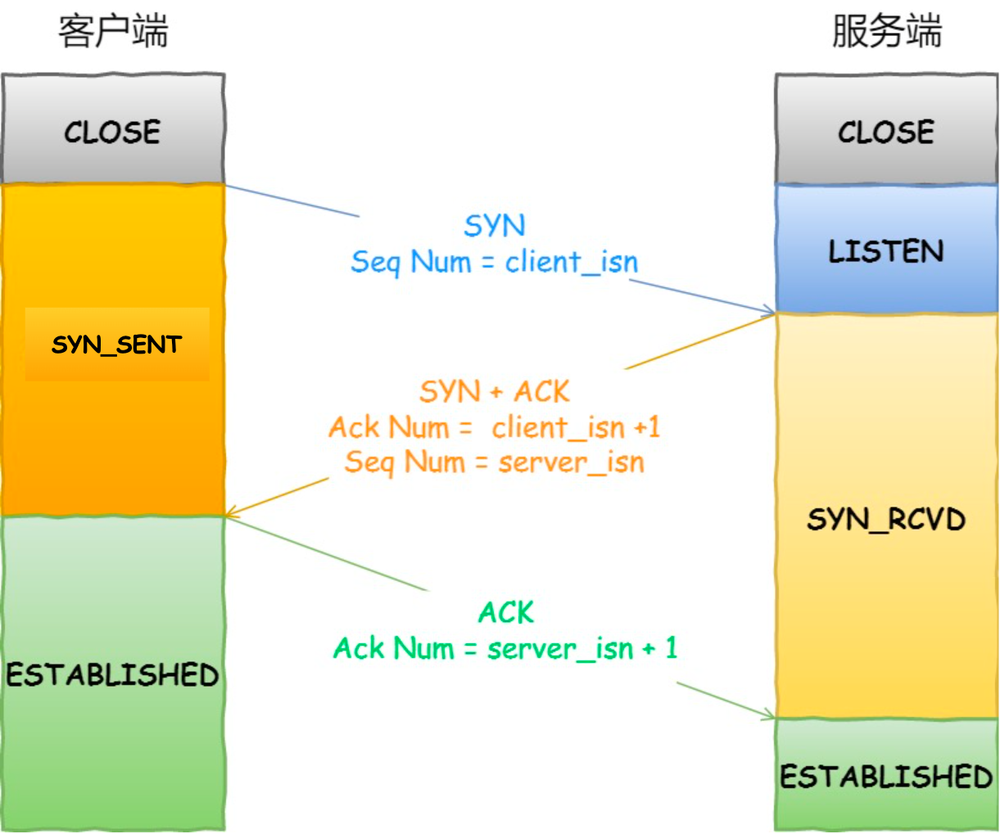

- 一开始，客户端和服务端都处于 `CLOSE` 状态。先是服务端主动监听某个端口，处于 `LISTEN` 状态

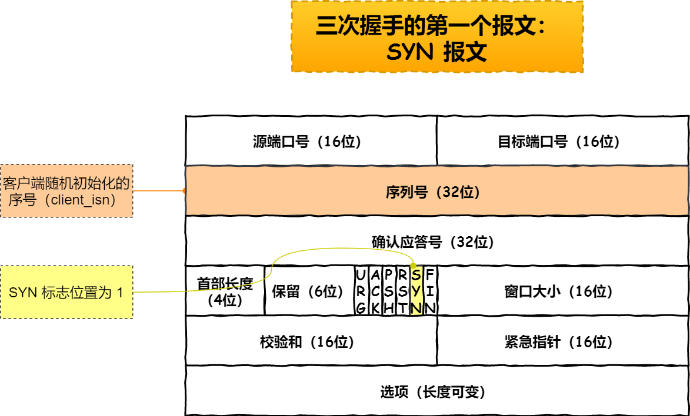

- 客户端会随机初始化序号（`client_isn`），将此序号置于 TCP 首部的「序号」字段中，同时把 `SYN` 标志位置为 `1`，表示 `SYN` 报文。接着把第一个 SYN 报文发送给服务端，表示向服务端发起连接，该报文不包含应用层数据，之后客户端处于 `SYN-SENT` 状态。

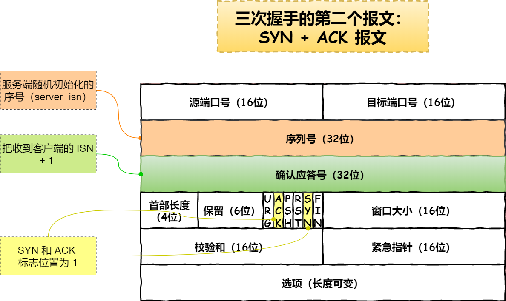


- 服务端收到客户端的 `SYN` 报文后，首先服务端也随机初始化自己的序号（`server_isn`），将此序号填入 TCP 首部的「序号」字段中，其次把 TCP 首部的「确认应答号」字段填入 `client_isn + 1`, 接着把 `SYN` 和 `ACK` 标志位置为 `1`。最后把该报文发给客户端，该报文也不包含应用层数据，之后服务端处于 `SYN-RCVD` 状态。

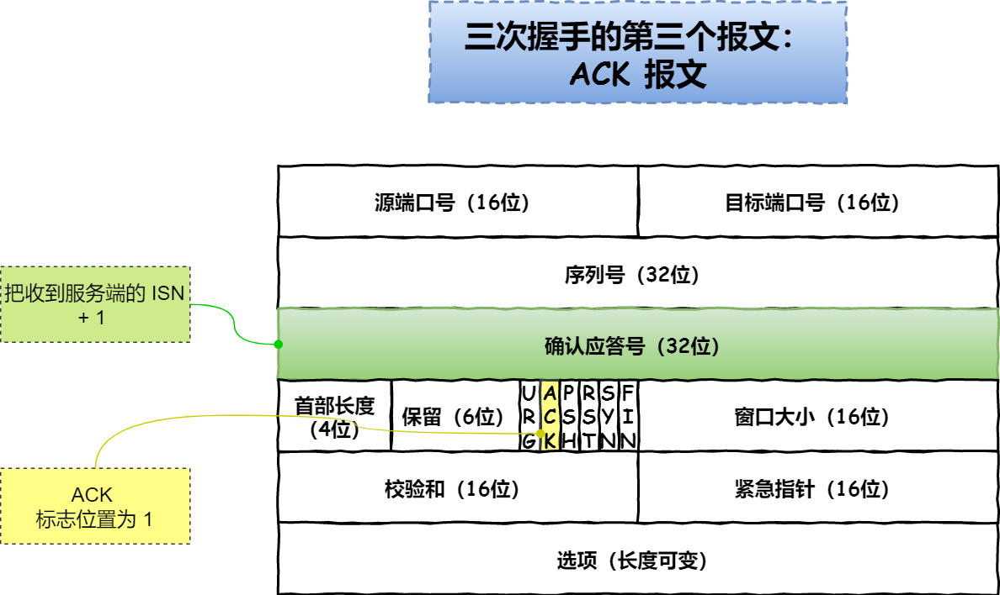

- 客户端收到服务端报文后，还要向服务端回应最后一个应答报文，首先该应答报文 TCP 首部 `ACK` 标志位置为 `1` ，其次「确认应答号」字段填入 `server_isn + 1` ，最后把报文发送给服务端，这次报文可以携带客户到服务端的数据，之后客户端处于 `ESTABLISHED` 状态。

- 服务端收到客户端的应答报文后，也进入 `ESTABLISHED` 状态。

从上面的过程可以发现**第三次握手是可以携带数据的，前两次握手是不可以携带数据的**，这也是面试常问的题。

一旦完成三次握手，双方都处于 `ESTABLISHED` 状态，此时连接就已建立完成，客户端和服务端就可以相互发送数据了。

#### 3、为什么是三次握手？不是两次、四次？

- **三次握手才可以阻止重复历史连接的初始化**（主要原因）

  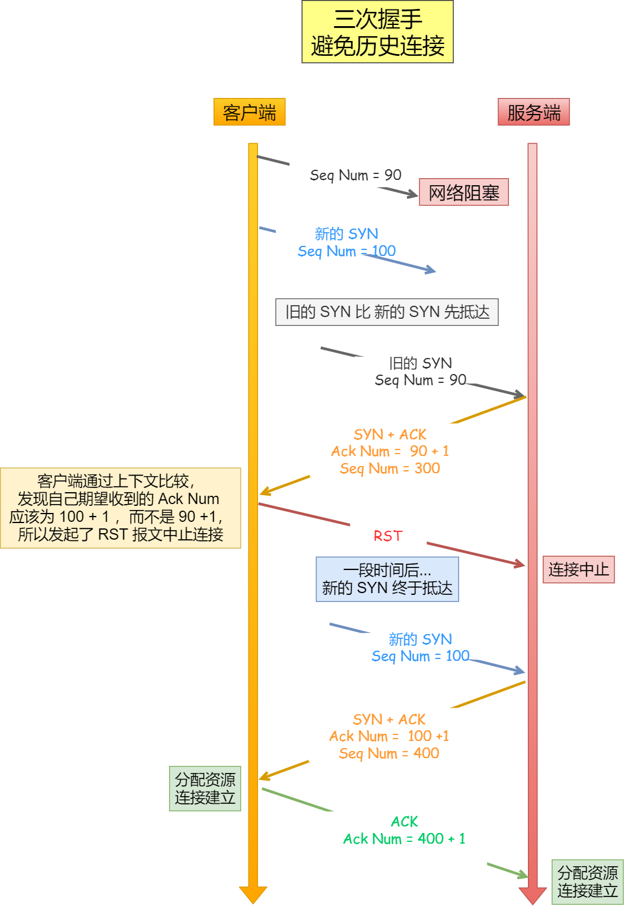

  客户端连续发送多次 SYN（都是同一个四元组）建立连接的报文，在**网络拥堵**情况下：

  - 一个「旧 SYN 报文」比「最新的 SYN」 报文早到达了服务端，那么此时服务端就会回一个 `SYN + ACK` 报文给客户端，此报文中的确认号是 91（90+1）。
  - 客户端收到后，发现自己期望收到的确认号应该是 100 + 1，而不是 90 + 1，于是就会回 RST 报文。
  - 服务端收到 RST 报文后，就会释放连接。
  - 后续最新的 SYN 抵达了服务端后，客户端与服务端就可以正常的完成三次握手了。

  上述中的「旧 SYN 报文」称为历史连接，TCP 使用三次握手建立连接的**最主要原因就是防止「历史连接」初始化了连接**。

  > **如果是两次握手连接，就无法阻止历史连接**，那为什么 TCP 两次握手为什么无法阻止历史连接呢？
  >
  > 我先直接说结论，主要是因为**在两次握手的情况下，服务端没有中间状态（`syn_recv`）给客户端来阻止历史连接，导致服务端可能建立一个历史连接，造成资源浪费**。

- **三次握手才可以同步双方的初始序列号**

  TCP 协议的通信双方， 都必须维护一个「序列号」， 用来保证传输的可靠性，它的作用：

  - 接收方可以去除重复的数据；
  - 接收方可以根据数据包的序列号按序接收；
  - 可以标识发送出去的数据包中， 哪些是已经被对方收到的（通过 ACK 报文中的序列号知道）；

  可见，序列号在 TCP 连接中占据着非常重要的作用，所以当客户端发送携带「初始序列号」的 `SYN` 报文的时候，需要服务端回一个 `ACK` 应答报文，表示客户端的 SYN 报文已被服务端成功接收，那当服务端发送「初始序列号」给客户端的时候，依然也要得到客户端的应答回应，**这样一来一回，才能确保双方的初始序列号能被可靠的同步。**

  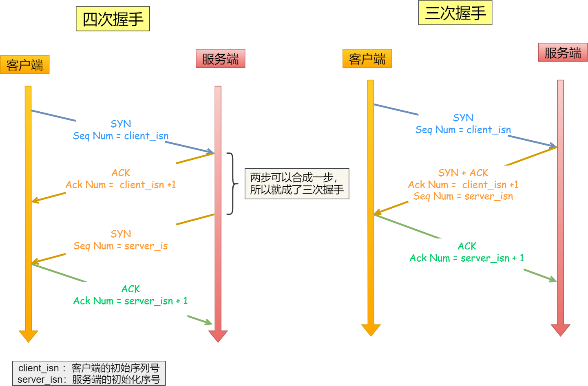

  四次握手其实也能够可靠的同步双方的初始化序号，但由于**第二步和第三步可以优化成一步**，所以就成了「三次握手」。

  而两次握手只保证了一方的初始序列号能被对方成功接收，没办法保证双方的初始序列号都能被确认接收。

- 三次握手才可以避免资源浪费

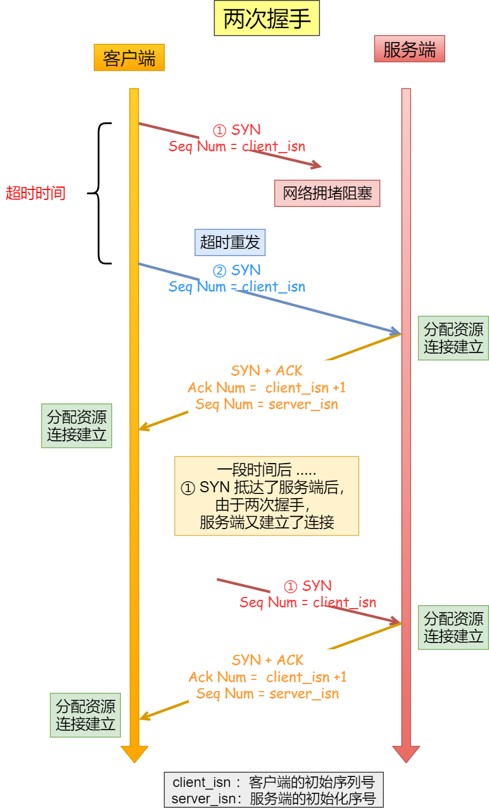

如果只有「两次握手」，当客户端发送的 `SYN` 报文在网络中阻塞，客户端没有接收到 `ACK` 报文，就会重新发送 `SYN` ，**由于没有第三次握手，服务端不清楚客户端是否收到了自己回复的 `ACK` 报文，所以服务端每收到一个 `SYN` 就只能先主动建立一个连接**，这会造成什么情况呢？

如果客户端发送的 `SYN` 报文在网络中阻塞了，重复发送多次 `SYN` 报文，那么服务端在收到请求后就会**建立多个冗余的无效链接，造成不必要的资源浪费。**

#### 4、TCP连接中的初始序列号 ISN 是如何随机产生的？

TCP协议中的初始序列号(ISN)是由发送方随机生成的一个32位序列号，用于在TCP连接建立时识别每个数据包。ISN是一个重要的安全机制，它可以防止网络攻击者通过猜测序列号来欺骗TCP连接。

ISN的产生过程通常涉及以下步骤：

1. 首先，发送方通过伪随机数生成算法生成一个随机的32位数值，该数值被作为ISN的值。
2. 生成的随机数通常是基于**当前时间戳和发送方IP地址**等信息计算的，这样可以保证每个发送方的ISN都是独一无二的。
3. 发送方使用生成的ISN作为初始序列号，将其作为TCP数据包的一个字段发送给接收方。
4. 接收方收到TCP数据包后，将ISN保存在本地，用于后续的TCP数据包识别和连接建立。

需要注意的是，ISN的生成过程不是严格规定的，具体实现可能会因操作系统、TCP实现或网络设备等不同而有所不同，但总体上ISN的随机性和唯一性都是必须保证的。

#### 5、 TCP 四次挥手过程是怎样的？

双方都可以主动断开连接，断开连接后主机中的「资源」将被释放，四次挥手的过程如下图：

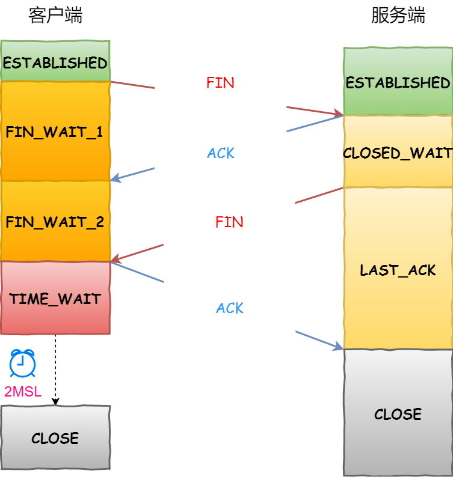

- 客户端打算关闭连接，此时会发送一个TCP首部**FIN**标志位被置为1的报文，也即`FIN`报文，之后客户端进入`FIN_WAIT_1`状态

- 服务端收到该报文后，就向客户端发送`ACK`应答报文，接着服务端进入`CLOSE_WAIT`状态。
- 客户端收到服务端的`ACK`应答报文后，就进入`FIN_WAIT_2`状态。
- 等待服务端处理完数据后，也向客户端发送`FIN`报文，之后服务端进入`LAST_ACK`状态。
- 客户端收到服务端的`FIN`报文后，回一个`ACK`应答报文，之后进入`TIME_WAIT`状态。
- 服务端收到这个`ACK`应答报文之后，就进入`CLOSE`状态，至此服务端已经完成连接的关闭。
- 客户端在经过`2MSL`一段时间后，自动进入`CLOSE`状态，至此客户端也完成了连接的关闭。

#### 6、为什么挥手需要四次？

再来回顾下四次挥手双方发 `FIN` 包的过程，就能理解为什么需要四次了。

- 关闭连接时，客户端向服务端发送 `FIN` 时，仅仅表示客户端不再发送数据了但是还能接收数据。
- 服务端收到客户端的 `FIN` 报文时，先回一个 `ACK` 应答报文，而服务端可能还有数据需要处理和发送，等服务端不再发送数据时，才发送 `FIN` 报文给客户端来表示同意现在关闭连接。

从上面过程可知，服务端通常需要等待完成数据的发送和处理，所以服务端的 `ACK` 和 `FIN` 一般都会分开发送，因此是需要四次挥手。

但是**在特定情况下，四次挥手是可以变成三次挥手的**。

#### 7、为什么TIME_WAIT等待的时间是2MSL？

`MSL`是Maximum Segment Lifetime，报文最大生存时间，它是任何报文在网络上存在的最长时间，超过这个时间报文将会被丢弃。因为 TCP 报文基于是 IP 协议的，而 IP 头中有一个 `TTL` 字段，是 IP 数据报可以经过的最大路由数，每经过一个处理他的路由器此值就减 1，当此值为 0 则数据报将被丢弃，同时发送 ICMP 报文通知源主机。

MSL 与 TTL 的区别： MSL 的单位是时间，而 TTL 是经过路由跳数。所以 **MSL 应该要大于等于 TTL 消耗为 0 的时间**，以确保报文已被自然消亡。

**TTL 的值一般是 64，Linux 将 MSL 设置为 30 秒，意味着 Linux 认为数据报文经过 64 个路由器的时间不会超过 30 秒，如果超过了，就认为报文已经消失在网络中了**。

TIME_WAIT 等待 2 倍的 MSL，比较合理的解释是： 网络中可能存在来自发送方的数据包，当这些发送方的数据包被接收方处理后又会向对方发送响应，所以**一来一回需要等待 2 倍的时间**。

比如，如果被动关闭方没有收到断开连接的最后的 ACK 报文，就会触发超时重发 `FIN` 报文，另一方接收到 FIN 后，会重发 ACK 给被动关闭方， 一来一去正好 2 个 MSL。

可以看到 **2MSL时长** 这其实是相当于**至少允许报文丢失一次**。比如，若 ACK 在一个 MSL 内丢失，这样被动方重发的 FIN 会在第 2 个 MSL 内到达，TIME_WAIT 状态的连接可以应对。

为什么不是 4 或者 8 MSL 的时长呢？你可以想象一个丢包率达到百分之一的糟糕网络，连续两次丢包的概率只有万分之一，这个概率实在是太小了，忽略它比解决它更具性价比。

`2MSL` 的时间是从**客户端接收到 FIN 后发送 ACK 开始计时的**。如果在 TIME-WAIT 时间内，因为客户端的 ACK 没有传输到服务端，客户端又接收到了服务端重发的 FIN 报文，那么 **2MSL 时间将重新计时**。

在 Linux 系统里 `2MSL` 默认是 `60` 秒，那么一个 `MSL` 也就是 `30` 秒。**Linux 系统停留在 TIME_WAIT 的时间为固定的 60 秒**。

其定义在 Linux 内核代码里的名称为 TCP_TIMEWAIT_LEN：

```c
#define TCP_TIMEWAIT_LEN (60*HZ) /* how long to wait to destroy TIME-WAIT 
                                    state, about 60 seconds  */
```

如果要修改 TIME_WAIT 的时间长度，只能修改 Linux 内核代码里 TCP_TIMEWAIT_LEN 的值，并重新编译 Linux 内核。

#### 8、为什么需要TIME_WAIT状态？

主动发起关闭的一方，才会有`TIME_WAIT`状态。

需要`TIME-WAIT` 状态，主要是两个原因：

- 防止历史连接中的数据，被后面相同的四元组连接错误的接收；
- 保证[被动关闭连接]的一方，能被正确的关闭

> **原因一：防止历史连接中的数据，被后面相同四元组的连接错误的接收**

为了能更好的理解这个原因，我们先来了解序列号（SEQ）和初始序列号（ISN）。

- **序列号**，是 TCP 一个头部字段，标识了 TCP 发送端到 TCP 接收端的数据流的一个字节，因为 TCP 是面向字节流的可靠协议，为了保证消息的顺序性和可靠性，TCP 为每个传输方向上的每个字节都赋予了一个编号，以便于传输成功后确认、丢失后重传以及在接收端保证不会乱序。**序列号是一个 32 位的无符号数，因此在到达 4G 之后再循环回到 0**。
- **初始序列号**，在 TCP 建立连接的时候，客户端和服务端都会各自生成一个初始序列号，它是基于时钟生成的一个随机数，来保证每个连接都拥有不同的初始序列号。**初始化序列号可被视为一个 32 位的计数器，该计数器的数值每 4 微秒加 1，循环一次需要 4.55 小时**。

给大家抓了一个包，下图中的 Seq 就是序列号，其中红色框住的分别是客户端和服务端各自生成的初始序列号。

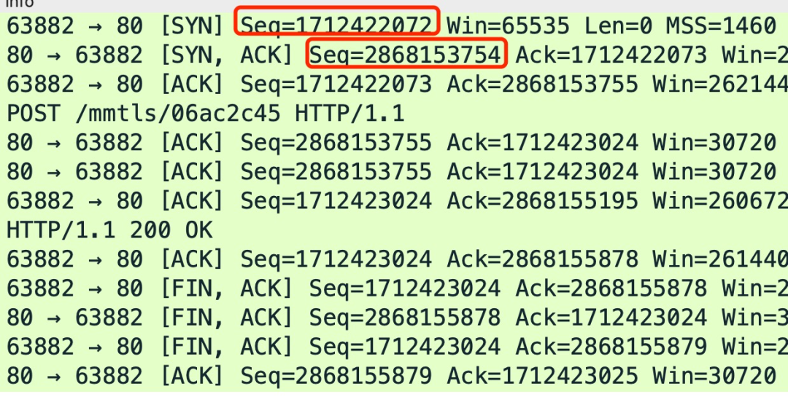

通过前面我们知道，**序列号和初始化序列号并不是无限递增的，会发生回绕为初始值的情况，这意味着无法根据序列号来判断新老数据**。

假设 TIME-WAIT 没有等待时间或时间过短，被延迟的数据包抵达后会发生什么呢？

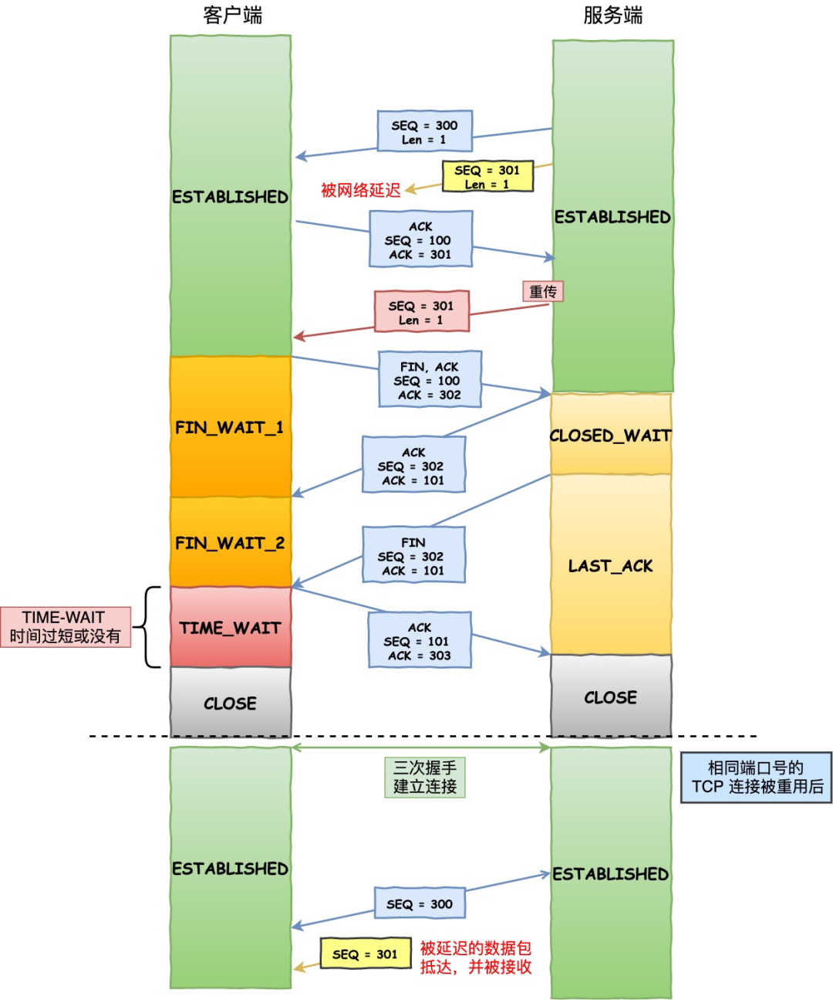


如上图：

- 服务端在关闭连接之前发送的 `SEQ = 301` 报文，被网络延迟了。
- 接着，服务端以相同的四元组重新打开了新连接，前面被延迟的 `SEQ = 301` 这时抵达了客户端，而且该数据报文的序列号刚好在客户端接收窗口内，因此客户端会正常接收这个数据报文，但是这个数据报文是上一个连接残留下来的，这样就产生数据错乱等严重的问题。

为了防止历史连接中的数据，被后面相同四元组的连接错误的接收，因此 TCP 设计了 `TIME_WAIT` 状态，状态会持续 `2MSL` 时长，这个时间**足以让两个方向上的数据包都被丢弃，使得原来连接的数据包在网络中都自然消失，再出现的数据包一定都是新建立连接所产生的。**

> 原因二：保证「被动关闭连接」的一方，能被正确的关闭

TIME-WAIT 作用是**等待足够的时间以确保最后的 `ACK` 能让被动关闭方接收，从而帮助其正常关闭。**

如果客户端（主动关闭方）最后一次 `ACK` 报文（第四次挥手）在网络中丢失了，那么按照 TCP 可靠性原则，服务端（被动关闭方）会重发 `FIN` 报文。

假设客户端没有 `TIME_WAIT` 状态，而是在发完最后一次回 `ACK` 报文就直接进入 `CLOSE` 状态，如果该 `ACK` 报文丢失了，服务端则重传的 `FIN` 报文，而这时客户端已经进入到关闭状态了，在收到服务端重传的 `FIN` 报文后，就会回 `RST` 报文。

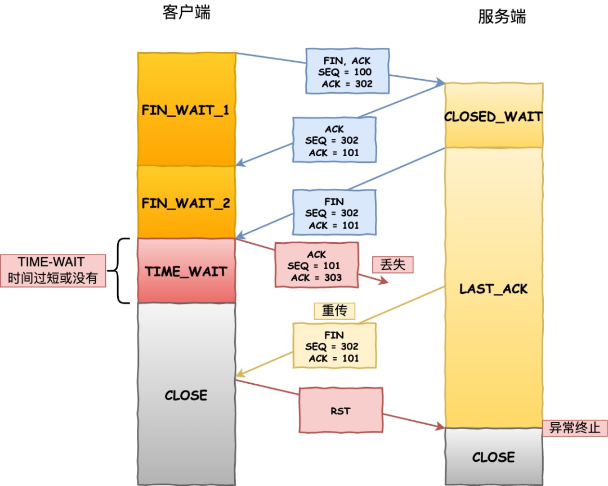


服务端收到这个 `RST` 并将其解释为一个错误（Connection reset by peer），这对于一个可靠的协议来说不是一个优雅的终止方式。

为了防止这种情况出现，客户端必须等待足够长的时间，确保服务端能够收到 `ACK`，如果服务端没有收到 `ACK`，那么就会触发 TCP 重传机制，服务端会重新发送一个 FIN，这样一去一来刚好两个 `MSL` 的时间。

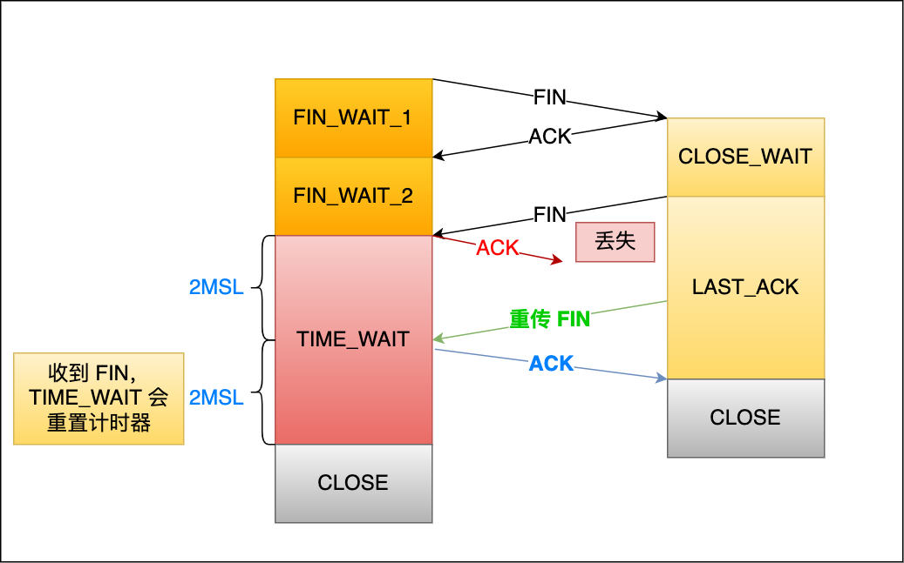

客户端在收到服务端重传的 `FIN` 报文时，`TIME_WAIT` 状态的等待时间，会重置回 `2MSL`。

#### 9、什么是 TCP 半连接队列和全连接队列？

在TCP三次握手的时候，Linux内核会维护两个队列，分别是：

- 半连接队列，也称`SYN`队列;
- 全连接队列。也称`accept`队列；

服务端收到客户端发起的 `SYN` 请求后，**内核会把该连接存储到半连接队列**，并向客户端响应 `SYN+ACK`，接着客户端会返回 `ACK`，服务端收到第三次握手的 `ACK` 后，**内核会把连接从半连接队列移除，然后创建新的完全的连接，并将其添加到 accept 队列，等待进程调用 accept 函数时把连接取出来。**

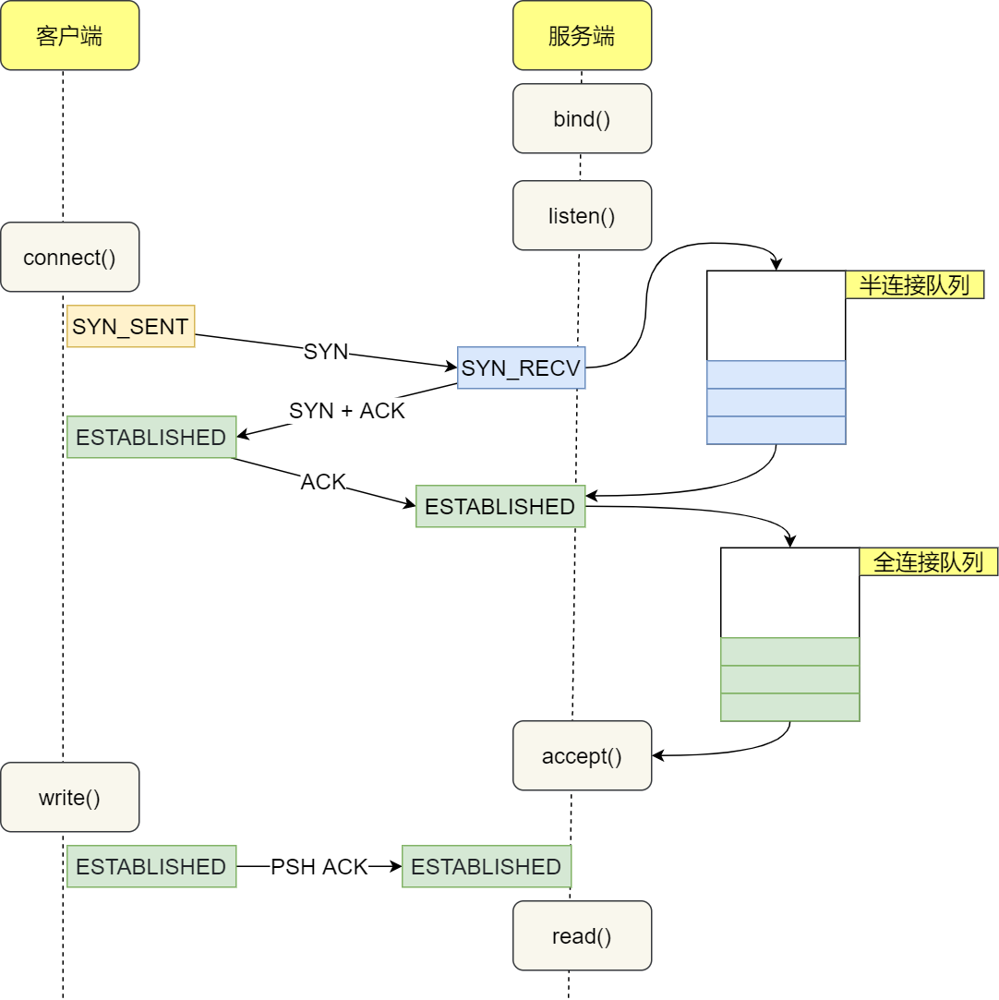

不管是半连接队列还是全连接队列，都有最大长度限制，超过限制时，内核会直接丢弃，或返回 RST 包。

#### 10、数据链路层有哪些协议？

数据链路层是OSI模型中的第二层，它负责将物理层提供的比特流转化为有意义的帧，并在通信的两个节点之间进行可靠的传输。以下是一些常见的数据链路层协议：

1. **以太网（Ethernet）**：是最常用的局域网技术之一，使用CSMA/CD协议实现了冲突检测和重传机制。
2. PPP（Point-to-Point Protocol）：是一种用于点对点链接的数据链路层协议，常用于拨号连接和宽带接入。
3. HDLC（High-Level Data Link Control）：是一种同步数据链路层协议，通常用于广域网和局域网中的点对点连接。
4. SLIP（Serial Line Internet Protocol）：是一种简单的数据链路层协议，通常用于串口连接的IP网络。
5. FDDI（Fiber Distributed Data Interface）：是一种高速光纤环网技术，具有高带宽和可靠性。
6. ATM（Asynchronous Transfer Mode）：是一种广域网数据链路层协议，提供了高速的传输和低延迟的服务。

这些协议在不同的网络环境中具有不同的优势和应用场景，选择合适的协议是实现可靠通信的重要因素之一。

#### 11、说说TCP的滑动窗口

> 引入窗口概念的原因

TCP每发送一个数据，都需要进行一次确认应答。当上一个数据包收到应答了再发送下一个。

这个模式就有点像我和你面对面聊天，**你一句我一句，这种方式的缺点就是效率比较低**。

如果你说完一句话，我在处理其他事情，没有及时回复你，那你不是要干等着我做完其他事情后，我回复你，你才能说下一句话，很显然这不现实。

所以，这样的传输方式有一个缺点：数据包的**往返时间越长，通信的效率就越低**。

为了解决这个问题，**TCP引入了窗口这个概念。即使在往返时间较长的情况下，它也不会降低网络通信的效率**。

那么有了窗口，就可以指定窗口大小，窗口大小就是指**无需等待确认应答，而可以继续发送数据的最大值**。

窗口的实现实际上是操作系统开辟的一个缓存空间，发送方主机在等到确认应答返回之前，必须在缓冲区中保留已发送的数据。如果按期收到确认应答，此时数据就可以从缓存区清除。

另外，通过滑动窗口也解决了两大问题：**流量控制和拥塞控制**。

#### 12、详细讲一下流量控制

滑动窗口解决了低效的一问一答的数据包发送方式，通过指定窗口大小，可以让TCP无需等待确认应答，即可发送大量的数据包。

但如果一直无脑的发数据给对方，而对方处理不过来，那么就会导致触发重发机制，从而导致网络流量无端的浪费。

为了解决这种现象，TCP就提供了一种流量控制机制，**可以让[发送方]根据[接收方]的实际接收能力控制发送的数据量**。

1. **操作系统缓冲区与滑动窗口的关系**

发送窗口和接收窗口中所存放的字节数，都是放在操作系统内存缓冲区中，而操作系统的缓冲区会被操作系统调整。

当服务端系统资源非常紧张的时候，操作系统可能会直接减少了接收缓冲区大小，这时应用程序又无法及时读取缓存数据，那么这时候就有严重的事情发生了，会出现数据包丢失的现象。

**为了防止这种情况发生，TCP 规定是不允许同时减少缓存又收缩窗口的，而是采用先收缩窗口，过段时间再减少缓存，这样就可以避免了丢包情况。**

2. **窗口关闭潜在的危险**

TCP 通过让接收方控制发送方发送的数据大小（窗口大小）来进行流量控制。

**如果窗口大小为 0 时，就会阻止发送方给接收方传递数据，直到窗口变为非 0 为止，这就是窗口关闭。**

接收方向发送方通告窗口大小时，是通过 `ACK` 报文来通告的。

那么，当发生窗口关闭时，接收方处理完数据后，会向发送方通告一个窗口非 0 的 ACK 报文，如果这个通告窗口的 ACK 报文在网络中丢失了，那麻烦就大了。

这会导致发送方一直等待接收方的非 0 窗口通知，接收方也一直等待发送方的数据，如不采取措施，这种相互等待的过程，会造成了死锁的现象。

3. **TCP 是如何解决窗口关闭时，潜在的死锁现象呢？**

为了解决这个问题，TCP为每个连接设有一个**持续定时器**，只要TCP连接一方收到对方的零窗口通知，就启动持续计数器。

如果持续计时器超时，就会发送**窗口探测（window probe）报文**，而对方在确认这个探测报文时，**给出自己现在的接收窗口大小**。

- 如果接收窗口仍然为 0，那么收到这个报文的一方就**会重新启动持续计时器**；
- 如果接收窗口不是 0，那么死锁的局面就可以被打破了。

窗口探测的次数一般为 3 次，每次大约 30-60 秒（不同的实现可能会不一样）。如果 3 次过后接收窗口还是 0 的话，有的 TCP 实现就会发 `RST` 报文来中断连接。

4. **糊涂窗口综合症**

如果接收方太忙了，来不及取走接收窗口里的数据，那么就会导致发送方的发送窗口越来越小。

到最后，**如果接收方腾出几个字节并告诉发送方现在有几个字节的窗口，而发送方会义无反顾地发送这几个字节，这就是糊涂窗口综合症**。

> 要知道，我们的 `TCP + IP` 头有 `40` 个字节，为了传输那几个字节的数据，要搭上这么大的开销，这太不经济了。

糊涂窗口综合症的现象是可以发生在发送方和接收方：

- **接收方可以通告一个小的窗口**
- **而发送方可以发送小数据**

于是，要解决糊涂窗口综合症，就要同时解决上面两个问题就可以了：

- 让接收方不通告小窗口给发送方
- 让发送方避免发送小数据

> 怎么让接收方不通告小窗口呢？

接收方通常的策略如下:

当「窗口大小」小于 min( MSS，缓存空间/2 ) ，也就是小于 MSS 与 1/2 缓存大小中的最小值时，就会向发送方通告窗口为 `0`，也就阻止了发送方再发数据过来。

等到接收方处理了一些数据后，窗口大小 >= MSS，或者接收方缓存空间有一半可以使用，就可以把窗口打开让发送方发送数据过来。

> 怎么让发送方避免发送小数据呢？

发送方通常的策略如下:

使用 Nagle 算法，该算法的思路是延时处理，只有满足下面两个条件中的任意一个条件，才可以发送数据：

- 条件一：要等到窗口大小 >= `MSS` 并且 数据大小 >= `MSS`；
- 条件二：收到之前发送数据的 `ack` 回包；

只要上面两个条件都不满足，发送方一直在囤积数据，直到满足上面的发送条件。

注意，如果接收方不能满足「不通告小窗口给发送方」，那么即使开了 Nagle 算法，也无法避免糊涂窗口综合症，因为如果对端 ACK 回复很快的话（达到 Nagle 算法的条件二），Nagle 算法就不会拼接太多的数据包，这种情况下依然会有小数据包的传输，网络总体的利用率依然很低。

所以，**接收方得满足「不通告小窗口给发送方」+ 发送方开启 Nagle 算法，才能避免糊涂窗口综合症**。

另外，Nagle 算法默认是打开的，如果对于一些需要小数据包交互的场景的程序，比如，telnet 或 ssh 这样的交互性比较强的程序，则需要关闭 Nagle 算法。

可以在 Socket 设置 `TCP_NODELAY` 选项来关闭这个算法（关闭 Nagle 算法没有全局参数，需要根据每个应用自己的特点来关闭）

#### 13、详细讲一下拥塞控制？

> **为什么要有拥塞控制，不是有流量控制吗？**

前面的流量控制是避免「发送方」的数据填满「接收方」的缓存，但是并不知道网络的中发生了什么。

一般来说，计算机网络都处在一个共享的环境。因此也有可能会因为其他主机之间的通信使得网络拥堵。

**在网络出现拥堵时，如果继续发送大量数据包，可能会导致数据包时延、丢失等，这时 TCP 就会重传数据，但是一重传就会导致网络的负担更重，于是会导致更大的延迟以及更多的丢包，这个情况就会进入恶性循环被不断地放大....**

所以，TCP 不能忽略网络上发生的事，它被设计成一个无私的协议，当网络发送拥塞时，TCP 会自我牺牲，降低发送的数据量。

于是，就有了**拥塞控制**，控制的目的就是**避免「发送方」的数据填满整个网络。**

为了在「发送方」调节所要发送数据的量，定义了一个叫做「**拥塞窗口**」的概念。

> **什么是拥塞窗口？和发送窗口有什么关系呢？**

拥塞窗口`cwnd`是发送方维护的一个状态变量，它会根据网络的拥塞程序动态变化。

我们在前面提到过发送窗口 `swnd` 和接收窗口 `rwnd` 是约等于的关系，那么由于加入了拥塞窗口的概念后，此时发送窗口的值是`swnd = min(cwnd, rwnd)`，也就是拥塞窗口和接收窗口中的最小值。

拥塞窗口`cwnd`变化的规则：

- 只要网络没有出现拥塞，`cwnd`就会增大；
- 发生拥塞，`cwnd`就会减少。

> 那么怎么知道当前网络是否发生了拥塞呢？

其实只要[发送方]没有在规定时间内接收到`ACK`应答报文，也就是发生了超时重传，就会认为网络出现了拥塞。

> **拥塞控制有哪些控制算法？**

- 慢启动：当发送方每收到一个`ACK`，拥塞窗口`cwnd`的大小就会加1（指数增长），直到到达慢启动门限`ssthresh`，这时进入拥塞避免。

- 拥塞避免：**每当收到一个 `ACK` 时，`cwnd` 增加 `1/cwnd`**。拥塞避免算法就是将原本指数增长变成了线性增长，还是处于增长阶段，但速度放缓。这样一直增长下去，网络慢慢会进入拥塞的状态，于是出现丢包现象，这时就需要对丢失的数据包进行重传。

- 拥塞发生：当触发了重传机制（超时重传、快速重传），也就进入到了拥塞发生算法。

  > **发生超时重传的拥塞发生算法：**

  这个时候，`ssthresh` 和 `cwnd` 的值会发生变化：

  - `ssthresh` 设为 `cwnd/2`，
  - `cwnd` 重置为 `1` （是恢复为 `cwnd` 初始化值，我这里假定 `cwnd` 初始化值 1）

  > **发生快速重传的拥塞发生算法**
  
  快速重传是一种更好的方式。当接收方发现丢了一个中间包的时候，发送三次前一个包的 ACK，于是发送端就会快速地重传，不必等待超时再重传

  TCP 认为这种情况不严重，因为大部分没丢，只丢了一小部分，则 `ssthresh` 和 `cwnd` 变化如下：
  - `cwnd = cwnd / 2`，也就是设置为原来的一半；
  - `ssthresh = cwnd`；
  - 进入快速恢复算法；

- 快速恢复

  快速恢复算法和快速重传算法一般同时使用，快速恢复算法认为，你还能收到3个重复ACK说明网络没有那么糟糕，所以没必要把像超时重传那么激烈。

  正如前面所说，进入快速恢复之前，`cwnd` 和 `ssthresh` 已被更新了：

  - `cwnd = cwnd/2` ，也就是设置为原来的一半;
  - `ssthresh = cwnd`;

  然后，进入快速恢复算法如下：

  - 拥塞窗口 `cwnd = ssthresh + 3` （ 3 的意思是确认有 3 个数据包被收到了）；
  - 重传丢失的数据包；
  - 如果再收到重复的 ACK，那么 `cwnd` 增加 1；
  - 如果收到新数据的 ACK 后，把 `cwnd` 设置为第一步中的 `ssthresh` 的值，原因是该 `ACK` 确认了新的数据，说明 `duplicated ACK` 时的数据都已收到，该恢复过程已经结束，可以回到恢复之前的状态了，也即再次进入拥塞避免状态；

#### 14、路由表的作用

路由表是计算机网络中用于控制数据包转发的重要组件之一。它记录了网络中路由器的路由信息，包括目的地、路由路径、路由器 ID 等信息。

路由表的作用如下:

1. 指导数据包的转发：路由表提供了到达目的地的最佳路径，路由器可以根据路由表的信息将数据包从源地址转发到目标地址。
2. 优化网络拓扑：路由表可以帮助路由器快速定位数据包的转发路径，减少网络拓扑的复杂度，提高网络的可扩展性和可管理性。
3. 支持路由协议：路由表是路由协议的基础，各种路由协议 (如 OSPF、EIGRP 等) 都是通过路由表来协调路由器之间的通信和确定最佳路径的。
4. 管理网络流量：路由表可以帮助路由器识别网络中的瓶颈和流量高峰，路由器可以通过调整路由策略来控制网络流量，提高网络的稳定性和性能。

总之，路由表是网络中的重要组成部分，它可以帮助路由器高效地管理网络流量，优化网络拓扑结构，支持路由协议的运行，是计算机网络中不可或缺的组件之一。

#### 15、ARP协议的工作原理？

ARP（Address Resolution Protocol）协议是**用于将IP地址解析为MAC地址**的网络协议，它工作在OSI模型的第二层——数据链路层。ARP协议的主要功能是通过广播查询目标设备的MAC地址，以便在数据链路层进行通信。（ARP 协议只能用于局域网中的设备之间，因为它是基于 MAC 地址的协议，而 **MAC 地址是一个局域网内的地址**）

ARP协议的工作原理如下：

1. 当源设备要向目标设备发送数据时，首先会在自己的**ARP缓存表**中查找目标设备的MAC地址，如果找到了，则直接将数据帧发送到目标设备。
2. 如果ARP缓存表中没有目标设备的MAC地址，则源设备会发送一个**ARP请求广播**，请求网络中所有设备帮助查找目标设备的MAC地址。
3. 网络中收到ARP请求的所有设备都会比对请求中的IP地址与自己的IP地址，如果匹配，则会向源设备回复一个**ARP响应**，**包含自己的MAC地址**。
4. 源设备收到ARP响应后，**将目标设备的IP地址和MAC地址添加到ARP缓存表中**，并使用这个MAC地址发送数据帧到目标设备。

需要注意的是，由于ARP请求是广播的，因此所有网络中的设备都会收到这个请求，这可能会对网络带宽产生一定的影响。因此，为了减少ARP请求的次数，常常会使用ARP缓存表来缓存已经解析过的IP地址与MAC地址的对应关系，以便在下一次通信时能够快速地查找。

**ARP请求数据包里包括源主机的IP地址、硬件地址、以及目的主机的IP地址**。

---

> 上面所说的情况其实是**源设备与目标设备在同一个网段的情况**。若源IP地址和目标IP地址不在同一个网段上，会是什么样的情况？

在这种情况，**源设备需要将数据包转发给网关（即默认路由器）**，并让网关帮助它转发到目标设备所在的子网。

在这个过程中，源设备会先构建一个数据包，并将目标 IP 地址设置为目标设备的 IP 地址。然后，它会将数据包发送到自己的默认网关（即路由器）的 MAC 地址，而不是目标设备的 MAC 地址。

- 那么这里的默认网关的MAC地址，又是如何知道的呢？其实，当ARP协议知道要解析的地址不是同一个子网时，源设备会发送目标IP为默认网关的ARP请求以获取路由器的MAC地址，这里其实也是执行了一遍ARP协议的工作过程，所以也能利用到ARP缓存。

当路由器收到数据包时，它会检查数据包的目标 IP 地址，并根据自己的路由表找到下一跳。如果下一跳在同一局域网内，那么路由器会使用 ARP 协议来获取下一跳的 MAC 地址，然后将数据包发送到下一跳的 MAC 地址。如果下一跳在不同的局域网内，路由器会将数据包转发到与目标设备所在子网相连的接口，并使用 ARP 协议来获取该子网的网关的 MAC 地址，然后将数据包发送到该网关的 MAC 地址。网关收到数据包后，再根据自己的路由表将数据包转发到下一跳，一直重复这个过程，直到数据包到达目标设备。

因此，当源设备和目标设备不在同一局域网上时，ARP 协议并不会直接在源设备所在的局域网下进行广播，**而是通过网关将数据包转发到目标设备所在的子网。**

> MAC 地址是一个局域网内的地址，怎么理解

MAC 地址是指数据链路层地址，也称为物理地址，它是一个唯一的标识符，用于在网络中识别每个网络设备。MAC 地址是由网络适配器厂商设定并嵌入到设备中，通常被称为网卡地址。MAC 地址由48位二进制数字组成，通常用六组十六进制数表示，例如 00-11-22-33-44-55。

MAC 地址是一个局域网内的地址，**因为它只能用于在同一个局域网内识别不同的网络设备**。在不同的局域网之间，需要使用路由器来进行数据包转发。在局域网内，数据包通常是通过 MAC 地址进行识别和传输的。当一个设备想要向另一个设备发送数据包时，它需要知道目标设备的 MAC 地址，这时候就需要使用 ARP 协议来获取目标设备的 MAC 地址。因此，MAC 地址只能用于在同一个局域网内进行数据包传输，如果需要跨越不同的网络，就需要使用更高层次的网络协议，如 IP 协议和路由协议。

#### 16、IPv4地址的分类

IPv4地址根据其所处网络的类别和网络掩码的不同，可以分为以下五类：

1. A类地址：第一位固定为0，后面7位为网络地址，剩下的24位为主机地址，其范围是1.0.0.0 ~ 126.255.255.255。
2. B类地址：前两位固定为10，后面14位为网络地址，剩下的16位为主机地址，其范围是128.0.0.0 ~ 191.255.255.255。
3. C类地址：前三位固定为110，后面21位为网络地址，剩下的8位为主机地址，其范围是192.0.0.0 ~ 223.255.255.255。
4. D类地址：前四位固定为1110，后面28位为组播地址，不可用于单点通信，其范围是224.0.0.0 ~ 239.255.255.255。
5. E类地址：前五位固定为11110，后面27位为保留位，用于实验和开发，其范围是240.0.0.0 ~ 255.255.255.255。

其中，**A、B、C三类地址被分配给了公共互联网使用**，而D、E两类地址则被保留用于特殊用途。

#### 17、ICMP有哪些应用？

ICMP（Internet Control Message Protocol）是一种基于IP协议的网络协议，主要用于网络设备之间进行错误报告、管理消息和控制信息的传递。

ICMP协议的应用包括：

1. ICMP Echo Request和ICMP Echo Reply：也就是**Ping命令**，**用于测试两个设备之间的网络连通性**。
2. ICMP Redirect：当路由器发现数据包将经过不同的路由进行转发时，会向发送方发送ICMP Redirect消息，指示发送方修改路由表，将下一跳路由修改为更合适的路由器。
3. ICMP Time Exceeded：当数据包在传输过程中超时时，设备会向发送方发送**ICMP Time Exceeded**消息，以便发送方得知数据包已被丢弃。
4. ICMP Destination Unreachable：当数据包无法到达目的地时，设备会向发送方发送**ICMP Destination Unreachable**消息，以便发送方得知数据包已被丢弃。
5. ICMP Router Advertisement和ICMP Router Solicitation：IPv6网络中，路由器通过ICMP Router Advertisement广告自己的存在，而主机通过ICMP Router Solicitation来主动请求路由器的存在，从而获取路由信息。

总之，ICMP协议在网络设备之间起到了重要的作用，帮助设备管理网络、传输数据以及进行故障排除。

#### 18、对称加密与非对称加密的区别

对称密钥加密是指加密与解密使用同一个密钥的方式，这种方式存在的最大问题就是密钥发送问题，即如何安全地将密钥发给对方。

而非对称加密是指使用一对非对称密钥，即公钥和私钥，公钥可以随意发布，但私钥只有自己知道。发送密文的一方使用对方的公钥进行加密处理，对方接收到加密信息后，使用自己的私钥进行解密。

由于非对称加密的方式不需要发送用来解密的私钥，所以可以保证安全性；但是和对称加密比起来，它非常的慢，所以我们还是要用对称加密来传送消息，**但对称加密所使用的密钥可以通过非对称加密的方式发送出去。**

#### 19、TCP的粘包和拆包

TCP是面向流，没有界限的一串数据。TCP底层并不了解上层业务数据的具体含义，它会根据TCP缓冲区的实际情况进行包的划分，所以在业务上认为是**完整的包，可能会被TCP拆分成多个包进行发送，也有可能把多个小的包封装成一个大的数据包发送**，这就是所谓的TCP粘包和拆包问题。

**为什么会产生粘包和拆包呢?**

- 要发送的数据小于TCP发送缓冲区的大小，TCP将多次写入缓冲区的数据一次发送出去，将会发生粘包；
- 接收数据端的应用层没有及时读取接收缓冲区中的数据，将发生粘包；
- 要发送的数据大于TCP发送缓冲区剩余空间大小，将会发生拆包；
- 待发送数据大于MSS（最大报文长度），TCP在传输前将进行拆包。即TCP报文长度-TCP头部长度>MSS。

**解决方案：**

- 发送端将每个数据包封装为固定长度
- 在数据尾部增加特殊字符进行分割
- 将数据分为两部分，一部分是头部，一部分是内容体；**其中头部结构大小固定，且有一个字段声明内容体的大小**。

------

> UDP会出现粘包吗

UDP不会出现TCP粘包的情况，因为UDP是基于报文发送的，每个UDP报文都会独立发送，不会像TCP一样将多个数据包合并成一个数据流进行传输，也不会出现拆包和粘包的问题。每个UDP报文都有独立的头部信息，包括**源端口号、目标端口号、长度**等信息，因此UDP报文的数据长度是固定的，不会因为数据的发送顺序不同而导致粘包或拆包的问题。

#### 20、两种请求转发方式forward 和 redirect 的区别？

`forward`和`redirect`是两种请求转发方式，区别如下：

- `forward`是转发，`redirect`是重定向；
- `forward`不会改变浏览器地址栏的`url`，而`redirect`会改变；
- `forward`是服务器内部的操作，`redirect`是客户端的操作；
- `forward`可以共享`request`里面的数据，而`redirect`不能共享数据。

总之，`forward`方式转发请求可以更快地完成请求处理，因为它不需要浏览器重新向服务器发起请求，而`redirect`方式可以让客户端与服务器之间建立新的会话，但是会增加一定的请求响应的开销。选择哪种方式取决于具体的应用场景。

#### 21、DNS的解析过程？

DNS的解析过程是将域名解析为IP地址的过程。DNS的解析过程可以分为两个阶段，分别是递归查询和迭代查询。

递归查询是指**客户端向本地域名服务器发出域名解析请求后，如果该本地域名服务器本身不能解析这个域名，它会向其他根域名服务器继续发送解析请求，直到解析到对应的IP地址并返回给客户端**。整个过程中，本地域名服务器扮演了中间者的角色，向其他域名服务器不断请求直到得到结果并返回给客户端。

而迭代查询则是指**本地域名服务器只向其他域名服务器提出请求，如果被请求的服务器不能提供正确的结果，那么它只会返回一个提示信息，告诉本地域名服务器下一步应该去哪个域名服务器进行查询**。这个过程会一直迭代下去，直到本地域名服务器得到了最终的解析结果或者查询失败。

总的来说，递归查询是本地域名服务器帮助客户端向其他域名服务器请求解析结果，而迭代查询则是本地域名服务器直接向其他域名服务器发起解析请求，并根据返回的提示信息不断迭代下去，直到得到最终的结果。

> 递归查询是相对客户端的工作来说，而迭代是相对本地域名服务器的工作。

在执行查询操作之前，会先检查本地计算机的缓存：

- 先检**查浏览器中的 DNS 缓存**，如果浏览器中有对应的记录会直接使用，并完成解析；

- 如果浏览器没有缓存，那就去**查询操作系统的缓存**，如果查询到记录就可以直接返回 IP 地址，完成解析；

- 如果操作系统没有 DNS 缓存，就会去**查看本地 host 文件**
- 如果本地host也没有相应的记录，则开始查询操作。

#### **22、DNS为什么用UDP？**

DNS使用UDP是出于效率和性能的考虑。

首先，DNS查询是非常频繁的，每次请求只需要发送一个小的DNS查询消息，如果使用TCP会增加额外的开销，包括建立连接、断开连接和确认消息，这将显著增加网络传输量和处理负担。**因此，使用UDP协议可以减少网络流量和资源消耗，提高查询效率**。

另外，DNS查询通常需要快速响应，而UDP是无连接的协议，不需要建立连接和保持状态，可以更快地发送和接收数据包，避免了TCP三次握手和四次挥手的延迟。虽然UDP协议不可靠，但DNS查询通常使用**重试机制**，因此，即使丢失一些数据包，也不会对查询结果产生太大影响。

总之，DNS使用UDP协议可以**减少网络流量和资源消耗**，提高**查询效率和响应速度**，同时也适合于处理一些数据不敏感的查询请求。

#### 23、简单说下怎么实现DNS劫持？

DNS劫持是一种网络攻击方式，攻击者通过篡改DNS解析结果，将用户的域名请求重定向到恶意网站，从而实现窃取用户的信息、欺诈等目的。下面是一些常见的DNS劫持攻击方式：

1. 本地hosts文件修改：攻击者可以修改本地hosts文件，将特定域名解析到恶意IP地址，从而实现DNS劫持。这种方式只对单个主机有效，对网络攻击效果有限。
2. DNS服务器攻击：攻击者可以攻击运营商或第三方DNS服务器，篡改DNS解析结果，将特定域名解析到恶意IP地址，从而实现DNS劫持。这种方式可以对整个网络产生影响，攻击效果较大。
3. 路由器攻击：攻击者可以通过攻击路由器，篡改DNS解析结果，将特定域名解析到恶意IP地址，从而实现DNS劫持。这种方式可以对整个局域网产生影响，攻击效果较大。

为了防止DNS劫持，可以采取以下措施：

1. 使用HTTPS协议：HTTPS协议可以加密数据传输，防止DNS解析结果被篡改。
2. 使用DNSSEC技术：DNSSEC技术可以对**DNS解析结果进行数字签名**，防止DNS解析结果被篡改。
3. 配置防火墙：可以通过配置防火墙，限制网络访问，从而防止恶意IP地址的攻击。
4. 使用可信赖的DNS服务器：使用可信赖的DNS服务器，可以减少DNS劫持的风险。

----

> 路由器为什么会有DNS解析结果

**路由器通常会提供DNS缓存的功能，这样可以加快DNS查询的速度**，同时减轻ISP域名服务器的压力。当一个设备（如PC、手机等）发起DNS查询请求时，路由器可以缓存查询结果并将其存储在本地缓存中，以便下次设备再次访问该域名时可以直接使用缓存结果，而无需再次向ISP域名服务器发送查询请求。攻击者可以通过篡改路由器的DNS缓存来实现DNS劫持，将受害者的访问请求重定向到恶意的IP地址

> 那HTTPS如何防止DNS解析结果被篡改

HTTPS可以通过数字证书来验证服务器的身份，从而防止DNS解析结果被篡改。数字证书由受信任的第三方机构颁发，包含了服务器的身份信息和公钥，浏览器可以使用数字证书来验证服务器的身份和公钥是否合法。如果服务器的数字证书不合法或者被篡改，浏览器就会给出警告提示，防止用户访问到恶意网站。此外，HTTPS还使用了加密技术来保护通信内容的安全，即使DNS解析结果被篡改，也无法窃取或篡改通信内容。

> 恶意网站不会在CA机构注册证书吗

恶意网站也可以在CA机构注册证书，但是CA机构会对证书申请人进行一定的身份验证和审核，如果申请人没有通过身份验证或者有不良记录，CA机构是不会为其颁发证书的。此外，一些浏览器厂商也会对CA机构进行信任评估，只有被认可的CA机构颁发的证书才能得到浏览器的信任。这些措施可以减少恶意网站获取有效证书的机会，从而提高用户的安全性。但是，这些措施并不能完全杜绝恶意网站的存在，因为攻击者也有可能通过某些途径获取有效证书，或者利用其他漏洞进行攻击。因此，用户在访问网站时，也需要保持警惕，提高自身的安全意识。

#### 24、IP地址和MAC地址有什么区别？各自的用处？

IP地址和MAC地址是两种不同的地址，各自有不同的用途。

IP地址是Internet Protocol的缩写，用于在网络上标识和寻找设备。**IP地址是逻辑地址**，由32位二进制数表示，通常以点分十进制的形式呈现。IP地址可以分为公网IP地址和私有IP地址，公网IP地址是在Internet上唯一标识一个设备的地址，私有IP地址则用于在局域网内部通信。IP地址的作用是用于在网络上路由数据包，将数据包从源地址传递到目的地址。

MAC地址是Media Access Control的缩写，用于在局域网上标识设备。MAC地址是物理地址，由48位二进制数表示，通常以十六进制的形式呈现。每个网络设备都有一个唯一的MAC地址，**用于在局域网内部通信，以确定数据包的目标设备**。在以太网中，MAC地址是数据链路层地址，用于在局域网上传输数据帧。

**简单来说，IP地址用于在互联网上标识和寻找设备，而MAC地址用于在局域网上标识设备。**

#### 25、IPV4 地址不够如何解决

IPv4地址不够的问题可以通过以下几种方式解决：

1. CIDR（无类域间路由）：CIDR允许将IP地址划分为更小的地址块，以便更有效地使用IP地址。
2. NAT（网络地址转换）：NAT将私有IP地址转换为公共IP地址，从而允许多个设备共享单个公共IP地址。这种方法可以延长IPv4地址的使用寿命。
3. IPv6：IPv6使用更长的地址（128位），相对于IPv4（32位）提供了更多的地址空间，这样就可以容纳更多的设备。IPv6的广泛部署需要一定的时间和资源，但随着IPv4地址枯竭的问题越来越突出，IPv6的部署已经成为了必然的趋势。

这些方法并不是互相排斥的，它们可以结合使用，以扩大IPv4地址的使用寿命，同时为IPv6的广泛部署提供更充分的准备。

----

CIDR（Classless Inter-Domain Routing）允许将IP地址划分为更小的地址块，以便更有效地使用IP地址，主要通过两个方面来实现：

1. 通过子网掩码将一个 IP 地址划分为多个子网，以便更精细地管理 IP 地址。例如，可以将一个大型网络划分为多个子网，每个子网有自己的 IP 地址范围和子网掩码，可以更好地管理和控制网络流量。
2. 使用无类别域间路由（CIDR）技术将 IP 地址分配更加合理。在传统的 IP 地址分配方案中，IP 地址根据网络类别（A、B、C）分配，每个网络类别分别分配一定数量的 IP 地址。但是，这种分配方案会造成 IP 地址的浪费，因为每个网络类别分配的 IP 地址数量是固定的，不能根据实际需要灵活分配。

CIDR 技术允许将 IP 地址按照需要进行分配，即根据实际需要动态分配 IP 地址，使得 IP 地址分配更加灵活和高效。同时，CIDR 还可以避免路由表的爆炸式增长，提高网络的路由效率和性能。

#### 26、说说TCP报文首部有哪些字段，其作用又分别是什么？

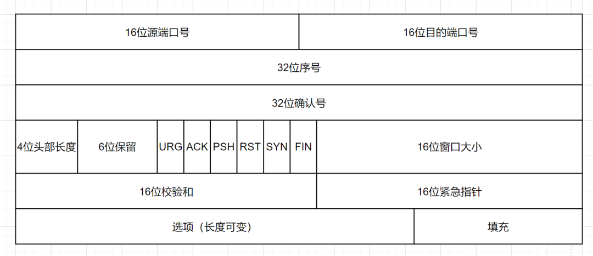

- **源端口和目标端口**：16位，分别用于标识发送方和接收方的端口号，确保数据传输的正确路由；
- **序号：**32位，用于标识数据段在整个TCP连接中的位置，以便接收方按正确的顺序重组数据段；
- **确认号：**32位，仅在ACK标志位设置时有效，用于通知发送方已经接收到的数据序号；
- **数据偏移：**4位，用于指定TCP报文头的长度，以支持可变长度的选项字段；

- **保留：**6位，保留为将来使用，目前未被使用；
- **控制位：**6位，用于指定TCP报文的类型和操作，如`SYN、ACK、FIN、RST`等；
- **窗口大小：**16位，用于指定接收方可以接收的数据量。发送方会根据窗口大小来控制自己发送的数据量，以确保接收方有足够的缓冲区来存储数据，从而避免了缓冲区溢出的问题；
- **校验和：**16位，用于检验TCP报文首部和数据的完整性，以避免在传输过程中出现数据错误；
- **紧急指针：**16位，用于指定发送方在TCP连接中发送紧急数据的位置

#### 27、TCP有哪些特点？

TCP（Transmission Control Protocol）是一种传输控制协议，它是面向连接的、可靠的、基于字节流的传输协议，具有以下特点：

1. 面向连接：在通信之前，发送方和接收方必须先建立连接，而且在通信过程中保持这个连接，通信结束后再释放连接。这种连接的建立和释放过程增加了开销，但确保了数据传输的可靠性。
2. 可靠性：TCP通过**序列号、确认应答、超时重传**等机制，确保数据的可靠传输，同时还支持**流量控制和拥塞控制**，保证网络传输的可靠性和稳定性。
3. 高效性：TCP采用了流量控制和拥塞控制机制，可以避免网络堵塞，保证传输的效率。
4. 面向字节流：TCP把数据看作一个字节流，因此无需考虑数据的内部结构，可以灵活地传输任意长度的数据。
5. 全双工通信：TCP连接是全双工的，可以实现双方同时发送和接收数据。

总之，TCP在保证数据可靠传输和网络稳定性方面表现出色，但在传输效率方面可能存在一定的问题。

#### 28、TCP和UDP的区别？

TCP和UDP都是传输层协议，用于实现数据在网络中的传输，他们的区别主要以下几点：

1. 连接方式：TCP是面向连接的协议，在发送数据之前需要建立连接；UDP是无连接的协议，无需建立连接，直接发送数据包。
2. 可靠性：TCP提供可靠的数据传输，保证数据传输的可靠性；UDP不提供数据传输的可靠性，传输数据时**不保证数据包的到达和正确性**。
3. 传输速度：UDP的传输速度比TCP快，因为UDP没有建立连接的过程和可靠性检测，而TCP需要建立连接和保证可靠性。

4. 通信方式：每一条TCP连接只能是**点到点**的；UDP支持一对一、一对多、多对一和多对多的通信方式。

5. 首部开销：TCP首部开销20字节；UDP的首部开销小，只有8个字节。

6. 适用场景：TCP适用于数据传输要求高可靠性的场景，如文件传输、邮件传输等；UDP适用于数据实时性要求高的场景，如视频直播、游戏等。

#### 29、TCP 和 UDP 分别对应的常见应用层协议有哪些？

**基于TCP的应用层协议有：HTTP、FTP、SMTP、TELNET、SSH**

- **HTTP** ：`HyperText Transfer Protocol`（超文本传输协议），默认端口80
- **FTP **: File Transfer Protocol (文件传输协议), 默认端口(20用于传输数据，21用于传输控制信息)
- **SMTP** : Simple Mail Transfer Protocol (简单邮件传输协议) ,默认端口25
- **TELNET **: Teletype over the Network (网络电传), 默认端口23
- **SSH** ：Secure Shell（安全外壳协议），默认端口 22

**基于UDP的应用层协议：DNS、TFTP、SNMP**

- **DNS**  : Domain Name Service (域名服务),默认端口 53
- **TFTP **: Trivial File Transfer Protocol (简单文件传输协议)，默认端口69
- **SNMP** ：Simple Network Management Protocol（简单网络管理协议），通过UDP端口161接收，只有Trap信息采用UDP端口162。

-----

DNS协议通常使用UDP进行域名解析查询，因为UDP具有轻量级和低延迟的特点，适合快速查询。但是在某些情况下，由于DNS协议本身的限制，UDP不足以满足需求，需要使用TCP协议。

具体来说，DNS协议规定每个DNS响应报文的长度不能超过512字节，如果响应的数据量超过了这个限制，DNS服务器就会将响应分割成多个512字节的数据块，并将它们放在多个UDP报文中进行传输。这种分割和传输过程会增加网络传输的负担，可能会导致数据包丢失或延迟。为了解决这个问题，可以使用TCP协议，TCP协议不限制报文的长度，可以在一条TCP连接上传输任意大小的数据，能够保证DNS响应报文的完整性和可靠性。另外，使用TCP协议可以保证数据的有序性，因为TCP会对数据包进行排序和重传，从而避免了UDP可能出现的乱序和丢包问题。

除此之外，**DNS在进行区域传输和DNSSEC安全扩展时，也需要使用TCP协议进行传输**。

----

区域传输（zone transfer）是指将一个域名的所有记录从主DNS服务器传输到从DNS服务器的过程。通常情况下，主DNS服务器会定期更新域名的记录，并将更新的记录发送到从DNS服务器，以确保从DNS服务器上的记录与主DNS服务器上的记录一致。

DNSSEC（DNS Security Extensions）是一种对DNS协议的安全扩展，通过数字签名技术确保DNS数据的真实性、完整性和不可否认性。DNSSEC的主要目的是解决DNS中的安全漏洞，包括DNS欺骗（DNS spoofing）和DNS缓存投毒（DNS cache poisoning）等攻击。

当使用区域传输或DNSSEC时，DNS协议需要使用TCP协议进行通信。因为UDP协议在传输数据时不保证数据的可靠性和完整性，而区域传输和DNSSEC的数据量比较大，需要保证数据的完整性和正确性，因此采用TCP协议进行传输，确保数据的可靠性。

#### 30、说说TCP是如何确保可靠性的呢？

TCP（传输控制协议）是一种面向连接的、可靠的协议。它通过以下几种机制来确保可靠性：

1. **序号和确认应答机制**：每个TCP报文段都有一个序号和确认号。序号表示报文段的第一个字节在整个数据流中的序号，确认号表示期望收到的下一个字节的序号。接收方通过发送确认应答（ACK）报文段来告知发送方，它已成功接收到数据。
2. **超时重传机制**：如果发送方在一段时间内没有收到确认应答，就会认为数据丢失，并重新发送该数据。
3. **滑动窗口机制**：TCP利用滑动窗口来进行流量控制，控制发送方发送数据的速率。接收方通过通告窗口大小来告知发送方，它当前可接收的数据量。发送方根据窗口大小来发送数据，以避免发送速率过快导致数据丢失。
4. **连接管理机制**：TCP通过三次握手和四次挥手来建立和关闭连接，以确保通信的可靠性和安全性。

这些机制使得TCP可以在不可靠的IP网络上提供可靠的传输服务。

#### 31、什么是DoS、DDoS、DRDoS攻击？

- **DOS**: (Denial of Service),翻译过来就是拒绝服务,一切能**引起DOS行为的攻击都被称为DOS攻击**。最常见的DoS攻击就有**计算机网络宽带攻击**、**连通性攻击**。
- **DDoS**: (Distributed Denial of Service),翻译过来是分布式拒绝服务。是指处于不同位置的多个攻击者同时向一个或几个目标发动攻击，或者一个攻击者控制了位于不同位置的多台机器并利用这些机器对受害者同时实施攻击。常见的DDos有**SYN Flood、Ping of Death、ACK Flood、UDP Flood**等。
- **DRDoS**: (Distributed Reflection Denial of Service)，中文是分布式反射拒绝服务，该方式靠的是发送大量带有被害者IP地址的数据包给攻击主机，然后攻击主机对IP地址源做出大量回应，从而形成拒绝服务攻击。

#### 32、什么是CSRF攻击，如何避免

CSRF，跨站请求伪造（英文全称是Cross-site request forgery），是一种挟制用户在当前已登录的Web应用程序上执行非本意的操作的攻击方法。

**怎么解决CSRF攻击呢？**

- 检查Referer字段。
- 添加校验token。

#### 33、什么是XSS攻击？如何解决

XSS，跨站脚本攻击（Cross-Site Scripting）。它指的是恶意攻击者往Web页面里插入恶意html代码，当用户浏览该页之时，嵌入其中Web里面的html代码会被执行，从而达到恶意攻击用户的特殊目的。XSS攻击一般分三种类型：**存储型 、反射型 、DOM型XSS**

**如何解决XSS攻击问题？**

- 对输入进行过滤，过滤标签等，只允许合法值。
- HTML转义
- 对于链接跳转，如`<a href="xxx"` 等，要校验内容，禁止以script开头的非法链接。
- 限制输入长度

#### 34、说下ping的原理

Ping是一种常用的网络工具，用于测试两台计算机之间的连通性。其原理是向目标计算机发送ICMP报文，然后等待目标计算机的响应。通过统计响应时间和丢包率等信息，可以判断两台计算机之间的网络质量。

具体来说，Ping的原理包括以下几个步骤： 

1. 发送ICMP Echo request报文：Ping程序向目标计算机发送一个ICMP Echo Request报文，其中包含了一个序号和时间戳。
2. 接收ICMP Echo reply报文：目标计算机收到ICMP Echo Request报文后，会回复一个ICMP Echo reply报文，其中包含了相同的序号和时间戳等信息。
3. 计算往返时间：Ping程序接收到ICMP Echo Reply报文后，可以计算出往返时间（RTT）,即发送Echo Request报文到接收到Echo Reply报文所需要的时间。
4. 统计丢包率：如果目标计算机没有收到ICMP Echo Request报文，或者ICMP Echo Reply报文在传输过程中丢失，那么Ping程序就会认为这个报文丢失了。通过统计丢包率，可以判断网络质量的好坏。

### HTTP

#### 1、HTTP协议的特点？

- 简单：HTTP协议是一种简单的协议，它使用客户端 - 服务器模型，并且通信协议只需要定义如何请求和响应数据即可。
- 灵活：HTTP协议允许客户端与服务器之间进行**任何类型的通信，包括文件、图像、音频和视频等**
- 跨平台：HTTP协议具有跨平台性，因为它可以在**不同的操作系统和浏览器之间使用**
- 可扩展性：**HTTP协议支持用户自定义相关字段和方法，以满足实际的需求**

#### 2、HTTP报文格式

HTTP请求由**请求行、请求头部、空行和请求体**四个部分组成。

- **请求行**：包括请求方法，访问的资源URL，使用的HTTP版本。`GET`和`POST`是最常见的HTTP方法，除此以外还包括`DELETE、HEAD、OPTIONS、PUT、TRACE`。
- **请求头**：格式为“属性名:属性值”，服务端根据请求头获取客户端的信息，主要有`cookie、host、connection、accept-language、accept-encoding、user-agent`。
- **请求体**：用户的请求数据如用户名，密码等。

**请求报文示例**：

```http
POST /xxx HTTP/1.1 请求行
Accept:image/gif.image/jpeg, 请求头部
Accept-Language:zh-cn
Connection:Keep-Alive
Host:localhost
User-Agent:Mozila/4.0(compatible;MSIE5.01;Window NT5.0)
Accept-Encoding:gzip,deflate

username=dabin 请求体
```

HTTP响应也由四个部分组成，分别是：**状态行、响应头、空行和响应体**。

- **状态行**：协议版本，状态码及状态描述。
- **响应头**：响应头字段主要有`connection、content-type、content-encoding、content-length、set-cookie、Last-Modified，、Cache-Control、Expires`。
- **响应体**：服务器返回给客户端的内容。

**响应报文示例**：

```http
HTTP/1.1 200 OK
Server:Apache Tomcat/5.0.12
Date:Mon,6Oct2003 13:23:42 GMT
Content-Length:112

<html>
    <body>响应体</body>
</html>
```

#### 3、HTTP 协议包括哪些请求？

HTTP协议中共定义了八种方法来表示对Request-URI指定的资源的不同操作方式，具体如下：

- `GET`：向特定的资源发出请求。
- `POST`：向指定资源提交数据进行处理请求（例如提交表单或者上传文件）。数据被包含在请求体中。POST请求可能会导致新的资源的创建和/或已有资源的修改。
- `OPTIONS`：返回**服务器针对特定资源所支持的HTTP请求方法**。也可以利用向Web服务器发送'*'的请求来测试服务器的功能性。
- `HEAD`：向服务器索要与GET请求相一致的响应，只不过响应体将不会被返回。这一方法可以在不必传输整个响应内容的情况下，就可以获取包含在响应消息头中的元信息。
- `PUT`：向指定资源位置上传其最新内容。
- `DELETE`：请求服务器删除Request-URI所标识的资源。
- TRACE：回显服务器收到的请求，主要用于测试或诊断。
- CONNECT：HTTP/1.1协议中预留给能够将连接改为管道方式的代理服务器。

-----

> HTTP方法中POST和PUT的区别

POST和PUT的区别在于，PUT方法用于创建一个新的资源，而POST方法用于将实体提交到指定的资源，通常导致状态变化或副作用。PUT方法是幂等的，即调用一次与连续调用多次效果是相同的，而连续调用多次相同的POST方法可能会产生副作用，比如多次提交同一个订单。

因此，PUT方法通常用于更新资源，而POST方法通常用于创建资源或者执行非幂等的操作。

#### 4、如何理解HTTP协议是无状态的

当浏览器第一次发送请求给服务器时，服务器响应了；如果同个浏览器发起第二次请求给服务器时，它还是会响应，但是呢，服务器不知道你就是刚才的那个浏览器。简言之，服务器不会去记住你是谁，所以是无状态协议。

#### 5、HTTP1.1和 HTTP2.0的区别？

HTTP2.0相比HTTP1.1支持的特性：

- **新的二进制格式**：HTTP1.1 基于文本格式传输数据；HTTP2.0采用二进制格式传输数据，解析更高效。
- **多路复用**：在一个连接里，允许同时发送多个请求或响应，**并且这些请求或响应能够并行的传输而不被阻塞**，避免 HTTP1.1 出现的”队头堵塞”问题。
- **头部压缩**，HTTP1.1的header带有大量信息，而且每次都要重复发送；HTTP2.0 把header从数据中分离，并封装成头帧和数据帧，**使用特定算法压缩头帧**，有效减少头信息大小。并且HTTP2.0**在客户端和服务器端记录了之前发送的键值对，对于相同的数据，不会重复发送。比如请求a发送了所有的头信息字段，请求b则只需要发送差异数据**，这样可以减少冗余数据，降低开销。
- **服务端推送**：HTTP2.0允许服务器向客户端推送资源，无需客户端发送请求到服务器获取。

#### 6、HTTP 与 HTTPS 的区别

- HTTP是超文本传输协议，信息是明文传输，不提供任何方式的数据加密，安全性较低，容易被第三方截取或篡改。HTTPS是HTTP的安全版本，它在HTTP的基础上加入了SSL/TLS协议，可以对数据进行加密传输，保护数据的隐私和完整性。
- HTTPS需要到CA（数字证书认证机构）申请证书，一般免费证书较少，需要一定费用。HTTP不需要证书，开销较小。
- HTTP和HTTPS使用的是完全不同的连接方式，默认端口也不一样，HTTP是80端口，HTTPS是443端口。
- HTTP的连接过程比较简单，只需要TCP三次握手建立连接。HTTPS的连接过程比较复杂，除了TCP三次握手外，还需要客户端验证服务器的数字证书，以及协商对称加密算法和密钥等。

- HTTPS相比HTTP会对搜索排名有一定的提升，因为百度和谷歌等搜索引擎都已经将HTTPS作为一个重要的权重指标。

#### 7、HTTP方法的get和post的区别

GET和POST都是HTTP请求方法，用于向服务器发送请求。它们之间的区别如下：

1. GET方法将请求参数附加在URL上，而POST方法将请求参数包含在HTTP请求体中。
2. GET方法请求的数据量较小，通常限制在URL长度限制范围内（约2048个字符），而POST方法请求的数据量较大，理论上无限制，但受服务器和网络限制。
3. GET方法请求是幂等的，即多次请求同一个URL，得到的结果是一样的。而POST方法请求不是幂等的，每次请求都会对服务器产生影响。
4. GET方法请求会被浏览器缓存，而**POST方法请求不会被缓存**。
5. GET方法请求不太安全，因为请求参数暴露在URL上，容易被第三方获取。而POST方法请求相对安全，因为请求参数包含在HTTP请求体中，不易被第三方获取。

综上所述，GET方法适用于**请求数据量小、幂等且安全性要求不高**的场景，而POST方法适用于请求数据量大、不幂等且安全性要求较高的场景。

#### 8、HTTP哪些常用的状态码及使用场景？

- 状态码分类
  - 1xx：表示目前是协议的中间状态，还需要后续请求
  - 2xx：表示请求成功
  - 3xx：表示重定向状态，需要重新请求
  - 4xx：表示请求报文错误
  - 5xx：服务端错误

- 常用状态码
  - 101 切换请求协议，从HTTP切换到websocket
  - 200 请求成功，有响应体
  - 301 永久重定向：**会缓存**
  - 302 临时重定向：**不会缓存**
  - 304 协商缓存命中
  - 403 服务器静止访问
  - 404 资源未找到
  - 400 请求错误
  - 500 服务端错误
  - 503 服务端繁忙

#### 9、谈下你对 HTTP 长连接和短连接的理解？分别应用于哪些场景？

> 理解：HTTP长连接和短连接是指客户端与服务端之间建立连接的持续时间。

短连接：指客户端和服务端之间的连接在完成一次请求和响应之后就会断开，下一次请求需要重新建立连接。这种方式适合于请求量较小的场景，如浏览网页，下载文件等。

长连接：指客户端和服务端之间的连接可以在多次请求和响应之间保持打开状态，直到某一方主动关闭连接或者发生错误。这种方式适用于请求量较大、频繁通信的场景，例如在线游戏、视频流媒体等。

> 使用场景

HTTP 长连接和短连接的区别在于建立和断开连接的次数不同。短连接可以避免因为长时间保持连接而导致的资源浪费，但是每次连接都需要重新建立，会增加网络延迟。长连接可以减少网络延迟，但是需要维护连接状态，会增加服务器的负担。

在实际应用中，可以根据具体场景选择使用长连接还是短连接。例如，在 Web 服务器中，可以使用短连接来处理 HTTP 请求，以减少服务器的负担；而在实时通信或者数据传输场景中，可以使用长连接来提高通信效率。

#### 10、HTTPS的工作过程？

HTTPS是一种基于传输层安全协议（TLS/SSL）的HTTP协议，用于对HTTP通信进行加密和身份认证。HTTPS通信的过程包括以下步骤：

- 客户端向服务器发起HTTPS请求，请求使用HTTPS通信。

- 服务器将自己的证书（包括公钥）发送给客户端。

- 客户端收到服务器的证书后，首先要验证证书的合法性。如果证书不合法，则提示用户证书不受信任；如果证书合法，则继续第4步。

- 客户端生成一个随机的对称密钥，并使用服务器的公钥进行加密，然后将加密后的密钥发送给服务器。

- 服务器使用自己的私钥进行解密，得到对称密钥。

- 客户端和服务器都有了对称密钥，接下来的通信就可以使用对称密钥进行加密和解密了。

在HTTPS的通信过程中，使用了对称加密和非对称加密两种加密算法。对称加密算法速度快，但密钥传输需要安全性，因此采用**非对称加密算法来加密对称密钥。此外，为了防止中间人攻击，需要使用数字证书来进行身份认证**。

总体来说，HTTPS可以提供更高的安全性，保证通信的机密性、完整性和可信度，适用于对数据安全要求比较高的场景，如电子商务、网上银行等。

#### 11、HTTPS 的优缺点？

HTTPS的优点：

- 数据加密传输：HTTPS通过`SSL/TLS`协议对数据进行加密传输，可以有效防止网络窃听和数据泄露，保证了数据的安全性和隐私性。

- 身份验证：HTTPS可以对服务器进行身份验证，确保用户访问的是真实的网站，防止中间人攻击。

- 改善搜索引擎排名：Google等搜索引擎已将网站的HTTPS协议作为排名因素之一，因此使用HTTPS协议可以改善网站的搜索排名。

HTTPS的缺点：

- **传输速度较慢**：HTTPS通过加密解密等过程会增加网络负载，因此传输速度比HTTP慢。

- **网站成本高**：HTTPS需要使用SSL证书，而SSL证书需要购买，因此使用HTTPS协议增加了网站的成本。

- SSL证书信任问题：HTTPS需要使用SSL证书对网站进行身份验证，但是SSL证书的信任问题容易被攻击者利用，如采用伪造证书的方式进行中间人攻击。

- 对于静态内容的传输，如图片、视频等，使用HTTPS加密传输的意义不是很大，但是却增加了服务器的负载。

#### 12、数字签名和数字证书

**数字签名**是通过将消息的摘要使用私钥进行加密得到的。私钥只有消息的发送者知道，所以只有消息发送者可以生成正确的数字签名。接收方可以使用消息发送者的公钥来验证数字签名的有效性，以此来确认消息的完整性和真实性。

**数字证书**是一种用于加密通信的安全电子文件，通常由第三方机构--证书颁发机构（Certificate Authority，CA）签发。数字证书用于在互联网上建立安全的通信信道，确保数据的机密性、完整性和身份认证。数字证书包含了**公钥、证书持有者信息、证书的有效期以及数字签名**等信息。

在使用数字证书的过程中，浏览器会向网站服务器请求数字证书，如果数字证书合法、未过期并由受信任的CA机构颁发，那么浏览器会信任该数字证书，建立安全通信信道。数字证书能够有效防止中间人攻击和DNS欺骗等安全问题，保障了用户的数据安全。

#### 13、Cookie和Session

Cookie和Session都是用于在客户端和服务器端之间保持状态的技术，但它们之间有一些不同点：

- 存储位置不同：Cookie是存储在客户端的浏览器中的，而Session是存储在服务器端的内存或者数据库中的。

- 安全性不同：Cookie的数据是以明文形式存储在客户端的浏览器中的，如果被窃取就会暴露用户的隐私信息；而Session是存储在服务器端的，相对来说更加安全。

- 存储大小不同：Cookie的存储大小一般为4KB左右，而Session的存储大小一般可以调整，通常比Cookie大。

- 有效期不同：Cookie可以设置一个过期时间，过了这个时间就会被删除；而Session一般在用户关闭浏览器或者一段时间内没有任何操作时就会被删除。

- 使用方式不同：Cookie是通过在响应头中添加Set-Cookie字段来设置的，客户端会自动将Cookie保存在浏览器中并在每次请求时自动发送；而Session是在服务器端创建的，服务器会在响应头中设置一个Session ID，客户端在请求时需要携带这个Session ID来标识自己的身份。

综上所述，Cookie和Session都是用于在客户端和服务器端之间保持状态的技术，但是它们的存储位置、安全性、存储大小、有效期和使用方式都有所不同，应根据实际需求选择使用哪种技术。

#### 14、URI和URL之间的区别？

URI和URL都是用于标识资源的字符串。URI是Uniform Resource Identifier的缩写，而URL是Uniform Resource Locator的缩写。URI是一个抽象的概念。可以是绝对的或相对的，而**URL必须提供足够的信息来定位资源，因此它是绝对的**。

换句话说，URL是URI的子集。URI可以表示任何资源，而URL只能表示网络上可用的资源。

#### 15、GET请求中URL编码的意义

在HTTP请求中，URL编码是一种将特殊字符转换为URL格式的编码方式。它的主要作用是确保**URL的可读性和安全性**。

具体来说，URL编码可以将所有非字母数字字符替换成它们的ASCII码值，以便它们能够被正确地解析和处理。例如，如果我们要使用一个包含空格或其他特殊字符的查询字符串来向服务器发送请求，那么这些字符可能会被误解或被截断，导致请求失败或返回错误的结果。通过使用URL编码，我们可以确保这些特殊字符被正确地编码和传输，从而避免这些问题的发生。

此外，URL编码还可以增强URL的安全性。一些特殊字符，如“/”、“？”、“&”等，可能被用作攻击的工具。通过将这些字符编码，我们可以防止它们被恶意利用，从而保护我们的网站和数据的安全。

#### 16、HTTP和TCP 中的keep-alive

- HTTP的keep-alive也叫HTTP长连接，该功能是由**[应用程序]**实现的，可以使得用同一个TCP连接来发送和接收多个HTTP请求/应答，减少了HTTP短连接带来的多次TCP连接建立和释放的开销。

- TCP的keep-alive也叫TCP保活机制，该功能由**[内核]**实现的，当客户端和服务端长达一定时间没有进行数据交互时，**内核为了确保该连接是否还有效，就会发送探测报文**，来检测对方是否还在线，然后来决定是否需要关闭该连接。

#### 17、说说HTTP2协议

由于 HTTP/2“事实上”是基于 TLS，所以在正式收发数据之前，会有 TCP 握手和 TLS 握手。TLS 握手成功之后，客户端必须要发送一个“连接前言”（connection preface），用来确认建立 HTTP/2 连接。这个“连接前言”是标准的 HTTP/1 请求报文，使用纯文本的 ASCII 码格式，请求方法是特别注册的一个关键字“PRI”，全文只有 24 个字节：

```http
PRI * HTTP/2.0\r\n\r\nSM\r\n\r\n
```

HTTP/2的主要特点包括：

1. 头部压缩：HTTP/2使用**HPACK算法**对头部信息进行压缩，减少了头部信息的传输大小，提高了传输效率。

   > 废除了起始行（用伪头字段，":method"），只用头字段。
   >
   > HPACK算法：在客户端和服务器两端建立“字典”，用索引号表示重复的字符串，还釆用**哈夫曼编码**来压缩整数和字符串，可以达到 50%~90% 的高压缩率
   >
   > 静态表：存储常用字段；
   >
   > 动态表：它添加在静态表后面，结构相同，但会在编码解码的时候随时更新，用于存储静态表中没有的自定义字段。

2. 二进制帧：头部数据压缩之后，HTTP/2 就要把报文拆成二进制的帧准备发送；HTTP/2采用二进制协议，**将请求和响应头部信息等转换为二进制格式传输**，减少了解析和传输的开销（位运算解析高效），提高了传输效率。

   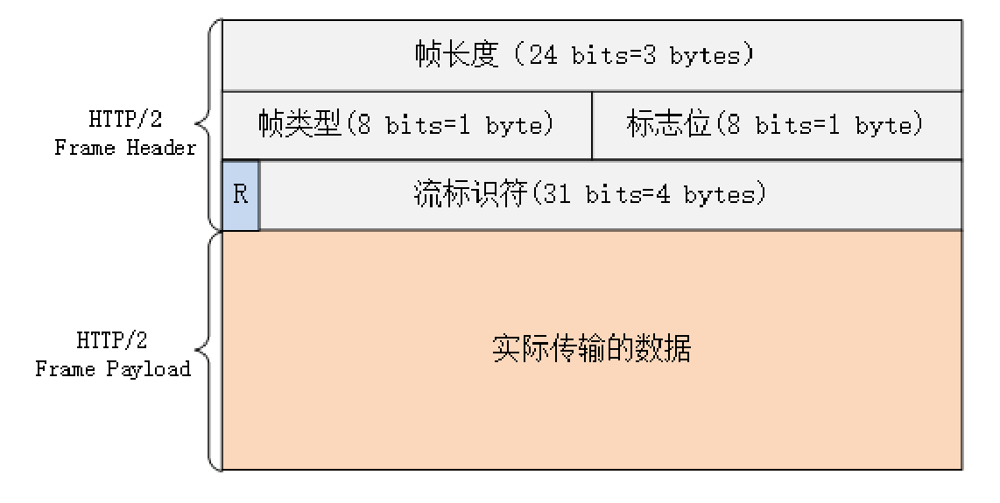

3. 流与多路复用：HTTP/2允许**在一个TCP连接中同时发送多个请求和响应**，避免了建立多个TCP连接的开销，提高了并发性能。

   > 在 HTTP/2 连接上，虽然帧是乱序收发的，但只要它们都拥有相同的流 ID，就都属于一个流，而且在这个流里帧不是无序的，而是有着严格的先后顺序。
   >
   > 在概念上，一个 HTTP/2 的流就等同于一个 HTTP/1 里的“请求 - 应答”。在 HTTP/1 里一个“请求 - 响应”报文来回是一次 HTTP 通信，在 HTTP/2 里一个流也承载了相同的功能。
   >
   > HTTP/2 的流有哪些特点：
   >
   > 1. 流是可并发的，一个HTTP/2连接上可以同时发出多个流传输数据，也就是并发多请求，实现“多路复用”；
   > 2. 客户端和服务端都可以创建流（流ID分别为奇数和偶数），双方互不干扰；
   > 3. 流是双向的，一个流里面客户端和服务端都可以发送或接收数据帧，也就是一个“请求-应答”来回；
   > 4. 流之间没有固定关系，彼此独立，但是流内部的帧是有严格顺序的；
   > 5. 流可以设置优先级，让服务器优先处理，比如先传HTML/CSS，后传图片，优化用户体验；
   > 6. 流ID不能重用，只能顺序递增，客户端发起的ID是奇数，服务端发起的ID是偶数；
   > 7. 在流上发送“RST_STREAM”帧可以随时终止流，取消接收或发送；
   > 8. 第 0 号流比较特殊，不能关闭，也不能发送数据帧，只能发送控制帧，用于流量控制。

4. 服务器推送：HTTP/2允许服务器在客户端**请求某个资源时主动推送相关资源，避免了客户端重复请求，提高了性能**。

5. 流量控制：HTTP/2引入了流量控制机制，允许客户端和服务器控制数据的传输速率，避免了网络拥塞问题。

总的来说，HTTP/2在保持HTTP/1.x基本功能的基础上，通过优化数据传输方式、头部压缩、流量控制等方式提高了Web应用程序的性能和效率。HTTP/2的特性和优势使得它成为现代Web应用程序的首选协议之一。

----

> HTTP/2中的流量控制分为两部分：**连接级和流级**

#### 18、说说HTTP/3协议

##### HTTP/2 的“队头阻塞”

HTTP/2虽然解决了应用层的队头阻塞，而在下层，也就是TCP协议中，还是会发生“队头阻塞”。

让我们从协议栈的角度来仔细看一下。在 HTTP/2 把多个“请求 - 响应”分解成流，交给 TCP 后，TCP 会再拆成更小的包依次发送（其实在 TCP 里应该叫 segment，也就是“段”）。

在网络良好的情况下，包可以很快送达目的地。但如果网络质量比较差，像手机上网的时候，就有可能会丢包。而 TCP 为了保证可靠传输，有个特别的“丢包重传”机制，丢失的包必须要等待重新传输确认，其他的包即使已经收到了，也只能放在缓冲区里，上层的应用拿不出来，只能“干着急”。

##### HTTP/3协议

HTTP/3协议相对于HTTP/2协议有以下主要的改进：

1. 基于UDP协议：HTTP/3协议使用了QUIC协议作为底层传输协议，而不是TCP协议。由于TCP协议在处理网络抖动和丢包等问题时会有一定的延迟，而UDP协议则可以更快地响应这些问题，因此HTTP/3协议的性能和速度相对于HTTP/2协议更快。
2. 0-RTT握手：HTTP/3协议支持0-RTT握手，也就是在第一次连接时可以发送数据，而不需要等待三次握手完成。这样可以提高连接速度和效率。
3. 加密：HTTP/3协议强制加密所有传输的数据，提高了传输数据的安全性。
4. 流量控制：HTTP/3协议内置流量控制机制，可以更好地处理传输数据的流量控制和管理。
5. 多路复用：HTTP/3协议继承了HTTP/2协议的多路复用特性，可以同时处理多个请求和响应，提高传输效率和性能。

总的来说，HTTP/3协议具有更好的性能、速度和安全性，可以更好地适应当今高速和不稳定的网络环境，成为未来Web应用程序的首选协议。

### 情景设计题

#### 1、两台服务器进行通信，近距离变成远距离，远距离会有一定的延迟，那发送程序会有什么影响？

发送速度其实是会有所减慢，因为TCP存在滑动窗口的问题，会限制会确认包的数量，**距离的增加会导致确认包回传更慢**，所以导致发送速度也变慢。

#### 2、当有两个近远的IP地址，怎么做出调整让DNS选择近的？

要让DNS服务器优先选择距离近的IP地址，可以采用以下几种方式：

- **使用基于地理位置的DNS负载平衡器**。这种类型的DNS负载平衡器可以通过IP地址的地理位置信息，将用户请求分配到距离用户最近的服务器上。

- **在DNS服务器上配置权重值**。可以将距离近的IP地址的权重值设置为更高，这样DNS服务器就会更倾向于选择这些IP地址作为响应。

- 在DNS服务器上配置TTL（生存时间）。可以将TTL设置为较短的时间，这样DNS服务器就会更频繁地查询IP地址，并选择最近的IP地址作为响应。

- 在DNS记录中添加区域信息。在DNS记录中添加区域信息可以让DNS服务器更准确地识别用户的位置，从而选择距离用户最近的IP地址作为响应。

需要注意的是，以上方法可能会因为网络环境的变化或者DNS缓存的问题，导致选择的IP地址不一定总是最优的。因此，在实际应用中，需要根据具体的情况选择合适的方法，以达到最优的效果。

#### 3、`udp`丢包会有什么现象？

当UDP丢包时，数据包将在传输过程中丢失，因此接收方将无法接收到该数据包。这可能会导致以下几种现象：

1. 数据损坏：由于UDP不提供可靠的数据传输，因此在丢失数据包时，接收方可能会接收到损坏的数据。这是因为UDP数据包不像TCP那样有序地传输，因此可能会导致接收到的数据包顺序错乱，从而导致数据损坏。
2. 数据延迟：如果UDP丢失了重要的数据包，则接收方可能需要等待发送方重新发送该数据包，这会导致数据的延迟。如果丢失了大量数据包，则延迟可能会更加明显。
3. 数据丢失：如果UDP丢失了重要的数据包，并且发送方没有重新发送该数据包，则接收方将无法接收该数据包，从而导致数据丢失。如果数据丢失太多，可能会导致数据完全丢失，无法恢复。

总之，当UDP丢包时，接收方可能会接收到**损坏的数据、延迟的数据或丢失的数据**，这可能会导致数据的不完整或无法使用。因此，在使用UDP进行数据传输时，需要确保使用适当的技术来处理丢包情况，例如使用**差错校验或重传机制来提高数据传输**的可靠性。

#### 4、简单说下SYN FLOOD是什么？

SYN Flood（SYN洪泛）是一种常见的DDoS攻击类型，攻击者利用TCP三次握手的过程**发送大量虚假的SYN请求**，消耗服务器资源，使得合法的连接请求无法被处理。

SYN Flood攻击的基本原理是利用攻击者发送大量伪造的TCP连接请求SYN包来占用服务器资源，使得正常的TCP连接请求无法被处理。**攻击者发送的SYN请求不会回复ACK确认，因此服务器一直在等待连接建立，从而消耗了大量的资源**。

SYN Flood攻击的目标通常是网络服务，如Web服务器、邮件服务器、DNS服务器等，这些服务都是基于TCP协议运行的。

## 二、操作系统

### 基础篇

#### 1、死锁发生的条件，以及如何避免死锁

死锁是多个进程或线程之间相互等待的一种情况，导致它们都无法继续执行，从而形成一种无限循环等待的状态。通常，死锁发生的条件包括：

1. 互斥：多个进程或线程竞争有限的资源，例如硬件设备、文件或共享内存等。
2. 占有和等待：一个进程或线程占有了某些资源，并等待其他进程或线程释放其所需的资源。
3. 不可剥夺：进程或线程持有的某些资源无法被其他进程或线程剥夺。
4. 环路等待：多个进程或线程形成了一个等待资源的环路，每个进程或线程都在等待另一个进程或线程释放其所需的资源。

为了避免死锁，可以采用以下策略：

1. 避免互斥：尽可能减少资源的竞争，或使用共享资源时尽可能避免同步。
2. 避免占有和等待：进程或线程需要**一次性获取所有资源**，而不是一个一个地等待。
3. 避免不可剥夺：尽可能使用可剥夺的资源，例如可以被操作系统强制回收的内存。
4. 避免环路等待：通过**给资源编号、固定申请资源的顺序**等方式，破坏等待资源的环路。

此外，还可以使用以下技术来避免死锁：

1. 超时机制：如果某个进程或线程无法获取所需的资源，可以设置一个超时时间，超过该时间就放弃等待并释放已占有的资源。
2. 死锁检测和恢复：定期检测系统中是否存在死锁，如果存在则采取措施打破死锁，例如回收某些资源或终止某些进程或线程。

#### 2、什么是软中断？

> 中断是什么？

在计算机中，中断是系统用来响应硬件设备请求的一种机制，操作系统收到硬件的中断请求，会打断正在执行的进程，然后调用**内核中的中断处理程序**来响应请求。

操作系统收到了中断请求，会打断其他进程的运行，所以中断请求的响应程序，也就是中断处理程序要尽可能快的执行完，这样可以减少对正常进程运行调度地影响。而且，中断处理程序在响应中断时，可能还会「临时关闭中断」，这意味着，如果当前中断处理程序没有执行完之前，系统中其他的中断请求都无法被响应，也就说中断有可能会丢失，所以中断处理程序要短且快。

> 什么是软中断？

linux系统为了**解决中断处理程序执行过长和中断丢失**的问题，将中断过程分为两个阶段，分别是`[上半部和下半部]`。

- 上半部分用来快速处理中断，一般会暂时关闭中断请求，主要负责处理跟硬件紧密相关或者时间敏感的事情。
- 下半部用来**延迟处理上半部未完成的工作**，一般以[内核线程]的方式运行。

举一个计算机中网卡接收网络包的例子。

网卡收到网络包后，通过DMA方式将接收到的数据写入内存，接着会通过硬件中断通知内核有新的数据到了，于是内核就会调用对应的中断处理程序来处理该事件，这个事件也是会分成上半部和下半部。

上半部要做的事情很少，会先禁止网卡中断，避免频繁硬中断，而降低内核的工作效率。接着，内核会触发一个**软中断**，把一些处理比较耗时且复杂的事情，交给[软中断处理程序]去做，也就是中断的下半部，其主要是需要从内存中找到网络数据，再按照网络协议栈，对网络数据进行逐层解析和处理，最后把数据送给应用程序。

所以，中断处理程序的上部分和下半部可以理解为：

- 上半部直接接收硬件请求，也就是硬中断，主要是负责耗时短的工作，特点是快速执行；
- 下半部是由内核触发，也就是软中断，主要是负责上半部未完成的工作，通常是耗时比较长的事情，特点是延迟执行。

还有一个区别，硬中断（上半部）是会打断CPU正在执行的任务，然后立即执行中断处理程序，而软中断（下半部）是以内核线程的方式执行，并且每一个CPU都对应一个软中断内核线程，名字通常为[`ksoftirqd/CPU 编号`]，比如0号CPU对应的软中断内核线程的名字是`ksoftirqd/0`。

不过，软中断不只是包括硬件设备中断处理程序的下半部，一些内核自定义事件也属于软中断，比如内核调度等、RCU 锁（内核里常用的一种锁）等。

-----

> 什么是 DMA 技术？

简单理解就是，**在进行 I/O 设备和内存的数据传输的时候，数据搬运的工作全部交给 DMA 控制器，而 CPU 不再参与任何与数据搬运相关的事情，这样 CPU 就可以去处理别的事务**。

#### 3、僵尸进程和孤儿进程

> 僵尸进程怎么产生的？

僵尸进程是指一个进程已经结束，但是它的父进程还没有来得及通过`wait()`系统调用来获取子进程的退出状态，导致子进程的进程描述符仍然存在，占用了系统资源，这个状态下的进程称为僵尸进程。

一个进程在退出时，内核会发送一个SIGCHLD信号给其父进程，父进程通过`wait()`系统调用来处理子进程的退出状态，如果父进程没有及时调用`wait()`来获取子进程的状态，子进程就会进入僵尸状态。这通常发生在父进程在子进程之前退出，或者父进程没有正确处理SIGCHLD信号的情况下。

> 孤儿进程和僵尸进程的区别

孤儿进程是指一个进程的父进程在它退出之前已经终止了，这时候这个进程就会成为孤儿进程，它会被`init`进程(进程号为1)接管。

> 哪个更有害？

与孤儿进程相比，僵尸进程是更有害的，因为僵尸进程会占用系统资源，当系统中存在大量的僵尸进程时，会降低系统的性能，甚至可能导致系统崩溃。

> 如何解决僵尸进程？

要解决僵尸进程问题，父进程需要在子进程退出后及时调用`wait()`或`waitpid()`函数来获取子进程的状态，并释放子进程的资源。如果父进程无法处理子进程的状态，也可以使用信号处理机制，注册SIGCHLD信号的处理函数，在处理函数中调用`wait()`来处理僵尸进程。

在终端中，可以使用命令`ps aux`查看系统中的进程信息，可以查看到僵尸进程的状态为"Z"。如果要杀死僵尸进程，可以使用kill命令，向进程发送SIGKILL信号，例如：

```shell
kill -9 <pid>
```

其中，`<pid>`为僵尸进程的进程ID。发送SIGKILL信号将立即终止进程，但是不会对其资源进行清理，因此需要注意使用。

#### 4、如何检验死锁？

死锁是多线程编程中常见的一种问题，当两个或多个线程在互相等待对方释放资源时，就可能发生死锁。以下是一些检验死锁的方法：

1. 程序死锁检查器：有些编程语言或开发工具提供了死锁检查器，可以自动检测程序中的死锁情况。
2. 日志分析：通过查看程序的日志记录，可以发现死锁的发生情况。
3. 手动调试：在程序出现死锁时，可以使用调试器来分析程序的状态，了解线程之间的互相等待情况。
4. 代码分析：通过分析程序的代码，找出可能导致死锁的代码块，并进行优化。
5. 压力测试：在高并发的情况下进行压力测试，检测是否会出现死锁。

以上方法可以帮助程序员检验死锁，找出问题并进行修复。

#### 5、程序执行的基本过程

程序实际上就是一条一条指令，所以程序的运行过程就是把每一条指令一步一步的执行起来，负责执行指令的就是CPU了。

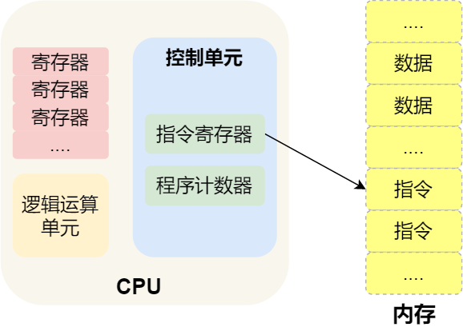

那CPU执行程序的过程如下：

- 第一步，CPU读取**[程序计数器]**的值，这个值是指令的内存地址，然后CPU的**[控制单元]**操作**[地址总线]**指定需要访问的内存地址，接着通知内存设备准备数据，数据准备好后通过**[数据总线]**将指令数据传给CPU，CPU收到内存传来的数据后，将这个指令数据存入到**[指令寄存器]**。
- 第二步，**[程序计数器]**的值自增，表示指向下一条指令。这个自增的大小，由CPU的位宽决定，比如32位的CPU，指令是4个字节，需要4个内存地址存放，因此[程序计数器]的值会自增4；
- 第三步，CPU分析**[指令寄存器]**中的指令，确定**指令的类型和参数**，如果是计算类型的指令，就把指令交给**[逻辑运算单元]**运算；如果是存储类型的指令，则交由**[控制单元]**执行。

简单总结一下就是，一个程序执行的时候，CPU会根据程序计数器里的内存地址，从内存里面把需要执行的指令读取到指令寄存器里面执行，然后根据指令长度自增，开始顺序读写下一条指令。

CPU从程序计数器读取指令、到执行、再到下一条指令，这个过程会不断循环，直到程序执行结束，这个不断循环的过程被称为**CPU的指令周期**。

#### 6、CPU缓存一致性

CPU 在读写数据的时候，都是在 CPU Cache 读写数据的，原因是 Cache 离 CPU 很近，读写性能相比内存高出很多。当 Cache 里没有缓存 CPU 所需要读取的数据，CPU 则会从内存读取数据，并将数据缓存到 Cache 里面，最后 CPU 再从 Cache 读取数据。

而对于数据的写入，CPU 都会先写入到 Cache 里面，然后再在找个合适的时机写入到内存，那就有「写直达」和「写回」这两种策略来保证 Cache 与内存的数据一致性：

- 写直达，只要有数据写入，都会直接把数据写入到内存里面，这种方式简单直观，但是**性能就会受限于内存的访问速度**；
- 写回，对于已经缓存在 Cache 的数据的写入，只需要更新其数据就可以，不用写入到内存，只有在需要把缓存里面的脏数据交换出去的时候，才把数据同步到内存里，这种方式在缓存命中率高的情况，性能会更好；

当今 CPU 都是多核的，每个核心都有各自独立的 L1/L2 Cache，只有 L3 Cache 是多个核心之间共享的。所以，我们要确保多核缓存是一致性的，否则会出现错误的结果。

要想实现缓存一致性，关键是要满足 2 点：

- 第一点是写传播，也就是当某个 CPU 核心发生写入操作时，需要把该事件广播通知给其他核心；
- 第二点是事务的串行化，这个很重要，只有保证了这个，才能保障我们的数据是真正一致的，我们的程序在各个不同的核心上运行的结果也是一致的；

基于总线嗅探机制的 **MESI 协议**，就满足上面了这两点，因此它是**保障缓存一致性的协议**。

MESI 协议，是已修改、独占、共享、已失效这四个状态的英文缩写的组合。整个 MSI 状态的变更，则是根据来自本地 CPU 核心的请求，或者来自其他 CPU 核心通过总线传输过来的请求，从而构成一个流动的状态机。另外，对于在「已修改」或者「独占」状态的 Cache Line，修改更新其数据不需要发送广播给其他 CPU 核心。

#### 7、负数为什么要用补码方式来表示

如果负数不是使用补码的方式表示，则在做基本对加减法运算的时候，**还需要多一步操作来判断是否为负数，如果为负数，还得把加法反转成减法，或者把减法反转成加法**，这就非常不好了，毕竟加减法运算在计算机里是很常使用的，所以为了性能考虑，应该要尽量简化这个运算过程。

**而用了补码的表示方式，对于负数的加减法操作，实际上是和正数加减法操作一样的**。你可以看到下图，用补码表示的负数在运算 `-2 + 1` 过程的时候，其结果是正确的：

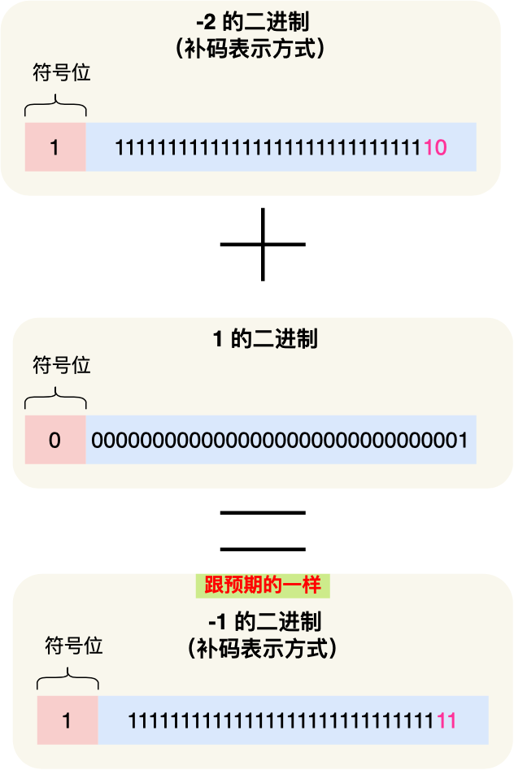

#### 8、malloc 是如何分配内存的？

`malloc()` 是 用于动态分配内存的C 库函数，malloc 申请内存的时候，会有两种方式向操作系统申请堆内存。

- 通过 `brk()` 系统调用从堆分配内存；
- 通过 `mmap()` 系统调用在文件映射区域分配内存；

----

> 什么场景下 `malloc()` 会通过 `brk()` 分配内存？又是什么场景下通过 `mmap()` 分配内存？

`malloc()` 源码里默认定义了一个阈值：

- 如果用户分配的内存小于 **128 KB**，则通过 `brk()` 申请内存；
- 如果用户分配的内存大于 **128 KB**，则通过 `mmap()` 申请内存；

注意，不同的 `glibc` 版本定义的阈值也是不同的。

> `malloc()` 分配的是物理内存吗？

不是的，**`malloc()` 分配的是虚拟内存**。

如果分配后的虚拟内存没有被访问的话，虚拟内存是不会映射到物理内存的，这样就不会占用物理内存了。

只有在访问已分配的虚拟地址空间的时候，操作系统通过查找页表，发现虚拟内存对应的页没有在物理内存中，就会触发缺页中断，然后**操作系统会建立虚拟内存和物理内存之间的映射关系**。

> malloc 申请的内存，free 释放内存会归还给操作系统吗？

- malloc 通过 `brk()`方式申请的内存，free 释放内存的时候，**并不会把内存归还给操作系统，而是缓存在 malloc 的内存池中，待下次使用**；
- malloc 通过 `mmap()` 方式申请的内存，free 释放内存的时候，**会把内存归还给操作系统，内存得到真正的释放**。

#### 9、为什么不全部使用 mmap 来分配内存？

因为向操作系统申请内存，是要通过系统调用的，执行系统调用是要进入内核态的，然后在回到用户态，运行态的切换会耗费不少时间。

所以，申请内存的操作应该避免频繁的系统调用，如果都用 `mmap` 来分配内存，等于每次都要执行系统调用。

另外，因为 `mmap` 分配的内存每次释放的时候，都会归还给操作系统，于是每次 `mmap` 分配的虚拟地址都是**缺页状态的**，然后在第一次访问该虚拟地址的时候，就会触发缺页中断。

也就是说，**频繁通过 `mmap` 分配的内存话，不仅每次都会发生运行态的切换，还会发生缺页中断（在第一次访问虚拟地址后），这样会导致 CPU 消耗较大**。

为了改进这两个问题，malloc 通过 `brk()` 系统调用在堆空间申请内存的时候，由于堆空间是连续的，所以直接预分配更大的内存来作为内存池，当内存释放的时候，就缓存在内存池中。

**等下次在申请内存的时候，就直接从内存池取出对应的内存块就行了，而且可能这个内存块的虚拟地址与物理地址的映射关系还存在，这样不仅减少了系统调用的次数，也减少了缺页中断的次数，这将大大降低 CPU 的消耗**。

#### 10、传统LRU算法的缺陷

传统的 LRU 算法法无法避免下面这两个问题：

- **预读失效**导致缓存命中率下降；
- **缓存污染**导致缓存命中率下降；

为了避免「预读失效」造成的影响，Linux 和 MySQL 对传统的 LRU 链表做了改进：

- Linux 操作系统实现两个了 LRU 链表：**活跃 LRU 链表（active list）和非活跃 LRU 链表（inactive list）**。
- MySQL Innodb 存储引擎是在一个 LRU 链表上划分来 2 个区域：**young 区域 和 old 区域**。

但是如果还是使用「只要数据被访问一次，就将数据加入到活跃 LRU 链表头部（或者 young 区域）」这种方式的话，那么**还存在缓存污染的问题**。

为了避免「缓存污染」造成的影响，Linux 操作系统和 MySQL Innodb 存储引擎分别提高了升级为热点数据的门槛：

- Linux 操作系统：在内存页被访问**第二次**的时候，才将页从 inactive list 升级到 active list 里。

- MySQL Innodb：在内存页被访问第二次的时候，并不会马上将该页从 old 区域升级到 young 区域，因为还要进行

  停留在 old 区域的时间判断：

  - 如果第二次的访问时间与第一次访问的时间**在 1 秒内**（默认值），那么该页就不会被从 old 区域升级到 young 区域；
- 如果第二次的访问时间与第一次访问的时间**超过 1 秒**，那么该页就会从 old 区域升级到 young 区域；

通过提高了进入 active list （或者 young 区域）的门槛后，就很好了避免缓存污染带来的影响。

#### 11、什么是零拷贝技术？

早期 I/O 操作，内存与磁盘的数据传输的工作都是由 CPU 完成的，而此时 CPU 不能执行其他任务，会特别浪费 CPU 资源。

于是，为了解决这一问题，DMA 技术就出现了，每个 I/O 设备都有自己的 DMA 控制器，通过这个 DMA 控制器，CPU 只需要告诉 DMA 控制器，我们要传输什么数据，从哪里来，到哪里去，就可以放心离开了。后续的实际数据传输工作，都会由 DMA 控制器来完成，CPU 不需要参与数据传输的工作。

传统 IO 的工作方式，从硬盘读取数据，然后再通过网卡向外发送，我们需要进行 **4 次上下文切换和 4 次数据拷贝**，其中 2 次数据拷贝发生在内存里的缓冲区和对应的硬件设备之间，这个是由 DMA 完成，另外 2 次则发生在内核态和用户态之间，这个数据搬移工作是由 CPU 完成的。

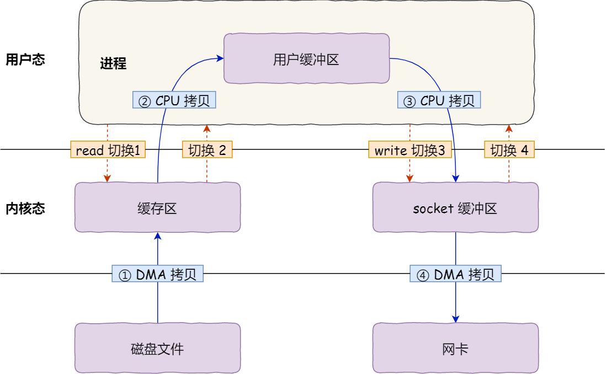

----

> 如何实现零拷贝？

零拷贝技术实现的方式通常有 2 种：

- mmap + write
- sendfile

**mmap + write**

```cpp
buf = mmap(file, len);
write(sockfd, buf, len);
```

`mmap()` 系统调用函数会直接把内核缓冲区里的数据「**映射**」到用户空间，这样，操作系统内核与用户空间就不需要再进行任何的数据拷贝操作。


具体过程如下：

- 应用进程调用了 `mmap()` 后，DMA 会把磁盘的数据拷贝到内核的缓冲区里。接着，应用进程跟操作系统内核「共享」这个缓冲区；
- 应用进程再调用 `write()`，操作系统直接将内核缓冲区的数据拷贝到 socket 缓冲区中，这一切都发生在内核态，由 CPU 来搬运数据；
- 最后，把内核的 socket 缓冲区里的数据，拷贝到网卡的缓冲区里，这个过程是由 DMA 搬运的。

我们可以得知，通过使用 `mmap()` 来代替 `read()`， 可以减少一次数据拷贝的过程。

但这还不是最理想的零拷贝，因为仍然需要通过 CPU 把内核缓冲区的数据拷贝到 socket 缓冲区里，而且仍然需要 4 次上下文切换，因为系统调用还是 2 次。

**sendfile**

在 Linux 内核版本 2.1 中，提供了一个专门发送文件的系统调用函数 `sendfile()`，函数形式如下：

```c
#include <sys/socket.h>
ssize_t sendfile(int out_fd, int in_fd, off_t *offset, size_t count);
```

它的前两个参数分别是目的端和源端的文件描述符，后面两个参数是源端的偏移量和复制数据的长度，返回值是实际复制数据的长度。

首先，它可以替代前面的 `read()` 和 `write()` 这两个系统调用，这样就可以减少一次系统调用，也就减少了 2 次上下文切换的开销。

其次，该系统调用，可以直接把内核缓冲区里的数据拷贝到 socket 缓冲区里，不再拷贝到用户态，这样就只有 2 次上下文切换，和 3 次数据拷贝。如下图：

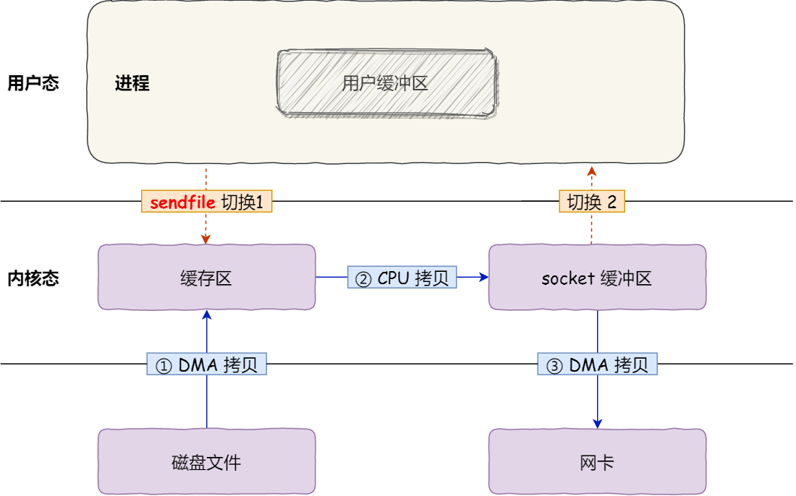


----

零拷贝技术是基于 PageCache 的，PageCache 会缓存最近访问的数据，提升了访问缓存数据的性能，同时，为了解决机械硬盘寻址慢的问题，它还协助 I/O 调度算法实现了 IO 合并与预读，这也是顺序读比随机读性能好的原因。这些优势，进一步提升了零拷贝的性能。

需要注意的是，零拷贝技术是不允许进程对文件内容作进一步的加工的，比如压缩数据再发送。

另外，当传输大文件时，不能使用零拷贝，因为可能由于 PageCache 被大文件占据，而导致「热点」小文件无法利用到 PageCache，并且大文件的缓存命中率不高，这时就需要使用「异步 IO + 直接 IO 」的方式。

在 Nginx 里，可以通过配置，设定一个文件大小阈值，针对大文件使用异步 IO 和直接 IO，而对小文件使用零拷贝。

#### 12、一个临界资源可以对应多个临界区

- 临界资源：是指每次仅允许一个进程访问的资源。 属于临界资源的硬件有打印机、磁带机等,软件有消息缓冲队列、变量、数组、缓冲区等。 诸进程间应采取互斥方式，实现对这种资源的共享。

- 临界区：**每个进程中访问临界资源的那段代码称为临界区**。

#### 13、外中断和异常有什么区别？

外中断是由硬件触发的中断，通常由计算机主板上的特定硬件模块实现。当外中断发生时，CPU会自动停止当前正在执行的程序，转而执行中断处理程序。中断处理程序通常是一段特定的代码，用于响应中断事件并进行相应的处理。外中断通常用于实现一些底层的功能，如外设访问、内存管理等。

异常是由处理器内部发生的错误或异常情况所引发的中断。当异常发生时，CPU会暂停当前正在执行的程序，转而执行**异常处理程序**。异常处理程序通常是一段通用的代码，用于处理异常情况并采取相应的措施。异常通常用于实现一些高级的功能，如浮点运算、位操作等。

> 异常情况包括非法操作码、地址越界、算术溢出等。

总之，**外中断是由硬件触发的中断，用于实现底层的功能；异常是由处理器内部发生的错误或异常情况所引发的中断，用于处理高级的功能**。

#### 14、linux分内核栈与用户栈的原因以及两者的区别

在Linux系统中，每个进程都有一个用户栈和一个内核栈，其原因和区别如下：

- 原因

**用户栈和内核栈的分离是为了保证系统的安全性和可靠性**。用户栈是用来保存用户进程的局部变量、函数调用的参数和返回地址等信息，而内核栈则是用来保存内核代码的局部变量、函数调用的参数和返回地址等信息。用户进程和内核代码运行在不同的特权级别下，**为了保证用户进程无法直接访问内核栈中的数据，避免恶意用户对内核进行攻击，因此需要将用户栈和内核栈进行分离**。

- 区别
  - **栈的大小**：用户栈和内核栈的大小不同。用户栈的大小是进程可以自行指定的，通常是几个MB，而内核栈的大小是固定的，通常只有几KB大小；
  - **作用**：用户栈是用来保存用户进程的**局部变量、函数调用的参数和返回地址**等信息，而内核栈则是用来保存内核代码的局部变量、函数调用的参数和返回地址等信息；
  - **特权级别**：用户栈和内核栈运行在不同的特权级别下，用户栈是运行在用户态下的，而内核栈是运行在内核态下的；

总之，用户栈和内核栈的分离是为了保证系统的安全性和可靠性，用户栈和内核栈有不同的大小、作用和特权级别等特点。

#### 15、协程切换与线程切换

> 什么是协程切换？

协程切换是指在一个线程中，控制权从一个协程转移到另一个协程的过程。这个过程完全在用户空间进行，不需要内核的参与。

协程切换只需要两步：

- 保存**当前寄存器的值到协程上下文中的数组**；
- 将新协程上下文的数组中的值取出来赋值给对应的寄存器。

完成这两步后，就可以切换到新协程的函数栈上了。

> 什么是线程切换？

线程切换是指在一个进程中，控制权从一个线程转移到另一个线程的过程。这个过程涉及特权模式切换，需要在内核空间完成。

线程切换的过程包括保存当前线程的上下文（包括寄存器、程序计数器、栈指针等），恢复目标线程的上下文，更新调度器等。

由于涉及到内核态和用户态的切换，以及对硬件寄存器和内存的访问，线程切换的代价比协程切换要大。

> 协程切换与线程切换的主要区别

协程切换与线程切换的主要区别在于**协程切换完全在用户空间进行，而线程切换涉及特权模式切换，需要在内核空间完成**。此外，**协程切换相比线程切换做的事情更少。因此，协程的开销远远小于线程的开销**。

#### 16、线程是怎么样切换的，切换时机与切换过程

线程的切换通常是由操作系统内核来负责调度和管理的，切换的时机和过程都是由内核来决定的。**当一个线程被阻塞或者因为时间片用完而需要切换时，内核会先保存当前线程的上下文**（也就是寄存器中的值以及栈指针等信息）到该线程的内核栈中，然后从就绪队列中选择一个就绪线程，将其上下文从内核栈中恢复，然后将控制权转移给该线程，让其继续执行。

具体来说，线程切换的过程一般包括以下几个步骤：

1. 内核保存当前线程的上下文：内核会将当前线程的程序计数器、堆栈指针、寄存器状态等信息保存到该线程的内核栈中，以便于之后恢复。
2. 内核选择下一个要执行的线程：内核会从就绪队列中选择一个线程，通常会选择优先级最高的线程。
3. 内核恢复下一个线程的上下文：内核会从下一个线程的内核栈中恢复其上下文，包括程序计数器、堆栈指针、寄存器状态等信息。
4. 内核切换到下一个线程的用户态：内核将控制权交给下一个线程，让其继续执行用户态代码。

需要注意的是，线程的切换过程涉及到内核态和用户态之间的转换，因此切换的代价相对较高。如果应用程序中存在大量的线程切换操作，就会严重影响程序的性能，因此需要采取一些优化措施，例如减少线程的创建和销毁操作、使用线程池等。

#### 17、说说什么是大端、小端，如何判断大端和小端？

大端和小端是两种不同的字节序方式，用于表示一个多字节的数据类型在内存中的存储顺序。

在大端字节序中，高位字节（最高位的字节）存储在低地址处，低位字节（最低位的字节）存储在高地址处。例如，数字0x12345678在大端字节序中的存储顺序为：

```cpp
+----+----+----+----+
| 12 | 34 | 56 | 78 |
+----+----+----+----+
| <-- 地址递增方向  
```

而在小端字节序中，高位字节存储在高地址处，低位字节存储在低地址处。例如，数字0x12345678在小端字节序中的存储顺序为：

```cpp
+----+----+----+----+
| 78 | 56 | 34 | 12 |
+----+----+----+----+
| <-- 地址递增方向
```

判断一台计算机是采用大端还是小端字节序可以通过以下代码实现：

```cpp
#include <stdio.h>
#include <stdlib.h>

int main() {
    int num = 0x12345678;
    char *ptr = (char *) &num;
    if (*ptr == 0x12) {
        printf("This machine is big-endian\n");
    } else if (*ptr == 0x78) {
        printf("This machine is little-endian\n");
    } else {
        printf("Unknown byte order\n");
    }
    return 0;
}
```

在这个示例中，我们**将一个整数变量转换成了指向字节的指针**，并通过查看指针所指向的第一个字节来判断字节序是大端还是小端。

#### 18、说说进程通信的方式有哪些？

进程通信是指不同的进程间传递信息和共享资源的过程。常见的进程通信方式包括：

1. 管道（Pipe）：管道是一种半双工的通信方式，可用于具有亲缘关系进程之间的通信。管道分为无名管道和命名管道。无名管道只能用于父子进程或兄弟进程之间的通信，而命名管道则可以用于无亲缘关系进程之间的通信。
2. 消息队列（Message Queue）：消息队列是一种消息的链表，存放在内核中并由消息队列标识符标识。进程通过调用系统函数发送和接收消息。
3. 共享内存（Shared Memory）：共享内存是指两个或多个进程共享一个给定的存储区。这种通信方式通常比管道更快，因为进程可以直接访问共享内存，而无需复制数据。
4. 信号（Signal）：信号是一种异步通信方式，用于通知进程发生了某种事件。信号可以被用来实现进程间的简单通信，例如进程间的同步和互斥。
5. 信号量（Semaphore）：信号量是一种计数器，用于控制多个进程对共享资源的访问。当一个进程需要访问共享资源时，它必须先获得信号量，以防止其它进程同时访问该资源。
6. 套接字（Socket）：套接字是一种通用的进程通信机制，适用于不同机器间的进程通信。套接字通信可以使用TCP或UDP协议。
7. 内存映射（Memory-mapped I/O）：将一个文件映射到进程的虚拟地址空间中，使得多个进程可以共享同一个文件，并且可以直接读写这个文件的内存映射区域，实现进程间的数据共享。

其他的有些进程通信方式：

1. 远程过程调用（RPC）：RPC是一种进程间通信技术，允许程序调用另一台计算机上的程序，而不需要了解底层网络细节。
2. 文件锁（File Lock）：文件锁是一种锁定文件以防止其他进程访问的机制。文件锁可以用于进程间的同步和互斥。

#### 19、说说进程有多少种状态？

一个进程可以处于以下几种状态：

1. 新建（New）：当进程被创建时，它就处于新建状态。在这个状态下，进程正在等待操作系统分配资源。
2. 就绪（Ready）：当进程拥有了所有需要的资源，并等待分配处理器资源时，它就处于就绪状态。在这个状态下，进程已经准备好运行，并正在等待处理器。
3. 运行（Running）：当操作系统分配处理器资源并开始执行进程时，进程处于运行状态。
4. 阻塞（Blocked）：当进程在等待某个事件（如IO操作）完成而无法继续执行时，进程处于阻塞状态。在这个状态下**，进程会被操作系统从处理器中移除**，并且将处理器分配给其他进程。
5. 终止（Terminated）：当进程运行完成或出现了无法恢复的错误时，进程处于终止状态。

在实际的操作系统中，这些状态可能会有所不同，但是以上五种状态是进程状态模型的基础。

#### 20、说说进程和线程的区别

进程和线程是操作系统中的两个核心概念，它们之间有以下几个区别：

1. 资源拥有：进程是系统资源分配的基本单位，每个进程都拥有独立的地址空间、文件描述符、信号处理和资源限制等；而线程则是进程中的执行单元，不拥有系统资源，只拥有一部分与线程相关的资源，如栈、寄存器等，线程共享进程的资源。
2. 切换开销：进程和线程切换时，需要切换上下文，进程的上下文切换开销远远大于线程上下文切换，各种页表、打开的文件等都需要切换，耗费资源较大，效率要差一些；而线程只需要切换少量的寄存器内容。
3. 并发性：由于多个线程共享进程的资源，因此线程之间的切换比进程之间切换更加快速，可以实现更高的并发性。
4. 通信：进程间通信需要使用IPC机制，如管道、消息队列、信号量、共享内存等，而线程之间**可以直接访问共享内存**。
5. 稳定性：**一个进程崩溃并不会影响到其他进程，但是一个线程崩溃可能会导致整个进程崩溃**。因此，多进程的程序比多线程的程序更加稳定。

综上所述，进程和线程各有优缺点，开发者需要根据实际情况选择合适的方式。一般来说，如果需要多任务协作完成某项任务，就需要使用多进程；而如果需要提高系统的并发性，就需要使用多线程。

#### 21、说说线程和协程的区别

线程和协程都是实现并发编程的方式，主要在调度方式、并发性和资源开销等方面存在一些区别：

- 首先，线程是由操作系统进行调度和管理的，每个线程都有自己的执行上下文、栈和寄存器等资源。线程之间的切换需要保存和恢复这些资源，因此线程切换的开销比较大。

  相比之下，协程是用户空间的**轻量级线程**，不需要操作系统的调度和管理。协程之间的切换只需**保存和恢复少量的状态**，因此切换开销比线程小得多。另外，协程可以由程序员手动控制调度，**可以在适当的时候进行切换，更加灵活**。

- 其次，线程是在操作系统层面实现的并发机制，不同线程之间可以并行执行，可以利用多核处理器的优势。而协程是在单个线程内部实现的并发机制，同一时刻只有一个协程在执行，需要程序员自行实现并发逻辑。

- 最后，线程的创建和销毁比较复杂，需要涉及操作系统的调用和内核态的切换，因此比较耗费资源。而协程的创建和销毁比较简单，只需要分配和释放一些内存，开销比较小。

总之，线程和协程都是实现并发编程的工具，各有各的优势和适用场景。需要根据具体的需求和情况来选择使用哪种并发机制。

#### 22、说说Linux的写时拷贝

> 为了提高效率，Linux的fork()采用读时共享，写时复制。当子进程只读时不额外复制父进程的资源，当进行写操作时，才将进程的资源进行复制。

Linux的写时拷贝（copy-on-write）是一种内存管理技术，它避免了在进行副本操作时不必要的数据复制。

在linux中，当多个进程共享同一份内存区域时，写时拷贝技术可以确保这些进程不会同时写入同一份内存，而只会在实际需要修改时才进行修改。这种技术在资源利用方面非常高效，避免了对相同数据的多次拷贝。

举例来说，linux在使用fork()函数创建子进程时，子进程和父进程拥有相同的页表，即对应页表项指向相同的物理页，所以并没有复制实际的物理内存，同时把这些页表项标记为只读。如果父子进程都不对页面进行操作，那么便一直共享同一份物理页面。只要父子进程有一个尝试进行修改某一个页面，那么就会发生缺页异常（page fault）。内核便会为该页面创建一个新的物理页面，并将内容复制到新的物理页面中，让父子进程真正地各自拥有自己的物理内存页面，并将页表中相应地页表项标记为可写。
写时拷贝父子进程修改某一个页面前后变化如下图所示：

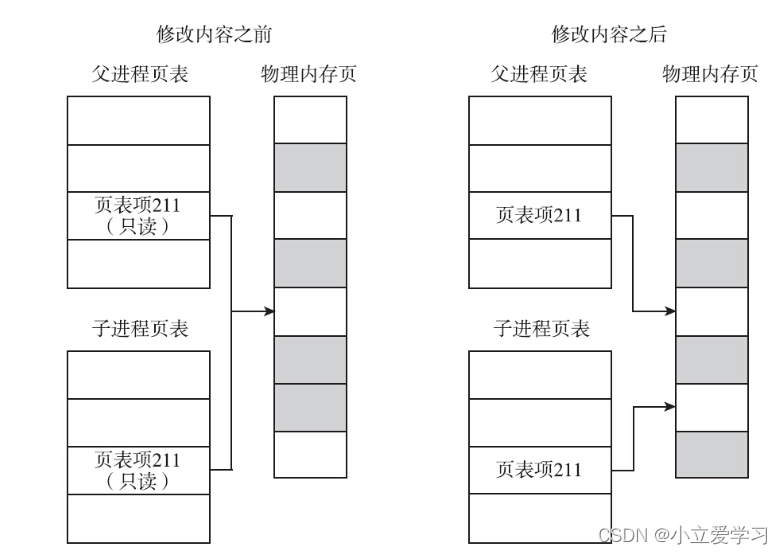

#### 23、说说内存的分段和分页

内存的分段和分页**都是操作系统中的内存管理技术**，用于将计算机的物理内存按照一定的规则划分成若干部分，从而方便操作系统对内存进行管理和使用。

内存的分段技术是将物理内存**按照功能或用途的不同，划分成若干大小不等的段**，每个段的大小可以根据需求进行动态调整。每个段可以用来存储不同的程序或数据使得操作系统能够更加有效地管理内存，提高内存的利用率。分段技术需要使用段表来记录**每个段的基址和长度，以及访问权限**等信息。

而内存的分页技术是将物理内存划分为**大小相等的页**，通常是4kb或者8kb，而逻辑地址也被划分为相同大小的页面。这种技术可以将逻辑内存空间与物理内存空间分离，从而使得**程序访问内存时不需要考虑物理地址的细节**。每个页可以被映射到不同的物理地址上，从而实现了内存的虚拟化。分页技术需要使用页表来记录每个页的映射信息和访问权限等信息。

分段和分页技术都是内存管理技术中的重要部分，它们可以使操作系统更好地管理内存，提高内存的利用率和性能。在实际应用中，通常会**同时使用分段和分页技术来管理内存**。

#### 24、说说互斥锁和自旋锁

互斥锁（mutex）和自旋锁（spinlock）都是用来保护共享资源的同步原语。它们的主要区别在于当一个线程无法获得锁时的行为。当一个线程无法获得互斥锁时，它会进入睡眠状态，等待锁被释放。而当一个线程无法获得自旋锁时，它会一直循环等待，直到锁被释放。

由于**互斥锁会导致线程进入睡眠状态，因此它适用于加锁时间较长的场景**。而**自旋锁不会导致线程进入睡眠状态，因此它适用于加锁时间较短且锁的争用不太激烈的场景**。

#### 25、说说共享内存

共享内存是一种用于在**多个进程之间共享数据的机制**。它**基于内存映射技术，通过将同一个物理内存区域映射到不同进程的虚拟地址空间，使得这些进程可以共享同一块物理内存**。这种共享方式可以避免数据拷贝和进程间的通信开销，从而提高了进程间数据传输的效率和速度。

共享内存通常需要经过以下步骤：

1. 创建共享内存区域：首先需要在操作系统中创建一个共享内存区域，用于存储要共享的数据。
2. 映射共享内存：进程需要将共享内存区域映射到自己的虚拟地址空间中，这样才能够访问共享内存区域中的数据。
3. 访问共享内存：映射完成后，进程就可以像访问本地内存一样，直接读写共享内存中的数据了。不同进程之间可以通过访问同一块共享内存区域来实现数据共享。
4. 同步访问：由于多个进程都可以同时访问共享内存，因此需要使用同步机制来确保多个进程之间的访问互斥，避免出现竞态条件和数据冲突。

常见的共享内存同步机制包括信号量、互斥锁和自旋锁等。

总之，**共享内存的优点是不需要内核操作**，**缺点是要提供同步机制，确保数据的一致性**。

#### 26、说说虚拟内存与物理内存

物理内存是计算机系统中**实际存在的内存**，是由硬件实现的，用来存储操作系统和应用程序运行时所需要的数据和代码。

虚拟内存则是在操作系统和硬件的支持下，对应用程序所需的内存进行虚拟化，从而使得应用程序可以使用比物理内存更大的内存空间。虚拟内存是由操作系统管理的，它将物理内存和磁盘空间结合起来，构成了一个虚拟的内存空间。当应用程序访问虚拟内存时，操作系统会根据需要将虚拟内存中的数据和代码从磁盘加载到物理内存中，以满足应用程序的需求。

虚拟内存的使用可以带来以下好处：

1. 第一，虚拟内存可以使得进程的运行内存超过物理内存大小，因为程序运行符合局部性原理，CPU访问内存会有很明显的重复访问的倾向性，对于那些没有被经常使用到的内存，我们可以把它换出到物理内存之外，比如硬盘的swap区域。
2. 第二，由于每个进程都有自己的页表，所以每个进程的虚拟内存空间就是相互独立的。进程也没有办法访问其他进程的页表，所以这些页表是私有的，这就解决了多进程之间地址冲突的问题。
3. 第三，页表里的页表项种**除了物理地址之外，还有一些标记属性的比特，比如控制一个页的读写权限，标记该页是否存在等**。在内存访问方面，操作系统提供了更好的安全性。

----

> 虚拟内存的缺点

由于需要将磁盘上的数据复制到内存中，因此访问虚拟内存的速度比直接访问物理内存要慢。此外，由于需要额外的管理开销，虚拟内存可能会对系统的性能产生一定的影响。但总体而言，虚拟内存仍然是一个非常实用的技术，可以帮助操作系统更好地管理内存资源，提高系统的性能和稳定性。

#### 27、说说条件变量

条件变量是一种线程同步机制，通常与互斥锁一起使用，以便线程可以在共享资源上进行安全的访问和修改。

条件变量的主要作用是让线程在特定条件下等待，直到满足条件后才被唤醒。在条件变量的使用过程中，需要注意以下几个概念：

1. 等待队列：所有等待特定条件的线程所在的队列。
2. 条件表达式：描述等待条件的逻辑表达式。
3. 互斥锁：在条件变量使用过程中需要配合使用的锁。

当线程需要等待某个条件时，可以通过如下方式进行操作：

1. 获取互斥锁：在等待之前，必须先获取与条件变量配合使用的互斥锁，以确保多个线程不会同时修改共享资源。
2. 检查条件：线程检查条件表达式，如果**条件不满足，则将线程添加到等待队列中，并释放互斥锁**。
3. 等待：**当线程进入等待状态时，它会释放互斥锁**，并等待其他线程发出特定信号来唤醒它。
4. 唤醒：当条件满足时，其他线程可以发出信号来唤醒等待队列中的线程。
5. 释放互斥锁：被唤醒的线程重新获取互斥锁，继续执行操作。

条件变量的使用需要注意以下几点：

1. 条件变量通常与互斥锁配合使用，以确保多个线程之间的同步和互斥。
2. 在等待条件变量之前，必须先获取与之配合使用的互斥锁，以确保线程安全。
3. 等待条件变量时，线程会阻塞并释放互斥锁，直到其他线程发出特定信号来唤醒它。
4. 发出信号的线程需要获取互斥锁，以便修改共享资源和唤醒等待队列中的线程。
5. 条件变量需要被正确地使用和释放，以避免资源泄漏和死锁等问题。

总之，条件变量是一种强大的多线程编程工具，能够帮助线程之间实现有效的协作和同步，从而提高程序的可靠性和性能。

#### 28、linux进程创建线程的流程是怎么样的？

linux进程创建线程的流程大致如下[1](https://www.baeldung.com/linux/process-vs-thread)[2](https://man7.org/linux/man-pages/man3/pthread_create.3.html)：

- 进程调用`pthread_create`()函数，传入线程属性、线程函数和参数。
- 系统内核为新线程分配一个唯一的线程标识符，并将其存入thread参数指向的内存。
- 系统内核为新线程分配栈空间、寄存器、信号屏蔽字等资源，并复制进程的一些属性，如进程ID、用户ID、组ID、能力集、CPU亲和性等。
- 系统内核将新线程加入到就绪队列中，等待调度器分配CPU时间片。
- 当新线程被调度器选中运行时，系统内核将其状态设置为运行态，并执行线程函数，将参数传递给线程函数。
- 新线程在执行过程中，可以通过`pthread_exit()`函数或者从线程函数返回来终止自己，也可以被其他线程取消。

---

> 线程共享进程的资源在linux中是怎么实现的？

linux中线程共享进程的资源是通过内核的调度和管理来实现的。linux内核实际上把进程和线程都当作任务（task）来处理，只是线程和进程共享了一些资源，如地址空间、打开的文件、信号处理等。这些资源在内存中有相应的数据结构来表示，如task_struct、mm_struct、files_struct等。当进程创建线程时，内核会为新线程分配一个新的task_struct结构，并复制或者共享进程的一些资源。当线程运行时，内核会根据task_struct结构中的信息来调度和切换线程，以及处理线程之间的同步和通信。

> 所以可以说，共享进程的资源是在初始化线程的一些数据结构时完成的

可以这么说，但是也要注意，共享进程的资源不仅仅是在初始化线程的时候完成的，还需要在运行线程的时候维护和管理。比如，如果线程打开了一个新的文件，那么它就要更新进程的files_struct结构，以便其他线程也能访问这个文件。或者，如果线程收到了一个信号，那么它就要根据进程的信号处理函数来执行相应的动作。所以，**共享进程的资源是一个动态的过程**，需要内核和线程之间的协作。


### 情景设计题

#### 1、多线程， 开一个线程， 在线程对象被销毁前， 需要做什么

在销毁一个线程对象之前，通常需要确保线程已经完成了它的工作并且已经退出。这可以通过调用线程对象的`join`方法来实现。`join`方法会阻塞当前线程，直到目标线程退出。

如果希望在线程对象被销毁之前强制终止线程，可以使用`detach`方法将线程与线程对象分离。这样，在线程对象被销毁时，线程将继续运行，直到它自然退出或被操作系统终止。

此外，在销毁一个线程对象之前，您可能还需要释放该线程使用的资源，例如动态分配的内存、文件描述符等。

> 调用线程对象的 `detach()` 函数之后，**该线程的所有权将转移到系统内部**，也就是说，该线程不再受由程序控制的线程对象管理。换句话说，该线程将成为守护线程，并且其资源将由系统自动释放。在这种情况下，该线程将不再与线程对象相关联，因此程序将无法再使用该线程对象来操作该线程。

#### 2、如何实现`BlockingQueue`

`BlockingQueue` 是一个常用的并发数据结构，用于多线程场景下的数据共享和同步。在 Java 中，`BlockingQueue` 是一个接口，可以由多种实现类来实现。在 C++ 中，也可以通过一些现有的库或者自行实现一个 `BlockingQueue`。

以下是一个使用 C++11 标准库实现的 `BlockingQueue` 示例代码：

```cpp
#include <iostream>
#include <queue>
#include <mutex>
#include <condition_variable>

template<typename T>
class BlockingQueue {
public:
    void put(T item) {
        std::unique_lock<std::mutex> lock(mutex_);
        queue_.push(std::move(item));
        lock.unlock();
        cond_.notify_one();
    }

    T take() {
        std::unique_lock<std::mutex> lock(mutex_);
        while (queue_.empty()) {
            cond_.wait(lock);
        }
        T front = std::move(queue_.front());
        queue_.pop();
        return front;
    }

private:
    std::queue<T> queue_;
    std::mutex mutex_;
    std::condition_variable cond_;
};
```

该示例代码中的 `BlockingQueue` 类使用一个 `std::queue` 来存储数据，同时使用 std::mutex 和 std::condition_variable 来实现线程同步。put() 方法用于向队列中添加数据，take() 方法用于从队列中取出数据。当队列为空时，take() 方法将会阻塞，直到队列中有新的数据被添加。

可以使用以下代码来测试该 `BlockingQueue` 的功能：

```cpp
int main() {
    BlockingQueue<int> queue;

    // 创建两个线程，一个线程用于添加数据，一个线程用于取出数据
    std::thread producer([&queue]() {
        for (int i = 0; i < 10; i++) {
            std::cout << "Producer put " << i << std::endl;
            queue.put(i);
            std::this_thread::sleep_for(std::chrono::milliseconds(100));
        }
    });

    std::thread consumer([&queue]() {
        for (int i = 0; i < 10; i++) {
            int item = queue.take();
            std::cout << "Consumer take " << item << std::endl;
            std::this_thread::sleep_for(std::chrono::milliseconds(100));
        }
    });

    producer.join();
    consumer.join();

    return 0;
}
```

该测试代码中，使用了一个生产者线程和一个消费者线程，生产者线程往 `BlockingQueue` 中添加数据，消费者线程从 `BlockingQueue` 中取出数据。程序执行结果如下：

```cpp
Producer put 0
Consumer take 0
Producer put 1
Consumer take 1
Producer put 2
Consumer take 2
Producer put 3
Consumer take 3
Producer put 4
Consumer take 4
Producer put 5
Consumer take 5
Producer put 6
Consumer take 6
Producer put 7
Consumer take 7
Producer put 8
Consumer take 8
Producer put 9
Consumer take 9
```

可以看到，该 `BlockingQueue` 可以在多线程环境下安全地共享和操作数据。

#### 3、多进程与多线程的优缺点及适应场景

- 多进程的优点是每个进程互相独立，不影响主程序的稳定性，可以利用多核CPU提高并行性能，可以跨机器迁移，方便资源的管理和保护。
- 多进程的缺点是创建和销毁进程的开销大，进程间通信和同步复杂，内存消耗大。
- 多线程的优点是创建和销毁进程的开销小，线程间通信和共享数据方便，节省内存空间。
- 多线程的缺点是一个线程的崩溃可能影响到整个程序的稳定性，线程间的同步和竞争问题比较麻烦，受限与单核CPU的性能。

何时使用多进程，何时使用多线程？一般来说，如果对资源的管理和保护要求高，不限制开销和效率时，使用多进程。如果要求效率高，频繁切换时，资源的保护管理要求不是很高时，使用多线程。也可以根据具体的场景和需求，结合多进程和多线程的优势，进行混合编程。[1](https://blog.csdn.net/dianqicyuyan/article/details/106877764)[2](https://zhuanlan.zhihu.com/p/350939400)[3](https://cloud.tencent.com/developer/article/2158791)

#### 4、共享内存原理、在虚存空间位置

- 共享内存是一种进程间通信的方式，它允许两个或多个不相关的进程访问同一个逻辑内存，也就是同一段物理内存。
- 共享内存的使用方法是通过 `shmget ()` 函数获取共享内存标识符，然后通过 `shmat ()` 函数把共享内存关联到某个虚拟内存地址上，最后通过 shmdt () 函数取消关联。
- 共享内存的实现原理是通过将不同进程的虚拟内存地址映射到相同的物理内存地址来实现的，这样不同进程就可以通过指针的方式读写操作这一段内存。
- 共享内存在虚拟地址空间中的位置取决于 `shmat ()` 函数传入的参数，如果传入0，表示由系统自动选择合适的虚拟内存地址。一般来说，共享内存位于堆栈之间的空闲部分。[1](https://blog.csdn.net/JMW1407/article/details/107703142)[2](https://zhuanlan.zhihu.com/p/431821033)[3](https://juejin.cn/post/7034388118157393951)

#### 5、为什么系统调用比较消耗CPU

- 系统调用是用户程序向操作系统内核申请服务的方法，它需要从用户态切换到内核态，这个过程涉及到寄存器、栈、页表等资源的保存和恢复，以及权限、有效性等检查。
- 系统调用的切换过程会破坏CPU的局部性原理，导致缓存和TLB的命中率下降，增加内存访问的开销。
- 系统调用的执行时间和类型有关，一些涉及到IO操作或者进程调度的系统调用可能会比较耗时，而一些只读取变量或者关闭文件描述符的系统调用会比较快速。
- 系统调用的平均耗时大约1微妙左右，而普通函数的调用只需要几纳秒左右，因此系统调用的开销是函数调用的几十倍甚至几百倍。

#### 6、在`linux`中，使用互斥锁时，等待锁资源的线程是不是会被切换出去

- 互斥锁是一种用于多线程编程的同步机制，用于保护共享资源不被多个线程同时访问和修改。当一个线程获得了互斥锁，其他线程就不能再获得该锁，直到该线程释放锁为止。
- 每一个互斥锁内部都有一个等待队列, 用来保存等待该互斥锁的线程. 当互斥锁处于解锁状态时, 阻塞在等待队列中的线程就可以竞争这个锁, 竞争到锁的线程就去执行, 其他的线程继续阻塞在等待队列。
- 当一个线程试图对一个已经被锁定的互斥锁加锁时，根据不同的锁类型，它可能会被阻塞或者返回错误。如果被阻塞，那么该线程就会被切换出去，让出CPU给其他线程运行，直到该互斥锁解锁后再重新竞争。

> 那这个线程切换回来的时候，会被放在其他的`cpu`核上执行吗？

在Linux中，线程的调度是由内核进行控制的，内核会根据系统的负载情况、线程的优先级和调度策略等因素来决定将线程调度到哪个 CPU 核心上执行。因此，当等待锁资源的线程被切换出去后再切换回来时，它可能会被分配到同一个 CPU 核心上执行，也可能会被分配到其它的 CPU 核心上执行，这取决于系统当前的负载情况以及线程的调度策略。

如果系统的负载比较低，CPU 核心数量比较多，那么内核很有可能将线程重新分配到同一个 CPU 核心上执行，以减少线程切换的开销。但如果系统的负载比较高，CPU 核心数量比较少，那么内核可能会将线程分配到其它的 CPU 核心上执行，以充分利用系统资源，避免某些 CPU 核心过度负载。

需要注意的是，在多核系统中，线程切换涉及到多个 CPU 核心之间的协作和同步，这可能会引入一定的开销和延迟。因此，在设计多线程程序时，应该尽量减少线程的切换次数，避免线程频繁地在不同的 CPU 核心之间切换。

#### 7、64 位相比 32 位 CPU 的优势在哪吗？

> 64 位 CPU 的计算性能一定比 32 位 CPU 高很多吗？

64 位相比 32 位 CPU 的优势主要体现在两个方面：

- 64位CPU可以一次计算超过32位的数字，而32位的CPU如果计算超过32位的数字，要分多步骤进行计算，效率就没有那么高，但是大部分应用程序很少会计算那么大的数字，所以只有运算大数字的时候，64位CPU的优势才能体现出来，否则和32位CPU的计算性能相差不大。
- 通常来说64位CPU的地址总线是48位，而32位CPU的地址是32位，**所以64位CPU可以寻址更大的物理内存空间**。如果一个32位CPU的地址总线是32位，那么该CPU最大寻址能力为4G，即使使用了8G大小的物理内存，也还是只能寻址到4G大小的地址，而如果是64位的CPU的地址总线是48位，那么该CPU最大寻址能力是2^48，远超32位CPU最大寻址能力。

#### 8、你知道软件的 32 位和 64 位之间的区别吗？

> 再来 32 位的操作系统可以运行在 64 位的电脑上吗？64 位的操作系统可以运行在 32 位的电脑上吗？如果不行，原因是什么？

64位和32位的软件，实际上代表指令是64位还是32位：

- 如果32位指令在64位机器上执行，**需要一套兼容机制，就可以做到兼容运行了**。但是如果64位指令在32位机器上执行，就比较困难了，因为32位的寄存器存不下64位的指令；
- 操作系统其实也是一种程序，我们也会看到操作系统会分成32位操作系统、64位操作系统，其代表意义就是**操作系统中程序的指令是多少位**，比如64位操作系统，指令也就是64位，因此不能装在32位机器上。

总之，**硬件的64位和32位指的是CPU的位宽，软件的64位和32位指的是指令的位宽**。

#### 9、如何让CPU跑得更快的代码？

要想写出让 CPU 跑得更快的代码，就需要写出缓存命中率高的代码，CPU L1 Cache 分为数据缓存和指令缓存，因而需要分别提高它们的缓存命中率：

- 对于数据缓存，我们在遍历数据的时候，应该按照内存布局的顺序操作，这是因为 CPU Cache 是根据 CPU Cache Line 批量操作数据的，所以顺序地操作连续内存数据时，性能能得到有效的提升；
- 对于指令缓存，有规律的条件分支语句能够让 CPU 的分支预测器发挥作用，进一步提高执行的效率；

另外，对于多核 CPU 系统，线程可能在不同 CPU 核心来回切换，这样各个核心的缓存命中率就会受到影响，于是要想提高线程的缓存命中率，可以**考虑把线程绑定 CPU 到某一个 CPU 核心**。

#### 10、free() 函数只传入一个内存地址，为什么能知道要释放多大的内存？

malloc 实际返回给用户态的内存起始地址比进程的堆空间起始地址多了 16 字节吗？

这个多出来的 **16 字节就是保存了该内存块的描述信息，比如有该内存块的大小**。

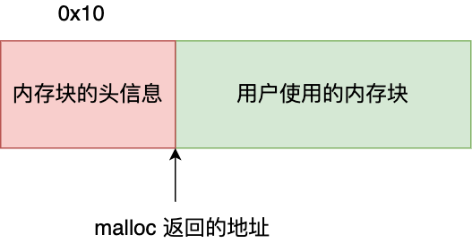


这样当执行 free() 函数时，free 会对传入进来的内存地址向左偏移 16 字节，然后从这个 16 字节的分析出当前的内存块的大小，自然就知道要释放多大的内存了。

#### 11、内存分配的过程是怎样的？

应用程序通过 malloc 函数申请内存的时候，实际上申请的是虚拟内存，此时并不会分配物理内存。

当应用程序读写了这块虚拟内存，CPU 就会去访问这个虚拟内存， 这时会发现这个虚拟内存没有映射到物理内存， CPU 就会产生**缺页中断**，进程会从用户态切换到内核态，并将缺页中断交给内核的 Page Fault Handler （缺页中断函数）处理。

缺页中断处理函数会看是否有空闲的物理内存，如果有，就直接分配物理内存，并**建立虚拟内存与物理内存之间的映射关系**。

如果没有空闲的物理内存，那么内核就会开始进行**回收内存**的工作，回收的方式主要是两种：直接内存回收和后台内存回收。

- **后台内存回收**（kswapd）：在物理内存紧张的时候，会唤醒 kswapd 内核线程来回收内存，这个回收内存的过程**异步**的，不会阻塞进程的执行。
- **直接内存回收**（direct reclaim）：如果后台异步回收跟不上进程内存申请的速度，就会开始直接回收，这个回收内存的过程是**同步**的，会阻塞进程的执行。

如果直接内存回收后，空闲的物理内存仍然无法满足此次物理内存的申请，那么内核就会放最后的大招了 ——**触发 OOM （Out of Memory）机制**。

OOM Killer 机制会根据算法选择一个占用物理内存较高的进程，然后将其杀死，以便释放内存资源，如果物理内存依然不足，OOM Killer 会继续杀死占用物理内存较高的进程，直到释放足够的内存位置。

申请物理内存的过程如下图：

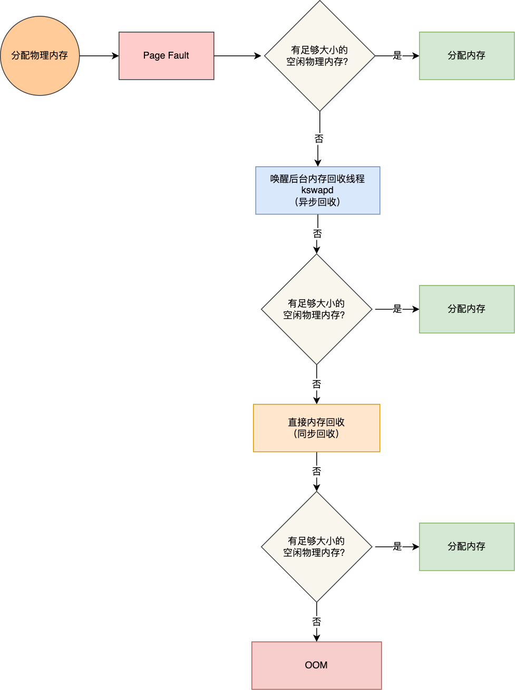

#### 12、如何解决回收内存导致的性能问题

针对回收内存导致的性能影响，常见的解决方式。

- 设置 `/proc/sys/vm/swappiness`，调整文件页和匿名页的回收倾向，尽量倾向于回收文件页；
- 设置 `/proc/sys/vm/min_free_kbytes`，调整 kswapd 内核线程异步回收内存的时机；
- 设置 `/proc/sys/vm/zone_reclaim_mode`，调整 NUMA 架构下内存回收策略，建议设置为 0，这样在回收本地内存之前，会在其他 Node 寻找空闲内存，从而避免在系统还有很多空闲内存的情况下，因本地 Node 的本地内存不足，发生频繁直接内存回收导致性能下降的问题；

在经历完直接内存回收后，空闲的物理内存大小依然不够，那么就会触发 OOM 机制，OOM killer 就会根据每个进程的内存占用情况和 `oom_score_adj` 的值进行打分，得分最高的进程就会被首先杀掉。

我们可以通过调整进程的 `/proc/[pid]/oom_score_adj` 值，来降低被 OOM killer 杀掉的概率。

#### 13、在4GB物理内存的机器上，申请8G内存会怎么样？

- 在 32 位操作系统，因为进程理论上最大能申请 3 GB 大小的虚拟内存，所以直接申请 8G 内存，会申请失败。
- 在 64位 位操作系统，因为进程理论上最大能申请 128 TB 大小的虚拟内存，即使物理内存只有 4GB，申请 8G 内存也是没问题，因为申请的内存是虚拟内存。如果这块虚拟内存被访问了，要看系统有没有 Swap 分区：
  - 如果没有 Swap 分区，因为物理空间不够，进程会被操作系统杀掉，原因是 OOM（内存溢出）；
  - 如果有 Swap 分区，即使物理内存只有 4GB，程序也能正常使用 8GB 的内存，进程可以正常运行；

#### 14、运行一个exe程序详细流程

流程大致如下：

- 操作系统创建进程，主线程[1](https://blog.csdn.net/dmxjmao/article/details/48207113)[2](https://blog.csdn.net/m0_55685698/article/details/124614192)。
- 系统程序检查.exe文件头，文件头包含运行加载exe程序所需信息
- 连接器嵌入exe文件头信息
- 导入所有需要的dll，dll是一些相对独立的动态链接库，可以被exe文件调用。
- 初始化c/c++运行时库，初始化运行库的全局变量，内存分配等
- 初始化之后，执行我们开发人员写的main或者`WinMain`函数，然后走我们的代码。
- 走完之后，启动函数调用exit ()函数，退出进程。

#### 15、Inactive 与 Active Page Cache 的关系

> 为什么第一次读写某个文件，Page Cache 是 Inactive 的？ 

第一次读取文件后，文件内容都是inactive的，只有再次读取这些内容后，才会把它放在active链表上，处于inactive链表上的`pagecache`在内存紧张是会首先被回收掉，有很多情况下文件内容往往只被读一次，比如日志文件，对于这类典型的one-off文件，它们占用的`pagecache`需要首先被回收掉；对于业务数据，往往都会读取多次，那么他们就会被放在active链表上，以此来达到保护的目的。 

> 如何让它变成 Active 的呢？ 

第二次读取后，这些内容就会从inactive链表里给promote到active链表里（可以称为二次机会法）。 在什么情况下 Active 的又会变成 Inactive 的呢？ 在内存紧张时，会进行内存回收，回收会把inactive list的部分page给回收掉，为了维持inactive/active的平衡，就需要把active list的部分page给demote到inactive list上，demote的原则也是`lru`。 

> 系统中有哪些控制项可以影响 Inactive 与 Active Page Cache 的大小或者二者的比例？ 

`min_free_kbytes`会影响整体的`pagecache`大小;`vfs_cache_pressure`会影响在回收时回收`pagecache`和slab的比例; 在开启了swap的情况下，`swappiness`也会影响`pagecache`的大小；zone_reclaim_mode会影响node的`pagecache`大小；`extfrag_threshold`会影响`pagecache`的碎片情况。

#### 16、有一个请求队列,有读者线程和写者线程 在同时操作这个共享的请求队列,属于什么样的读写模型 ？

读者-写者模型是一种经典的进程同步问题，它涉及到一个数据文件或记录可以被多个进程共享，其中有些进程只读该文件（称为读者进程），有些进程只写该文件（称为写者进程）。读者-写者模型的读写操作限制如下：

- 写-写互斥：不能有两个写者同时进行写操作
- 读-写互斥：不能同时有一个线程在读，而另一个线程在写。
- 读-读允许：可以有一个或多个读者在读。

为了实现这些限制，需要使用一些同步机制，如信号量、互斥锁、条件变量等。不同的同步机制可能导致不同的效率和公平性。例如，如果优先处理读者进程，可能导致写者进程饿死；如果优先处理写者进程，可能导致读者进程饿死；如果按照到达顺序处理，可能导致性能下降。

因此，根据不同的需求和场景，可以设计不同的**读者-写者算法**，如：

- 读者优先算法：当存在读进程时，写操作将被延迟，并且只要有一个读进程活跃，随后而来的读进程都将被允许访问文件。这样的方式下，会导致写进程可能长时间等待，且存在写进程“饿死”的情况。
- 写者优先算法：当有读者进程正在执行，写者进程发出申请，这时应该拒绝其他读者进程的请求，等待当前读者进程结束后立即执行写者进程，只有在无写者进程执行的情况下才能够允许读者进程再次运行。这样的方式下，会导致读进程可能长时间等待，且存在读进程“饿死”的情况。
- 读写公平算法：当有一个线程在访问共享资源时，不允许其他线程再访问；当没有线程在访问共享资源时，按照到达顺序执行；这样可以保证每个线程都有机会访问共享资源，但可能降低并发性能。

除了使用信号量等低级同步机制来实现读者-写者算法外，在一些高级编程语言中，还提供了一种专门用于解决这个问题的同步机制，称为**读写锁**[3](https://blog.csdn.net/belongHWL/article/details/104824486)。它是一种特殊的锁，在任意时刻只允许一个线程持有锁进行写操作或多个线程持有锁进行读操作。它通常提供了以下几种方法：

- lock_read(): 获取锁以进行读操作。如果没有其他线程持有锁进行写操作，则成功获取锁并返回；否则等待直到可以获取锁为止。
- lock_write(): 获取锁以进行写操作。如果没有其他线程持有锁进行任何操作，则成功获取锁并返回；否则等待直到可以获取锁为止。
- unlock(): 释放锁。如果当前线程持有锁进行读操作，则释放读锁；如果当前线程持有锁进行写操作，则释放写锁。

使用读写锁可以简化读者-写者模型的实现，但也需要注意一些问题，如：

- 读写锁的实现可能存在不同的策略，如优先读、优先写、公平等，这会影响到线程的等待时间和执行顺序。
- 读写锁的使用需要遵循一些原则，如避免死锁、避免递归、避免长时间占用锁等，否则可能导致性能下降或错误发生。
- 读写锁的使用需要考虑数据的一致性和原子性，如在读操作中是否需要保证数据不被修改、在写操作中是否需要保证数据完整更新等，否则可能导致数据不正确或不一致。

#### 17、Cache 伪共享问题

伪共享问题是指多个线程同时读写同一个缓存行的不同变量时导致的CPU缓存失效的现象[1](https://zhuanlan.zhihu.com/p/187593289)[2](https://zhuanlan.zhihu.com/p/458926355)[3](https://blog.csdn.net/weixin_41605937/article/details/115358501)[4](https://www.cnblogs.com/diegodu/p/9340243.html)。理解这个问题需要知道以下几个概念：

- CPU缓存（Cache）是CPU内部的一种高速缓存，用于存储CPU频繁访问的数据，以减少对内存或硬盘的访问，提高CPU的运算速度。
- CPU缓存行（Cache Line）是CPU从**内存或硬盘读取数据到缓存的单位**，通常是64个字节。也就是说，当CPU读取一个字节的数据时，会顺带读取该字节所在的连续的64个字节的数据到缓存中。
- CPU缓存一致性协议（Cache Coherence Protocol）是一种保证多核CPU之间缓存数据一致性的协议，常见的有MESI协议。该协议规定了每个缓存行有四种状态：已修改（Modified），独占（Exclusive），共享（Shared），已失效（Invalid）。当一个核心修改了一个缓存行时，会将该缓存行标记为已修改，并通知其他核心将其对应的缓存行标记为已失效；当一个核心读取了一个缓存行时，会根据其他核心是否有该缓存行来标记为独占或共享。

为了解决 CPU Cache 伪共享问题，可以采用以下方法：

1. 缓存行填充：在变量之间插入一些无用的变量，使它们被分配到不同的缓存行中，从而避免多个 CPU 核心访问同一缓存行的情况。
2. 缓存行对齐：将变量的起始地址对齐到缓存行的大小，从而避免多个变量被分配到同一缓存行中的情况。
3. 加锁或者原子操作，使得同一个缓存行中的变量不被多个线程同时修改。


## 三、Linux相关

#### 1、查找一个字符串是否在文件中

`grep “main” ./main.c`

#### 2、几十个G的文件中查找一个字符串是否存在

在一个几十个G的文件中查找一个字符串是否存在，可以使用以下几种方法：

- 使用文本编辑器或IDE的查找功能。大多数文本编辑器和IDE都提供了在文件中查找字符串的功能。但是，在处理大文件时，可能会导致性能问题，因为整个文件都需要读取和搜索。

- 使用命令行工具grep。grep是一个在Linux和其他类Unix系统上常用的命令行工具，可以快速搜索文件内容。使用grep命令可以在文件中查找指定的字符串。例如，以下命令可以在名为filename的文件中查找字符串“search_string”：

```shell
grep "search_string" filename
```

- 使用专业的搜索工具。如果需要频繁地在大文件中进行搜索，可以考虑使用专业的搜索工具，例如ag、ack、ripgrep等。这些工具都是为了优化搜索大文件而设计的，并且通常比标准命令行工具更快。

无论使用哪种方法，都应该注意到在处理大文件时可能会出现性能问题。因此，最好使用适当的工具和技术来处理这种情况。

#### 3、查找本机一个端口号的状态是什么

第一种：`lsof -i:端口号`

第二种：`netstat -nltp | grep 端口号`

-a：显示本机所有连接和监听地端口

-n：网络IP地址的形式，显示当前建立的有效连接和端口

-r：显示路由表信息

-s：显示按协议的统计信息

-v：显示当前有效的连接

-t：显示所有TCP协议连接情况

-u：显示所有UDP协议连接情况

-i：显示自动配置端口的状态

-l：仅仅显示连接状态为listening的服务网络状态

-p：显示`pid/program name`

#### 4、如何查看`linux`进程所打开的文件情况

在Linux中，可以使用`lsof`命令来查看进程打开的文件情况。

`lsof`命令的用法如下：

```shell
lsof -p <进程号>
```

其中，<进程号>是要查看的进程的PID。

例如，要查看进程号为1234的进程打开的文件情况，可以执行以下命令：

```shell
lsof -p 1234
```

这将输出进程号为1234的进程打开的所有文件列表，包括文件名、文件类型、文件描述符等详细信息。可以通过`grep`命令对输出进行过滤，以便更快地找到所需的信息。例如，要查找该进程打开的TCP连接，可以执行以下命令：

```shell
lsof -p 1234 | grep TCP
```

这将输出进程号为1234的进程打开的所有TCP连接列表。

#### 5、`lsof`命令有哪些功能

`lsof`是一个功能强大的Linux命令，主要用于列出当前系统中打开的文件列表。除了查看进程打开的文件情况外，`lsof`命令还具有以下功能：

- 列出某个文件被哪些进程使用：

```shell
lsof <文件名>
```

例如，要查找文件`/etc/passwd`被哪些进程使用，可以执行以下命令：

```shell
lsof /etc/passwd
```

- 列出某个用户打开的文件列表：

```shell
lsof -u <用户名>
```

例如，要列出用户john打开的所有文件，可以执行以下命令：

```shell
lsof -u john
```

- 列出某个进程所打开的网络连接：

```
lsof -i
```

例如，**要列出当前系统中所有进程打开的网络连接**，可以执行以下命令：

```shell
lsof -i
```

- 列出某个目录下被哪些进程使用的文件：

```shell
lsof +D <目录名>
```

例如，要列出目录`/tmp`下被哪些进程使用的文件，可以执行以下命令：

```shell
lsof +D /tmp
```

除了以上功能外，`lsof`还可以用于列出打开某个端口的进程、列出使用某个共享库的进程等。`lsof`命令功能十分强大，可以根据需要进行灵活使用。


#### 3、`linux`查看日志文件的前几行和后几行，有没有相关的命令

是的，Linux系统中有几个命令可以查看日志文件的前几行和后几行。

- head命令：可以显示文件的前几行，默认为10行。例如，要查看名为logfile.txt的文件的前5行，可以使用以下命令：

```shell
head -n 5 logfile.txt
```

- tail命令：可以显示文件的后几行，默认为10行。例如，要查看名为logfile.txt的文件的后5行，可以使用以下命令：

```shell
tail -n 5 logfile.txt
```

- sed命令：可以使用sed命令查看文件中的任意行。例如，要查看名为logfile.txt的文件的第5到第10行，可以使用以下命令：

```shell
sed -n '5,10p' logfile.txt
```

注意，以上命令中的“logfile.txt”是文件的名称或路径，您可以将其替换为您要查看的文件的名称或路径。

#### 4、Linux如何检查远程服务器中端口是否打开？

- `nmap -p 80 127.0.0.1`

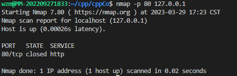

- `telnet 127.0.0.1 8888`

- `nc -t host port` 其中-t代表`tcp`，-u是`udp`

#### 5、linux查询文件权限的命令

Linux中查询文件权限的命令是`ls -l`。

该命令会列出当前目录下所有文件和子目录的详细信息，包括文件的权限、所有者、所属组、文件大小、创建时间等等。其中文件的权限位可以用字符或数字表示，权限字符表示方法如下：

- `r` 表示读权限
- `w` 表示写权限
- `x` 表示执行权限
- `-` 表示该权限位没有对应的权限

例如，一个文件的权限位为 `-rw-r--r--`，表示该文件所有者有读写权限，而其他用户只有读权限。

如果要查询某个特定文件的权限信息，可以使用`ls -l filename` 命令。

#### 6、kill -9 和kill -15的区别？

`kill -9` 和 `kill -15` 都是用来向进程发送信号以停止运行的命令，但它们之间有着重要的区别。

`kill -9` 发送的是 SIGKILL 信号，这个信号会立即终止目标进程，而且无法被捕获或忽略。这意味着，进程无法执行任何清理或保存操作，它会立即停止，就像被强制终止一样。如果进程正在执行一些关键的任务或者正在写入一些数据，这个进程可能会损坏或数据丢失。

`kill -15` 发送的是 SIGTERM 信号，这个信号会请求进程优雅地终止。进程会收到这个信号后，会尝试完成一些清理或保存操作，然后再停止运行。这个过程可能需要一些时间，但可以确保进程能够正确地关闭并保存数据。

因此，如果你想优雅地终止一个进程并允许它完成一些清理工作，你应该使用 `kill -15`。但如果你需要强制终止一个进程，你可以使用 `kill -9`。但要注意，`kill -9` 可能会导致数据丢失或者进程损坏，因此应该尽可能避免使用。

#### 7、git clone下来的项目存在子项目的问题

若项目中有子项目，可以用`git submodule update --init`下载子项目内容。

#### 8、cmake 中make install 默认安装的位置

（没有设置`cmake .. -DCMAKE_INSTALL_PREFIX=/install/location`）

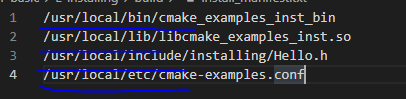

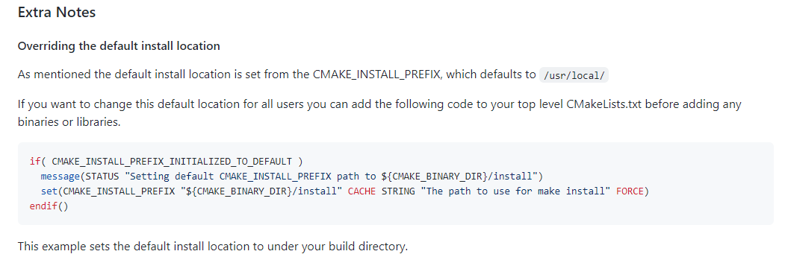

#### 9、分析`netstat -natp`命令

netstat 是一个命令行工具，可以用来查看网络状态和网络连接信息。在 Linux 系统上，通过执行 netstat 命令可以查看各种网络相关的统计信息和活动连接列表，以及监听状态等等。

- `-n` 表示使用数字地址，不使用域名或服务名。
- `-a` 表示列出所有的 socket 连接，包括监听连接和被连接的连接。
- `-t` 表示只显示 TCP 连接信息。
- `-p` 表示显示进程标识符和进程名称，这样可以知道每个连接是由哪个进程创建的。

因此，执行 `netstat -natp` 命令可以列出所有 TCP 连接的详细信息，包括连接状态、本地地址和端口、远程地址和端口、进程标识符和进程名称等等。这个命令可以用来查看系统中所有的 TCP 连接，以及这些连接所属的进程信息，对于网络排查、故障诊断和安全监控非常有帮助。

----

> `ss -natp`也有相同的作用，速度和开销相比netstat都更优

`ss` 命令用于显示套接字（socket）统计信息，可以显示本地与远程主机的套接字连接状态、TCP 连接状态、监听端口等信息。下面是 `ss -natp` 命令的分析：

- `-n` 参数表示不对 IP 地址和端口进行解析，以数字形式显示；
- `-a` 参数表示显示所有的连接，包括已经关闭的；
- `-t` 参数表示显示 TCP 连接状态；
- `-p` 参数表示显示建立连接所对应的进程信息；

因此，`ss -natp` 命令会显示本地和远程主机的所有 TCP 连接状态信息，包括监听状态和建立连接的进程信息。可以用这个命令来查看网络连接的状态，方便快捷地进行网络故障排除和性能分析。

#### 10、 `ftrace` 的 function-graph 

功能可以查看这些内核函数的具体耗时，以及在哪个路径上耗时最大

#### 11、列举`linux`资源监控命令/工具并说明其作用

- `top`：这个命令可以**实时显示系统的进程和资源使用**情况，包括CPU使用率，内存使用率，交换空间，缓存大小，进程PID，用户，命令等等。它还可以显示运行进程的高内存和CPU占用情况。`top`命令是系统管理员监控和系统调优系统性能的常用工具。
- `vmstat`：这个命令可以显示虚拟内存，内核线程，磁盘，系统进程，I/O块、中断、CPU活动等的统计信息。**`vmstat`命令可以帮助分析系统的内存使用情况和磁盘I/O性能。**

- `iostat`：这个命令可以**显示CPU利用率和所有磁盘和文件系统的I/O（输入/输出）统计信息**。iostat命令可以帮助调整系统配置以更好地平衡物理磁盘之间的I/O负载。
- `lsof`：这个命令可以**列出系统中所有打开的文件和进程**。打开的文件不仅包括文本文件或PDF文件，还可以包括后台进程使用的磁盘文件或管道。这个命令是操作系统挑事者和系统管理员的方便工具。
- `tcpdump`：这个命令是一个用于TCP/IP数据包分析的工具。这个命令可以在`linux`以及许多其他操作系统上用于网络流量分析。`tcpdump`允许你捕获所有进出所有接口的流量。更重要的是，它能够根据接口，主机，目的地或源主机，流量类型等多种条件过滤流量。你还可以将捕获的数据包保存在一个文件中以供以后分析。
- `netstat`：这个命令可以显示各种网络相关信息，如网络连接、路由表、接口统计信息、组播成员等。netstat命令可以用于监控进出网络数据包。

## 四、网络编程

#### 1、介绍一下IO多路复用

IO多路复用是一种用于处理多个I/O事件的机制。通常情况下，程序需要为每个I/O事件创建一个单独的线程来进行处理，这会导致线程数目过多，从而降低程序的性能。使用IO多路复用可以让程序在单个线程中同时处理多个I/O事件，提高程序的效率和可扩展性。

在IO多路复用机制中，程序使用一个系统调用（如select、poll或epoll）来监听多个I/O事件的状态，并在事件就绪时通知应用程序。这种机制可以让程序在等待I/O事件就绪时不会被阻塞，而是可以继续执行其他任务，提高程序的并发性和效率。

IO多路复用的主要优点包括：

1. 减少线程数目：使用IO多路复用可以让程序在单个线程中同时处理多个I/O事件，从而减少线程数目，提高程序的性能和可扩展性。
2. 提高并发性：使用IO多路复用可以让程序在等待I/O事件就绪时不会被阻塞，而是可以继续执行其他任务，提高程序的并发性和效率。
3. 减少上下文切换：使用IO多路复用可以减少线程之间的上下文切换，从而提高程序的性能。

#### 2、说说select的原理以及优缺点

select是一种IO多路复用技术，可以同时监听多个文件描述符的状态，具体实现原理如下：

1. 首先，select会维护一个文件描述符列表fd_set，用来存放需要监听的文件描述符fd，其本质是一个1024bit的bitmap数组，1代表需要检测的fd，0代表不需要检测的fd。
2. 其次调用select()函数对fd_set进行轮询，轮询操作需要将fd集合从用户态拷贝到内核态，因为检测一个fd是否有IO事件发生是由内核完成的。同时select会阻塞进程，直到检测到有事件发生时才会返回事件个数（当然可以设置超时时间，避免一直阻塞进程），并修改fd_set对应的值，0表示无事件发生。由于select返回的只是事件的个数，所以要知道具体哪一个fd有IO事件，还需要再次对fd_set进行轮询一遍。

缺点：

1. 由于每次调用 select 都需要将 fd_set 集合从用户空间拷贝到内核空间，这个过程需要耗费一定的时间，当监视的文件描述符比较多时，这个时间将会变得非常长，影响程序的效率；
2. select只返回了事件发生的个数，而不知晓具体哪个fd上发生了IO事件，所以还需要额外的轮询时间；
3. select 函数的文件描述符集合大小是有限制的，通常情况下最多只能监视 1024 个文件描述符；
4. 文件描述符集合不能重用，因为每次监听都会对该集合进行修改；
5. 轮询机制过于耗时，尤其是当fd数量很多的时候。

#### 3、说说epoll的原理

epoll是一种更加高效的IO复用技术，epoll的使用步骤及原理如下：

1. 调用epoll_create()会在内核中创建一个event对象，包括了一个用于检测文件描述符的结构体和一个返回就绪文件描述符的双向链表；
2. 调用epoll_ctrl()通过add、mod、del关键字对文件描述符或者事件进行添加、修改、删除操作。
3. 调用epoll_wait()可以让内核去检测就绪的事件，并将就绪的事件放到就绪列表中并返回，通过返回的事件数组做进一步的事件处理。

4. epoll的工作模式有两种:
   - LT(水平触发)，默认的工作模式；
   - ET(边沿触发)，高速工作模式；

#### 4、`epoll`的LT和ET的区别及应用场景

epoll的LT（Level Triggered，水平触发）和ET（Edge Triggered，边沿触发）是两种不同的触发模式，影响的是epoll_wait函数的行为[1](https://bing.com/search?q=epoll+LT+ET+区别)[2](https://zhuanlan.zhihu.com/p/607927978)[3](https://blog.csdn.net/jammg/article/details/51854436)[4](https://blog.csdn.net/qq_43390943/article/details/89433893)。具体区别如下：

- LT模式下，只要文件描述符有可读或者可写的数据，epoll_wait就会返回该文件描述符，无论之前是否处理过。这意味着，如果没有完全读取或写入所有数据，下次调用epoll_wait时，该文件描述符仍然会被返回。
- ET模式下，只有文件描述符的状态发生变化（比如从不可读变为可读），epoll_wait才会返回该文件描述符，只会返回一次。这意味着，如果没有完全读取或写入所有数据，下次调用epoll_wait时，该文件描述符不会被返回，除非又有新的数据到达或者可写。

应用场景如下：

- LT模式比较简单易用，不需要一次性处理完所有数据，也不需要担心遗漏事件。但是LT模式可能会造成重复的事件通知，浪费CPU资源；
- ET模式比较高效，只通知一次事件，减少了系统调用的次数。但是ET模式需要一次性处理完所有数据，否则可能会丢失事件。同时ET模式需要使用非阻塞IO，避免在读写时阻塞。

一般来说，ET模式适合于高并发、高性能的场景，比如网络服务器；LT模式适合于低并发、简单逻辑的场景，比如普通文件操作。

#### 5、异步IO与同步IO的区别

在计算机系统中，I/O（Input/Output）是指与外部设备之间的数据交换。I/O操作可分为同步IO和异步IO两种方式。

同步IO指的是在I/O操作中，应用程序需要**等待I/O操作完成并返回结果之后才能继续执行后续的操作**。在同步I/O操作中，操作系统会阻塞当前线程或进程，直到I/O操作完成。

异步IO（Asynchronous I/O）是指在进行I/O操作时，应用程序不需要等待I/O操作完成，而是可以继续执行后续操作。在异步I/O操作中，操作系统不会阻塞当前线程或进程，而是通过**回调函数或事件通知的方式**来通知应用程序I/O操作已完成。

具体来说，异步IO与同步IO的区别主要表现在以下几个方面：

1. 调用方式：在同步I/O操作中，应用程序需要主动调用I/O操作函数，并等待函数返回结果。而在异步I/O操作中，应用程序发起I/O请求后，可以立即返回，并且I/O操作在后台异步进行，完成后通过回调函数或事件通知应用程序。
2. 阻塞与非阻塞：在同步I/O操作中，I/O操作会阻塞当前线程或进程，直到操作完成。而在异步I/O操作中，I/O操作不会阻塞当前线程或进程。
3. 效率：在高并发的情况下，异步I/O操作可以提高系统的吞吐量，因为它可以让系统处理更多的请求而不用等待I/O操作完成。

总之，同步I/O操作需要等待I/O操作完成才能继续执行后续操作，而异步I/O操作则可以让应用程序在I/O操作完成之前继续执行后续操作。虽然异步I/O操作需要更复杂的编程方式和更高的技术水平，但是在某些场景下，异步I/O操作可以显著提高系统的性能和吞吐量。

#### 6、select和epoll有什么区别？

- select和epoll都是用于多路复用I/O的机制，即可以同时监听多个文件描述符（fd）的状态，从而实现高效的网络通信。
- select的缺点是：
  - 单个进程可监视的fd数量受到限制，一般为1024或2048，不能满足高并发的需求。
  - 每次调用select都需要将所有fd从用户态拷贝到内核态，这会带来额外的开销和性能损耗。
  - select采用轮询的方式检查每个fd是否就绪，这会浪费很多CPU时间，而且时间复杂度为O(n)。
- epoll的优点是：
  - epoll没有fd数量的限制，只受限于内存大小。
  - epoll只需要在注册事件时拷贝一次fd，之后通过回调函数通知用户态，避免了不必要的拷贝和轮询。
  - epoll采用事件驱动的方式通知用户态，只关注就绪的fd，时间复杂度为O(1)。
  - epoll支持水平触发（LT）和边缘触发（ET）两种模式，其中ET模式可以进一步提高效率，但需要更加小心地处理事件。

但并不是说select就要被丢弃，select适合于处理少量但频繁的网络事件，例如读取文件或发送大量数据；而epoll则适合**处理大量但不太频繁的网络事件**，例如处理大量的连接或读取大型文件。

#### 7、Reactor 和 Proactor 的区别

`Reactor` 是非阻塞同步网络模式，而 **`Proactor` 是异步网络模式**。

> ##### 阻塞IO

当用户程序执行 `read` ，线程会被阻塞，一直等到内核数据准备好，并把数据从内核缓冲区拷贝到应用程序的缓冲区中，当拷贝过程完成，`read` 才会返回。

> 注意，阻塞等待的是**内核数据准备好**和**数据从内核态拷贝到用户态**这两个过程。


> ##### 非阻塞IO

非阻塞的 read 请求在数据未准备好的情况下立即返回，可以继续往下执行，此时应用程序不断轮询内核，直到数据准备好，内核将数据拷贝到应用程序缓冲区，`read` 调用才可以获取到结果。过程如下图：


> 注意，这里最后一次read调用，获取数据的过程，是一个同步的过程，是需要等待的过程。这里的**同步指的是内核态的数据拷贝到用户程序的缓冲区**这个过程。
>
> 举个例子，如果 socket 设置了 `O_NONBLOCK` 标志，那么就表示使用的是非阻塞 I/O 的方式访问，而不做任何设置的话，默认是阻塞 I/O。
>
> 因此，无论 read 和 send 是阻塞 I/O，还是非阻塞 I/O 都是同步调用。因为在 read 调用时，内核将数据从内核空间拷贝到用户空间的过程都是需要等待的，也就是说这个过程是同步的，如果内核实现的拷贝效率不高，read 调用就会在这个同步过程中等待比较长的时间。

而真正的**异步 I/O** 是「内核数据准备好」和「数据从内核态拷贝到用户态」这**两个过程都不用等待**。

当我们发起 `aio_read` （异步 I/O） 之后，就立即返回，内核自动将数据从内核空间拷贝到用户空间，这个拷贝过程同样是异步的，内核自动完成的，和前面的同步操作不一样，**应用程序并不需要主动发起拷贝动作**。过程如下图：


>  现在我们再来理解 Reactor 和 Proactor 的区别，就比较清晰了。

- Reactor是非阻塞同步网络模式，**感知的是就绪可读写事件**。在每次感知有事件发生（比如可读就绪事件）后，就需要应用进程主动调用read方法来完成数据的读取，也就是应用进程主动将socket接收缓存中的数据复制到应用进程内存中，这个过程是同步的，读取完数据后应用进程才能处理数据。
- Proactor是异步网络模式，**感知的是已完成的读写事件**。在发起异步读写请求时，需要传入数据缓冲区的地址（用来存放结果数据）等信息，这样系统内核才可以自动帮我们把数据的读写工作完成，这里的读写工作全程由操作系统来做，并不需要像 Reactor 那样还需要应用进程主动发起 read/write 来读写数据，操作系统完成读写工作后，就会通知应用进程直接处理数据。

因此，**Reactor 可以理解为「来了事件操作系统通知应用进程，让应用进程来处理」**，而 **Proactor 可以理解为「来了事件操作系统来处理，处理完再通知应用进程」**。这里的「事件」就是有新连接、有数据可读、有数据可写的这些 I/O 事件这里的「处理」包含从驱动读取到内核以及从内核读取到用户空间。

#### 8、epoll中可以无限承载socket的连接吗？创建socket时的返回值是什么？

- epoll可以无限承载socket的连接吗？答案肯定是不可以。epoll所支持的最大连接数是进程最大可打开的文件的数目，这个数目一般是大于1024，但也不是无限的。具体数目可以通过 `cat /proc/sys/fs/file-max`查看，也可以通过修改配置文件来调整。epoll相对于select的优势在于它没有固定fd数量的限制，而是根据内存大小来决定。
- 创建socket时的返回值是什么？答案是一个非负整数，表示socket文件描述符(fd)。如果创建失败，返回值是-1，并设置`errno`错误码。socket的文件描述符可以用于后续的bind，listen，connect，accept，send，recv等操作。

#### 9、fd在系统中有限制吗？可以无限申请吗？

- fd在系统中有限制吗？答案是有限制的。fd的数量受到两个方面的限制，一个是系统级的限制，一个是用户级的限制。系统级的限制是指所有用户打开fd的总和不能超过一个阈值，这个阈值可以通过`cat /proc/sys/fs/file-max`查看，也可以通过修改`/etc/sysctl.conf`文件来调整。用户级的限制是指每个用户登录后执行的程序占用fd的总数不能超过一个阈值，这个阈值可以通过`ulimit -n`查看，也可以通过修改`/etc/security/limits.conf`文件来调整。
- 可以无限申请fd吗？答案是不可以的。即使不考虑内存大小的限制，fd的数量也受到上述两个方面的限制。如果申请fd超过了这些限制，那么open()等获取fd的系统调用都会返回失败，并设置errno错误码。因此，申请fd时要注意检查返回值和错误码，以及及时关闭不需要的fd，避免资源泄露。

#### 10、一个服务端进程最多可以和多少个客户端进行连接？和fd的数量有关吗？

- 一个服务端进程最多可以和多少个客户端进行连接？答案是没有一个确定的数字，因为这取决于很多因素，比如**服务端的CPU、内存、网络带宽、操作系统参数、应用程序逻辑**等。理论上，一个服务端进程可以和任意数量的客户端进行连接，只要能够区分不同的客户端[1](https://blog.csdn.net/daocaokafei/article/details/115410761)，并且有足够的资源来处理连接[2](https://www.zhihu.com/question/375168439)。
- 和fd的数量有关吗？答案是有关系的。fd是文件描述符，是Linux系统中用来标识打开的文件或者网络连接的一个整数。每个进程都有一个打开文件表，记录了它所打开的所有fd。每个fd都占用一定的内存空间，并且受到系统级和用户级的限制[3](https://blog.csdn.net/qq_46514118/article/details/123600469)。如果一个服务端进程要和多个客户端进行连接，那么它就需要打开多个fd，这就会消耗内存，并且可能达到限制。因此，fd的数量会影响服务端进程能够同时连接的客户端数量。[2](https://www.zhihu.com/question/375168439)

#### 11、假设这样一个场景，客户端在和服务端进行TCP的三次握手的过程中，突然间客户端宕机了，那么这个socket怎么处理？可以删除吗？是怎么删除的？

这个场景下的socket处理方式可能有以下几种：

- 如果客户端在发送syn包后宕机，那么服务端收不到syn包，也不会回复SYN+ACK包，此时socket没有建立连接，不需要删除。

- 如果客户端在发送syn包后收到了服务端的SYN+ACK包，但是在回复ACK包时宕机，那么服务端会等待一段时间，（由`tcp_synack_retries`参数决定）后重新发送SYN+ACK包，如果仍然没有收到ACK包，那么服务端会关闭这个socket。

  > 如果客户端在发送SYN包后宕机，那么服务端收到SYN包后会把这个连接放入半连接队列，并回复SYN+ACK包[1](https://juejin.cn/post/7158091149499400205)[2](https://blog.csdn.net/u010039418/article/details/78369343)。如果服务端没有收到客户端的ACK包，那么服务端会重传SYN+ACK包，直到超过`tcp_synack_retries`参数设置的次数。如果仍然没有收到ACK包，那么服务端会关闭这个连接，并把它从半连接队列中删除[3](https://blog.csdn.net/small_engineer/article/details/124190620)[4](https://zhuanlan.zhihu.com/p/619498204)。所以，这个半连接最终会被删除，不会一直占用资源。

- 如果客户端在发送ACK包后宕机，那么服务端会收到ACK包，并进入ESTABLISHED状态，此时socket已经建立连接。如果客户端没有发送数据，那么客户端会一直等待，直到超时（由`tcp_keepalive_time`参数决定）后关闭这个socket。如果客户端发送了数据，那么服务端会回复ACK包，如果没有收到客户端的确认，那么服务端会重传ACK包（由`tcp_retries2`参数决定），如果仍然没有收到确认，那么服务端会关闭这个socket。

总之，无论客户端在哪个阶段宕机，服务端都有相应的超时重传或者超时关闭机制来处理这个socket，不会造成资源泄露。

#### 12、在服务端调用`accept()`之后,socket就是一直可读的吗？就是调用read()函数就一直可以读吗？会阻塞吗？

服务端在调用accept()之后，socket不一定是一直可读的。如果socket上没有数据可读，那么调用read()函数会阻塞，直到有数据可读或者发生错误。如果不想让read()函数阻塞，可以设置socket为非阻塞模式，或者使用select()，poll()，epoll等函数来检测socket是否可读。

----

> 如果服务端read()函数发生了阻塞,对方客户端异常关闭了,一直没有发数据过来,服务端会一直阻塞吗？会导致服务端卡死吗？

服务端read()函数发生了阻塞，如果对方客户端异常关闭了，那么服务端会收到一个RST包，导致read()函数返回-1，并设置errno为ECONNRESET[1](https://stackoverflow.com/questions/12773509/read-is-not-blocking-in-socket-programming)[2](https://stackoverflow.com/questions/15358157/c-sharp-tcp-sockets-blocking-read-how-to-close-such-threads)。这样服务端就可以检测到错误并处理，不会一直阻塞[3](https://stackoverflow.com/questions/2416944/can-read-function-on-a-connected-socket-return-zero-bytes)。


## 五、设计模式

#### 1、讲讲设计模式的 6 大设计原则

设计模式是一种解决软件设计问题的通用方法，它可以提高代码的可重用性、可维护性和可扩展性。在设计模式中，有 6 个基本的设计原则，也被称为 SOLID 原则：

- 单一职责原则 (SRP)：一个类或者一个方法只负责一项职责，避免过多的耦合和复杂性。

- 开闭原则 (OCP)：对扩展开放，对修改关闭。在不修改原有代码的基础上进行扩展，提高软件的可维护性和可复用性。

- 里氏替换原则 (LSP)：子类可以替换父类，并且保持父类的功能和特性。遵循这个原则可以保证继承关系的正确性和合理性。

- 接口隔离原则 (ISP)：使用多个专门的接口，而不使用单一的总接口。避免接口中出现不相关的方法，减少类之间的依赖，提高接口的内聚性和可用性。

- 依赖倒置原则 (DIP)：高层模块不应该依赖于低层模块，而是应该依赖于抽象。抽象不应该依赖于细节，细节应该依赖于抽象。使用接口或者抽象类来降低类之间的耦合度，提高系统的灵活性和可扩展性。
- 最少知识原则 (LKP)：一个对象应该尽可能少地与其他对象发生相互作用，只与直接相关的对象交流。降低对象之间的耦合度，提高模块的独立性和隔离性。

#### 2、设计模式可以分为几类

根据不同的标准，设计模式可以分为不同的类别。一种常见的分类方法是根据设计模式的**目的和范围**来划分。

按照目的来划分，设计模式可以分为三大类：

- **创建型模式**（Creational Pattern）：关注于对象的创建过程，将对象的创建和使用分离，使得同一种创建过程可以创建不同的对象。包括单例模式、工厂模式、抽象工厂模式、建造者模式、原型模式等。
- **结构型模式**（Structural Pattern）：关注于对象和类的组织结构，通过组合或继承等方式来实现更复杂的功能。包括适配器模式、桥接模式、组合模式、装饰模式、外观模式、享元模式、代理模式等。
- **行为型模式**（Behavioral Pattern）：关注于对象之间的交互和协作，通过定义对象的职责和行为来实现更灵活的功能。包括模板方法模式、命令模式、迭代器模式、观察者模式、中介者模式、备忘录模式、解释器模式、状态模式、策略模式、职责链模式、访问者模式等。

按照范围来分，设计模式可以分为两大类：

- **类模式**（Class Pattern）：处理类和子类之间的静态关系，通过继承等方式来实现代码复用和扩展。如工厂模式、适配器、模板方法等。
- **对象模式**（Object Pattern）：处理对象之间的动态关系，通过组合或委托等方式来实现对象的协作和通信。

#### 3、工厂模式的应用场景

**工厂模式**是一种创建型设计模式，它提供了一种创建对象的最佳实践，这种模式提供了一个工厂类或接口，通过使用工厂方法来创建对象。工厂方法将对象的创建推迟到子类或实现类中，这样就可以实现对象的创建和使用解耦。

工厂模式的使用场景包括：

- 当需要创建的对象类型较多或者不确定时，可以使用工厂模式来**避免使用大量的new关键字**，提高代码的可维护性和可扩展性。
- 当需要将对象的创建和使用解耦时，可以使用工厂模式来降低系统的耦合性，提高系统的灵活性和可测试性。
- 当需要根据不同的条件或者环境来创建不同的对象时，可以使用工厂模式来封装对象的创建逻辑，提高代码的可读性和复用性[1](https://zhuanlan.zhihu.com/p/624343687)[2](https://blog.csdn.net/shulianghan/article/details/119850841)。

工厂模式有三种形式：简单工厂模式、工厂方法模式和抽象工厂模式。每种形式都有其特定的应用场景和优缺点[1](https://zhuanlan.zhihu.com/p/624343687)[3](https://juejin.cn/post/7245885711940780088)。

- 简单工厂模式是最基本的工厂模式，它通过一个工厂类来创建所有需要的对象。简单工厂模式适用于对象类型较少且不会频繁变化的情况，它可以简化对象的创建过程，但是它违背了开闭原则，当需要添加新的对象时，需要修改工厂类的代码[1](https://zhuanlan.zhihu.com/p/624343687)[3](https://juejin.cn/post/7245885711940780088)。
- 工厂方法模式通过定义一个工厂接口和多个工厂类来解决简单工厂模式的缺点。每个工厂类负责创建一种类型的对象，客户端通过调用工厂类的工厂方法来创建对象。工厂方法模式适用于对象类型较多且会频繁变化的情况，它可以遵循开闭原则，通过扩展工厂类或增加新的工厂类来添加新的产品，但是它会增加系统的复杂度和类的数量[1](https://zhuanlan.zhihu.com/p/624343687)[3](https://juejin.cn/post/7245885711940780088)。
- 抽象工厂模式通过定义一个抽象工厂接口和多个具体工厂类来实现多个产品族的创建。每个具体工厂类负责创建一组相关或不相关的对象，客户端通过调用具体工厂类的抽象方法来创建对象。抽象工厂模式适用于对象类型较多且存在产品族或产品等级结构的情况，它可以保证同一个产品族中的对象能够协同使用，但是它违背了开闭原则，当需要添加新的产品族或产品等级时，需要修改抽象工厂接口和所有实现类[1](https://zhuanlan.zhihu.com/p/624343687)[3](https://juejin.cn/post/7245885711940780088)。

----

使用简单工厂模式的例子，其中定义了抽象的商品类和三个具体的商品子类，以及一个工厂类来根据商品类型创建对象

```cpp
#include <iostream>
#include <string>
using namespace std;

// 抽象的商品类
class Product {
  public:
    // 商品的价格
    double price;
    // 商品的品牌
    string brand;

    // 获取商品的价格
    double getPrice() {
      return price;
    }

    // 设置商品的价格
    void setPrice(double price) {
      this->price = price;
    }

    // 获取商品的品牌
    string getBrand() {
      return brand;
    }

    // 设置商品的品牌
    void setBrand(string brand) {
      this->brand = brand;
    }

    // 抽象的显示方法，由子类实现
    virtual void display() = 0;
};

// 手机类，继承自商品类
class Phone : public Product {
  public:
    // 手机的型号
    string model;

    // 获取手机的型号
    string getModel() {
      return model;
    }

    // 设置手机的型号
    void setModel(string model) {
      this->model = model;
    }

    // 实现显示方法，打印手机的信息
    void display() override {
      cout << "这是一部" << brand << "手机，型号是" << model << "，价格是" << price << "元。" << endl;
    }
};

// 电脑类，继承自商品类
class Computer : public Product {
  public:
    // 电脑的配置
    string configuration;

    // 获取电脑的配置
    string getConfiguration() {
      return configuration;
    }

    // 设置电脑的配置
    void setConfiguration(string configuration) {
      this->configuration = configuration;
    }

    // 实现显示方法，打印电脑的信息
    void display() override {
      cout << "这是一台" << brand << "电脑，配置是" << configuration << "，价格是" << price << "元。" << endl;
    }
};

// 鼠标类，继承自商品类
class Mouse : public Product {
  public:
    // 鼠标的颜色
    string color;

    // 获取鼠标的颜色
    string getColor() {
      return color;
    }

    // 设置鼠标的颜色
    void setColor(string color) {
      this->color = color;
    }

     // 实现显示方法，打印鼠标的信息
     void display() override {
       cout << "这是一个" << brand << "鼠标，颜色是" << color << "，价格是" << price << "元。" << endl;
     }
};

// 工厂类，用于创建不同类型的商品对象
class Factory {

   public:
     // 根据商品类型创建对象，并返回抽象的商品类指针
     static Product* createProduct(string type) {
       if (type == "phone") { // 如果类型是手机，则创建手机对象并返回
         Phone* phone = new Phone();
         phone->setBrand("华为");
         phone->setModel("P40");
         phone->setPrice(4999);
         return phone;
       } else if (type == "computer") { // 如果类型是电脑，则创建电脑对象并返回
         Computer* computer = new Computer();
         computer->setBrand("联想");
         computer->setConfiguration("i7-10700K/16G/512G SSD/RTX3070");
         computer->setPrice(9999);
         return computer;
       } else if (type == "mouse") { // 如果类型是鼠标，则创建鼠标对象并返回
         Mouse* mouse = new Mouse();
         mouse->setBrand("罗技");
         mouse->setColor("黑色");
         mouse->setPrice(199);
         return mouse;
       } else { // 如果类型不匹配，则返回空
         return nullptr;
       }
     }
};

// 客户端类，用于测试工厂模式
int main() {
  // 通过工厂类创建不同类型的商品对象
  Product* phone = Factory::createProduct("phone");
  Product* computer = Factory::createProduct("computer");
  Product* mouse = Factory::createProduct("mouse");

  // 调用商品对象的显示方法
  phone->display();
  computer->display();
  mouse->display();

  // 释放动态分配的内存
  delete phone;
  delete computer;
  delete mouse;

  return 0;
}
```

---------------------------

使用抽象工厂模式的 C++ 代码示例：

```cpp
#include <iostream>
#include <string>

// 抽象产品类
class Product {
public:
    virtual void operation() = 0;
};

// 具体产品类 A
class ProductA : public Product {
public:
    void operation() override {
        std::cout << "Product A operation." << std::endl;
    }
};

// 具体产品类 B
class ProductB : public Product {
public:
    void operation() override {
        std::cout << "Product B operation." << std::endl;
    }
};

// 工厂类
class Factory {
public:
    // 创建产品的方法
    virtual Product* createProduct() = 0;
};

// 具体工厂类 A
class FactoryA : public Factory {
public:
    Product* createProduct() override {
        return new ProductA();
    }
};

// 具体工厂类 B
class FactoryB : public Factory {
public:
    Product* createProduct() override {
        return new ProductB();
    }
};

int main() {
    // 创建工厂对象
    Factory* factory = nullptr;
    std::string factoryType = "A";
    if (factoryType == "A") {
        factory = new FactoryA();
    }
    else if (factoryType == "B") {
        factory = new FactoryB();
    }

    // 创建产品对象
    Product* product = factory->createProduct();

    // 调用产品方法
    product->operation();

    // 释放资源
    delete product;
    delete factory;

    return 0;
}
```

这段代码中，我们定义了一个抽象产品类 `Product` 和两个具体产品类 `ProductA` 和 `ProductB`。我们还定义了一个抽象工厂类 `Factory` 和两个具体工厂类 `FactoryA` 和 `FactoryB`，每个工厂类负责创建一个具体产品类的实例。

在 `main` 函数中，我们根据需要创建的产品类型选择一个具体的工厂类，然后使用工厂对象来创建产品对象。最后，我们调用产品对象的方法完成相关操作。

这段代码就是一个简单的工厂模式的实现。通过使用工厂模式，我们可以将对象的创建和使用分离开来，提高代码的可维护性和可扩展性。

#### 4、单例模式的使用场景

单例模式是一种创建型模式，它保证一个类只有一个实例，并提供一个全局访问点。[1](https://blog.csdn.net/li123128/article/details/80491016)

单例模式的使用场景一般是：

- 当需要保证一个类在系统中只有一个实例时，例如全局配置管理器、数据库连接池、消息总线等。
- 当需要频繁创建和销毁对象时，例如计数器、缓存等。
- 当创建对象时耗时或耗资源过多，但又经常用到的对象时，例如配置文件、资源管理器等。

单例模式的优点是：

- 可以节省系统资源，避免重复创建对象。
- 可以保证数据的一致性，避免多个实例之间的状态不同步。
- 可以提供全局访问点，方便外部调用。

单例模式的缺点是：

- 可能会影响代码的可测试性，难以用单元测试覆盖。
- 可能会违反单一职责原则，将多种功能或逻辑集中在一个类中。
- 可能会造成模块之间的高耦合，难以扩展和维护。

-----

单例模式在多线程环境下可能会出现问题，需要进行线程安全的处理，通常会使用锁机制来保证线程安全。

C++中，线程安全的单例模式有多种实现方式[1](https://zhuanlan.zhihu.com/p/342769966)，比如：

- Meyers Singleton，利用**C++11规定的静态局部变量**的线程安全性，只在第一次调用时初始化单例对象。

  ```cpp
  class Singleton
  {
  public:
      static Singleton &get_instance()
      {
          static Singleton instance;
          return instance;
      }
  
  private:
      Singleton() = default;
      ~Singleton() = default;
      Singleton(const Singleton &) = delete;
      Singleton(Singleton &&) = delete;
      Singleton &operator=(const Singleton &) = delete;
      Singleton &operator=(Singleton &&) = delete;
  };
  ```

- 双重检查锁，利用原子指针和互斥锁，在第一次检查为空时加锁，再次检查为空时创建单例对象。

  ```cpp
  #include <atomic>
  #include <mutex>
  
  class Singleton
  {
  public:
      static Singleton &get_instance()
      {
          Singleton *ins = _instance.load(std::memory_order_acquire);
          if (!ins)
          {
              std::lock_guard lk(_m);
              ins = _instance.load(std::memory_order_acquire);
              if (!ins)
              {
                  ins = new Singleton();
                  _instance.store(ins, std::memory_order_release);
              }
          }
          return *ins;
      }
  
  private:
      Singleton() = default;
      ~Singleton() = default;
      Singleton(const Singleton &) = delete;
      Singleton(Singleton &&) = delete;
      Singleton &operator=(const Singleton &) = delete;
      Singleton &operator=(Singleton &&) = delete;
      static std::atomic<Singleton *> _instance;
      static std::mutex _m;
  };
  
  // initialization of static variables
  std::atomic<Singleton *> Singleton::_instance;
  std::mutex Singleton::_m;
  ```

- call_once/once_flag，利用C++11提供的`std::call_once`和`std::once_flag`函数，保证创建单例对象的函数只被调用一次。

  ```cpp
  #include <mutex>
  
  class Singleton
  {
  public:
      static Singleton &get_instance()
      {
          std::call_once(_flag, create_instance);
          return *_instance;
      }
  
  private:
      Singleton() = default;
      ~Singleton() = default;
      Singleton(const Singleton &) = delete;
      Singleton(Singleton &&) = delete;
      Singleton &operator=(const Singleton &) = delete;
      Singleton &operator=(Singleton &&) = delete;
      static void create_instance()
      {
          _instance = new Singleton();
      }
      static Singleton *_instance;
      static std::once_flag _flag;
  };
  
  // initialization of static variables
  Singleton *Singleton::_instance = nullptr;
  std::once_flag Singleton::_flag;
  ```

- 单次检测法：这个方案比较傻，每一次都要加锁和解锁，性能很差。

  ```cpp
  #include <mutex>
  
  class Singleton
  {
  public:
      static Singleton &get_instance()
      {
          std::lock_guard lk(_m);
          if (!_instance)
          {
              _instance = new Singleton();
          }
          return *_instance;
      }
  
  private:
      Singleton() = default;
      ~Singleton() = default;
      Singleton(const Singleton &) = delete;
      Singleton(Singleton &&) = delete;
      Singleton &operator=(const Singleton &) = delete;
      Singleton &operator=(Singleton &&) = delete;
      static Singleton *_instance;
      static std::mutex _m;
  };
  
  // initialization of static variables
  Singleton *Singleton::_instance;
  std::mutex Singleton::_m;
  ```

#### 5、观察者模式的应用场景

观察者模式是一种行为型设计模式，它定义了对象之间的一对多的依赖关系，当一个对象的状态发生变化时，所有依赖于它的对象都会收到通知并自动更新。[1](https://bing.com/search?q=观察者模式的应用场景)

观察者模式的应用场景：

- 当一个对象的数据或状态更新需要其他对象同步更新时，例如**微博的订阅功能**，当我们订阅了某个人的微博账号，当这个人发布了新的消息，就会通知我们。
- 当系统存在事件多级触发时，例如电商平台的降价通知，**当用户关注了某个商品，当商品降价时，就会通知用户**。
- 当一个对象仅需要将自己的更新通知给其它对象而不需要知道其它对象细节时，例如消息推送功能，当有新的消息时，就会通知所有订阅了该主题的用户。
- 当跨系统的消息交换场景，例如通信过程中的消息队列处理。

-----------

当我们使用C++实现观察者模式时，通常需要定义以下三个类：

1. 抽象主题类（Subject）：负责维护观察者列表，提供注册和取消注册观察者的方法，以及通知观察者的方法。
2. 抽象观察者类（Observer）：定义了一个更新状态的接口，用于被主题通知时更新自己的状态。
3. 具体主题类（ConcreteSubject）：实现了抽象主题类中的方法，用于维护观察者列表和通知观察者。

以下是一个简单的C++示例：

```cpp
#include <iostream>
#include <vector>
#include <algorithm>

// 观察者接口，定义了一个更新方法
class Observer {
public:
  virtual void update(int value) = 0;
};

// 主题类，维护了一个观察者列表，提供了添加和删除观察者的方法，以及通知观察者的方法
class Subject {
  int m_value; // 主题的状态
  std::vector<Observer*> m_observers; // 观察者列表
public:
  void attach(Observer* observer) { // 添加观察者
    m_observers.push_back(observer);
  }
  
  void detach(Observer* observer) { // 删除观察者
    m_observers.erase(std::remove(m_observers.begin(), m_observers.end(), observer), m_observers.end());
  }
  
  void set_value(int value) { // 设置主题的状态，并通知观察者
    m_value = value;
    notify();
  }
  
  void notify() { // 遍历观察者列表，调用每个观察者的更新方法
    for (auto observer : m_observers)
      observer->update(m_value);
  }
};

// 具体的观察者类，实现了观察者接口，接收主题的通知并更新自己的状态
class ConcreteObserver : public Observer {
public:
  ConcreteObserver(Subject* subject) : m_subject(subject) { // 在构造函数中将自己添加到主题的观察者列表中
    m_subject->attach(this);
  }
  
  ~ConcreteObserver() { // 在析构函数中将自己从主题的观察者列表中删除
    m_subject->detach(this);
  }
  
  void update(int value) { // 实现更新方法，打印收到的通知
    std::cout << "Received update with value: " << value << std::endl;
  }
private:
  Subject* m_subject; // 持有一个主题对象的指针
};

int main() {
  Subject subject; // 创建一个主题对象
  ConcreteObserver observer1(&subject); // 创建两个具体的观察者对象，并将它们添加到主题的观察者列表中
  ConcreteObserver observer2(&subject);
  
  subject.set_value(42); // 改变主题的状态，并通知所有的观察者
  
  return 0;
}

```

#### 6、装饰器模式的应用场景

装饰器是一种结构型设计模式，它可以在不改变原有对象的基础上，动态地给对象添加一些额外的功能和职责。装饰器模式的核心是**使用一个装饰器类来包装一个目标对象，并实现与目标对象相同的接口，从而对目标对象的功能进行扩展或增强**。

装饰器的应用场景有[1](https://www.cnblogs.com/V1haoge/p/10472321.html)[2](https://juejin.cn/post/7166531323320860680)：

- 当需要给一个现有的类添加额外的功能，而又不想通过继承或修改源代码的方式时，可以使用装饰器模式。
- 当需要动态地给对象增加或撤销功能时，可以使用装饰器模式。例如，根据不同的用户需求，给不同的对象添加不同的功能。
- 当需要在不影响其他对象的情况下，给一个对象增加功能时，可以使用装饰器模式。例如，**给一个特定的对象添加日志记录、权限校验、缓存等功能**。
- 当需要避免产生大量子类时，可以使用装饰器模式。例如，如果通过继承来实现功能扩展，可能导致类的数量过多，增加系统的复杂度和维护成本。

------

下面是一个使用C++实现的简单装饰器模式示例代码：

```cpp
#include <iostream>
#include <string>

// 定义一个基础接口
class Component {
public:
    virtual void operation() = 0;
};

// 实现基础接口的具体组件
class ConcreteComponent : public Component {
public:
    virtual void operation() override {
        std::cout << "ConcreteComponent operation" << std::endl;
    }
};

// 定义一个装饰器接口
class Decorator : public Component {
protected:
    Component* component_;
public:
    Decorator(Component* component) : component_(component) {}
    virtual void operation() override {
        if (component_) {
            component_->operation();
        }
    }
};

// 实现装饰器接口的具体装饰器
class ConcreteDecoratorA : public Decorator {
public:
    ConcreteDecoratorA(Component* component) : Decorator(component) {}
    virtual void operation() override {
        Decorator::operation();
        std::cout << "ConcreteDecoratorA operation" << std::endl;
    }
};

// 实现装饰器接口的具体装饰器
class ConcreteDecoratorB : public Decorator {
public:
    ConcreteDecoratorB(Component* component) : Decorator(component) {}
    virtual void operation() override {
        Decorator::operation();
        std::cout << "ConcreteDecoratorB operation" << std::endl;
    }
};

int main() {
    // 创建一个具体组件对象
    Component* component = new ConcreteComponent();

    // 对具体组件对象进行装饰，添加新的功能
    Component* decoratedComponent = new ConcreteDecoratorA(new ConcreteDecoratorB(component));

    // 调用装饰后的操作
    decoratedComponent->operation();

    return 0;
}

```

这个示例代码中，`Component` 是一个基础接口，`ConcreteComponent` 是实现该接口的具体组件。`Decorator` 是一个装饰器接口，`ConcreteDecoratorA` 和 `ConcreteDecoratorB` 是实现该接口的具体装饰器。在 `main` 函数中，我们先创建一个具体组件对象 `component`，然后使用 `ConcreteDecoratorA` 和 `ConcreteDecoratorB` 装饰该对象，形成一个新的被装饰后的对象 `decoratedComponent`。最后，我们调用 `decoratedComponent` 的 `operation` 函数，即可执行装饰后的操作。


